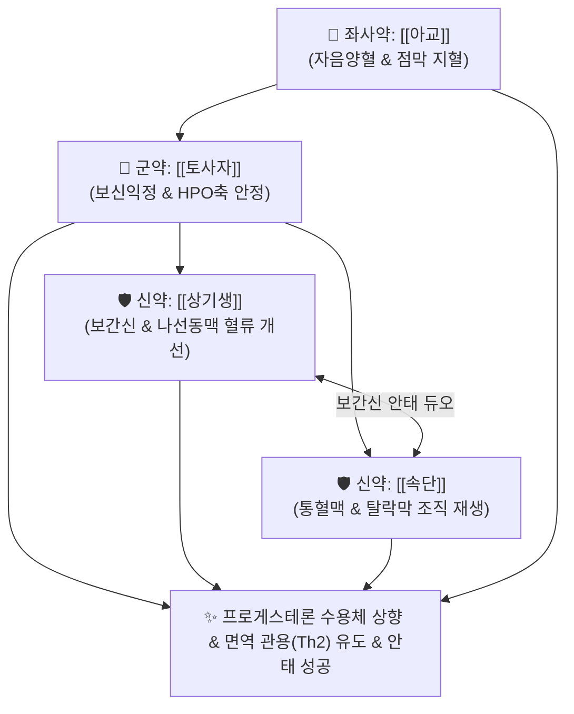

# 🍵 [[수태환]] (壽胎丸, Shoutai Pill)

> **핵심 3줄 요약 (Key Summary)**:
> - 🌿 보신익정(補腎益精)·고충안태(固衝安胎)의 4미 배오 ([[토사자]]·[[상기생]]·[[속단]]·[[아교]]).
> - 🎯 신허(腎虛)로 인한 태루(임신 중 소량 질출혈), 태동불안(아랫배 당김 및 요통), 활태(습관성 유산), 황체기능부전으로 인한 절박유산.
> - 🔬 시상하부-하수체-난소(HPO) 축 자극을 통한 프로게스테론 분비 촉진, 탈락막 프로게스테론 수용체(PR) 상향 조절, 모체-태아 계면 Th2 면역 관용 유도 및 자궁 평활근 진경.
> - ⚠️ 주의사항: 자궁내 감염이나 습열·실열로 인한 활태 환자 금기, 계류유산 확인 시 지체 없이 산부인과적 처치 병행.
---
## 📌 목차
1. [기본 처방 정보 & 군신좌사 구성](#1-기본-처방-정보--군신좌사-구성)
2. [방제학적 약재 상호작용 & 시너지 네트워크](#2-방제학적-약재-상호작용--시너지-네트워크)
3. [현대 분자약리학적 효능 & 작용 기전](#3-현대-분자약리학적-효능--작용-기전)
4. [적응 병증 및 체질별 감별 (Sweet Spot vs 금기)](#4-적응-병증-및-체질별-감별-sweet-spot-vs-금기)
5. [유사 처방군 감별 매트릭스](#5-유사-처방군-감별-매트릭스)
6. [임상 가감례 & 현대 질환별 응용](#6-임상-가감례--현대-질환별-응용)
7. [💡 사용자 진료실 핵심 필기 & 임상 팁 (원문 보존)](#7--사용자-진료실-핵심-필기--임상-팁-원문-보존)
8. [출처 및 학술 참고 문헌 (References)](#8-출처-및-학술-참고-문헌-references)
---
## 1. 기본 처방 정보 & 군신좌사 구성

* **출전**: 근대 명의 장석순(張錫純) 『[[의학충중참서록]](醫學衷中參西錄)』
* **치법**: 보신익정(補腎益精), 고충안태(固衝安胎), 양혈지혈(養血止血), 강근보신(强筋補腎)

| 구분 | 약재명 | 표준 용량 | 본초 효능 & 방제 내 역할 |
| :--- | :--- | :--- | :--- |
| **군약 (君藥)** | [[토사자]] | 15~20g | 보신익정(補腎益精), 양간명목, 신양과 신음을 평보(平補)하여 임신 유지 호르몬 촉진 |
| **신약 (臣藥)** | [[상기생]] | 12~15g | 보간신(補肝腎), 강근골, 안태(安胎), 자궁 나선동맥 혈류 개선 및 수축 억제 |
| **신약 (臣藥)** | [[속단]] | 12~15g | 보간신(補肝腎), 통혈맥, 속절상(續折傷), 자궁 탈락막 조직 재생 촉진 |
| **좌사약 (佐使藥)** | [[아교]] | 9~12g | 자음양혈(滋陰養血), 지혈안태, 자궁 점막 모세혈관 출혈 지혈 (용화 烊化) |

> **배오 특징**: 장석순이 창안한 안태(安胎)의 성방으로, 임신을 유지하는 근본 뿌리가 신(腎)에 있음에 착안하여 [[토사자]]로 신기를 굳건히 하고, [[상기생]]·[[속단]]으로 태반 혈류를 뚫어주며, [[아교]]로 피를 맑게 채워 지혈하는 군더더기 없는 4미의 정밀 결합체입니다.
---
## 2. 방제학적 약재 상호작용 & 시너지 네트워크

* [[토사자]] + [[상기생]] 배오: 토사자가 모체의 프로게스테론 분비를 자극하고 상기생이 자궁 평활근의 비정상적 경련 수축을 억제하여 착상 안정성을 유지합니다.
* [[속단]] + [[아교]] 배오: 속단이 자궁 탈락막의 미세혈관 신생을 돕고 아교가 모세혈관 출혈을 멎게 하여 태반 조기 박리와 태루를 차단합니다.
---
## 3. 현대 분자약리학적 효능 & 작용 기전

### 1) 프로게스테론 수용체(PR) 상향 조절 및 황체 수명 연장
* 난소 황체세포의 스테로이드 생성 단백질(StAR) 발현을 유도하여 혈중 프로게스테론 생성을 늘리고, 자궁내막의 PR-A 및 PR-B 수용체를 상향 조절하여 탈락막화를 유지합니다.

### 2) 모체-태아 계면 면역 관용(Immune Tolerance: Th1/Th2 편향)
* 반동종이식편인 태아에 대한 모체의 면역 공격(Th1 염증성 사이토카인: TNF-α, IFN-γ)을 억제하고, 임신 유지성 Th2 사이토카인(IL-4, IL-10) 분비를 유도하여 자연유산을 억제합니다.

### 3) 자궁 평활근 진경 및 태반 혈류 개선
* 세포 내 $Ca^{2+}$ 과유입을 억제하여 자궁 평활근 연축을 풀고, 자궁 나선동맥의 혈류 저항 지수를 낮추어 태아로 가는 산소와 영양 공급을 원활하게 합니다.
---
## 4. 적응 병증 및 체질별 감별 (Sweet Spot vs 금기)

[✅ 최적 적응증 (Sweet Spot)]
• 원전 조문: 의학충중참서록 — "治婦人腎虛, 胎動不安, 墮胎, 滑胎." (부인의 신허로 태동이 불안하고 유산하며 습관성 유산이 되는 것을 다스린다.)
• 체질 소견: 평소 허리가 시리고 무릎에 힘이 없으며, 임신 후 아랫배가 묵직하게 처지고 당기는 신허 임산부
• 임상 주치: 절박유산(임신 초기 갈색혈 또는 선홍색 출혈, 하복통), 습관성 유산(과거 2회 이상 연속 유산력), 황체기능부전, 임신 중 요통
• 설진/맥진: 설질담홍(舌淡紅), 설태박백(薄白), 맥활무력(脈滑無力) 혹은 척맥침약(尺脈沈弱)

[⚠️ 신중 투여 및 금기 (Caution / Contraindication)]
• 습열 자궁감염 환자 금기: 고열, 악취 나는 질 분비물, 화농성 대하를 동반한 감염성 유산 징후에는 청열해독 처방 선행
• 계류유산: 태아 심박동이 정지된 불가피 유산의 경우 즉각적인 산부인과적 배출 치료 필요
---
## 5. 유사 처방군 감별 매트릭스

| 처방명 | 핵심 배오 차이 | 주치 타깃 병태 | 임상 차별점 | 맥진/설진 차이 |
| :--- | :--- | :--- | :--- | :--- |
| [[수태환]] | 토사자, 상기생, 속단, 아교 (4미) | **신허태동 (腎虛胎動)** | **습관성 유산, 요통 동반 출혈, 절박유산** | 맥활무력, 척약 |
| [[안태음]] | 백출, 황금 + 사물탕 + 사인, 진피, 소엽 | **비허습열 + 입덧 (기혈허)** | **임신 초기 입덧, 소화장애, 복부 팽만** | 맥활삭(滑數), 박백태 |
| [[보생탕]] | 인삼, 백출, 감초 + 향부자, 오약, 진피 | **심인성 예민 + 구토** | **마르고 예민한 산모의 극심한 입덧** | 맥세현(細弦), 설담 |
| [[교애탕]] | 아교, 애엽, 숙지황, 당귀, 작약, 천궁, 감초 | **충임허손 (衝任虛損) 출혈** | **하혈량이 많고 복통이 극심한 임신 출혈** | 맥세약, 설담어반 |
---
## 6. 임상 가감례 & 현대 질환별 응용

* **수반 증상별 가감법**:
  * 기허로 기운이 처지고 밑이 빠질 듯할 때 $\rightarrow$ + [[당삼]], [[황기]], [[백출]]
  * 출혈량이 다소 많을 때 $\rightarrow$ + [[포황]], [[저근백피]], [[한련초]]
  * 입덧 및 오심 구역 동반 시 $\rightarrow$ + [[사인]], [[소엽]]
* **현대 질환별 임상 매핑**:
  * **산과**: 절박유산(Threatened Miscarriage), 습관성 유산(Recurrent Pregnancy Loss), 임신 초기 융모막하 혈종(SCH)
  * **불임/생식**: 시험관 아기(IVF) 배아 이식 후 착상 보조, 황체기 결함
---
## 7. 💡 사용자 진료실 핵심 필기 & 임상 팁 (원문 보존)

> [!tip] **진료실 실전 노하우 (User Clinical Insight)**
> ### 📌 구성
> [[토사자]] [[상기생]] [[속단]] [[아교]]
> - 장석순의 명방으로 신허(腎虛)로 인해 아이를 붙잡지 못하고 떨어뜨리는 유산에 가장 안전하고 탁월한 4미 처방
> 
> ### 📌 적응증
> - 임신 초기 아랫배가 당기고 허리가 끊어질 듯 아프며 피가 비치는 절박유산 및 습관성 유산에 사용
> - 입덧이 심하고 소화가 안 될 때는 [[안태음]]이나 [[보생탕]]을 우선 고려하고, 허리가 아프고 피가 비치는 신허 유산 기미에는 수태환이 1순위
---
## 8. 출처 및 학술 참고 문헌 (References)

1. **장석순 (1909)**. 『[[의학충중참서록]](醫學衷中參西錄)』.
   - **[고전 원전]**: "治婦人腎虛, 胎動不安, 墮胎, 滑胎, 壽胎丸主之."
2. * **Zhang Y et al. (2026)**. Jiawei Shoutai Pill promotes embryo implantation via PPAR signaling and endometrial microbiota remodeling: An integrative multi-omics study. *Phytomedicine : international journal of phytotherapy and phytopharmacology*, 158: 158296. [PMID: 42314265](https://pubmed.ncbi.nlm.nih.gov/42314265/)
3. **Zeng L et al. (2025)**. Sweroside, the effective component of jianwei shoutai pills, alleviates recurrent pregnancy loss by activating cAMP signaling pathway in maternal-fetal interface. *Phytomedicine : international journal of phytotherapy and phytopharmacology*, 148: 157427. [PMID: 41197342](https://pubmed.ncbi.nlm.nih.gov/41197342/)
