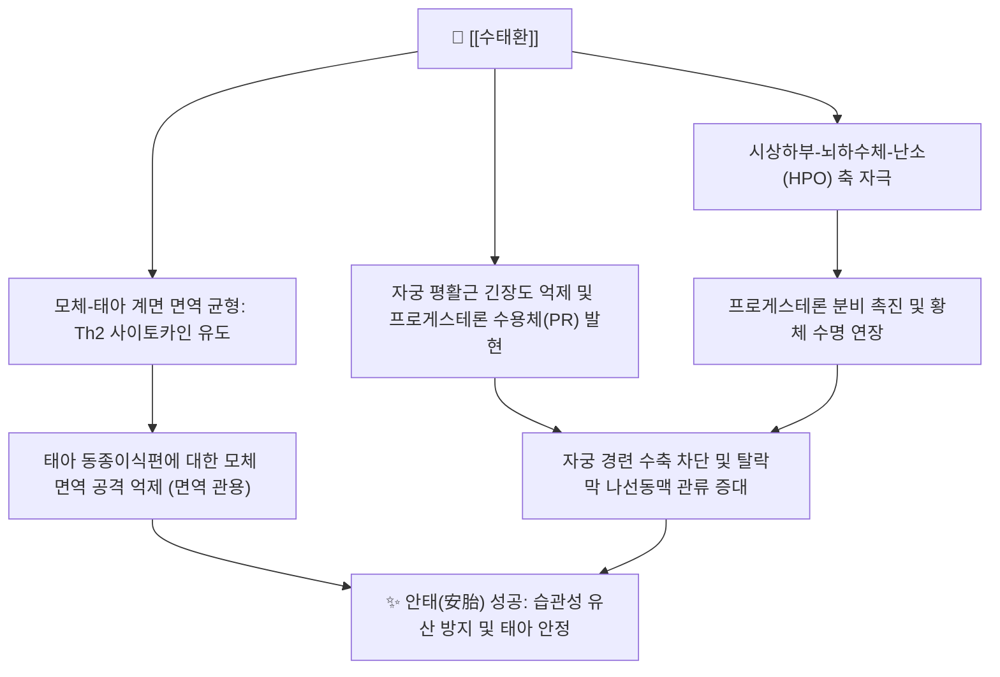

# 🧪 [[수태환]] (壽胎丸, Shòutāi Wán)

> **핵심 요약 (Key Summary)**:
> 장석순의 《의학충중참서록》에 수록된 신허로 인한 태동불안 및 습관성 유산 치료의 명방
> [[토사자]]의 보신양 및 [[상기생]], [[속단]], [[아교]]의 보간신·양혈지혈 작용 배오
> 황체 기능 보강, 프로게스테론 수용체 발현 촉진, 태아 면역 관용 유도 및 자궁 수축 억제

---
## 📌 목차
1. [처방 기본 정보](#1-처방-기본-정보)
2. [방제 구성 및 군신좌사 (君臣佐使)](#2-방제-구성-및-군신좌사-君臣佐使)
3. [분자약리 기전 & 현대 의학적 효능](#3-분자약리-기전--현대-의학적-효능)
4. [임상 적응증 & 사상의학적 배오](#4-임상-적응증--사상의학적-배오)
5. [처방 감별 매트릭스](#5-처방-감별-매트릭스)
6. [안전성, 부작용 및 복용 주의](#6-안전성-부작용-및-복용-주의)
7. [출처 및 학술 참고 문헌 (References)](#7-출처-및-학술-참고-문헌-references)

---
## 1. 처방 기본 정보

| 항목 | 상세 내용 |
| :--- | :--- |
| **처방명** | [[수태환]] (壽胎丸, Shoutai Pill) |
| **출전** | 장석순, 《의학충중참서록(醫學衷中參西錄)》 |
| **처방 분류** | [[02_보익제]] / 보신안태제(補腎安胎劑) |
| **주치 병증** | 신허태루(腎虛胎漏), 태동불안(胎動不安), 활태(滑胎, 습관성 유산), 요통임신, 하혈소량 |
| **치법** | 보신익정(補腎益精), 고충안태(固衝安胎), 양혈지혈(養血止血) |

---
## 2. 방제 구성 및 군신좌사 (君臣佐使)

| 본초명 | 약재 역할 | 용량(원방 기준) | 핵심 약리 성분 | 주요 기전 및 배오 목적 |
| :--- | :--- | :--- | :--- | :--- |
| [[토사자]] | 군약(君藥) | 4냥 (초숙 炒熟) | 플라보노이드, [[퀘르세틴]] | 신양과 신음을 평보, 시상하부-하수체-난소축 조절 |
| [[상기생]] | 신약(臣藥) | 2냥 | 렉틴, 비스코톡신 | 보간신, 양혈고충, 자궁 수축 억제 및 태반 혈류 개선 |
| [[속단]] | 좌약(佐藥) | 2냥 | 아케비아사포닌 D | 간신 보강, 통혈맥, 손상된 자궁 탈락막 조직 회복 |
| [[아교]] | 사약(使藥) | 2냥 (진주교, 양화 烊化) | 콜라겐 펩타이드, 아미노산 | 자음양혈, 지혈안태, 자궁 점막 지혈 및 영양 공급 |

---
## 3. 분자약리 기전 & 현대 의학적 효능

### (1) 난소 황체 기능 보강 및 프로게스테론 수용체 발현
* [[토사자]]와 [[속단]] 복합 추출물이 황체세포의 스테로이드 합성 경로를 활성화하여 혈중 프로게스테론 분비를 증가시키고, 자궁내막의 프로게스테론 수용체(PR) 발현을 유도하여 착상 상태를 견고히 유지함.

### (2) 모체-태아 면역 관용(Immune Tolerance) 증진
* 임신 실패를 유발하는 염증성 Th1 면역 반응(TNF-α, IFN-γ)을 억제하고, 항염증성 Th2 면역 반응(IL-4, IL-10)을 유도하여 반동종이식편인 태아를 모체 면역 공격으로부터 보호함.

---
## 4. 임상 적응증 & 사상의학적 배오

### (1) 현대 한의 임상 적응증
* **절박 유산 (Threatened Abortion)**: 임신 초기 하복부 은은한 통증, 요산(허리 시림), 갈색 혈성 분비물 동반 시.
* **습관성 유산 (Recurrent Pregnancy Loss)**: 황체기 결함, 면역학적 원인 또는 원인 불명의 반복 유산 예방.
* **체외수정(IVF) 착상 보조**: 배아 이식 후 착상 유지 및 자궁내막 수용성(Receptivity) 개선.

### (2) 사상의학적 관점
* 신국(腎局)이 허약하여 하초 기운이 쉽게 새어나가기 쉬운 소양인의 태동불안이나, 음혈이 마르기 쉬운 소음인 허약자의 안태 처방으로 체질에 맞추어 약재 가감이 널리 활용됨.

---
## 5. 처방 감별 매트릭스

| 구분 | [[수태환]] | [[교애탕]] | [[당귀산]] |
| :--- | :--- | :--- | :--- |
| **주요 병인** | 신허(腎虛)로 인한 충임맥 불안정 | 충임허손(衝任虛損) 한출혈 | 간비불화(肝脾不和) 습열 내조 |
| **핵심 약재** | [[토사자]], [[상기생]], [[속단]], [[아교]] | [[아교]], [[애엽]], [[당귀]], [[천궁]] | [[당귀]], [[백작약]], [[황금]], [[백출]] |
| **동반 증상** | 허리 시림과 묵직함, 다리 무력, 소변 잦음 | 복통, 암적색 출혈, 수족 냉증 | 태열(胎熱), 가슴 답답함, 신체 열감 |
| **치료 원칙** | 온건한 보신익정·안태 | 온경지혈·자혈양태 | 청열양혈·건비안태 |

---
## 6. 안전성, 부작용 및 복용 주의

* **아교 소화장애 주의**: 아교의 점조성(끈적거리는 성질)으로 인해 비위가 허약한 임산부에게 소화불량, 오심, 식욕감퇴, 설사가 발생할 수 있음.
* **복용 요령**: 아교는 탕약에 넣고 함께 달이지 않고, 다른 약재를 달인 따뜻한 탕약에 녹여(양화 烊化) 복용함.
* **열증(熱證) 임산부 주의**: 발열이나 자궁 내 감염으로 인한 급성 질환에는 투여를 금하고, 청열해독 조치를 우선함.
* **처방 사이드 대처법 연계**: [[처방 사이드 대처법]] 145번 항목에 아교의 소화장애 대처 및 건비 배오 요령이 정리되어 있음.

---
## 7. 출처 및 학술 참고 문헌 (References)

* 장석순, 《의학충중참서록(醫學衷中參西錄)》
* 전국한의과대학 방제학교수 공편저, 《방제학》, 영림사
* Li L et al. Shoutai Wan improves endometrial receptivity and pregnancy outcomes in recurrent implantation failure. J Ethnopharmacol. 2021.
  * [연구 요약] 수태환 투여가 자궁내막 수용성 지표(LIF, Integrin β3) 발현을 유의하게 증가시키고 착상 성공률을 높임을 규명함.
