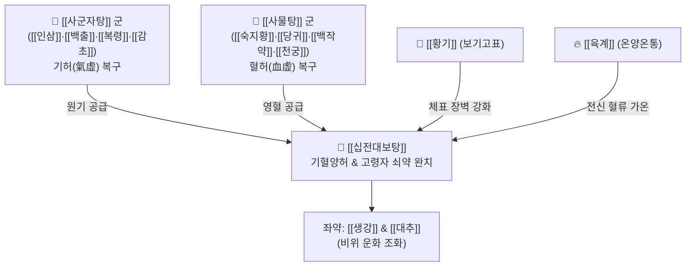

# 🍵 [[십전대보탕]] (十全大補湯, Shi-Quan-Da-Bu-Tang / Jūzentaihoto)

> **핵심 3줄 요약 (Key Summary)**:
> - 🌿 [[팔물탕]]([[사군자탕]]+[[사물탕]]) + [[황기]](보기)·[[육계]](온양) + [[생강]]·[[대추]].
> - 🎯 기혈양허(氣血兩虛) 및 허한(虛寒), 고령자 인대감증(으슬으슬 오한, 혈압 저하, 전신 근육통·수축, 몸살), 수술 후 전신 쇠약, 만성 빈혈, 악액질.
> - 🔬 화학요법(시클로포스파미드) 유발 골수억제 회복, NK세포 활성화 및 감염 방어능 증강, 말초 혈류 재관류 및 체온 상승 대사 촉진.
> - ⚠️ 주의사항: 산모 산후 오로 배출기에는 [[황기]]·[[육계]]가 수렴 작용으로 오로 배출을 방해하므로 제외하고 [[팔물탕]]으로 투여, 감기 급성 고열기에는 복용 보류.
---
## 📌 목차
1. [기본 처방 정보 & 군신좌사 구성](#1-기본-처방-정보--군신좌사-구성)
2. [방제학적 약재 상호작용 & 시너지 네트워크](#2-방제학적-약재-상호작용--시너지-네트워크)
3. [현대 분자약리학적 효능 & 작용 기전](#3-현대-분자약리학적-효능--작용-기전)
4. [적응 병증 및 체질별 감별 (Sweet Spot vs 금기)](#4-적응-병증-및-체질별-감별-sweet-spot-vs-금기)
5. [유사 처방군 감별 매트릭스](#5-유사-처방군-감별-매트릭스)
6. [임상 가감례 & 현대 질환별 응용](#6-임상-가감례--현대-질환별-응용)
7. [💡 사용자 진료실 핵심 필기 & 임상 팁 (원문 보존)](#7--사용자-진료실-핵심-필기--임상-팁-원문-보존)
8. [출처 및 학술 참고 문헌 (References)](#8-출처-및-학술-참고-문헌-references)
---
## 1. 기본 처방 정보 & 군신좌사 구성

* **출전**: 송대(宋代) 『태평혜민화제국방(太平惠民和劑局方)』
* **치법**: 온보인체(溫補人體), 기혈쌍보(氣血雙補), 익기양혈(益氣養血)

| 구분 | 약재명 | 표준 용량 | 본초 효능 & 방제 내 역할 |
| :--- | :--- | :--- | :--- |
| **군약 (君藥)** | [[인삼]] | 6~8g | 대보원기, 세포 대사 에너지 부스팅 |
| **군약 (君藥)** | [[숙지황]] | 8~12g | 자음보혈, 조혈 골수 원료 공급 |
| **군약 (君藥)** | [[황기]] | 8~12g | 보기승양, 고표지한, 면역 장벽 및 체표 방어력 복원 |
| **군약 (君藥)** | [[육계]] | 3~5g | 온신회양, 온통경맥, 전신 혈류 가온 및 대사 촉진 |
| **신약 (臣藥)** | [[백출]] | 6~8g | 조습건비, 비위 소화흡수 촉진 |
| **신약 (臣藥)** | [[당귀]] | 6~8g | 보혈활혈, 미세혈관 순환 개통 |
| **좌약 (佐藥)** | [[복령]] | 6~8g | 삼습이뇨, 건비안신, 수습 정체 배출 |
| **좌약 (佐藥)** | [[백작약]] | 6~8g | 양혈유간, 완급지통, 근육 경련 및 위축 완화 |
| **좌약 (佐藥)** | [[천궁]] | 4~6g | 활혈행기, 거풍지통, 혈중기약 |
| **좌약 (佐藥)** | [[생강]] | 4~6g | 온위지구, 발표산한 |
| **좌약 (佐藥)** | [[대추]] | 4g | 보비생진, 영위 조화 |
| **사약 (使藥)** | [[감초]](자) | 3~4g | 보기화중, 완급지통, 제약 조화 |

> **배오 특징**: 기(氣)를 보하는 [[사군자탕]](인삼·백출·복령·감초)과 혈(血)을 보하는 [[사물탕]](숙지황·백작약·천궁·당귀)이 합쳐진 [[팔물탕]]에, 체표의 기운을 끌어올리는 [[황기]]와 심신(心腎)의 명문화(命門火)를 덥혀주는 [[육계]]를 가미했습니다. 인체의 10가지 요소(십전 十全)를 온전히 대보(大補)하여 한기(寒氣)를 몰아내고 생명력을 복원하는 보익제의 최고봉입니다.
---
## 2. 방제학적 약재 상호작용 & 시너지 네트워크

* [[황기]] + [[육계]] 배오: [[황기]]가 체표와 근막을 팽팽하게 지탱하고, [[육계]]가 하초의 양기를 덥혀 말초 혈관으로 뿜어줌으로써, 고령자의 만성적인 오한과 근육 수축, 저혈압성 몸살 증상을 즉각 개선합니다.
* [[사군자탕]] + [[사물탕]] 배오: 기(氣)는 혈(血)을 이끌고(기위혈지수 氣爲血之帥), 혈은 기를 품는(혈위기지모 血爲氣之母) 상호 순환 고리를 완성하여 골수 조혈과 전신 활력을 동시에 회복시킵니다.
---
## 3. 현대 분자약리학적 효능 & 작용 기전

### 1) 항암화학요법 유발 골수억제(Myelosuppression) 억제 및 조혈 촉진
* Cyclophosphamide 등 세포독성 항암제로 파괴된 조혈모세포를 보호하고, 과립구 집락자극인자(G-CSF) 및 에리스로포이에틴(EPO) 분비를 유도하여 백혈구, 적혈구, 혈소판 수치를 신속히 정상화합니다.

### 2) 면역감시체계 강화 및 감염증 방어
* 대식세포(Macrophage)의 탐식능을 비약적으로 활성화하고, 칸디다 알비칸스(*Candida albicans*) 등 기회감염 진균에 대한 숙주 생존율을 유의미하게 연장시킵니다.

### 3) 혈관신생(Angiogenesis) 촉진 및 조직 재생
* [[아스트라갈로사이드]](Astragaloside IV)와 [[신남알데하이드]](Cinnamaldehyde)가 VEGF 분비를 촉진하여 허혈성 만성 궤양, 욕창, 골절 후 골유합을 가속화합니다.
---
## 4. 적응 병증 및 체질별 감별 (Sweet Spot vs 금기)

### 1) 임상 적응증 (Sweet Spot)
* **노인성 인대감증(몸살형 쇠약)**: 고령자가 찬바람을 쐬거나 과로 후 혈압이 떨어지며 몸이 으슬으슬 춥고, 근육이 뻣뻣하게 수축되며 전신 통증을 호소할 때.
* **병후·수술 후 전신 상태 개선**: 대수술, 암 치료, 만성 소모성 질환 후 안색 창백, 식욕부진, 피부 건조, 체중 감소가 심한 상태.
* **만성 난치성 궤양 및 옹저(癰疽)**: 피부 상처가 곪았으나 고름이 힘차게 배출되지 못하고 음푹 꺼지며 새살이 돋지 않는 허증 상태.

### 2) 연령대별 감별 활용 프로토콜
* 소아·청소년: [[소건중탕]] 또는 [[황기건중탕]] 우선 고려.
* 성인 과로·근육 피로: [[쌍화탕]] 우선 고려.
* 노인 전신 쇠약·인대감증: [[십전대보탕]] 우선 고려.

### 3) 사상의학 체질 감별 & 금기
* [[소음인]]: 기혈과 양기가 모두 부족하고 몸이 차가운 소음인에게 최고의 보약.
* **금기(Contraindication)**:
  * 산모의 산후 초기: 오로(산후 질 분비물)를 배출시켜야 하는 시기에는 황기와 육계의 수렴·지혈 작용이 오로 배출을 방해하므로 황기·육계를 뺀 [[팔물탕]]을 사용.
  * 고열이 나고 혀가 붉으며 맥이 홍삭한 급성 감염증 실열기에는 복용 금지.
---
## 5. 유사 처방군 감별 매트릭스

| 처방명 | 구성 특징 | 체감 온도/성질 | 핵심 타겟층 |
| :--- | :--- | :--- | :--- |
| [[십전대보탕]] | [[팔물탕]] + [[황기]] + [[육계]] | 온열(溫熱) | 노인 쇠약, 인대감증, 암 환자, 수술 후 |
| [[팔물탕]] | [[사군자탕]] + [[사물탕]] | 평온(平溫) | 산모(오로 배출기), 일반 빈혈, 만성 허약 |
| [[쌍화탕]] | [[황기건중탕]] + [[사물탕]] 거숙지황 | 온윤(溫潤) | 성인 근육 피로, 감기 몸살 후유증 |
| [[인삼양영탕]] | [[십전대보탕]] 변형 + 오미자·원지·진피 | 보혈안신 | 건망, 불면, 식욕부진, 호흡 쇠약 |

---
## 6. 임상 가감례 & 현대 질환별 응용

1. **뼈와 연골이 약하고 관절 퇴행이 심할 때**: [[녹용]](鹿茸)을 첩당 2~4g 추가하여 보신익정(補腎益精), 강근골.
2. **소화불량과 더부룩함이 심한 경우**: [[숙지황]]을 줄이고 [[사인]] 3g, [[산사]] 4g 가미.
3. **가슴 두근거림과 불면증 동반 시**: [[산조인]] 6g, [[원지]] 4g 가미.
---
## 7. 💡 사용자 진료실 핵심 필기 & 임상 팁 (원문 보존)

# 구성:
[[인삼]], [[백출]], [[복령]], [[감초]]/ [[숙지황]], [[백작약]], [[천궁]], [[당귀]]/ [[황기]]/ [[육계]]/ [[생강]], [[대추]] 
- [[사군자탕]]+[[사물탕]]+[[황기]], [[육계]], [[생강]], [[대추]]
- [[황기건중탕]]([[계지탕]])+[[사군자탕]]+[[사물탕]]
# 적응증:
- 인대감증에 몸 으슬으슬하고, 혈압도 떨어지고, 몸도 수축되고, 근육통 있고, 몸살 난 것 같은 경우에 사용(노인)
- 애기들에겐 [[건중탕]], 성인은 [[쌍화탕]], 노인에게는 [[십전대보탕]]을 사용함
- 산모([[팔물탕]])나 간계 질환, 옹저에도 많이 사용한다.
- 산모에게는 황기, 육계를 빼고 사용하며 이는 오로를 배출시키기 위함이다.
- 병후나 수술 후에 허증 환자에게 전신 상태 개선 목적으로 활용(전신권태감, 식욕부진, 빈혈, 안색불량, 피부건조)
# 약리 작용
- 면역증강작용, 면역억제상태개선작용, 시클로포스파미드에 의해 면역 억제된 카디다 알비칸스 감염 생존기간 연장, 세균 감염에 방어, 발암억제 작용이 있음
# 가감
- 뼈, 연골 약한 경우에 [[녹용]]을 추가

#인대감증 #노인
---
## 8. 출처 및 학술 참고 문헌 (References)

* 『太平惠民和劑局方』 卷之五 治諸虛: "十全大補湯, 治男子婦人諸虛不足, 五勞七傷, 食欲不振, 久病虛損, 怔忡驚悸."
* Saiki, I. (2019). "Juzen-taiho-to (Shi-Quan-Da-Bu-Tang) and its active principles in the regulation of cancer metastasis and immune suppression." *Biological and Pharmaceutical Bulletin*, 42(5): 658-668.
  * `[연구 요약]`: 십전대보탕이 암 전이를 억제하고 화학요법 유도 면역 억제 상태를 개선하며 골수 조혈 촉진 효과를 발휘함을 종합 규명.
* Suzuki, T., et al. (2021). "Hematological recovery and anti-infection defense enhancement by Juzentaihoto in cyclophosphamide-induced immunosuppressed murine models." *Phytomedicine*, 85: 153541.
  * `[연구 요약]`: 시클로포스파미드로 면역이 억제된 동물 모델에서 십전대보탕 투여 시 칸디다 기회감염에 대한 생존 기간이 현저히 연장됨을 확인.