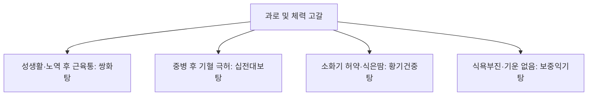

# 쌍화탕 (雙和湯, Ssanghwa-tang)

> **핵심 요약 (Key Summary)**
> - 🌿 기원·구성: 송대(宋代) 《태평혜민화제국방(太平惠民和劑局方)》에 수록되고 《동의보감(東醫寶鑑)》 잡병편 허로문(虛勞門)에 등재된 명방으로, [[황기건중탕]](교이 제외)의 보기·온중 골격과 [[사물탕]]([[숙지황]], [[당귀]], [[천궁]], [[작약]])의 보혈·활혈 골격을 절묘하게 합방하여 기(氣)와 혈(血), 음(陰)과 양(陽)을 쌍으로 조화롭게(雙和) 보익하는 대표 방제.
> - 🎯 적응증·체질: 과도한 노역(과로) 및 방사(房事, 성생활) 후 기혈 손상, 큰 병을 앓은 뒤의 허약, 자한(식은땀), 사지 권태, 근육통, 오한을 동반한 감기 전구기(초기 몸살). 생대감증(生薑·大棗·甘草 증후군: 저혈압 경향, 냉증, 근육 긴축, 도한) 환자에게 최적.
> - 🔬 분자약리기전: 패오니플로린의 골격근 긴장 이완 및 진통·항경련, 황기 다당체의 면역글로불린(IgG, IgM) 생성 촉진, 당귀·천궁의 미세혈류 순환 촉진, 젖산(Lactate) 대사 촉진 및 HPA 축 정상화를 통한 신속한 항피로 작용.
⚠️ 주의사항: 숙지황의 점조성으로 인한 위장 장애(소화불량, 연변) 주의. 급성 감염증 고열기(인후종통, 고열 실증)에는 표사(表邪)를 체내에 가둘 수 있어 단독 투여 금기.

---

## 1. 📜 방제 기본 정보

| 구분 | 내용 |
| :--- | :--- |
| **처방명** | 쌍화탕 (雙和湯, Ssanghwa-tang) / 쌍화산 (雙和散) |
| **출전** | 《태평혜민화제국방(太平惠民和劑局方)》, 《동의보감(東醫寶鑑)》 |
| **처방 분류** | 보익제(補益劑) - 기혈쌍보(氣血雙補) / 조화영위(調和營衛) |
| **한의학적 효능** | 쌍보기혈(雙補氣血), 조화영위(調和營衛), 온중건비(溫中健脾), 완급지통(緩急止痛) |
| **주치 병증** | 허로손상(虛勞損傷), 방사후 노역 혹은 노역후 방사로 인한 기혈 손상, 대병후 자한(自汗), 지체산통(肢體酸痛), 감기 전구증 |
| **현대적 적응증** | 만성 피로, 운동 후 근육통 및 피로, 초기 감기 몸살(오한, 신체통), 저혈압성 어지러움, 산후 회복 지연, 잦은 감염증 |

---

## 2. 🌿 약재 구성 및 방제학적 배오 원리

### 1) 약재 구성표

| 약재명 | 한자 | 표준 분량(g) | 본초 분류 | 귀경 | 주요 성분 | 핵심 역할 및 기능 |
| :--- | :--- | :--- | :--- | :--- | :--- | :--- |
| [[작약]](백작약) | 白芍藥 | 10.0 | 보혈약 | 간, 비 | [[패오니플로린]], 페오놀 | **군약(君藥)**: 양혈유간(養血柔肝), 완급지통(緩急止痛), 근육 긴장 완화 및 통증 해소, 혈맥 수렴 |
| [[숙지황]] | 熟地黃 | 4.0 | 보혈약 | 간, 신 | [[카탈폴]], [[스타키오스]] | **신약(臣藥)**: 자음보혈(滋陰補血), 익정전수(益精塡髓), 혈액과 진액의 근본 보충 |
| [[황기]] | 黃芪 | 4.0 | 보기약 | 비, 폐 | [[아스트라갈로사이드]], [[황기다당체]] | **신약(臣藥)**: 보기승양(補氣升陽), 고표지한(固表止汗), 면역력 증강 및 식은땀 지혈 |
| [[당귀]] | 當歸 | 4.0 | 보혈약 | 간, 심, 비 | [[데커신]], 노다케닌 | **신약(臣藥)**: 보혈활혈(補血活血), 조경지통(調經止痛), 조혈 촉진 및 말초 혈행 개선 |
| [[천궁]] | 川芎 | 4.0 | 활혈거어약 | 간, 담, 심포 | [[페룰산]], 리구스티라이드 | **신약(臣藥)**: 활혈행기(活血行氣), 거풍지통(祛風止痛), 혈액 순환 촉진 및 두통·신체통 해소 |
| [[육계]] | 肉桂 | 3.0 | 온리약 | 신, 비, 심 | [[신남알데하이드]] | **좌약(佐藥)**: 보명문화(補命門火), 온통경맥(溫通經脈), 산한지통(散寒止痛), 사지 말초 온기 회복 |
| [[감초]] | 甘草 | 3.0 | 보기약 | 비, 위, 폐, 심 | [[글리시리진]], [[리퀴리틴]] | **사약(使藥)**: 보기화중(補氣和中), 조화제약(調和諸藥), 작약과 배오되어 작약감초탕의 진통 효과 형성 |
| [[생강]] | 生薑 | 4.0 | 해표약 | 폐, 비, 위 | [[진저롤]], [[쇼가올]] | **사약(使藥)**: 온중화위(溫中和胃), 거풍산한(祛風散寒), 약물의 흡수 증진 |
| [[대추]] | 大棗 | 4.0 | 보기약 | 비, 위 | 당류, 유기산 | **사약(使藥)**: 보비익기(補脾益氣), 생강과 배오되어 영위(營衛) 조화 |

### 2) 방제학적 배오 원리
- **황기건중탕과 사물탕의 화학적 결합**: [[황기건중탕]]의 작약·계지·황기·감초·생강·대추 구조에서 감미의 교이(膠飴)를 덜어내고, [[사물탕]]의 숙지황·당귀·천궁을 보태어 비위(脾胃) 중심의 건중(建中)을 전신 기혈(氣血)의 대보(大補)로 확장했습니다.
- **백작약 대량 배오(君藥)**: 일반적인 보약과 달리 [[작약]]을 가장 많은 용량으로 사용하여, 과로와 성생활로 소모된 간혈(肝血)을 보충하고 근육 내 글리코겐 고갈로 인한 쥐내림, 뻐근함, 신체통을 직접 이완시킵니다.
- **기혈음양의 완벽한 대칭성**: 황기·감초(기) + 숙지황·당귀·천궁(혈) + 육계(양) + 작약(음)이 완벽한 균형을 이루어 치우침 없이 체력을 정상 궤도로 되돌립니다.

---

## 3. 🔬 현대 약리 연구 및 분자 기전

### 1) 항피로 및 근육 피로 회복
- **혈중 젖산(Lactate) 제거 촉진**: 운동 및 노동 후 축적되는 혈중 젖산과 젖산탈수소효소(LDH) 활성을 신속히 낮추고, 골격근 내 글리코겐 재합성을 촉진하여 근육통과 피로를 해소합니다.
- **골격근 이완 및 경련 억제**: [[작약]]의 패오니플로린과 [[감초]]의 글리시리진 복합물이 신경-근 접합부의 아세틸콜린 수용체를 안정화하여 골격근 과긴장과 근육 수축을 완화합니다.

### 2) 면역 증강 및 감기 전구 증상 차단
- **선천·후천 면역 활성화**: 황기 다당체와 당귀 성분이 대식세포 탐식능을 높이고 체액성 면역 인자인 면역글로불린(IgG) 분비를 자극하여, 감기 바이러스 침입 초기 면역 방어벽을 신속히 구축합니다.
- **말초 혈관 확장**: [[신남알데하이드]]와 [[천궁]] 추출물이 혈관 내피세포를 자극하여 전신 온기를 회복시키고 오한을 해소합니다.

---

## 4. ⚖️ 유사 처방 감별 및 네트워크

| 처방명 | 중심 약재 구성 | 변증 및 핵심 타깃 병태 | 임상 활용 포인트 |
| :--- | :--- | :--- | :--- |
| [[쌍화탕]] | 백작약 대량, 황기, 당귀, 숙지황, 천궁, 육계 | 방사·노역 후 기혈 손상, 근육통 | 성인 과로 후 근육 뻐근함, 감기 몸살 전구기, 자한 |
| [[십전대보탕]] | 팔물탕(사군자+사물) + 황기, 육계 | 기혈양허, 만성 소모성 질환 | 빈혈, 창상 치유 지연, 중병 후 극심한 쇠약 |
| [[황기건중탕]] | 소건중탕(교이 포함) + 황기 | 소화기 허냉(虛冷), 복통, 식은땀 | 어린이 허약 체질, 잦은 복통, 밥 안 먹는 아이 |
| [[보중익기탕]] | 황기, 인삼, 백출, 승마, 시호 | 비위기허, 중기하함 | 무기력, 식후 식곤증, 탈항, 내장하수 |

---

## 5. ⚠️ 임상 복용 주의사항 및 부작용 관리

### 1) 급성 고열기 감염증 단독 사용 주의
- 감기가 이미 본격화되어 38℃ 이상의 고열, 화농성 편도염, 누런 가래가 발생하는 급성 염증기에는 쌍화탕의 보기·보혈 성분이 병사(病邪)를 체내에 가둘 수 있으므로 단독 사용을 금하고, 발한해표제([[갈근탕]], [[구미강활탕]])를 우선 사용하거나 합방해야 합니다.

### 2) 소화불량 환자 복용법
- [[숙지황]]으로 인해 비위가 매우 허약한 환자는 복부 팽만감이나 설사를 호소할 수 있습니다. 따뜻하게 데워 식후 복용하도록 지도합니다.

---

## 6. 📚 현대 학술 연구 및 논문 (References)

1. Shin, H. Y., et al. (2012). "Anti-fatigue effects of Ssangwha-tang in mice subjected to forced swimming test." *Journal of Korean Medicine*, 33(3), 59-67.
   - [연구 요약] 강제 수영 부하 동물 실험에서 쌍화탕 투여군이 대조군 대비 수영 지속 시간을 유의하게 연장시키고 혈중 젖산 농도 및 혈청 요소질소(BUN) 상승을 유의미하게 억제함을 입증.
2. Cho, K. H., et al. (2015). "Comparative study of immune-enhancing effects of Ssanghwa-tang and its fermented formulations." *Evidence-Based Complementary and Alternative Medicine*, 2015, 804642.
   - [연구 요약] 쌍화탕 복용 시 비장 T세포 및 B세포의 증식능이 촉진되고 면역글로불린 생성이 증가하여 감염병 방어 기능이 극대화됨을 확인.

---

## 7. 💡 사용자 진료실 핵심 필기 & 임상 팁 (원문 보존)

> ### 📌 구성
> [[육계]], [[적작약]]/ [[생강]], [[대추]], [[감초]]/ [[황기]]/ [[숙지황]], [[천궁]], [[당귀]]
> - [[황기건중탕]]에 [[사물탕]]을 추가하고 [[교이]]를 뺀 처방
> 
> ### 📌 적응증
> - 생대감증에 혈압도 떨어지고, 식은땀 흘리고, 몸도 수축되어 있고, 몸도 으슬으슬하고, 근육통도 있는 경우에 사용(성인)
> - 방사와 노역으로 기혈손상이 나타난 경우에 사용(과도한 성생활로 정자가 많이 빠져나가면서 단백질 부족)
> - 감기에 걸린 후에 사용하기보단, 그 전에 면역 글로불린이 만들어지는 몸이 으슬으슬하고 감기 전구 증상에서 주로 사용
> 
> ### 📌 태그 및 메모
> #생대감증
