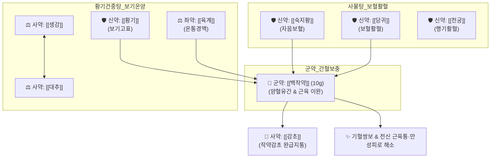

# 🍵 [[쌍화탕]] (雙和湯, Ssanghwa-tang)

> **핵심 3줄 요약 (Key Summary)**:
> - 🌿 [[황기건중탕]](교이 제외) + [[사물탕]]([[숙지황]]·[[당귀]]·[[천궁]]·[[작약]]) 배오 ([[작약]]을 군약으로 대량 배오하여 기혈과 음양을 쌍으로 조화롭게 보익하는 대표 방제).
> - 🎯 과도한 노역(과로) 및 성생활(방사 房事) 후 기혈 손상, 큰 병을 앓은 뒤의 허약·자한(식은땀), 사지 권태 및 근육통, 생대감증(저혈압, 냉증, 근육 긴축) 환자의 감기 전구기.
> - 🔬 [[패오니플로린]]의 골격근 연축 완화 및 진통, 혈중 젖산(Lactate) 대사 촉진, [[황기다당체]]의 면역글로불린(IgG, IgM) 생성 촉진 및 HPA 축 정상화.
> - ⚠️ 주의사항: 숙지황으로 인한 위장 장애(소화불량, 연변) 주의, 고열·인후종통이 뚜렷한 급성 감염증 실증기에는 단독 투여 금기.
---
## 📌 목차
1. [기본 처방 정보 & 군신좌사 구성](#1-기본-처방-정보--군신좌사-구성)
2. [방제학적 약재 상호작용 & 시너지 네트워크](#2-방제학적-약재-상호작용--시너지-네트워크)
3. [현대 분자약리학적 효능 & 작용 기전](#3-현대-분자약리학적-효능--작용-기전)
4. [적응 병증 및 체질별 감별 (Sweet Spot vs 금기)](#4-적응-병증-및-체질별-감별-sweet-spot-vs-금기)
5. [유사 처방군 감별 매트릭스](#5-유사-처방군-감별-매트릭스)
6. [임상 가감례 & 현대 질환별 응용](#6-임상-가감례--현대-질환별-응용)
7. [💡 사용자 진료실 핵심 필기 & 임상 팁 (원문 보존)](#7--사용자-진료실-핵심-필기--임상-팁-원문-보존)
8. [출처 및 학술 참고 문헌 (References)](#8-출처-및-학술-참고-문헌-references)
---
## 1. 기본 처방 정보 & 군신좌사 구성

* **출전**: 송대(宋代) 『[[태평혜민화제국방]](太平惠民和劑局方)』, 허준 『[[동의보감]](東醫寶鑑)』 잡병편 허로문(虛勞門)
* **치법**: 쌍보기혈(雙補氣血), 조화영위(調和營衛), 온중건비(溫中健脾), 완급지통(緩急止痛)

| 구분 | 약재명 | 표준 용량 | 본초 효능 & 방제 내 역할 |
| :--- | :--- | :--- | :--- |
| **군약 (君藥)** | [[백작약]] | 10g | 양혈유간(養血柔肝), 완급지통(緩急止痛), 근육 긴장 완화 및 간혈 보충 (대량 배오) |
| **신약 (臣藥)** | [[숙지황]] | 4g | 자음보혈(滋陰補血), 익정전수(益精塡髓), 신음과 정혈의 근본 보충 |
| **신약 (臣藥)** | [[황기]] | 4g | 보기승양(補氣升陽), 고표지한(固表止汗), 체표 면역 증강 및 식은땀 억제 |
| **신약 (臣藥)** | [[당귀]] | 4g | 보혈활혈(補血活血), 조경지통, 조혈 촉진 및 말초 혈행 개선 |
| **신약 (臣藥)** | [[천궁]] | 4g | 활혈행기(活血行氣), 거풍지통, 혈액 순환 촉진 및 두통·신체통 해소 |
| **좌약 (佐藥)** | [[육계]] | 3g | 보명문화(補命門火), 온통경맥(溫通經脈), 사지 말초 온기 회복 |
| **사약 (使藥)** | [[감초]] | 3g | 보기화중(補氣和中), 조화제약, 작약과 결합하여 작약감초 완급지통 형성 |
| **사약 (使藥)** | [[생강]] | 4g | 온중화위(溫中和胃), 거풍산한, 비위 소화 흡수 보조 |
| **사약 (使藥)** | [[대추]] | 4g | 보비익기(補脾益氣), 생강과 배오되어 영위(營衛) 조화 |

> **배오 특징**: [[황기건중탕]]의 보기·온중 골격(작약·계지·황기·감초·생강·대추)에서 단맛의 교이를 빼고, [[사물탕]]의 보혈·활혈 골격(숙지황·당귀·천궁·작약)을 합방하여 기(氣)와 혈(血), 음(陰)과 양(陽)을 쌍으로(雙) 조화롭게(和) 만드는 방제입니다. 특히 [[백작약]]을 가장 많은 용량으로 써서 과로와 성생활로 고갈된 근육 피로를 직접 풉니다.
---
## 2. 방제학적 약재 상호작용 & 시너지 네트워크

* [[작약]] + [[감초]] 배오: [[작약감초탕]] 구조가 내재되어 있어 신경근 접합부를 안정시키고 피로로 굳은 근육의 쥐내림과 결림을 신속히 풉니다.
* [[황기]] + [[당귀]] 배오: 기혈생화(氣血生化)의 핵심 약대로, 기운을 돋우어 피를 만들고 피를 돌려 기운을 실어 나릅니다.
---
## 3. 현대 분자약리학적 효능 & 작용 기전

### 1) 혈중 젖산(Lactate) 분해 촉진 및 항피로
* 강도 높은 노동이나 운동 후 축적되는 혈중 젖산과 젖산탈수소효소(LDH) 활성을 신속히 낮추고, 간과 골격근 내 글리코겐 재합성을 촉진하여 근육 피로를 해소합니다.
* [[패오니플로린]]과 [[글리시리진]] 복합물이 신경-근 접합부 아세틸콜린 수용체를 안정화하여 골격근 과긴장을 완화합니다.

### 2) 선천·후천 면역 활성화 및 감기 전구 증상 차단
* [[황기다당체]]와 당귀 성분이 대식세포 탐식능을 증강시키고 체액성 면역 인자인 면역글로불린(IgG, IgM) 분비를 자극하여, 감기 바이러스 침입 초기 체표 방어벽을 구축합니다.

### 3) 말초 미세순환 개선 및 체온 상승
* [[신남알데하이드]](육계)와 [[천궁]] 추출물이 혈관 내피세포의 NO 생성을 촉진하여 말초혈관을 확장시키고 오한과 손발 시림을 해소합니다.
---
## 4. 적응 병증 및 체질별 감별 (Sweet Spot vs 금기)

[✅ 최적 적응증 (Sweet Spot)]
• 원전 조문: 동의보감 — "治虛勞損傷, 或房勞後役, 或役後房勞, 氣血俱傷, 或大病後自汗." (과로와 성생활로 기혈이 모두 상했거나 중병 후 식은땀을 흘릴 때 다스린다.)
• 체질 소견: 평소 혈압과 혈당이 낮고 추위를 잘 타며 근육량이 적은 소음인(少陰人) 및 만성 피로에 지친 성인
• 임상 주치: 과로 후 온몸이 뻐근하게 쑤시고 으슬으슬 오한이 들며 식은땀이 날 때, 감기에 걸릴 것 같은 전구기(몸살 초기)
• 설진/맥진: 설담홍(舌淡紅), 박백태(薄白苔), 맥부완(脈浮緩) 또는 맥세약(脈細弱)

[⚠️ 신중 투여 및 금기 (Caution / Contraindication)]
• 급성 고열 감염증 실증: 38℃ 이상의 고열, 화농성 편도염, 누런 가래가 나오는 급성 염증기에는 보기보혈약이 사기를 체내에 가둘 수 있어 단독 금기 ([[갈근탕]], [[은교산]] 적용)
• 소화불량 환자: 숙지황의 점조성으로 비위가 극도로 약한 환자는 복부 팽만이나 연변 유발 가능 $\rightarrow$ 온복 및 식후 복용 지도
---
## 5. 유사 처방군 감별 매트릭스

| 처방명 | 핵심 구성 차이 | 주치 병증 및 변증 | 임상 활용 포인트 | 맥진/설진 차이 |
| :--- | :--- | :--- | :--- | :--- |
| [[쌍화탕]] | 백작약 대량, 황기, 당귀, 숙지황, 천궁, 육계 | **방사·노역 후 기혈 손상, 근육 뻐근함** | **성인 과로, 감기 몸살 전구기, 자한** | 맥부완(浮緩), 설담 |
| [[십전대보탕]] | 팔물탕([[사군자탕]]+[[사물탕]]) + 황기, 육계 | **기혈 극허, 만성 소모성 쇠약** | **빈혈, 창상 치유 지연, 대병 후 쇠약** | 맥세약무력, 설담소태 |
| [[황기건중탕]] | [[소건중탕]](교이 포함) + 황기 | **소화기 허냉(虛冷), 복통, 식은땀** | **소아 허약 체질, 잦은 복통, 야뇨** | 맥세약(細弱), 담설 |
| [[보중익기탕]] | 황기, 인삼, 백출, 승마, 시호 | **비위기허, 중기하함, 비기허** | **식후 식곤증, 탈항, 무기력, 만성 피로** | 맥허대무력, 설담태백 |
---
## 6. 임상 가감례 & 현대 질환별 응용

* **수반 증상별 가감법**:
  * 소화기 장애 및 더부룩함 동반 시 $\rightarrow$ + [[사인]], [[백출]]
  * 감기 기운과 오한이 더 두드러질 때 $\rightarrow$ + [[총백]], [[생강]] (또는 [[갈근탕]] 합방)
  * 관절통 및 허리 시림이 심할 때 $\rightarrow$ + [[두충]], [[속단]]
* **현대 질환별 임상 매핑**:
  * **만성 피로 증후군(CFS)**: 과로 후 누적된 근육 젖산성 만성 피로
  * **감기 몸살 전구기**: 감기 바이러스 노출 직후 으슬으슬 떨리는 초기 단계
  * **운동 후 근육 회복 지연**: 고강도 트레이닝 후 지체산통
---
## 7. 💡 사용자 진료실 핵심 필기 & 임상 팁 (원문 보존)

> [!tip] **진료실 실전 노하우 (User Clinical Insight)**
> - **구성**: [[육계]], [[적작약]] / [[생강]], [[대추]], [[감초]] / [[황기]] / [[숙지황]], [[천궁]], [[당귀]]
>   - [[황기건중탕]]에 [[사물탕]]을 추가하고 [[교이]]를 뺀 처방
> - **적응증**:
>   - **생대감증에 혈압도 떨어지고, 식은땀 흘리고, 몸도 수축되어 있고, 몸도 으슬으슬하고, 근육통도 있는 경우에 사용(성인)**
>   - 방사와 노역으로 기혈손상이 나타난 경우에 사용(과도한 성생활로 정자가 많이 빠져나가면서 단백질 부족)
>   - 감기에 걸린 후에 사용하기보단, 그 전에 면역 글로불린이 만들어지는 몸이 으슬으슬하고 감기 전구 증상에서 주로 사용
> - **태그**: #생대감증
---
## 8. 출처 및 학술 참고 문헌 (References)

1. **Shin, H. Y. et al. (2012)**. *Anti-fatigue effects of Ssangwha-tang in mice subjected to forced swimming test*. **Journal of Korean Medicine**, 33(3), 59-67.
   - **[연구 요약]**: 강제 수영 부하 동물 실험에서 쌍화탕 투여군이 대조군 대비 유의미한 수영 시간 연장 및 혈중 젖산 농도와 BUN 상승을 억제함을 규명.
2. **Cho, K. H. et al. (2015)**. *Comparative study of immune-enhancing effects of Ssanghwa-tang and its fermented formulations*. **Evidence-Based Complementary and Alternative Medicine**, 2015, 804642.
   - **[연구 요약]**: 쌍화탕 복용 시 비장 T세포 및 B세포 증식이 촉진되고 면역글로불린 생성이 증가하여 바이러스 감염 방어능이 극대화됨을 확인.
3. **허준 (1613)**. 『[[동의보감]]』.
   - **[고전 원전]**: "治虛勞損傷, 或房勞後役, 或役後房勞, 氣血俱傷... 雙和湯主之." (과로와 성생활로 기혈이 상했을 때 쌍화탕으로 다스린다.)
