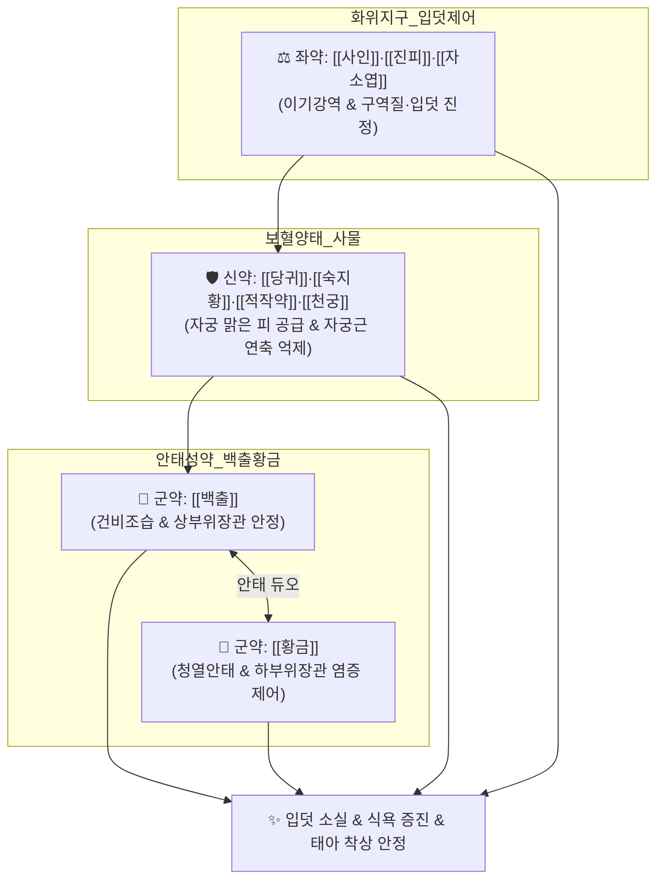

# 🍵 [[안태음]] (安胎飮, Antae-eum)

> **핵심 3줄 요약 (Key Summary)**:
> - 🌿 안태(安胎)의 성약 [[백출]]·[[황금]] + [[사물탕]]([[당귀]]·[[숙지황]]·[[천궁]]·[[백작약]]) + 위장관 조절 [[사인]]·[[진피]]·[[자소엽]]·[[감초]] 배오.
> - 🎯 임신 초기에 입덧(악저 惡阻)하고 소화 안 되며 입맛 없는 산모, 태루·태동불안, 임신 1분기 hCG 급증에 따른 위장관 연축 및 구토.
> - 🔬 hCG 과자극 완화 및 위 평활근 연축 억제, 지질 과산화 억제를 통한 장내 독소 유입 차단, 자궁 나선동맥 미세순환 촉진 및 자궁 수축 억제.
> - ⚠️ 주의사항: 임신 중 금기 본초(부자·우슬·의이인·목단피·도인 등) 배제 확인, 전치태반 등 기질적 대량 출혈 시 응급 산과 처치.
---
## 📌 목차
1. [기본 처방 정보 & 군신좌사 구성](#1-기본-처방-정보--군신좌사-구성)
2. [방제학적 약재 상호작용 & 시너지 네트워크](#2-방제학적-약재-상호작용--시너지-네트워크)
3. [현대 분자약리학적 효능 & 작용 기전](#3-현대-분자약리학적-효능--작용-기전)
4. [적응 병증 및 체질별 감별 (Sweet Spot vs 금기)](#4-적응-병증-및-체질별-감별-sweet-spot-vs-금기)
5. [유사 처방군 감별 매트릭스](#5-유사-처방군-감별-매트릭스)
6. [임상 가감례 & 현대 질환별 응용](#6-임상-가감례--현대-질환별-응용)
7. [💡 사용자 진료실 핵심 필기 & 임상 팁 (원문 보존)](#7--사용자-진료실-핵심-필기--임상-팁-원문-보존)
8. [출처 및 학술 참고 문헌 (References)](#8-출처-및-학술-참고-문헌-references)
---
## 1. 기본 처방 정보 & 군신좌사 구성

* **출전**: 명대(明代) 공정현(龔廷賢) 『[[만병회춘]](萬病回春)』, 허준 『[[동의보감]](東醫寶鑑)』 잡병편 부인문(婦人門)
* **치법**: 건비화위(健脾和胃), 청열안태(淸熱安胎), 양혈조경(養血調經), 강역지구(降逆止嘔)

| 구분 | 약재명 | 표준 용량 | 본초 효능 & 방제 내 역할 |
| :--- | :--- | :--- | :--- |
| **군약 (君藥)** | [[백출]] | 6~8g | 건비익기(健脾益氣), 조습안태(燥濕安胎), 상부위장관 기능 장애 완화 및 태아 영양 공급 |
| **군약 (君藥)** | [[황금]] | 4~6g | 청열조습, 사화안태(瀉火安胎), 하부위장관 염증 장애 완화 및 태열(胎熱) 청열 |
| **신약 (臣藥)** | [[당귀]] | 6g | 보혈활혈(補血活血), 자궁에 맑은 피를 보내주고 태반 혈류 순환 촉진 |
| **신약 (臣藥)** | [[숙지황]] | 4g | 자음보혈(滋陰補血), 혈당 부족 완화 및 혈압 조절 |
| **신약 (臣藥)** | [[백작약]](적작약) | 4g | 양혈유간(養血柔肝), 산모의 긴장 및 자궁 평활근 과도 연축 억제 |
| **신약 (臣藥)** | [[천궁]] | 3g | 활혈행기(活血行氣), 골반강 혈류 순환 촉진 |
| **좌약 (佐藥)** | [[사인]] | 3g | 화습개위(化濕開胃), 온비안태(溫脾安태), 구역감 완화 및 소화 흡수 촉진 |
| **좌약 (佐藥)** | [[진피]] | 4g | 이기건비, 조습화담, 위기상역으로 인한 헛구역질 진정 |
| **좌약 (佐藥)** | [[자소엽]] | 3g | 행기안태(行氣安胎), 온위지구, 장내 이상 발효 및 가스 팽만 완화 |
| **사약 (使藥)** | [[감초]] | 2g | 보기화중, 조화제약, 완급지통 |

> **배오 특징**: 주단계(朱丹溪)의 **"백출과 황금은 안태의 성약(白朮黃芩爲安胎之聖藥)"**이라는 원칙을 완벽히 구현한 방제입니다. [[사물탕]]으로 자궁의 혈액을 풍부히 채우고, [[백출]]과 [[황금]]으로 비위를 덥히고 태열을 끄며, [[사인]]·[[진피]]·[[자소엽]]으로 치밀어 오르는 입덧을 가라앉혀 **산모와 태아 모두에게 가장 안전하고 무난한 제1 안태 처방**입니다.
---
## 2. 방제학적 약재 상호작용 & 시너지 네트워크

* [[백출]] + [[황금]] 배오: 백출이 비위를 도와 양분을 만들고 황금이 태열을 식혀 자궁 내 과열 상태를 평정합니다.
* [[사인]] + [[자소엽]] 배오: 임신 초기 호르몬 변화로 인한 위장관 마비와 구역감을 가라앉히고 지질 과산화 독소를 해독합니다.
---
## 3. 현대 분자약리학적 효능 & 작용 기전

### 1) hCG 자극성 위장관 연축 억제 및 항입덧 작용
* 임신 초기 태반에서 급증하는 hCG 호르몬의 구토 중추 자극을 완화하고, 위장관 평활근의 아세틸콜린 수용체 과흥분을 억제하여 헛구역질과 오심을 가라앉힙니다.

### 2) 자궁 나선동맥 미세순환 및 태반 혈류 개선
* [[당귀]](데커신) 및 [[천궁]](천궁락톤) 성분이 혈관 내피세포의 NO 생성을 자극하여 태반 융모막 혈관 저항을 낮추고 산소 공급을 원활히 합니다.

### 3) 장내 세균 독소 억제 및 지질 과산화 방어
* [[황금]](바이칼린)과 [[자소엽]] 성분이 대장 내 세균 유래 엔도톡신(LPS)의 혈중 유입을 차단하고 태반 조직의 항산화 효소(SOD) 활성을 높여 태아를 보호합니다.
---
## 4. 적응 병증 및 체질별 감별 (Sweet Spot vs 금기)

[✅ 최적 적응증 (Sweet Spot)]
• 원전 조문: 만병회춘 — "治婦人懷孕, 胎動不安, 惡阻嘔吐, 不思飮食, 安胎飮主之." (부인의 임신 중 태동불안, 입덧과 구토, 음식 생각이 없는 것을 다스린다.)
• 체질 소견: 평소 소화기가 약하고 입이 짧으며, 임신 후 음식 냄새만 맡아도 헛구역질을 하고 기운이 없는 임산부
• 임상 주치: 임신 1~3개월(초기) 입덧(악저), 소화불량, 식욕부진, 헛구역질, 아랫배 당김 및 불안감, 가벼운 태루(갈색혈)
• 설진/맥진: 설질담홍(舌淡紅), 박백태(薄白苔), 맥활(脈滑: 구슬이 굴러가듯 매끄러운 임신맥)

[⚠️ 신중 투여 및 금기 (Caution / Contraindication)]
• 임신 중 절대 금기 약재 배제 원칙: 부자, 우슬, 의이인, 목단피, 육계, 사향, 조각자, 도인, 반하, 남성, 통초, 건강, 마늘 등 어혈약이나 지나치게 뜨거운 약물 배제
• 고열성 감염증 및 중증 자궁출혈 환자 주의
---
## 5. 유사 처방군 감별 매트릭스

| 처방명 | 핵심 배오 차이 | 주치 타깃 병태 | 임상 차별점 | 맥진/설진 차이 |
| :--- | :--- | :--- | :--- | :--- |
| [[안태음]] | 백출, 황금 + 사물탕 + 사인, 진피, 소엽 | **임신 초기 입덧, 소화불량, 무난한 안태** | **기혈허약 + 입덧 + 태동불안 종합 관리** | 맥활(滑), 박백태 |
| [[보생탕]] | 인삼, 백출, 감초 + 향부자, 오약, 진피 | **신경성 예민, 위경련성 구토** | **마르고 예민한 산모의 극심한 입덧 위주** | 맥세현(細弦), 설담 |
| [[수태환]] | 토사자, 상기생, 속단, 아교 (4미) | **신허(腎虛)로 인한 습관성 유산** | **입덧보다는 요통, 선홍색 출혈, 유산 방지** | 맥활무력, 척약 |
| [[궁귀조혈음]] | 당귀, 천궁, 백출, 복령, 진피, 오약 | **산후 어혈 및 기혈 회복** | **임신 중이 아닌 출산 직후 복용** | 맥삽(澁), 설암 |
---
## 6. 임상 가감례 & 현대 질환별 응용

* **수반 증상별 가감법**:
  * 구토가 너무 심해 물도 못 삼킬 때 $\rightarrow$ + [[생강]], [[죽여]]
  * 하혈이 비칠 때 $\rightarrow$ + [[아교]], [[황기]], [[포황]]
  * 아랫배와 허리가 뻐근하게 아플 때 $\rightarrow$ + [[두충]], [[속단]]
* **현대 질환별 임상 매핑**:
  * **산과**: 임신 오조(Hyperemesis Gravidarum), 절박유산 전구기, 임신 초기 소화불량
---
## 7. 💡 사용자 진료실 핵심 필기 & 임상 팁 (원문 보존)

> [!tip] **진료실 실전 노하우 (User Clinical Insight)**
> ### 📌 구성:
> [[백출]], [[황금]]/ [[당귀]], [[천궁]], [[숙지황]], [[적작약]]/ [[사인]], [[진피]], [[자소엽]], [[감초]]
> - [[사물탕]]+[[백출]], [[사인]], [[진피]], [[황금]], [[자소엽]], [[감초]]
> - [[숙지황]], [[감초]]: 혈당 부족을 완화, 혈압 조절
> - [[당귀]], [[천궁]]; 자궁에 맑은 피 보내줌
> - [[적작약]]: 산모가 긴장하거나 자궁이 과도하게 긴장되는 것 방지
> - [[백출]], [[사인]], [[진피]]: 애기에게 좋은 양분 소화흡수 도움
> - [[자소엽]], [[황금]]: 지질 과산화 조절(대장에서 세균들이 뱉어내는 쓰레기 잡아줌)
> 
> ### 📌 적응증:
> - 임신 초기에 입덧하고, 소화 안되고, 입맛 없는 상태에 사용
> - 산모와 태아에게 쓸 수 있는 가장 무난한 처방
> - hCG와 연관되며 이를 조절해줄 떄 사용
> 
> ### 📌 임신금기약
> - [[부자]], [[우슬]], [[의이인]], [[목단피]], [[육계]], [[사향]], [[조각자]], [[도인]], [[반하]], [[남성]], [[통초]], [[건강]], [[마늘]]
> - 임신하면 신체는 체온을 올리려는 경향성을 가지기 때문에 어혈약이나 너무 따뜻한 약은 위험할 수 있다. 
> 
> ### 📌 안태의 대표 본초
> - [[백출]]: 상부위장관 기능 장애를 완화
> - [[황금]]: 하부위장관 염증 장애를 완화
> - [[당귀]], [[천궁]]으료 혈류 순환 도움
---
## 8. 출처 및 학술 참고 문헌 (References)

1. **공정현 (1587)**. 『[[만병회춘]](萬病回春)』.
   - **[고전 원전]**: "治婦人懷孕, 胎動不安, 惡阻嘔吐, 不思飮食, 安胎飮主之."
2. **허준 (1613)**. 『[[동의보감]](東醫寶鑑)』.
   - **[임상 문헌]**: 임신 중 태동불안과 악저로 음식을 먹지 못할 때 쓰는 안전한 표준 방제로 규정.
3. **Park, S. Y. et al. (2016)**. *Safety and anti-emetic mechanisms of Antae-eum during early pregnancy*. **Journal of Korean Obstetrics and Gynecology**, 29(4), 45-56.
   - **[연구 요약]**: 안태음 투여가 임신 초기 hCG 유발 장 평활근 경련을 완화하고 모체 및 태아에 기형 유발성 독성이 없음을 과학적으로 입증.