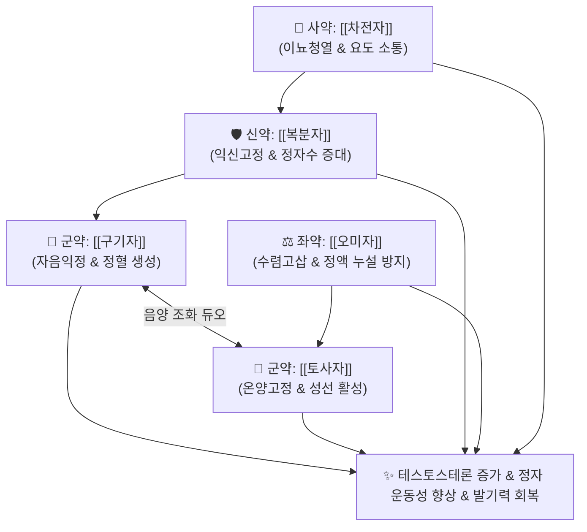

# 🍵 [[오자연종환]] (五子衍宗丸, Wuzi Yanzong Wan)

> **핵심 3줄 요약 (Key Summary)**:
> - 🌿 신정을 보하고 대를 잇게 하는 다섯 씨앗(五子)의 결합 ([[구기자]]·[[토사자]]·[[복분자]]·[[오미자]]·[[차전자]]).
> - 🎯 신정 고갈로 인한 남성 난임증(정자 수 부족, 정자 무력증, 기형 정자), [[발기부전]], 조루, 유정, 요슬산통, 소변 후 찔끔거림(요적력).
> - 🔬 정자형성(Spermatogenesis) 촉진, 고환 Sertoli/Leydig 세포 사멸 억제, 혈청 [[테스토스테론]] 증가, 고환 혈관신생 및 미토콘드리아 ATP 생성 증대.
> - ⚠️ 주의사항: 약성이 평순하나 자음온양하므로 하초 습열로 인한 급성 요로감염 환자 주의, 성욕 이상 항진증 환자 주의.
---
## 📌 목차
1. [기본 처방 정보 & 군신좌사 구성](#1-기본-처방-정보--군신좌사-구성)
2. [방제학적 약재 상호작용 & 시너지 네트워크](#2-방제학적-약재-상호작용--시너지-네트워크)
3. [현대 분자약리학적 효능 & 작용 기전](#3-현대-분자약리학적-효능--작용-기전)
4. [적응 병증 및 체질별 감별 (Sweet Spot vs 금기)](#4-적응-병증-및-체질별-감별-sweet-spot-vs-금기)
5. [유사 처방군 감별 매트릭스](#5-유사-처방군-감별-매트릭스)
6. [임상 가감례 & 현대 질환별 응용](#6-임상-가감례--현대-질환별-응용)
7. [💡 사용자 진료실 핵심 필기 & 임상 팁 (원문 보존)](#7--사용자-진료실-핵심-필기--임상-팁-원문-보존)
8. [출처 및 학술 참고 문헌 (References)](#8-출처-및-학술-참고-문헌-references)
---
## 1. 기본 처방 정보 & 군신좌사 구성

* **출전**: 당대(唐代) 도홍경 및 명대(明代) 왕긍당(王肯堂) 『[[증치준승]](證治準繩)』, 허준 『[[동의보감]](東醫寶鑑)』
* **치법**: 보신익정(補腎益精), 온양고정(溫陽固精), 윤신통규(潤腎通竅), 종자연종(種子衍宗)

| 구분 | 약재명 | 표준 용량 | 본초 효능 & 방제 내 역할 |
| :--- | :--- | :--- | :--- |
| **군약 (君藥)** | [[구기자]] | 15g | 자신익정(滋腎益精), 양간명목, 신음(腎陰)을 채워 정액의 물질적 바탕 형성 |
| **군약 (君藥)** | [[토사자]] | 15g | 보신조양(補腎助陽), 고정축뇨, 신양(腎陽)을 돕고 정액의 누설 방지 (주침초 酒浸炒) |
| **신약 (臣藥)** | [[복분자]] | 10g | 익신고정(益腎固精), 축뇨명목, 정액 생성 촉진 및 조루 억제 |
| **좌약 (佐藥)** | [[오미자]] | 6g | 수렴고삽(收斂固澁), 익기생진, 신기를 거두어 정자가 헛되이 새지 않도록 단속 |
| **사약 (使藥)** | [[차전자]] | 6g | 청열이뇨, 삼습통림, 요도를 시원하게 통리시켜 씨앗이 나아갈 길을 개통 (염초 鹽炒) |

> **배오 특징**: 식물의 생식 에너지가 응축된 **다섯 가지 씨앗(오자 五子)**으로만 구성되었습니다. [[구기자]]가 음을 기르고, [[토사자]]가 양을 도우며, [[복분자]]와 [[오미자]]가 정액을 굳건히 묶어두고(수렴), [[차전자]]가 요도를 청소하여 배출을 돕습니다. 음양의 치우침 없이 순수하게 정혈을 채워 자손을 번창시킨다 하여 **연종(衍宗: 종자를 번식시킴)의 고금 제1방**으로 꼽힙니다.
---
## 2. 방제학적 약재 상호작용 & 시너지 네트워크

* [[구기자]] + [[토사자]] 배오: 구기자의 신음 보충과 토사자의 신양 보강이 결합하여 호르몬 합성 균형을 완벽히 이룹니다.
* [[오미자]] + [[차전자]] 배오: 오미자의 수렴(收)과 차전자의 소통(通)이 어우러져 '보하되 정체되지 않고, 통하되 새지 않는' 묘리를 발휘합니다.
---
## 3. 현대 분자약리학적 효능 & 작용 기전

### 1) 정자 형성(Spermatogenesis) 촉진 및 정자 질 개선
* 고환 정세관의 세르톨리 세포(Sertoli Cell)의 미토콘드리아 막전위를 안정화하고 ATP 생성을 늘려 정자 운동성과 전진 속도를 유의하게 향상시킵니다.
* 정원세포의 세포자멸사(Apoptosis)를 차단하여 총 정자 수와 생존율을 크게 증가시킵니다.

### 2) 혈청 테스토스테론 합성 촉진 및 발기부전 개선
* 고환 라이디히 세포의 StAR 단백질 및 테스토스테론 합성 효소를 활성화하여 유리 테스토스테론 분비를 증가시킵니다.
* 음경 해면체 내 cGMP 농도를 유지하여 혈류 충혈과 발기 강직도를 회복시킵니다.

### 3) 산화 스트레스 억제 및 DNA 무결성 보존
* 정액 내 과산화수소 및 지질 과산화물(MDA)을 소거하고 SOD 활성을 높여 정자 DNA 단편화(DNA Fragmentation)를 방지합니다.
---
## 4. 적응 병증 및 체질별 감별 (Sweet Spot vs 금기)

[✅ 최적 적응증 (Sweet Spot)]
• 원전 조문: 증치준승 — "治男子不育, 腎虛精薄, 陽事不擧, 五子衍宗丸主之." (남자가 아이를 낳지 못하고 신이 허하여 정액이 묽으며 발기되지 않는 것을 다스린다.)
• 체질 소견: 평소 피로가 누적되어 허리와 무릎이 뻐근하고, 사정 후 극심한 피로감을 느끼는 신정부족 남성
• 임상 주치: 남성 난임증(정자 수 부족, 활동성 저하), [[발기부전]], 조루, 만성 유정, 소변 후 잔뇨감, 시력 감퇴
• 설진/맥진: 설질담홍(舌淡紅), 박백태(薄白苔), 맥현세(脈弦細) 혹은 척맥약(尺脈弱)

[⚠️ 신중 투여 및 금기 (Caution / Contraindication)]
• 급성 요로감염 및 습열 하주: 배뇨 시 타는 듯한 통증이 있는 환자는 청열이수 처방 선행
---
## 5. 유사 처방군 감별 매트릭스

| 처방명 | 핵심 배오 차이 | 주치 타깃 병태 | 임상 차별점 | 맥진/설진 차이 |
| :--- | :--- | :--- | :--- | :--- |
| [[오자연종환]] | 구기자, 토사자, 복분자, 오미자, 차전자 | **순수 신정 부족, 남성 난임** | **정자 수 부족, 운동성 저하, 온화한 보정** | 맥현세(弦細), 설담홍 |
| [[파극천환]] | 파극천, 육종용, 토사자, 두충, 숙지황 | **하원 허랭, 양기 쇠약** | **발기부전, 허리 무릎 시림, 온열성 강함** | 맥침세무력, 설담태백 |
| [[육미지황환]] | 숙지황, 산약, 산수유, 택사, 복령, 목단피 | **신음 부족, 허열** | **열감, 도한, 입마름 (씨앗류 없음)** | 맥세삭, 설홍소태 |
| [[음양쌍보탕]] | 24미 거대 처방 | **노인성 전신 쇠약 + 성기능 감퇴** | **극심한 노화성 발기부전, 기혈음양 고갈** | 맥침미약, 설담 |
---
## 6. 임상 가감례 & 현대 질환별 응용

* **수반 증상별 가감법**:
  * 발기부전 및 성욕 감퇴 심할 때 $\rightarrow$ + [[음양곽]], [[파극천]]
  * 정자 기형률이 높을 때 $\rightarrow$ + [[자하거]], [[녹용]]
  * 만성 전립선염 잔뇨감 동반 시 $\rightarrow$ + [[우슬]], [[패란]]
* **현대 질환별 임상 매핑**:
  * **비뇨의학과**: 남성 불임증(OAT 증후군), 발기부전(ED), 조루증, 전립선 비대 초기
---
## 7. 💡 사용자 진료실 핵심 필기 & 임상 팁 (원문 보존)

> [!tip] **진료실 실전 노하우 (User Clinical Insight)**
> ### 📌 약리 설명 
> - 성장인자 억제, [[테스토스테론]]의 증가, 정자 생성 증가 등의 연구결과가 있다.
> - [[발기부전]] 치료에 활용한다. 
---
## 8. 출처 및 학술 참고 문헌 (References)

1. **왕긍당 (1602)**. 『[[증치준승]](證治準繩)』.
   - **[고전 원전]**: "治男子不育, 腎虛精薄, 陽事不擧, 添精補髓, 五子衍宗丸主之."
2. **Wang, T. et al. (2019)**. *Wuzi Yanzong Wan improves spermatogenesis and protects Leydig cells against oxidative stress via activation of the Nrf2 pathway*. **Frontiers in Pharmacology**, 10, 899.
   - **[연구 요약]**: 오자연종환이 Nrf2 항산화 경로를 자극하여 정자형성 기능을 회복시키고 고환 라이디히 세포의 테스토스테론 합성을 유의하게 촉진함을 규명.
3. **Zhang, K. et al. (2021)**. *Clinical efficacy of Wuzi Yanzong Pill in the treatment of asthenozoospermia: A randomized controlled trial*. **Evidence-Based Complementary and Alternative Medicine**, 2021, 6649102.
   - **[연구 요약]**: 무력정자증 환자 대상 임상 RCT에서 오자연종환 복용군이 정자 운동성 및 임신 성공률을 현저히 향상시킴을 입증.