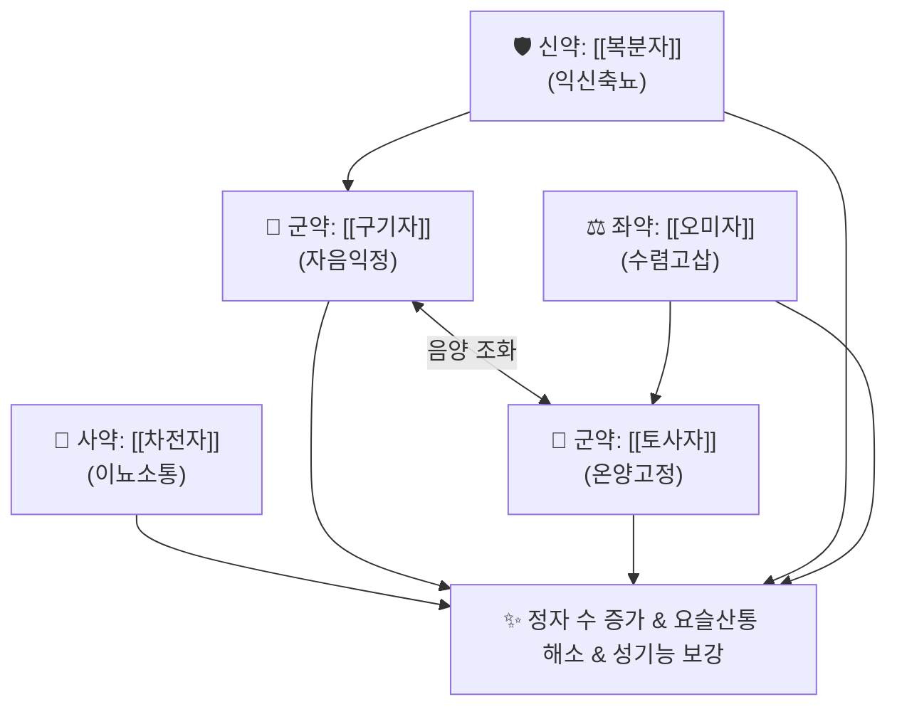

# 🍵 [[오자환]] (五子丸, Wuzi-wan)

> **핵심 3줄 요약 (Key Summary)**:
> - 🌿 신정(腎精)을 충실히 채우는 다섯 가지 씨앗 본초 환제 배오 ([[구기자]]·[[토사자]]·[[복분자]]·[[오미자]]·[[차전자]]).
> - 🎯 하초 신정 고갈로 인한 발기력 저하, 잦은 몽설과 유정, 소변 후 찔끔거림(요적력), 요슬산통(허리와 무릎 시림), 조기 탈모.
> - 🔬 정자 형성(Spermatogenesis) 촉진, 혈청 테스토스테론 유지, 고환 항산화 효소(SOD, CAT) 활성 증대 및 정자 DNA 보호.
> - ⚠️ 주의사항: 자음보양(滋陰補陽) 약재로 구성되어 습열이 하초에 가득 차 소변이 붉고 찌릿한 환자는 청열이수 후 복용.
---
## 📌 목차
1. [기본 처방 정보 & 군신좌사 구성](#1-기본-처방-정보--군신좌사-구성)
2. [방제학적 약재 상호작용 & 시너지 네트워크](#2-방제학적-약재-상호작용--시너지-네트워크)
3. [현대 분자약리학적 효능 & 작용 기전](#3-현대-분자약리학적-효능--작용-기전)
4. [적응 병증 및 체질별 감별 (Sweet Spot vs 금기)](#4-적응-병증-및-체질별-감별-sweet-spot-vs-금기)
5. [유사 처방군 감별 매트릭스](#5-유사-처방군-감별-매트릭스)
6. [임상 가감례 & 현대 질환별 응용](#6-임상-가감례--현대-질환별-응용)
7. [💡 사용자 진료실 핵심 필기 & 임상 팁 (원문 보존)](#7--사용자-진료실-핵심-필기--임상-팁-원문-보존)
8. [출처 및 학술 참고 문헌 (References)](#8-출처-및-학술-참고-문헌-references)
---
## 1. 기본 처방 정보 & 군신좌사 구성

* **출전**: 송대(宋代) 『[[태평성혜방]](太平聖惠方)』 및 명대 『[[증치준승]](證治準繩)』
* **치법**: 보신익정(補腎益精), 고충삽정(固衝澁精), 자신명목(滋腎明目)

| 구분 | 약재명 | 표준 용량 | 본초 효능 & 방제 내 역할 |
| :--- | :--- | :--- | :--- |
| **군약 (君藥)** | [[구기자]] | 15g | 자신익정(滋腎益精), 양간명목, 신음의 근본 바탕을 채움 |
| **군약 (君藥)** | [[토사자]] | 15g | 보신조양(補腎助陽), 고정축뇨, 신양을 돕고 정액 누설 방지 |
| **신약 (臣藥)** | [[복분자]] | 10g | 익신고정(益腎固精), 축뇨, 정자 수 증대 및 조루 억제 |
| **좌약 (佐藥)** | [[오미자]] | 6g | 수렴고삽(收斂固澁), 익기생진, 신기를 굳건히 수렴 |
| **사약 (使藥)** | [[차전자]] | 6g | 이뇨청열(利尿淸熱), 요도를 소통시켜 배뇨 및 사정 원활 |

> **배오 특징**: [[오자연종환]]의 환제 원형으로, 생식 능력을 상징하는 다섯 가지 씨앗(오자)을 고운 분말로 내어 꿀(봉밀)로 환을 빚은 제제입니다. 부자나 육계처럼 지나치게 뜨겁지 않아 **체질에 구애받지 않고 평순하게 신정을 북돋우는 보신익정의 기본 환약**입니다.
---
## 2. 방제학적 약재 상호작용 & 시너지 네트워크

---
## 3. 현대 분자약리학적 효능 & 작용 기전

### 1) 고환 조직 항산화 및 정자 무결성 보존
* 고환 조직 내 활성산소종(ROS) 생성을 억제하고 글루타치온(GSH) 및 카탈라아제 활성을 높여 정자 세포막의 지질 과산화를 방지합니다.

### 2) 비뇨생식기 신경계 조절
* 골반저근 및 방광 괄약근의 신경 긴장도를 개선하여 소변 후 찔끔거림과 요실금을 완화합니다.
---
## 4. 적응 병증 및 체질별 감별 (Sweet Spot vs 금기)

[✅ 최적 적응증 (Sweet Spot)]
• 임상 주치: 신정 부족으로 인한 조기 성기능 감퇴, 정자 감소증, 유정, 소변 잔뇨감, 시력 감퇴, 만성 요통
• 체질 소견: 평소 피로가 누적되고 눈이 침침하며 허리가 뻐근한 성인 남성
• 설진/맥진: 설담홍(舌淡紅), 맥현세(脈弦細)

[⚠️ 신중 투여 및 금기 (Caution / Contraindication)]
• 하초 습열성 배뇨통 환자 주의
---
## 5. 유사 처방군 감별 매트릭스

| 처방명 | 핵심 배오 차이 | 주치 타깃 병태 | 임상 차별점 | 맥진/설진 차이 |
| :--- | :--- | :--- | :--- | :--- |
| [[오자환]] | 5미 씨앗 환제 (구기자, 토사자, 복분자, 오미자, 차전자) | **평순한 보신익정** | **장기 복용 환약, 정액 생성, 요적력** | 맥현세, 설담홍 |
| [[오자연종환]] | 5미 씨앗 (탕제 또는 대환) | **남성 난임증 집중** | **정자 수 부족, 활동성 개선 위주** | 맥현세, 설담홍 |
| [[팔미지황환]] | 육미지황탕 + 육계, 포부자 | **신양허 명문화쇠** | **사지 냉통, 전신 추위 위주** | 맥침미, 설담 |
---
## 6. 임상 가감례 & 현대 질환별 응용

* **수반 증상별 가감법**:
  * 발기부전이 심할 때 $\rightarrow$ + [[음양곽]], [[파극천]]
  * 만성 요통 심할 때 $\rightarrow$ + [[두충]], [[우슬]]
* **현대 질환 매핑**:
  * 남성 불임증(핍정자증), 발기부전(ED), 전립선 비대 잔뇨감
---
## 7. 💡 사용자 진료실 핵심 필기 & 임상 팁 (원문 보존)

> [!tip] **진료실 실전 노하우 (User Clinical Insight)**
> ### 📌 구성
> [[구기자]] [[토사자]] [[복분자]] [[오미자]] [[차전자]]
> - 다섯 가지 씨앗(오자)으로 구성된 보신고정 환약으로, 자극 없이 장기 복용하여 신정과 정력을 꾸준히 보강하는 기본 처방
---
## 8. 출처 및 학술 참고 문헌 (References)

1. **송대 태의국 (992)**. 『[[태평성혜방]](太平聖惠方)』.
   - **[고전 원전]**: "治腎氣虛損, 補益精髓, 五子丸主之."
