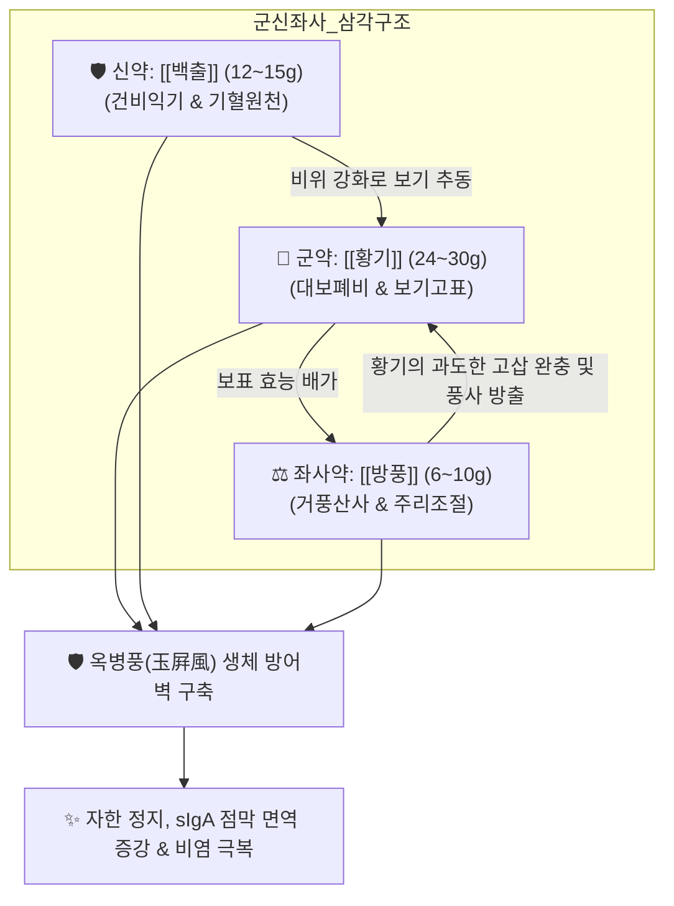

# 🍵 [[옥병풍산]] (玉屛風散, Yupingfeng San)

> **핵심 3줄 요약 (Key Summary)**:
> - 🌿 대보폐비·고표지한하는 [[황기]](군약, 24~30g) + 건비익기하는 [[백출]](신약, 12~15g) + 거풍산사하는 [[방풍]](좌사약, 6~10g) 단 3미로 구성되어 "체표에 옥으로 만든 병풍을 두른 듯" 견고한 방어벽을 세우는 익기고표(益氣固表) 대표 방제.
> - 🎯 위기(衛氣) 허약으로 주리(땀구멍)가 열려 가만히 있어도 땀이 줄줄 흐르는 표허자한(表虛自汗), 바람을 싫어하는 오풍(惡風), 환절기마다 감기를 달고 사는 체허감모, 맑은 콧물·재채기의 만성 알레르기 비염.
> - 🔬 호흡기 점막 분비형 IgA(sIgA) 분비 촉진을 통한 병원체 침투 차단, Th1/Th2 면역 불균형 교정(과항진된 IgE 및 IL-4 억제), 자율신경 안정화를 통한 땀샘 과흥분 억제.
> - ⚠️ 주의사항: 감기 초기 오한, 고열, 두통, 무한(땀이 안 남) 등 풍한·풍열 사기가 실(實)한 상태에서는 사기를 체내에 가두므로 복용 금기 (표증 해소 후 허약 회복에 투약).
---
## 📌 목차
1. [기본 처방 정보 & 군신좌사 구성](#1-기본-처방-정보--군신좌사-구성)
2. [방제학적 약재 상호작용 & 시너지 네트워크](#2-방제학적-약재-상호작용--시너지-네트워크)
3. [현대 분자약리학적 효능 & 작용 기전](#3-현대-분자약리학적-효능--작용-기전)
4. [적응 병증 및 체질별 감별 (Sweet Spot vs 금기)](#4-적응-병증-및-체질별-감별-sweet-spot-vs-금기)
5. [유사 처방군 감별 매트릭스](#5-유사-처방군-감별-매트릭스)
6. [임상 가감례 & 현대 질환별 응용](#6-임상-가감례--현대-질환별-응용)
7. [💡 사용자 진료실 핵심 필기 & 임상 팁 (원문 보존)](#7--사용자-진료실-핵심-필기--임상-팁-원문-보존)
8. [출처 및 학술 참고 문헌 (References)](#8-출처-및-학술-참고-문헌-references)
---
## 1. 기본 처방 정보 & 군신좌사 구성

* **출전**: 원대(元代) 주단계(朱丹溪) 『[[단계심법]](丹溪心法)』, 위역림 『[[세의득효방]](世醫得效方)』
* **치법**: 익기고표(益氣固表), 지한(止汗), 소풍산사(疎風散邪)

| 구분 | 약재명 | 표준 용량 | 본초 효능 & 방제 내 역할 |
| :--- | :--- | :--- | :--- |
| **군약 (君藥)** | [[황기]] | 24~30g | 대보폐비(大補肺脾), 보기고표(補氣固表), 주리(땀구멍)를 치밀하게 닫아 땀샘 조절 및 면역 촉진 |
| **신약 (臣藥)** | [[백출]] | 12~15g | 건비익기(健脾益氣), 조습건비, 중초 비위를 튼튼히 하여 기혈 생성 원천 보강 |
| **좌사약 (佐使藥)** | [[방풍]] | 6~10g | 거풍산사(祛風散邪), 주리 개폐 조절, 황기의 고삽 편향 완충 및 풍사 구축 |

> **배오 특징**: '보기(補氣)'와 '산풍(散風)', '고표(固表)'와 '소설(疎泄)'의 상반된 약성을 절묘하게 융합한 방제입니다. [[황기]]가 체표의 땀구멍을 닫아 원기 유출을 막고, [[백출]]이 내부의 소화 흡수를 도와 황기의 보기 작용을 배가시키며, [[방풍]]이 체표에 숨은 풍사를 밖으로 몰아냅니다. 고대 의가들은 "황기가 방풍을 얻으면 그 보표(補表) 효능이 배가되고, 방풍이 황기를 얻으면 기운을 소모하지 않는다"고 극찬했습니다.
---
## 2. 방제학적 약재 상호작용 & 시너지 네트워크

* [[황기]] + [[백출]] 배오: 황기는 표(表)의 위기를 굳건히 하고, 백출은 이(裏)의 비기를 북돋워 표리(表裏)를 아울러 기운을 가득 채웁니다.
* [[황기]] + [[방풍]] 배오: 보(補)함 속에 소(疎)함이 있고 거(祛)함 속에 고(固)함이 있어, 사기를 가두지 않으면서도 정기가 새어나가지 않는 한의학 배오의 극치입니다.
---
## 3. 현대 분자약리학적 효능 & 작용 기전

### 1) 호흡기 점막 면역 강화 및 분비형 IgA(sIgA) 분비 촉진
* **물리적 병원체 침투 차단**: 비강 및 기관지 점막 상피세포에서 분비형 IgA(sIgA) 합성을 촉진하여 인플루엔자 바이러스, 세균, 미세먼지의 상피 침투를 원천 차단합니다.
* **대식세포 탐식능 증강**: 황기 다당체가 TLR4 수용체를 활성화하여 선천 면역세포의 식균 작용을 강화합니다.

### 2) Th1/Th2 면역 균형 정상화 (알레르기 비염 억제)
* **과항진된 알레르기 반응 조절**: 알레르기 비염 및 아토피에서 급증하는 Th2 사이토카인(IL-4, IL-5) 및 혈중 IgE 농도를 낮추고, 면역 억제성 Th1 반응(IFN-γ)을 유도하여 면역 항상성을 복원합니다.

### 3) 땀샘 및 말초 자율신경 안정화
* 교감신경의 과도한 흥분으로 인한 체표 모세혈관 확장과 비정상적인 발한 충동을 억제하여 표허자한을 멎게 합니다.
---
## 4. 적응 병증 및 체질별 감별 (Sweet Spot vs 금기)

[✅ 최적 적응증 (Sweet Spot)]
• 원전 조문: 《단계심법》 "스스로 땀이 나고 바람을 싫어하며 기운이 없는 자를 치료한다. 이를 복용하면 병풍을 두른 듯 병에 걸리지 않는다."
• 체질 소견: 소음인 및 태음인 중 체력이 약하고 피부가 희며 땀을 흘린 뒤 오한을 느끼는 체질
• 임상 주치: 
  1. 표허자한(가만히 있어도 땀이 흐르고 움직이면 더욱 심해짐)
  2. 오풍(찬 바람을 조금만 쐬어도 으슬으슬 춥고 감기가 듦)
  3. 환절기 잦은 감기(체허감모), 만성 통년성 알레르기 비염(맑은 콧물, 재채기)
  4. 소아 및 노인의 잦은 상기도 감염증
• 설진/맥진: 설담태백(舌淡苔白) 혹은 치흔설, 맥부허무력(脈浮虛無力) 혹은 맥약(脈弱)

[⚠️ 신중 투여 및 금기 (Caution / Contraindication)]
• 감기 초기 실증: 오한, 고열, 두통, 무한(땀이 안 남) 등 풍한 표사 실증기에는 사기를 체내에 가두므로 투여 금기 (마황탕, 갈근탕 선행).
• 음허도한(陰虛盜汗): 밤에 잘 때만 식은땀이 나고 열감이 있는 음허 환자에게는 [[당귀육황탕]]이나 [[육미지황환]]으로 감별 투여.
---
## 5. 유사 처방군 감별 매트릭스

| 처방명 | 중심 구성 | 핵심 기전 및 병태 | 주치 차이점 |
| :--- | :--- | :--- | :--- |
| [[옥병풍산]] | 황기, 백출, 방풍 | **익기고표, 지한, 면역조절** | **표허자한, 잦은 감기 예방, 알레르기 비염** |
| [[보중익기탕]] | 황기, 인삼, 백출, 당귀, 승마, 시호 | 비위기허, 중기하함 | 소화불량, 권태감, 위하수, 식후 졸림 |
| [[계지탕]] | 계지, 작약, 생강, 대추, 감초 | 조화영위, 해표산한 | 감기 초기 오풍, 발열, 가벼운 땀(유한) |
| [[당귀육황탕]] | 당귀, 숙지황, 생지황, 황련, 황금, 황백, 황기 | 자음청열, 고표지한 | 야간 도한(도둑땀), 조열, 갱년기 식은땀 |

---
## 6. 임상 가감례 & 현대 질환별 응용

* **수반 증상별 가감법**:
  * 비염 콧물·재채기 극심 시 $\rightarrow$ + [[신이]], [[백지]], [[창이자]] 각 4g
  * 기침 및 인후 가려움 동반 시 $\rightarrow$ + [[길경]], [[행인]] 각 6g
  * 자한(식은땀)이 비 오듯 쏟아질 때 $\rightarrow$ + [[단삼]], [[오미자]], [[부소맥]] 각 10g
* **현대 질환별 임상 매핑**:
  * **이비인후과**: 알레르기 비염, 혈관운동성 비염, 만성 비부비동염 회복기
  * **호흡기과**: 잦은 감모(반복성 상기도 감염), 기관지 천식 관해기 면역 증강
  * **자율신경계**: 국소 및 전신 다한증, 식은땀 후유 피로 증후군
---
## 7. 💡 사용자 진료실 핵심 필기 & 임상 팁 (원문 보존)

> [!tip] **진료실 실전 노하우 (User Clinical Insight)**
> - 표허자한(가만히 있어도 땀이 줄줄 흐름), 오풍, 잦은 감기, 알레르기 비염의 제1선 면역 증강 방제.
> - "황기가 방풍을 얻으면 고표 효능이 배가되고, 방풍이 황기를 얻으면 기운을 소모하지 않는다"는 방제학적 황금 배오.
> - 감기 초기의 오한·고열 실증기에는 절대 쓰지 않고, 감기가 다 나은 뒤 체력 회복과 재발 방지 목적으로 투약.

---
## 8. 출처 및 학술 참고 문헌 (References)

1. * **Bai Y et al. (2026)**. Therapeutic effect of Yupingfeng powder and its bioactive metabolites on renal diseases. *Frontiers in pharmacology*, 17: 1807950. [PMID: 42602265](https://pubmed.ncbi.nlm.nih.gov/42602265/)
2. * **Wang L et al. (2019)**. The Ancient Chinese Decoction Yu-Ping-Feng Suppresses Orthotopic Lewis Lung Cancer Tumor Growth Through Increasing M1 Macrophage Polarization and CD4(+) T Cell Cytotoxicity. *Frontiers in pharmacology*, 10: 1333. [PMID: 31780946](https://pubmed.ncbi.nlm.nih.gov/31780946/)
3. **주단계 (1347)**. 『[[단계심법]](丹溪心法)』.
   - **[고전 원전]**: 옥병풍산 조문 및 익기고표 지한 치법.
