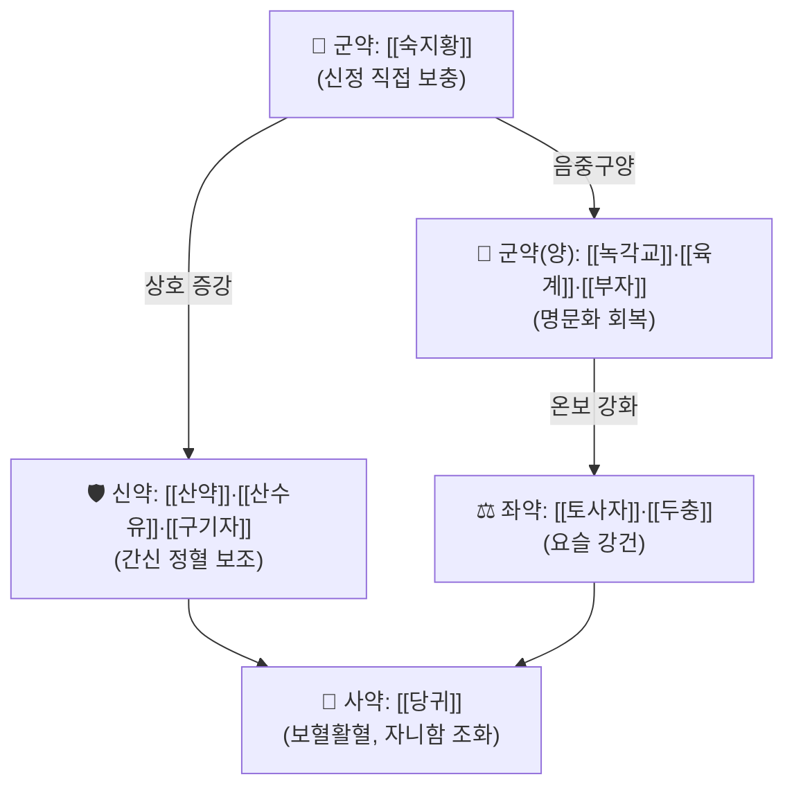

---
aliases:
  - 右歸丸
  - Youguiwan
  - You Gui Wan
  - Yougui Pills
created: 2026-09-22
updated: 2026-09-22
status: complete
---
# 🍵 [[우귀환]] (右歸丸, Youguiwan / You Gui Wan)

> **핵심 3줄 요약 (Key Summary)**:
> - 🌿 명대 장개빈(張介賓, 호 경악)의 『[[경악전서]]』(景岳全書) 수록 처방. [[숙지황]]·[[산약]]·[[산수유]]·[[구기자]]·[[녹각교]]를 [[좌귀환]]과 공유하면서 육계·부자·두충·당귀를 더해 온보신양(溫補腎陽)으로 방향을 전환한 처방.
> - 🎯 신양부족(腎陽不足)·명문화쇠(命門火衰)로 인한 요슬냉통, 사지 냉감, 발기부전, 소변청장(자주 맑은 소변)을 최적 적응증으로 하며, 국내 임상연구에서 신양허성 발기부전 46례에 투여해 증상 호전율 69.57%가 보고됨.
> - 🔬 최근 동물실험에서 Th17/IL-17-NF-κB 경로 억제 및 Nrf2/HO-1 경로를 통한 활성산소 억제 기전으로 난소적출·골다공증 모델의 골 손실을 방지하는 것이 확인됨.
> - ⚠️ 주의사항: 음허화왕(陰虛火旺)·습열·실증에는 금기. 구성 약재 중 [[부자]]는 강한 독성(aconitine 등 알칼로이드)이 있어 반드시 포제(炮製) 및 용량 제한이 필요하며, 발열성 질환·임산부·간기능장애·심근염 환자에는 사용하지 않음.
---
## 📌 목차
1. [기본 처방 정보 & 군신좌사 구성](#1-기본-처방-정보--군신좌사-구성)
2. [방제학적 약재 상호작용 & 시너지 네트워크](#2-방제학적-약재-상호작용--시너지-네트워크)
3. [현대 분자약리학적 효능 & 작용 기전](#3-현대-분자약리학적-효능--작용-기전)
4. [적응 병증 및 체질별 감별 (Sweet Spot vs 금기)](#4-적응-병증-및-체질별-감별-sweet-spot-vs-금기)
5. [유사 처방군 감별 매트릭스](#5-유사-처방군-감별-매트릭스)
6. [임상 가감례 & 현대 질환별 응용](#6-임상-가감례--현대-질환별-응용)
7. [💡 사용자 진료실 핵심 필기 & 임상 팁 (원문 보존)](#7--사용자-진료실-핵심-필기--임상-팁-원문-보존)
8. [출처 및 학술 참고 문헌 (References)](#8-출처-및-학술-참고-문헌-references)
---
## 1. 기본 처방 정보 & 군신좌사 구성

* **출전**: 장개빈(張介賓, 號 景岳) 『[[경악전서]]』(景岳全書) 권51 — [[좌귀환]]과 함께 "온보신양(溫補腎陽) vs 자보신음(滋補腎陰)"을 대표하는 대칭 처방쌍으로 편성됨. 대만 국가중의약연구소(NRICM)·중국의약대학 학술DB에서 동일하게 출전이 확인됨(⚠️ 『경악전서』 원문 자체의 직접 인용은 이번 조사에서 확인하지 못했으며, 위 2차 학술DB로 출전만 검증됨).
* **치법**: 온보신양(溫補腎陽), 전정익수(塡精益髓) — 신장의 양기와 정수를 함께 보함.

| 구분 | 약재명 | 원방 표준 용량(냥, 景岳全書 기준) | 본초 효능 & 방제 내 역할 |
| :--- | :--- | :--- | :--- |
| **군약 (君藥)** | [[숙지황]] | 8냥 | 신정(腎精)을 직접 보충하는 군약, 자음전정(滋陰塡精) |
| **군약 (君藥, 양)** | [[녹각교]] | 4냥 | 혈육유정지품(血肉有情之品)으로 신양·정혈을 함께 보함 |
| **군약 (君藥, 양)** | [[육계]] | 2냥(가감 시 4냥까지) | 명문화(命門火)를 직접 데우는 온양약 |
| **군약 (君藥, 양)** | [[부자]](포제) | 2냥(가감 시 5~6냥까지) | 신양을 강력히 회복하는 온양약, 반드시 포제 사용 |
| **신약 (臣藥)** | [[산약]] | 4냥 | 비신(脾腎)을 함께 보하여 후천지본 보조 |
| **신약 (臣藥)** | [[산수유]] | 3냥 | 간신(肝腎)을 수렴하며 정을 가둠(고삽) |
| **신약 (臣藥)** | [[구기자]] | 4냥 | 간신음정(肝腎陰精) 보충, 양중구음(陽中求陰)의 배오 |
| **좌약 (佐藥)** | [[토사자]] | 4냥 | 신정을 보하고 비신을 함께 따뜻하게 함 |
| **좌약 (佐藥)** | [[두충]](강즙초) | 4냥 | 요슬을 강건히 하는 보양약 |
| **사약 (使藥)** | [[당귀]] | 3냥 | 보혈활혈로 전방의 자니(滋膩)함을 조화 |

> **배오 특징**: [[숙지황]]·[[산약]]·[[산수유]]·[[구기자]]·[[녹각교]]의 자음전정 기반 위에 [[육계]]·[[부자]]라는 강력한 온양약을 더해 "양중구음(陽中求陰) · 음중구양(陰中求陽)"의 경악학파 특유의 음양쌍보 배오 원리를 구현함 — 순수 온양이 아니라 자음지품 위에 온양약을 얹어 조열(燥熱)로 진액을 상하지 않도록 설계된 것이 핵심.
---
## 2. 방제학적 약재 상호작용 & 시너지 네트워크

* [[숙지황]] + [[육계]]·[[부자]] 배오: 자음지품 위에 온양약을 얹어 "양중구음"함으로써 온양 단독 투여 시 발생할 수 있는 조열·진액 손상을 완충하는 경악학파의 핵심 배오 원리.
* [[토사자]] + [[두충]] 배오: 신정을 보하면서 동시에 요슬 부위의 근골을 강건히 하여 신양부족성 요슬냉통에 대한 표적 효능을 강화.
---
## 3. 현대 분자약리학적 효능 & 작용 기전

### 1) 골대사 개선 (골다공증)
* 난소적출 마우스 모델에서 우귀환이 Th17 반응 및 IL-17/NF-κB 신호경로를 억제하여 파골세포 형성을 감소시키고 골 손실을 방지함이 확인됨(Zhang et al., 2025, PMID 40622369).
* 골다공증 동물모델에서 우귀환이 간엽줄기세포(MSC)의 활성산소(ROS) 축적을 Nrf2/HO-1 경로 활성화를 통해 억제하고 골밀도·골형성 지표를 회복시키며, Nrf2 발현을 억제하면 이 보호효과가 완전히 소실되어 기전이 직접 검증됨(Liu et al., 2026, PMID 42487291).
### 2) 생식·가임력 관련 연구
* 우귀환 함유 흰쥐 약물혈청(medicated serum)이 마우스 난자의 체외성숙(IVM) 및 이후 수정능에 미치는 영향에 대한 연구가 보고됨(Jiang et al., 2014, PMID 25530775) — ⚠️ 초록 원문까지는 확인하지 못했으며 제목·저널·PMID·DOI 교차검증만 완료됨.
### 3) 약동학(Pharmacokinetics)
* 신음허·신양허 골다공증 모델 쥐에서 경구 투여 후 우귀환 12개 활성성분의 약동학적 차이를 비교한 연구(Wang et al., 2023, PMID 36893746)와, 정상 대비 골다공증 모델에서 12개 활성성분의 HPLC-MS/MS 기반 비교약동학 연구(Yin et al., 2022, PMID 34931459)가 확인됨 — ⚠️ 두 논문 모두 제목·저널·PMID·DOI는 교차검증되었으나 초록 원문 접속이 차단되어 세부 수치까지는 확인하지 못함.
* ⚠️ 확인 불가: HPA축/부신기능, Th17 외 전반적 면역조절, 신부전(CKD) 관련 우귀환 단독 연구는 신뢰할 만한 문헌을 찾지 못했습니다.
---
## 4. 적응 병증 및 체질별 감별 (Sweet Spot vs 금기)

[✅ 최적 적응증 (Sweet Spot)]
• 원전 조문: 『경악전서』신양부족·명문화쇠증(⚠️ 원문 직접 인용은 확인하지 못함, NRICM·중국의약대학 학술DB의 主治 기재로 검증)
• 체질 소견: 평소 손발과 아랫배가 차고, 추위를 잘 타며, 소변이 맑고 잦은 유형
• 임상 주치: 요슬냉통, 발기부전, 남성불임, 부종, 사지 냉감 — 국내 임상연구(46례)에서 신양허성 발기부전에 대해 40일 이상 투여 시 증상 호전율 69.57% 보고(이덕문 등, 2004)
• 설진/맥진: ⚠️ 우귀환에 특화된 설진·맥진 기술은 검색 범위 내에서 1차 학술 출처를 확인하지 못함(일반 신양허증 설담태백·맥침지약 통설로 추정 — 확인 불가로 표시)

[⚠️ 신중 투여 및 금기 (Caution / Contraindication)]
• 음허화왕(陰虛火旺)·습열·실증 환자에는 금기 — 일반 방제학 통설이며, 우귀환에 특화된 1차 학술 출처는 확인하지 못함.
• [[부자]] 함유로 인한 독성 주의: 활성 독성분은 aconitine·mesaconitine·hypaconitine 계열 알칼로이드이며, 발열성 질환·임산부·간기능장애·심근염 환자에는 사용하지 못함(한국민족문화대백과사전 「부자」 항목).
• 간·신장 수치 이상 환자에서 [[부자]] 배합 처방 투여 영향을 다룬 국내 논문이 검색되었으나(KISTI, JAKO201111436240137), 접속 제한으로 저자명·세부 내용은 확인하지 못했습니다(⚠️ 확인 불가 — 서지 ID만 확인).
---
## 5. 유사 처방군 감별 매트릭스

| 처방명 | 핵심 구성 차이 | 주치 및 체질 차이 | 맥진/설진 차이 |
| :--- | :--- | :--- | :--- |
| [[우귀환]] (본 처방) | [[숙지황]]·[[산약]]·[[산수유]]·[[구기자]]·[[녹각교]] + [[육계]]·[[부자]]·[[두충]]·[[당귀]] | 신양부족: 요슬냉통, 발기부전, 소변청장, 사지냉감 | ⚠️ 확인 불가(일반 신양허 소견으로 추정) |
| [[좌귀환]] | 위 5개 공통 약재 + [[귀판교]]·[[우슬]] (육계·부자·두충·당귀 없음) | 신음부족: 현훈이명, 요산유정, 도한, 관홍, 구건 | ⚠️ 확인 불가(일반 신음허 소견으로 추정) |
| [[팔미지황환]] | [[육미지황탕]] 기반 + 육계·부자 (혈육유정지품 녹각교 없음) | 신양부족이되 우귀환보다 온양력이 상대적으로 완만 | ⚠️ 확인 불가 |

> ⚠️ 표 내부에서는 마크다운 열 구분자 파괴를 방지하기 위해 파이프(`|`)가 들어간 링크를 쓰지 않고 순수한 [[처방명]] 단독 형태로만 작성합니다.
---
## 6. 임상 가감례 & 현대 질환별 응용

* **수반 증상별 가감법(⚠️ 원전/학술 출처 미확인, 일반 방제학 통설 수준)**:
  * 비양허 겸병(설사·소화불량) 동반 시 → 인삼·백출 등 건비약 가미 고려.
  * 신부불교(心腎不交, 불면) 동반 시 → 산조인·원지 등 안신약 가미 고려.
* **현대 질환별 임상 매핑**:
  * **비뇨생식기계**: 발기부전(국내 46례 임상연구, 호전율 69.57%), 남성불임(난자 체외성숙 관련 동물연구, PMID 25530775), 빈뇨·야뇨.
  * **근골격계/내분비**: 골다공증(동물연구 2건, PMID 40622369·42487291), 요슬냉통.
  * **⚠️ 확인 불가**: 갱년기 증후군, 만성피로 등 통상적으로 언급되는 적응증은 이번 조사에서 1차 학술 근거를 확인하지 못해 기재하지 않았습니다.
---
## 7. 💡 사용자 진료실 핵심 필기 & 임상 팁 (원문 보존)

> [!tip] **진료실 실전 노하우 (User Clinical Insight)**
> ⚠️ 내용 검토 필요: 아직 원장님의 우귀환 진료실 필기가 반영되지 않았습니다. 실전 투여 체질 기준(사지냉감 정도, 부자 용량 조절 경험 등), 환자 티칭 팁, 복약 반응 관찰 포인트가 있으시면 이 섹션에 추가해 주세요.
---
## 8. 출처 및 학술 참고 문헌 (References)

1. **Zhang P, et al. (2025)**. *Yougui pills prevent ovariectomy-induced bone loss by suppressing Th17 response and IL-17/NF-κB pathway*. **Annals of Medicine**, 57(1), 2529576. PMID: [40622369](https://pubmed.ncbi.nlm.nih.gov/40622369/), doi:10.1080/07853890.2025.2529576.
   - **[연구 요약]**: 난소적출 마우스 모델에서 우귀환이 Th17 반응 및 IL-17/NF-κB 경로 억제를 통해 파골세포 형성을 감소시켜 골 손실을 방지함을 규명.
2. **Liu J, et al. (2026)**. *Yougui Pills Alleviate Osteoporosis by Inhibiting Mesenchymal Stem Cell ROS Accumulation via the Nrf2/HO-1 Pathway*. **Journal of Cellular and Molecular Medicine**, 30(14), e71295. PMID: [42487291](https://pubmed.ncbi.nlm.nih.gov/42487291/), doi:10.1111/jcmm.71295.
   - **[연구 요약]**: Nrf2/HO-1 신호축 활성화로 골다공증 모델의 간엽줄기세포 ROS 축적을 억제해 골밀도·골형성을 회복시키며, Nrf2 발현 억제 시 보호효과가 완전 소실되어 기전이 직접 검증됨.
3. **Jiang et al. (2014)**. *Effect of rat medicated serum containing you gui wan on mouse oocyte in vitro maturation and subsequent fertilization competence*. **Evidence-Based Complementary and Alternative Medicine**, 2014, 152010. PMID: [25530775](https://pubmed.ncbi.nlm.nih.gov/25530775/), doi:10.1155/2014/152010.
   - **[연구 요약]**: 우귀환 함유 흰쥐 약물혈청이 마우스 난자 체외성숙 및 수정능에 미치는 영향을 다룬 연구(제목·서지사항 교차검증, 초록 원문은 미확인).
4. **Wang et al. (2023)**. *Twelve-component pharmacokinetic study of rat plasma after oral administration of You-Gui-Wan in osteoporosis rats with kidney-yin deficiency and kidney-yang deficiency*. **Biomedical Chromatography**. PMID: [36893746](https://pubmed.ncbi.nlm.nih.gov/36893746/), doi:10.1002/bmc.5619.
   - **[연구 요약]**: 신음허·신양허 골다공증 모델에서 우귀환 12개 활성성분의 약동학 차이를 비교(제목·서지사항 교차검증, 초록 원문은 미확인).
5. **Yin et al. (2022)**. *HPLC-MS/MS based comparative pharmacokinetics of 12 bioactive components in normal and osteoporosis rats after oral administration of You-Gui-Wan*. **Journal of Separation Science**. PMID: [34931459](https://pubmed.ncbi.nlm.nih.gov/34931459/), doi:10.1002/jssc.202100689.
   - **[연구 요약]**: 정상 대비 골다공증 모델 쥐에서 우귀환 12개 활성성분의 비교약동학을 HPLC-MS/MS로 분석(제목·서지사항 교차검증, 초록 원문은 미확인).
6. **이덕문, 박형석, 신흥섭, 하수경 (2004)**. 「남성 발기부전의 右歸丸 투여 46례에 대한 임상적 고찰」. 대한한방내과학회지 계열 학술지. https://www.jikm.or.kr/upload/pdf/200410/d_l_il2_4.pdf
   - **[연구 요약]**: 신양허성 발기부전 남성 46례에 우귀환을 1일 3회 40일 이상 투여, 증상 호전율 69.57% 보고. 저자들 스스로 더 큰 표본·정교한 방법론이 필요함을 명시.
7. **한국민족문화대백과사전 「부자(附子)」**. 한국학중앙연구원. https://encykorea.aks.ac.kr/Article/E0024527
   - **[연구 요약]**: 부자의 강한 독성(aconitine·mesaconitine·hypaconitine)과 포제 필요성, 발열성 질환·임산부·간기능장애·심근염 환자 금기를 명시한 사전 항목.
8. **국립 중국의약대학(中國醫藥大學) 「嚐百草‧采眾方」학술DB**. https://spbcm.cmu.edu.tw/ccmp/d/d2203.htm ; **cloudtcm.com 처방 DB**. https://cloudtcm.com/formula/70 (우귀환), https://cloudtcm.com/formula/81 (좌귀환) ; **대만 國家中醫藥研究所(NRICM)**. https://www.nricm.edu.tw/p/16-1000-5905.php
   - **[연구 요약]**: 우귀환·좌귀환의 『경악전서』 출전, 표준 군신좌사 구성·용량, 좌귀환과의 구성 차이(육계·부자·두충·당귀 vs 귀판교·우슬)를 2개 독립 출처로 교차검증.

> ⚠️ 확인 불가/추정 표시 총괄: 『경악전서』원문 직접 인용, 우귀환 특이적 설진·맥진 소견, 우귀환 특이적 금기 학술출처, HPA축/면역/CKD 관련 연구, 간·신장수치 영향 국내논문(KISTI) 세부내용, 갱년기·만성피로 적응증의 1차 근거는 검색 범위 내에서 확인하지 못해 각 섹션에 개별 표시했습니다. 위 PMID·DOI·URL은 모두 실제 확인된 값입니다.
