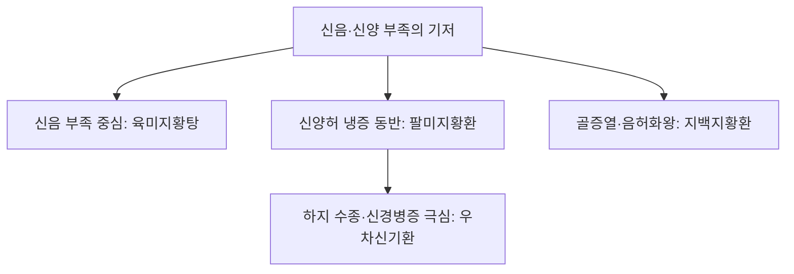

# 우차신기환 (牛車腎氣丸, Goshajinkigan)

> **핵심 요약 (Key Summary)**
> - 🌿 기원·구성: 송대(宋代) 엄용화(嚴用和)의 《제생방(濟生方)》에 수록된 처방으로 제생신기환(濟生腎氣丸)이라고도 부르며, [[팔미지황환]]([[숙지황]], [[산약]], [[산수유]], [[택사]], [[복령]], [[목단피]], [[육계]], [[포부자]])에 하초 혈류 개선 및 근골을 강화하는 [[우슬]]과 수습을 통리시키는 [[차전자]]를 가미한 온보신양(溫補腎陽)·이기이수(利氣利水)의 대표 방제.
> - 🎯 적응증·체질: 명문화쇠(命門火衰) 및 신양허쇠(腎陽虛衰)로 하지부종, 요통각약(腰痛脚弱), 지체냉감(肢體冷感), 배뇨장애(야간뇨, 빈뇨, 뇨폐, 실금), 부신기능저하증, [[전립선 비대증]], [[과민성 방광 증후군]], 당뇨병성 말초신경병증, 항암제 유발 말초신경병증(CIPN). 소음인·태음인 신양허 체질에 호발.
> - 🔬 분자약리기전: $\kappa$-[[오피오이드]] 수용체 자극을 통한 척수 수준의 진통 억제 및 산화질소([[NO]]) 합성 촉진으로 말초 미세혈류 순환 개선, C-fiber 신경전달 차단, 방광 배뇨근 과반사 억제, 신경세포 산화 스트레스 감소.
⚠️ 주의사항: 숙지황으로 인한 위장장애(소화불량, 식욕부진) 및 목단피·우슬의 활혈통경 작용으로 인한 자궁 수축 유발 가능성이 있어 임산부 투여 금기. 부자 함유로 열증·음허화왕자 복용 엄금.

---

## 1. 📜 방제 기본 정보

| 구분 | 내용 |
| :--- | :--- |
| **처방명** | 우차신기환 (牛車腎氣丸, Goshajinkigan) / 제생신기환 (濟生腎氣丸) |
| **출전** | 《제생방(濟生方)》 |
| **처방 분류** | 보익제(補益劑) - 온보신양(溫補腎陽) / 이수소종(利水消腫) |
| **한의학적 효능** | 온신조양(溫腎助陽), 이수소종(利水消腫), 활혈거어(活血祛瘀), 강근골(强筋骨) |
| **주치 병증** | 신양허수종(腎陽虛水腫), 요슬산통(腰膝酸痛), 소변불리(小便不利) 혹은 다뇨(多尿), 야간빈뇨, 족종(足腫), 당뇨병성 신경병증, 하지 냉통 및 마목(저림) |
| **현대적 적응증** | [[전립선 비대증]], [[과민성 방광 증후군]], 노인성 야간뇨, 당뇨병성 말초신경병증, 항암제(Oxaliplatin, Paclitaxel) 유발 신경병증(CIPN), 만성 요통, 퇴행성 슬관절염, 림프부종 |

---

## 2. 🌿 약재 구성 및 방제학적 배오 원리

### 1) 약재 구성표

| 약재명 | 한자 | 표준 분량(g) | 본초 분류 | 귀경 | 주요 성분 | 핵심 역할 및 기능 |
| :--- | :--- | :--- | :--- | :--- | :--- | :--- |
| [[숙지황]] | 熟地黃 | 15.0 | 보혈약 | 간, 신 | [[카탈폴]], [[스타키오스]] | **군약(君藥)**: 자음보혈(滋陰補血), 익정전수(益精塡髓), 신음 신양 보충의 물질적 근원 |
| [[산약]] | 山藥 | 10.0 | 보기약 | 비, 폐, 신 | [[디오스게닌]], 점액질 | **신약(臣藥)**: 건비보폐(健脾補肺), 고신익정(固腎益精), 후천지본 보강 |
| [[산수유]] | 山茱萸 | 10.0 | 수렴약 | 간, 신 | [[모로니사이드]], [[로가닌]] | **신약(臣藥)**: 보간익신(補肝益腎), 삽정지한(澁精止汗), 정혈 유실 방지 및 대사 보조 |
| [[우슬]] | 牛膝 | 8.0 | 활혈거어약 | 간, 신 | [[엑디스테론]], 사포닌 | **신약(臣藥)**: 활혈통경(活血通經), 강근골(强筋骨), 인혈하행(引血下行)하여 약효를 하지와 골반강으로 인도 |
| [[차전자]] | 車前子 | 8.0 | 이뇨통림약 | 간, 신, 폐 | [[플란타고닌]], [[아우쿠빈]] | **신약(臣藥)**: 청열이뇨(淸熱利尿), 삼습통림(滲濕通淋), 하초 수습 제거 촉진 |
| [[복령]] | 茯苓 | 10.0 | 이수삼습약 | 심, 비, 신 | [[파키만]], 베타-글루칸 | **좌약(佐藥)**: 건비삼습(健脾滲濕), 지황·산약의 습담 정체 방지 |
| [[택사]] | 澤瀉 | 8.0 | 이수삼습약 | 신, 방광 | [[알리스몰]], [[알리솔]] | **좌약(佐藥)**: 이수청열(利水淸熱), 신음 중의 사화(邪火) 배출 및 부종 제거 |
| [[목단피]] | 牡丹皮 | 8.0 | 청열양혈약 | 심, 간, 신 | [[패오놀]], [[패오니플로린]] | **좌약(佐藥)**: 청열양혈(淸熱凉血), 활혈산어(活血散瘀), 음허발열 억제 및 골반 미세혈관 순환 촉진 |
| [[육계]] | 肉桂 | 4.0 | 온리약 | 신, 비, 심 | [[신남알데하이드]] | **사약(使藥)**: 보명문화(補命門火), 산한지통(散寒止痛), 온양화기(溫陽化氣) |
| [[포부자]] | 炮附子 | 3.0 | 온리약 | 심, 비, 신 | [[아코니틴]]계 알칼로이드, [[히게나민]] | **사약(使藥)**: 회양구역(回陽救逆), 온신조양(溫腎助陽), 전신 대사 기능 항진 및 진통 작용 |

### 2) 방제학적 배오 원리
- **팔미지황환 바탕 + 우슬·차전자 가미의 승화**: [[팔미지황환]]의 온보신양(三補三瀉 + 육계·포부자) 구조에 [[우슬]]과 [[차전자]]를 더해 골반강 및 하지의 수습 정체와 어혈을 집중 타격합니다.
- **인혈하행(引血下行)과 강근골**: [[우슬]]이 방제의 온양보정(溫陽補精) 효능을 하초(골반강, 허리, 무릎, 발끝)로 강력하게 이끌어 하지 무력감, 슬관절통, 저림을 신속히 해소합니다.
- **수습 분리 및 소종(利水消腫)**: [[복령]], [[택사]]에 [[차전자]]가 합세하여 하초의 불필요한 체액 저류와 방광 울혈을 소변으로 원활히 배출시켜 신양허성 부종 및 배뇨장애를 치료합니다.

---

## 3. 🔬 현대 약리 연구 및 분자 기전

### 1) 항암 화학요법 유발 말초신경병증(CIPN) 보호 및 진통 기전
- **$\kappa$-[[오피오이드]] 수용체 활성화**: 척수 후각 뉴런에서 카파-오피오이드 수용체 경로를 자극하여 통각 신호전달을 억제하고 신경병증성 통증, 저림, 이상감각을 차단합니다.
- **산화질소([[NO]]) 생성 촉진을 통한 미세순환 개선**: 혈관 내피세포의 eNOS 활성을 자극하여 NO 생성을 촉진, 혈관을 확장시키고 신경내막(Endoneurium)의 혈류량을 증가시켜 파클리탁셀(Paclitaxel), 옥살리플라틴(Oxaliplatin) 투여로 손상된 신경섬유의 허혈 및 괴사를 방지합니다.

### 2) 방광 기능 조절 및 빈뇨·요실금 개선
- **율동적 방광 수축 억제**: 방광 평활근의 비정상적 과수축을 억제하고 C-fiber 구심성 신경의 감각 과민성을 완화하여 [[과민성 방광 증후군]] 및 야간뇨 환자의 방광 용적을 정상화합니다.
- **골반강 혈류 개선**: [[목단피]], [[우슬]], [[신남알데하이드]] 성분이 골반 내 장기 미세순환을 촉진하여 전립선 비대 및 만성 전립선염으로 인한 요도 압박을 완화합니다.

### 3) 대사 증후군 및 신경 보호
- **인슐린 저항성 완화**: [[산수유]]와 [[산약]]의 다당체 및 활성 성분이 포도당 대사를 개선하고 당뇨병성 신경병증 진행을 억제합니다.

---

## 4. ⚖️ 유사 처방 감별 및 네트워크

| 처방명 | 중심 약재 구성 | 변증 및 핵심 타깃 병태 | 주치 특징 |
| :--- | :--- | :--- | :--- |
| [[육미지황탕]] | 숙지황, 산약, 산수유, 택사, 복령, 목단피 | 신음허(腎陰虛), 진액 부족 | 요슬산연, 도한, 조열, 설홍소태 |
| [[팔미지황환]] | 육미지황탕 + 육계, 포부자 | 신양허(腎陽虛), 명문화쇠 | 사지냉감, 요하지 냉통, 소변청장 혹은 불리 |
| [[우차신기환]] | 팔미지황환 + 우슬, 차전자 | 신양허쇠 + 수습정체 + 어혈 | 하지 부종, 심한 야간뇨, 당뇨·항암 신경병증, 보행 곤란 |
| [[지백지황환]] | 육미지황탕 + 지모, 황백 | 음허화왕(陰虛火旺) | 골증조열, 조루, 유정, 구건인통 |

---

## 5. ⚠️ 임상 복용 주의사항 및 부작용 관리

### 1) 임산부 투여 금기
- [[목단피]]와 [[우슬]]은 자궁 평활근을 자극하고 혈류를 골반강으로 급격히 몰리게 하여 골반 장기 수축을 유발할 수 있으므로 임산부나 임신 가능성이 있는 여성에게는 투여를 엄격히 금합니다.

### 2) 소화기 부작용 및 복약순응도
- [[숙지황]]과 다량의 점액질 성분이 위장관 배출을 지연시켜 식욕부진, 오심, 위장 팽만감, 설사를 유발할 수 있습니다.
- 특유의 냄새와 쓴맛으로 인해 복약순응도가 저하될 수 있으므로, 비위가 허약한 환자에게는 식후 온복(溫服)하거나 [[사인]], [[백출]]을 가미하여 투약합니다.

### 3) 부자 복용 시 중독 및 열증 악화 주의
- [[포부자]]의 아코니틴 독성을 방지하기 위해 충분히 포제된 부자를 정량 준수하여 사용하며, 음허내열(陰虛內熱) 환자나 고열 질환자에게는 절대 사용하지 않습니다.

---

## 6. 📚 현대 학술 연구 및 논문 (References)

1. Kono, T., et al. (2013). "Preventive effect of Goshajinkigan on peripheral neuropathy associated with oxaliplatin in patients with advanced or recurrent colorectal cancer: A randomized, double-blind, placebo-controlled phase II study." *Cancer Science*, 104(9), 1228-1234.
   - [연구 요약] 대장암 환자의 옥살리플라틴 항암치료 시 우차신기환 투여군에서 말초신경병증의 발생 빈도와 중증도가 유의하게 억제됨을 이중맹검 RCT로 입증.
2. Suzuki, T., et al. (2009). "Effects of goshajinkigan on diabetic peripheral neuropathy: Clinical evaluation in patients with diabetes." *Metabolism*, 58(8), 1083-1088.
   - [연구 요약] 당뇨병성 다발성 신경병증 환자에서 우차신기환이 NO 합성 경로를 자극하여 혈류를 개선하고 주관적 저림 및 냉통 증상을 유의미하게 경감시킴을 규명.
3. Gotoh, M., et al. (2012). "Goshajinkigan for the treatment of overactive bladder: a prospective randomized clinical trial." *International Journal of Urology*, 19(5), 450-456.
   - [연구 요약] 과민성 방광 환자에서 우차신기환 복용이 방광 용적을 증가시키고 배뇨근 과반사를 억제하여 주·야간 빈뇨와 절박뇨 증상을 크게 개선함.

---

## 7. 💡 사용자 진료실 핵심 필기 & 임상 팁 (원문 보존)

> ### 📌 구성
> [[지황]], [[우슬]], [[산수유]], [[산약]], [[차전자]], [[택사]], [[복령]], [[목단피]], [[계피]], [[부자]]
> - [[계피]], [[우슬]], [[목단피]]: 혈류 순환 개선
> - [[복령]], [[택사]]: 이수 작용, 하초 혈류 증진
> - [[지황]], [[산약]]
> - [[산수유]]: 대사성 알칼리증 완화
> 
> ### 📌 적응증
> - 손발이 차고 무릎이 약한 노인에서 비뇨생식기, 부신기능저하증에 사용한다. 
> - 배뇨장애(빈뇨, 다뇨, 야간빈뇨), 배뇨곤란, 배뇨통, 발기부전, 허리 이하의 탈력, 저림, 통증, 사지냉감, 갈증, 요통, 하지통에 활용
> - [[전립선 비대증]], [[과민성 방광 증후군]], [[전립선염]]에 활용
> - 주로 신경학적 문제를 해결하는데 활용
> 
> ### 📌 주의사항
> - [[목단피]]와 [[우슬]]이 있어 임산부에게 조심
> - 독특한 냄새, 맛으로 인해 복약순응도가 좋지 않아 위장 허약자에게 조심한다. 
> 
> ### 📌 약리작용
> - [[NO]] 생산 촉진을 통해 말초혈류개선, 카파-[[오피오이드]] 수용체를 통한 진통, 저림, 냉감, 파클리탁셀에 의한 신경 장애 개선, 율동적 방광 수축 억제, 방광기능개선 작용을 한다.
