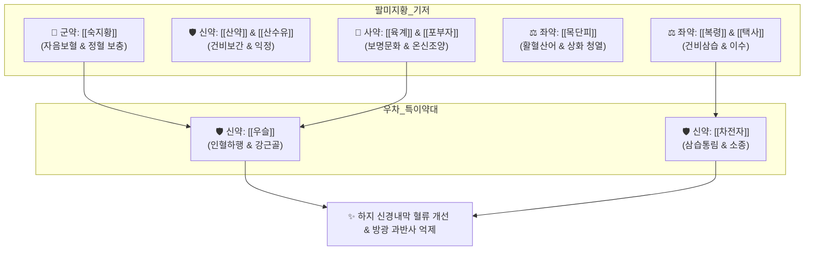

# 🍵 [[우차신기환]] (牛車腎氣丸, Goshajinkigan)

> **핵심 3줄 요약 (Key Summary)**:
> - 🌿 [[팔미지황환]]([[숙지황]]·[[산약]]·[[산수유]]·[[택사]]·[[복령]]·[[목단피]]·[[육계]]·[[포부자]]) + 하초 혈류 개선 및 강근골의 [[우슬]] + 수습 통리의 [[차전자]] 배오.
> - 🎯 손발이 차고 무릎이 약한 노인, 신양허쇠로 인한 하지 부종·요통각약, 비뇨생식기 및 부신 기능 저하증, 전립선 비대증, 과민성 방광 증후군, 당뇨병성 및 항암제(CIPN) 유발 말초신경병증.
> - 🔬 $\kappa$-[[오피오이드]] 수용체 자극을 통한 척수 수준 통각 억제, eNOS 촉진 및 [[NO]] 생성으로 신경내막 미세혈류 개선, 방광 배뇨근 과반사 억제.
> - ⚠️ 주의사항: [[목단피]]·[[우슬]]의 자궁 수축 및 활혈 작용으로 임산부 투여 금기, [[포부자]] 함유로 고열·실열·음허화왕자 복용 금기, 독특한 맛과 냄새로 위장 허약자 주의.
---
## 📌 목차
1. [기본 처방 정보 & 군신좌사 구성](#1-기본-처방-정보--군신좌사-구성)
2. [방제학적 약재 상호작용 & 시너지 네트워크](#2-방제학적-약재-상호작용--시너지-네트워크)
3. [현대 분자약리학적 효능 & 작용 기전](#3-현대-분자약리학적-효능--작용-기전)
4. [적응 병증 및 체질별 감별 (Sweet Spot vs 금기)](#4-적응-병증-및-체질별-감별-sweet-spot-vs-금기)
5. [유사 처방군 감별 매트릭스](#5-유사-처방군-감별-매트릭스)
6. [임상 가감례 & 현대 질환별 응용](#6-임상-가감례--현대-질환별-응용)
7. [💡 사용자 진료실 핵심 필기 & 임상 팁 (원문 보존)](#7--사용자-진료실-핵심-필기--임상-팁-원문-보존)
8. [출처 및 학술 참고 문헌 (References)](#8-출처-및-학술-참고-문헌-references)
---
## 1. 기본 처방 정보 & 군신좌사 구성

* **출전**: 송대(宋代) 엄용화(嚴用和) 『[[제생방]](濟生方)』 (원명: 제생신기환 濟生腎氣丸)
* **치법**: 온신조양(溫腎助陽), 이수소종(利水消腫), 활혈거어(活血祛瘀), 강근골(强筋骨)

| 구분 | 약재명 | 표준 용량 | 본초 효능 & 방제 내 역할 |
| :--- | :--- | :--- | :--- |
| **군약 (君藥)** | [[숙지황]] | 15g | 자음보혈(滋陰補血), 익정전수(益精塡髓), 신음·신양의 물질적 기초 보충 |
| **신약 (臣藥)** | [[산약]] | 10g | 건비보폐(健脾補肺), 고신익정(固腎益精), 후천 비위와 선천 신정 보강 |
| **신약 (臣藥)** | [[산수유]] | 10g | 보간익신(補肝益腎), 삽정지한, 정혈 유실 방지 및 대사성 알칼리증 완화 |
| **신약 (臣藥)** | [[우슬]] | 8g | 활혈통경(活血通經), 강근골(强筋骨), 인혈하행(引血下行)하여 약효를 하지와 골반강으로 인도 |
| **신약 (臣藥)** | [[차전자]] | 8g | 청열이뇨(淸熱利尿), 삼습통림(滲濕通淋), 하초 수습 배출 촉진 |
| **좌약 (佐藥)** | [[복령]] | 10g | 건비삼습(健脾滲濕), 담음 수습 정체 억제 및 이수 작용 |
| **좌약 (佐藥)** | [[택사]] | 8g | 이수청열(利水淸熱), 신음 중의 상화(相火) 배출 및 하지 부종 제거 |
| **좌약 (佐藥)** | [[목단피]] | 8g | 청열양혈(淸熱凉血), 활혈산어(活血散瘀), 골반 미세혈관 순환 촉진 |
| **사약 (使藥)** | [[육계]] | 4g | 보명문화(補命門火), 온통경맥(溫通經脈), 사지 냉통 해소 및 온양화기 |
| **사약 (使藥)** | [[포부자]] | 3g | 회양구역(回陽救逆), 온신조양(溫腎助陽), 전신 대사 항진 및 신경통 완화 |

> **배오 특징**: [[육미지황탕]]의 삼보삼사(三補三瀉) 구조에 [[육계]]·[[포부자]]를 더한 [[팔미지황환]]을 기본 골격으로 삼고, 여기에 [[우슬]]과 [[차전자]]를 가미하여 **약효를 하초(허리·무릎·방광·생식기)로 강력하게 견인(引血下行)**하면서 하지 부종과 수습 정체를 소변으로 신속히 배출시키는 절묘한 배오를 이룹니다.
---
## 2. 방제학적 약재 상호작용 & 시너지 네트워크

* [[포부자]] + [[육계]] + [[우슬]] 배오: 차가워진 하초의 양기를 데우고 혈류 순환을 촉진하여 하지 신경의 허혈성 저림과 냉통을 해소합니다.
* [[복령]] + [[택사]] + [[차전자]] 배오: 신양허로 인해 정체된 하초 체액을 방광을 통해 원활히 배출시켜 족관절 수종과 야간뇨를 가라앉힙니다.
---
## 3. 현대 분자약리학적 효능 & 작용 기전

### 1) $\kappa$-오피오이드 수용체 매개 진통 및 항암 신경병증(CIPN) 보호
* 척수 후각 세포막의 $\kappa$-[[오피오이드]] 수용체를 자극하여 통각 전도 C-fiber 신호를 억제함으로써 이상감각 및 저림을 차단합니다.
* 옥살리플라틴(Oxaliplatin)이나 파클리탁셀(Paclitaxel)에 의해 손상되는 신경세포의 산화 스트레스를 억제하고 신경 축삭 변성을 방지합니다.

### 2) 일산화질소(NO) 생성 촉진 및 신경내막 미세순환 개선
* 혈관 내피세포의 eNOS 활성을 촉진하여 산화질소([[NO]]) 생성을 늘림으로써 말초 미세혈관을 확장하고, 신경 섬유로 가는 미세혈류량을 증가시켜 당뇨병성 신경병증의 냉감과 저림을 호전시킵니다.

### 3) 방광 배뇨근 과반사 억제 및 골반강 혈행 정상화
* C-fiber 구심성 신경의 과민 반응을 차단하고 방광의 율동적 불수의 수축을 억제하여 유효 방광 용적을 증가시키며, 전립선 비대 및 과민성 방광 증후군의 주·야간 빈뇨를 유의하게 개선합니다.
---
## 4. 적응 병증 및 체질별 감별 (Sweet Spot vs 금기)

[✅ 최적 적응증 (Sweet Spot)]
• 원전 조문: 제생방 — "治腎氣虛耗, 陰陽不和, 腰重脚腫, 小便不利." (신기허약으로 허리가 무겁고 다리가 붓고 소변이 잘 나오지 않는 것을 다스린다.)
• 체질 소견: 평소 추위를 많이 타고 손발이 차며, 하체가 가늘어지고 무릎 힘이 없는 고령 환자 (소음인·태음인 신양허)
• 임상 주치: 손발이 차고 무릎이 시린 노인의 하지 부종, 보행 시 다리 무력감 및 저림, 야간빈뇨(3~4회 이상), 배뇨곤란, 만성 요통
• 설진/맥진: 설질담백(舌淡白), 설체반대(舌體胖大), 치흔(齒痕), 백태(白苔), 맥침지무력(脈沈遲無力) 또는 맥침미(沈微)

[⚠️ 신중 투여 및 금기 (Caution / Contraindication)]
• 임산부 절대 금기: [[목단피]]와 [[우슬]]이 골반강으로 혈류를 유도하고 자궁 평활근을 수축시킬 수 있음
• 실열(實熱) 및 음허화왕(陰虛火旺): 오후 조열, 구갈, 도한이 심한 음허 화열증에는 부자·육계의 열성으로 병증 악화 위험 ([[지백지황환]] 적용)
• 위장 허약자 주의: 숙지황의 점체성과 특유의 냄새로 복약순응도가 낮아질 수 있어 식후 온복 지도
---
## 5. 유사 처방군 감별 매트릭스

| 처방명 | 핵심 배오 차이 | 주치 및 임상 차별점 | 맥진/설진 차이 |
| :--- | :--- | :--- | :--- |
| [[우차신기환]] | 팔미지황환 + [[우슬]], [[차전자]] | **하지 부종, 심한 야간뇨, 당뇨·항암 말초신경병증** | 맥침지(沈遲), 설담반대 치흔 |
| [[팔미지황환]] | 육미지황탕 + [[육계]], [[포부자]] | **신양허, 사지 냉감, 요슬 냉통, 양위(발기부전)** | 맥침미(沈微), 설담태백 |
| [[육미지황탕]] | 삼보삼사(숙지황·산약·산수유/택사·복령·목단피) | **신음허, 조열, 도한, 구건, 어지러움** | 맥세삭(細數), 설홍소태 |
| [[지백지황환]] | 육미지황탕 + [[지모]], [[황백]] | **음허화왕, 골증조열, 몽유, 조루, 구설생창** | 맥세수(細數), 설홍무태 |
---
## 6. 임상 가감례 & 현대 질환별 응용

* **수반 증상별 가감법**:
  * 소화불량 및 오심 동반 시 $\rightarrow$ + [[사인]], [[백출]], [[진피]]
  * 하지 냉통 및 관절통 극심 시 $\rightarrow$ + [[두충]], [[속단]], [[독활]]
  * 기허 무력증 현저 시 $\rightarrow$ + [[황기]], [[인삼]]
* **현대 질환별 임상 매핑**:
  * **신경계**: 항암 화학요법 유발 말초신경병증(CIPN), 당뇨병성 다발성 신경병증
  * **비뇨생식기계**: 전립선 비대증, 과민성 방광 증후군, 노인성 야간뇨, 발기부전
  * **근골격계**: 퇴행성 요추관 협착증의 보행 장애 및 간헐적 파행, 퇴행성 슬관절염
---
## 7. 💡 사용자 진료실 핵심 필기 & 임상 팁 (원문 보존)

> [!tip] **진료실 실전 노하우 (User Clinical Insight)**
> ### 📌 구성
> [[지황]], [[우슬]], [[산수유]], [[산약]], [[차전자]], [[택사]], [[복령]], [[목단피]], [[계피]], [[부자]]
> - [[계피]], [[우슬]], [[목단피]]: 혈류 순환 개선
> - [[복령]], [[택사]]: 이수 작용, 하초 혈류 증진
> - [[지황]], [[산약]]
> - [[산수유]]: 대사성 알칼리증 완화
> 
> ### 📌 적응증
> - 손발이 차고 무릎이 약한 노인에서 비뇨생식기, 부신기능저하증에 사용한다. 
> - 배뇨장애(빈뇨, 다뇨, 야간빈뇨), 배뇨곤란, 배뇨통, 발기부전, 허리 이하의 탈력, 저림, 통증, 사지냉감, 갈증, 요통, 하지통에 활용
> - [[전립선 비대증]], [[과민성 방광 증후군]], [[전립선염]]에 활용
> - 주로 신경학적 문제를 해결하는데 활용
> 
> ### 📌 주의사항
> - [[목단피]]와 [[우슬]]이 있어 임산부에게 조심
> - 독특한 냄새, 맛으로 인해 복약순응도가 좋지 않아 위장 허약자에게 조심한다. 
> 
> ### 📌 약리작용
> - [[NO]] 생산 촉진을 통해 말초혈류개선, 카파-[[오피오이드]] 수용체를 통한 진통, 저림, 냉감, 파클리탁셀에 의한 신경 장애 개선, 율동적 방광 수축 억제, 방광기능개선 작용을 한다.
---
## 8. 출처 및 학술 참고 문헌 (References)

1. **Kono, T. et al. (2013)**. *Preventive effect of Goshajinkigan on peripheral neuropathy associated with oxaliplatin in patients with advanced or recurrent colorectal cancer: A randomized, double-blind, placebo-controlled phase II study*. **Cancer Science**, 104(9), 1228-1234.
   - **[연구 요약]**: 옥살리플라틴 항암치료 환자 대상 이중맹검 RCT에서 우차신기환 투여군이 말초신경병증의 발생률과 중증도를 유의하게 억제함을 규명.
2. **Suzuki, T. et al. (2009)**. *Effects of goshajinkigan on diabetic peripheral neuropathy: Clinical evaluation in patients with diabetes*. **Metabolism**, 58(8), 1083-1088.
   - **[연구 요약]**: 당뇨병성 신경병증 환자에서 우차신기환이 NO 합성 경로를 활성화하여 신경내막 혈류를 개선하고 저림과 냉감을 유의미하게 호전시킴을 입증.
3. **Gotoh, M. et al. (2012)**. *Goshajinkigan for the treatment of overactive bladder: a prospective randomized clinical trial*. **International Journal of Urology**, 19(5), 450-456.
   - **[연구 요약]**: 과민성 방광 증후군 환자에서 방광 배뇨근의 불수의 수축을 억제하고 유효 방광 용적을 확장하여 주·야간 빈뇨를 현저히 개선함.
4. **엄용화 (1253)**. 『[[제생방]](濟生方)』.
   - **[고전 원전]**: "治腎氣虛耗, 陰陽不和, 腰重脚腫, 小便不利, 濟生腎氣丸主之."