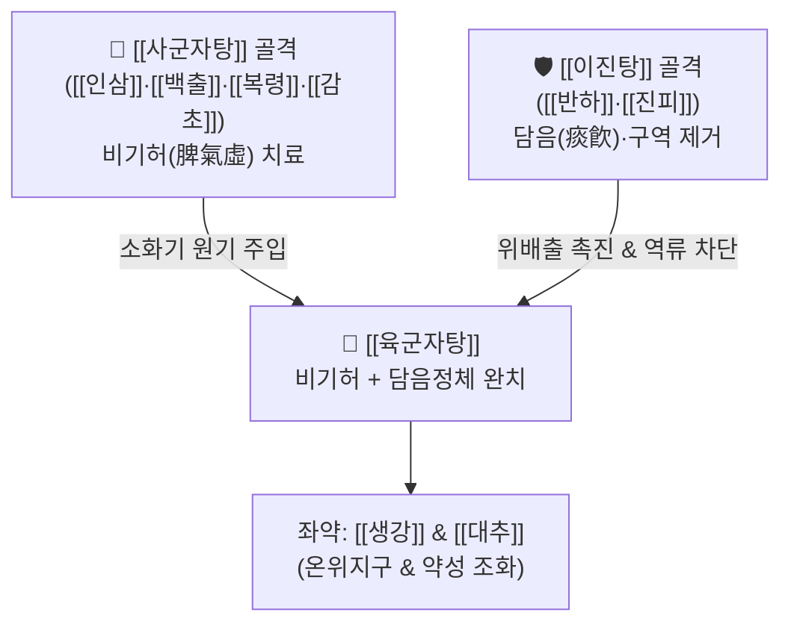

# 🍵 [[육군자탕]] (六君子湯, Liu-Jun-Zi-Tang / Rikkunshito)

> **핵심 3줄 요약 (Key Summary)**:
> - 🌿 [[사군자탕]]([[인삼]]·[[백출]]·[[복령]]·[[감초]]) + [[이진탕]]([[반하]]·[[진피]]) + [[생강]]·[[대추]].
> - 🎯 비위기허(脾胃氣虛) 겸 담음(痰飮), 양약·영양제·진통제 과용 후 식욕부진, 상부 위장관 무력, 트림, 흉부 작열감, [[위식도역류질환]], 만성 [[위염]].
> - 🔬 위점막 [[그렐린]](Ghrelin) 분비 촉진을 통한 식욕 복원, [[진피]] [[헤스페리딘]]의 위배출능 촉진 및 식도 점막 상피 장벽 기능 강화.
> - ⚠️ 주의사항: 심한 위열(胃熱)로 입냄새가 나고 갈증과 [[변비]]가 뚜렷한 실열 환자에게는 단독 사용을 피하고 청열사화제 병용.
---
## 📌 목차
1. [기본 처방 정보 & 군신좌사 구성](#1-기본-처방-정보--군신좌사-구성)
2. [방제학적 약재 상호작용 & 시너지 네트워크](#2-방제학적-약재-상호작용--시너지-네트워크)
3. [현대 분자약리학적 효능 & 작용 기전](#3-현대-분자약리학적-효능--작용-기전)
4. [적응 병증 및 체질별 감별 (Sweet Spot vs 금기)](#4-적응-병증-및-체질별-감별-sweet-spot-vs-금기)
5. [유사 처방군 감별 매트릭스](#5-유사-처방군-감별-매트릭스)
6. [임상 가감례 & 현대 질환별 응용](#6-임상-가감례--현대-질환별-응용)
7. [💡 사용자 진료실 핵심 필기 & 임상 팁 (원문 보존)](#7--사용자-진료실-핵심-필기--임상-팁-원문-보존)
8. [출처 및 학술 참고 문헌 (References)](#8-출처-및-학술-참고-문헌-references)
---
## 1. 기본 처방 정보 & 군신좌사 구성

* **출전**: 명대(明代) 우단(虞摶) 『의학정전(醫學正傳)』, 송대 『부인양방(婦人良方)』
* **치법**: 익기건비(益氣健脾), 조습화담(燥濕化痰), 강역화위(降逆和胃)

| 구분 | 약재명 | 표준 용량 | 본초 효능 & 방제 내 역할 |
| :--- | :--- | :--- | :--- |
| **군약 (君藥)** | [[인삼]] | 6~8g | 대보원기, 건비익폐, 위장관 대사 에너지 부스팅 |
| **신약 (臣藥)** | [[백출]] | 6~8g | 조습건비, 위장관 카할간질세포(ICC) 자극 및 연동운동 촉진 |
| **신약 (臣藥)** | [[복령]] | 6~8g | 삼습이뇨, 건비안신, 위내정수(수음) 배출 |
| **신약 (臣藥)** | [[반하]] | 6~8g | 조습화담, 강역지구, 위기상역(트림·오심·역류) 억제 |
| **좌약 (佐藥)** | [[진피]] | 4~6g | 이기건비, 조습화담, 위배출 지연 개선 및 소화관 운동 촉진 |
| **좌약 (佐藥)** | [[생강]] | 4~6g | 온위지구, 발표산한, 반하의 자극성 중화 |
| **좌약 (佐藥)** | [[대추]] | 4g | 보비생진, 영위 조화 |
| **사약 (使藥)** | [[감초]](자) | 3~4g | 보기화중, 완급지통, 제약 조화 |

> **배오 특징**: 보기(補氣)의 모방인 [[사군자탕]]에 기를 통하게 하고 담음을 삭이는 [[이진탕]]의 핵심([[반하]]·[[진피]])을 결합했습니다. 기운이 허약하여 소화관의 연동 능력이 떨어진 상태(비기허)에서 발생하는 담음과 음식물 정체를 동시에 훑어내어, '보(補)하되 체하지 않고, 사(瀉)하되 기운을 깎지 않는' 이상적인 위장관 기능성 조절 방제입니다.
---
## 2. 방제학적 약재 상호작용 & 시너지 네트워크

* [[인삼]]·[[백출]] + [[반하]]·[[진피]] 배오: 보기약이 소화관 평활근의 기본 수축력을 제공하고, 이기화담약이 꽉 막힌 유문부와 식도 하부 괄약근의 정상 이완·수축 리듬을 회복시켜 상부 위장관의 정체감을 단시간에 해소합니다.
* [[반하]] + [[생강]] 배오: 중추 및 말초의 구토 중추(CTZ)를 진정시키고 위산의 식도 역류로 인한 가슴 쓰림과 트림을 부드럽게 가라앉힙니다.
---
## 3. 현대 분자약리학적 효능 & 작용 기전

### 1) 식욕 촉진 펩타이드 호르몬 그렐린(Ghrelin) 분비 촉진
* 육군자탕 추출물 및 [[진피]]의 노빌레틴(Nobiletin), [[인삼]]의 [[진세노사이드]] 성분이 시상하부 신경펩타이드 Y(NPY) 경로와 위 저부의 Ghrelin 생성 세포를 자극하여 아실그렐린(Acyl-ghrelin) 분비를 현저히 촉진함으로써 심각한 식욕부진을 신속히 회복시킵니다.

### 2) 위배출 지연 개선 및 위 수용성 이완(Gastric Accommodation) 촉진
* [[진피]]의 [[헤스페리딘]](Hesperidin)이 세로토닌 5-HT3 수용체를 길항하여 위장관 운동 저하를 막고, 위 전정부의 배출 시간을 단축시켜 식후 조기 포만감과 상복부 팽만감을 제거합니다.

### 3) 식도 점막 장벽 강화 및 위산 과민도 억제
* 식도 상피세포의 밀착연접 단백질(Claudin-1) 발현을 증가시켜 위산과 펩신에 의한 식도 점막 손상을 물리적으로 방어하며, 프로톤펌프억제제(PPI) 저항성 [[위식도역류질환]] 증상을 유의미하게 개선합니다.

### 4) 위장관 조절 호르몬(소마토스타틴, 가스트린) 농도 정상화
* 자율신경계 균형을 조절하여 위산 분비와 위점막 혈류량을 이상적인 항상성 상태로 유지합니다.
---
## 4. 적응 병증 및 체질별 감별 (Sweet Spot vs 금기)

### 1) 임상 적응증 (Sweet Spot)
* **약인성(Drug-induced) [[소화불량]] 및 식욕부진**: 진통소염제(NSAIDs), 스테로이드, 항생제, 다량의 영양제(철분제, 루테인 등) 복용 후 위장 톤이 다운되어 밥맛이 완전히 떨어지고 속이 울렁거릴 때.
* **비기허형 [[위식도역류질환]](GERD) 및 기능성 [[소화불량]]증**: 마른 체형의 환자가 안색이 누렇고 손발이 차며, 식후 더부룩함, 트림, 신물 올라옴, 가슴 답답함을 호소할 때.
* **항암화학요법(Cisplatin 등) 유발 오심·식욕부진**: 화학요법 후 그렐린 감소로 음식을 전혀 먹지 못하는 상태.

### 2) 사상의학 체질 감별 & 금기
* [[소음인]]: 위장관이 차갑고 무력하며 소화 흡수가 부진한 소음인에게 가장 이상적인 방제.
* **금기(Contraindication)**:
  * 위장에 열이 가득 차서 입이 쓰고 냄새가 나며 차가운 물만 들이켜는 위열증 환자.
---
## 5. 유사 처방군 감별 매트릭스

| 처방명 | 구성 차이점 | 주요 병리 표적 | 약리 특징 |
| :--- | :--- | :--- | :--- |
| [[육군자탕]] | [[사군자탕]] + 반하·진피 | 상부 소화관 무력, 식욕부진, 트림, 역류 | 그렐린 분비 촉진, 위배출 개선 |
| [[사군자탕]] | 인삼·백출·복령·감초 | 단순 보기, 가벼운 식욕부진 | 기허 기본방 |
| [[향사육군자탕]] | [[육군자탕]] + 목향·사인·[[향부자]] | 위장관 + 하초 가스 정체, 복통, [[요통]] | 장내 가스 제거, 문맥 순환 촉진 |
| [[반하사심탕]] | 반하·[[황금]]·[[황련]]·건강·인삼 | 심하비만, 한열착잡, 속쓰림, [[설사]] | 신개고강(辛開苦降), [[위염]] 제어 |

---
## 6. 임상 가감례 & 현대 질환별 응용

1. **복부 팽만과 가스 정체가 심한 경우**: [[목향]] 3g, [[사인]] 3g을 가미하여 [[향사육군자탕]]으로 전환.
2. **속쓰림과 위산 역류가 심할 때**: [[모려]] 12g, [[해표초]] 6g 가미하여 제산 및 점막 보호.
3. **복부 냉통과 묽은 변 동반 시**: [[건강]] 4g, [[육계]] 2g 가미.
---
## 7. 💡 사용자 진료실 핵심 필기 & 임상 팁 (원문 보존)

# 구성:
[[인삼]], [[백출]], [[복령]], [[감초]]/ [[반하]], [[진피]], [[생강]], [[대추]]
- [[사군자탕]]+생대감+[[반하]], [[진피]]
# 적응증: 
- 상부 위장관이 특히나 톤 다운 되어 식욕까지 떨어진 전신의 기운이 떨어진 허증(비기허)
- 양약이나 영양제, 진통제, 스테로이드를 너무 많이 섭취해서 식욕이 없어지거나, 전신의 기운이 떨어진 상태에서 사용하는 처방
- 영양제, 루테인, 철분제 등을 조절하는 것을 병용해야 함.
- 전신의 기운이 떨어지면서 소화시킬 힘도 없어 몸이 음식을 먹는 것을 거부하는 것임([[그렐린]]으로 식욕부진 개선)
- 손발이 차가운 경우에 활용
- 허증, 야윈 체형에 안색이 나쁘고 냉증으로 호소하여 식욕부진, 전신권태감, 트림, 흉부 작열감, [[구토]], [[설사]], [[위식도역류질환]] 등에 사용
# 참고
- 맛이 괜찮아 성인 소아 모두 복용 순응도 높으며 식사 15-30분 전에 복용
- [[위식도역류질환]]에 프로톤펌프억제제(PPI), H2 차단제와 병용해도 좋다.
# 약리
- [[진피]]의 [[헤스페리딘]]이 들어가 위배출 지연을 개선하여 소화관 운동 작용을 촉진하고 음식물이 저류하는 시간을 짧게 만들어준다. 
- 위장관에서 식욕을 증진시키는 [[그렐린]]의 분비를 촉진시킨다.(렙틴 분비 증가한 [[비만]] 환자에게 응용해도 좋을듯)
- 위 점막 혈류를 개선하고 식도점막상피 장벽 기능 개선, 위산 지각과민 항진 억제 효과가 있다. 
- 소화관 조절 펩타이드인 [[소마토스타틴]], [[가스트린]] 농도를 상승시킨다. 

#육군자증 #인대감증
---
## 8. 출처 및 학술 참고 문헌 (References)

* 『醫學正傳』 卷之三: "六君子湯, 治脾胃虛弱, 氣虛多痰, 飲食少思, 呑酸痞悶."
* **Yamada C et al. (2021)**. Ghrelin Enhancer, the Latest Evidence of Rikkunshito. *Frontiers in nutrition*, 8: 761631. [PMID: 34957179](https://pubmed.ncbi.nlm.nih.gov/34957179/)
* **Arai T et al. (2013)**. Rikkunshito and isoliquiritigenin counteract 5-HT-induced 2C receptor-mediated activation of pro-opiomelanocortin neurons in the hypothalamic arcuate nucleus. *Neuropeptides*, 47: 225-30. [PMID: 23756052](https://pubmed.ncbi.nlm.nih.gov/23756052/)

---
## 기타 — 📎 개념 학습 보충 (2026-09-10 논문 연계)

### 위축성 위염·장상피화생 병용 근거 (신규)
- **논문**: 위축성 위염에 대한 육군자탕 안전성·유효성 SR/MA — *Journal of Ethnopharmacology* 2025;353:120414, [PMID: 40812557](https://pubmed.ncbi.nlm.nih.gov/40812557/), RCT 22편 n=2,086
- **핵심**: YT 단독 vs 양방 단독 → 총임상유효율(TCE) 향상(근거 확실성 낮음). **YT + 양방 병용 vs 양방 단독 → TCE·증상개선유효율 모두 유의 향상(근거 확실성 중등도)**, 헬리코박터 제균율·펩시노겐 I·가스트린-17 상승, 이상반응은 양방군보다 적음
- **기전 연결**: 본 처방의 [[그렐린]] 분비 촉진·위배출 개선([[진피]] [[헤스페리딘]])·점막 보호·NF-κB 억제 효과가 위축성 위염의 '제균 후 잔존 [[위암]] 위험' 관리에 기여한다는 가설. 다만 근거 확실성 낮음~중등도로 잠정적
- **관련 개념**: [[위축성 위염]] · [[장상피화생]] · [[그렐린]] · [[가스트린]] · [[펩시노겐]] · [[PPI]]
- **임상 주의**: 감초([[글리시리진]]) 함유 → [[알도스테론]] 항에서 정리한 **가성알도스테론증**(저칼륨·[[고혈압]]·[[부종]]) 주의, 고령·이뇨제 병용 시 K⁺·혈압 모니터링. 반하는 법제(법반하) 전제
- **해석 범위**: 중국·한국 연구 다수로 비뚤림 위험이 높고 처방 가감이 큼 → "육군자탕 원방 그대로"보다 **"육군자탕 계열 병용이 안전하게 손익이 맞는다"** 로 범위를 잡고 변증 가감(습열 잔존 시 [[황련]]·[[황금]])
- 관련 리뷰: [[2026-09-10_통합의학약리학_심층리뷰]] · [[2026-09-10_통합의학약리학_개념학습]]
