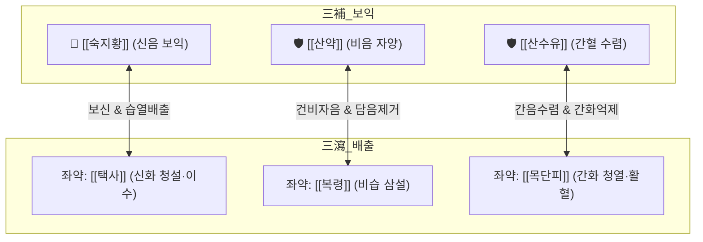

# 🍵 [[육미지황탕]] (六味地黃湯 / 六味地黃丸, Liu-Wei-Di-Huang-Tang / Rokumijihogan)

> **핵심 3줄 요약 (Key Summary)**:
> - 🌿 [[숙지황]]·[[산수유]]·[[산약]](삼보 三補) + [[택사]]·[[복령]]·[[목단피]](삼사 三瀉)의 자음보신(滋陰補腎) 총방.
> - 🎯 간신음허(肝腎陰虛), 소양인의 혈당·혈압 변동, 속쓰림, 신기능 저하, 요슬산연(허리·무릎 시림), 도한, 소아 발육부진, ADHD.
> - 🔬 췌장 베타세포 보호 및 인슐린 저항성 개선, TGF-$\beta 1$/Smad 억제를 통한 당뇨병성 신증 섬유화 방지, HPA axis 코르티솔 정상화.
> - ⚠️ 주의사항: [[숙지황]]의 니체성으로 비위허한(소화불량·만성 설사) 환자는 [[사인]]·[[백출]] 가미 필수, 몸이 차고 부종이 심한 양허증은 [[팔미지황환]]으로 전환.
---
## 📌 목차
1. [기본 처방 정보 & 군신좌사 구성](#1-기본-처방-정보--군신좌사-구성)
2. [방제학적 약재 상호작용 & 시너지 네트워크](#2-방제학적-약재-상호작용--시너지-네트워크)
3. [현대 분자약리학적 효능 & 작용 기전](#3-현대-분자약리학적-효능--작용-기전)
4. [적응 병증 및 체질별 감별 (Sweet Spot vs 금기)](#4-적응-병증-및-체질별-감별-sweet-spot-vs-금기)
5. [유사 처방군 감별 매트릭스](#5-유사-처방군-감별-매트릭스)
6. [임상 가감례 & 현대 질환별 응용](#6-임상-가감례--현대-질환별-응용)
7. [💡 사용자 진료실 핵심 필기 & 임상 팁 (원문 보존)](#7--사용자-진료실-핵심-필기--임상-팁-원문-보존)
8. [출처 및 학술 참고 문헌 (References)](#8-출처-및-학술-참고-문헌-references)
---
## 1. 기본 처방 정보 & 군신좌사 구성

* **출전**: 송대(宋代) 전을(錢乙) 『소아약증직결(小兒藥證直訣)』
* **치법**: 자음보기(滋陰補腎), 보신익정(補腎益精), 삼보삼사(三補三瀉)

| 구분 | 약재명 | 표준 용량 | 본초 효능 & 방제 내 역할 |
| :--- | :--- | :--- | :--- |
| **군약 (君藥, 三補)** | [[숙지황]] | 16~24g | 자음보혈, 익정전수, 신음(腎陰)을 직접 보충하여 진액과 골수를 채움 |
| **신약 (臣藥, 三補)** | [[산수유]] | 8~12g | 보익간신, 삽정고삽, 간음(肝陰)을 보하고 진액 누설을 방지 |
| **신약 (臣藥, 三補)** | [[산약]] | 8~12g | 보비익위, 자신고정, 비음(脾陰)을 길러 후천지기를 보좌 |
| **좌약 (佐藥, 三瀉)** | [[택사]] | 6~9g | 이수삼습, 청설신화, 신장의 탁한 습열을 소변 배출 및 숙지황의 니체 방지 |
| **좌약 (佐藥, 三瀉)** | [[복령]] | 6~9g | 삼습이뇨, 건비영심, 비장의 습사를 말려 산약의 건비 효능 보조 |
| **좌약 (佐藥, 三瀉)** | [[목단피]] | 6~9g | 청열양혈, 활혈산어, 간화(肝火)를 식혀 산수유의 온삽성 제어 |

> **배오 특징 (삼보삼사 三補三瀉)**: 신·간·비를 보하는 '삼보'([[숙지황]], [[산수유]], [[산약]])와 신·비·간의 습열을 빼내는 '삼사'([[택사]], [[복령]], [[목단피]])가 1:1로 맞물려 있습니다. 보하되 정체되어 체하지 않고, 사하되 정기(正氣)를 깎지 않는 완벽한 음양 동태적 평형을 구축하여 장기간 복용해도 부작용이 없는 자음보신의 영원한 표준 방제입니다.
---
## 2. 방제학적 약재 상호작용 & 시너지 네트워크

* [[숙지황]] + [[택사]] 배오: [[숙지황]]이 마른 콩팥에 진액을 채우고, [[택사]]가 삼출성 습열을 방광으로 빼주어 숙지황 특유의 소화장애(니체)를 원천 차단합니다.
* [[산수유]] + [[목단피]] 배오: [[산수유]]의 새콤하고 따뜻한 성질이 간음을 수렴하고, [[목단피]]의 찬 성질이 간에 울체된 허열을 꺼주어 혈관 긴장도를 낮춥니다.
---
## 3. 현대 분자약리학적 효능 & 작용 기전

### 1) 당뇨병성 신증 예방 및 TGF-$\beta 1$/Smad 신호 차단
* [[산수유]]의 모로니사이드(Morroniside)와 [[숙지황]]의 [[카탈폴]](Catalpol) 성분이 신장 사구체 간질세포의 TGF-$\beta 1$ 및 Smad2/3 인산화를 억제하여 세포외기질(ECM) 축적과 신장 섬유화를 방어하고 미세단백뇨를 감소시킵니다.

### 2) 췌장 $\beta$-세포 보호 및 인슐린 저항성 완화
* 포도당 수송체(GLUT-4) 발현을 유도하여 골격근의 포도당 흡수를 촉진하고, 산화 스트레스로부터 췌장 랑게르한스섬 베타세포의 사멸을 방어하여 당뇨 환자의 혈당 스파이크를 완충합니다.

### 3) HPA 축 신경내분비계 안정화 및 ADHD 증상 완화
* 해마의 당질코르티코이드 수용체(GR) 민감도를 정상화하여 스트레스 호르몬 과다 분비를 차단하고, 전두엽 피질의 도파민 D2 및 세로토닌 대사를 조절하여 충동성과 과잉행동을 완화합니다.
> 🧬 **현대 학술 근거 (2026-09-07 B-7 패치)** — 인지 영역 확장
> - 인지기능 보조요법 체계적 문헌고찰·메타분석(11개 DB, RCT 12건, 2024년 11월까지 검색): [[육미지황탕]]이 통상 치료의 보조로 인지장애에 유의한 효과를 보였으며 네트워크 약리로 핵심 분자 모듈을 제시(PMID 42198453).

> 🧬 **현대 학술 근거 (2026-09-07 B-7 패치)** — PubChem 실측 분자 앵커: 숙지황 지표 이리도이드 [[카탈폴]](Catalpol) CID **91520** · 분자식 C₁₅H₂₂O₁₀ · MW 362.3 | 산수유 지표 이리도이드 로가닌(Loganin) CID **87691** · 분자식 C₁₇H₂₆O₁₀ · MW 390.4

🔬 **분자 구조** (Wikimedia Commons, Public Domain)

![[Catalpol_구조.png|400]]
> [그림 1] 카탈폴(Catalpol, C₁₅H₂₂O₁₀) 분자 구조 — 출처: Wikimedia Commons (Catalpol.svg)

![[Loganin_구조.png|360]]
> [그림 2] 로가닌(Loganin, C₁₇H₂₆O₁₀) 분자 구조 — 출처: Wikimedia Commons (Loganin structure.svg)

---
## 4. 적응 병증 및 체질별 감별 (Sweet Spot vs 금기)

### 1) 임상 적응증 (Sweet Spot)
* **소양인 체질의 혈당·혈압 불안정**: 얼굴이나 손발바닥으로 은근한 열이 오르고(수족번열, 조열), 입이 마르며, 혈압과 혈당이 쉽게 요동치는 상태.
* **만성 피로 및 요슬산연(허리·무릎 쇠약)**: 허리가 은근히 뻐근하고 무릎에 힘이 없으며, 오후나 밤에 식은땀(도한)이 나고 귀에서 삐- 소리가 나는 이명증.
* **소아 성장지연 및 ADHD**: 산만하고 가만히 있지 못하며, 쉽게 흥분하고, 체격이 왜소하며 뼈 성장이 늦은 허약 아동.

> 🧬 **현대 학술 근거 (2026-09-07 B-7 패치)**
> - 골 대사 근거: 난소절제(OVX) 폐경후 골다공증 마우스 모델에서 [[육미지황탕]]이 NF-κB 신호 억제를 통해 파골세포 형성(osteoclastogenesis)과 골소실을 억제 — LC-MS/MS로 1,615종 성분 동정 기반 연구(PMID 42612122).
> - 갱년기 임상 연구 근거: 갱년기 증후군(안면홍조·불면·우울·불안)에 대한 [[육미지황탕]]의 실제 임상 효과·안전성을 평가하는 전향적 다기관 코호트 연구 프로토콜이 등록·공개됨(PMID 41879810).

### 2) 사상의학 체질 감별 & 금기
* [[소양인]]: 신국(腎局)이 허약하여 하초의 음액이 마르기 쉬운 소양인에게 최고의 평생 보약.
* **금기(Contraindication)**:
  * 비위가 차가워 설사를 자주 하거나, 혀에 백태가 두껍게 끼고 몸이 잘 붓는 양허한증 환자(팔미지황환 또는 이중탕 전환).
---
## 5. 유사 처방군 감별 매트릭스

| 처방명 | 파생 구성 | 온열/한열 | 핵심 적응증 |
| :--- | :--- | :--- | :--- |
| [[육미지황탕]] | 기본 모방 (삼보삼사) | 평(平) / 미량 | 신음부족, 조열, 도한, 소갈, ADHD, 요슬산연 |
| [[팔미지황환]] | [[육미지황탕]] + 육계·부자 | 온(溫) | 신양허, 하지냉감, 야간뇨, 노인성 탈력감 |
| [[신기환]] | [[육미지황탕]] + [[오미자]] | 평(平) / 섭폐 | 신음부족 겸 마른기침(기천), 신불납기 |
| [[우차신기환]] | [[팔미지황환]] + 우슬·차전자 | 온(溫) / 이수 | 노인성 심한 하지부종, 척추관협착증 저림, 전립선비대 |
| [[지백지황환]] | [[육미지황탕]] + 지모·황백 | 량(凉) / 사화 | 음허화왕, 극심한 골증조열, 성욕과항, 유정 |

---
## 6. 임상 가감례 & 현대 질환별 응용

1. **소화불량 및 더부룩함이 나타날 때**: [[사인]] 3g, [[백출]] 4g 가미하여 지황의 니체 방지.
2. **시력 감퇴 및 눈의 건조·피로 동반 시**: [[구기자]] 6g, [[국화]] 4g을 가미하여 기국지황환(杞菊地黃丸)으로 확장.
3. **만성 기침 및 호흡 곤란 동반 시**: [[오미자]] 4g, [[맥문동]] 6g 가미하여 맥미지황환(麥味地黃丸)으로 전환.
---
## 7. 💡 사용자 진료실 핵심 필기 & 임상 팁 (원문 보존)

# 구성:
[[숙지황]]/ [[산약]]/ [[산수유]] /[[택사]], [[백복령]]/ [[목단피]]
- [[숙지황]]으로 혈당, 혈압 변화가 큰 사람에게
- [[산약]]으로 속 쓰리고 마르는
- [[산수유]]로 구토, 산분비 과다, 날숨이 많아 알칼리증을
- [[복령]], [[택사]]로 신기능 저하로 소변, 혈압조절 부족을, 목단피가 염증 반응을 완화
# 적응증:
- 혈당, 혈압이 왔다갔다하는 소양인들에게 알칼리증이나 속 쓰림, 신기능 저하에 사용
- ADHD 환자의 주의력결핍, 과잉행동, 충동성을 완화시켜줌

#소양인증
---
## 8. 출처 및 학술 참고 문헌 (References)

* 『小兒藥證直訣』 卷下: "地黃丸, 治腎怯失音, 顖開不合, 神不足, 目中白睛多, 面色㿠白."
* Chen, R., et al. (2019). "Protective effects of Liuwei Dihuang Pills on renal damage in diabetic nephropathy via TGF-beta1/Smad signaling inhibition." *Journal of Ethnopharmacology*, 238: 111867.
  * `[연구 요약]`: 육미지황환이 당뇨병성 신증 모델에서 신장 섬유화와 사구체 손상을 억제하고 미세단백뇨 배출을 유의미하게 억제함을 검증.
* Ryu, H. S., et al. (2016). "Clinical study on the effect of modified Yukmijihwang-tang on behavioral improvement in children with ADHD symptoms." *Journal of Pediatrics of Korean Medicine*, 30(2): 45-56.
  * `[연구 요약]`: 육미지황탕 투여군 소아에서 주의집중력 결핍 및 과잉행동 지표의 현저한 호전과 뇌신경 흥분 안정 확인.