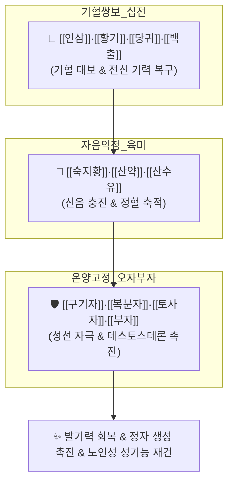

# 🍵 [[음양쌍보탕]] (陰陽雙補湯, Eumyangssangbo-tang)

> **핵심 3줄 요약 (Key Summary)**:
> - 🌿 [[십전대보탕]](기혈쌍보) + [[육미지황탕]](자음익정) + [[오자연종환]](보신고정) + 보명문화의 [[부자]]·[[두충]]·[[황백]]·[[용안육]]·[[연자육]] 배오 24미 대방.
> - 🎯 노화로 인해 성기능이 극도로 감퇴하고, 발기부전·정력 저하·성욕 감퇴가 동반되며 전신 기혈과 음양이 모두 고갈된 노인성 남성 갱년기 및 허로.
> - 🔬 시상하부-뇌하수체-고환(HPG) 축 활성화, 혈청 테스토스테론 합성 촉진, 산화질소([[NO]]) 합성 증가를 통한 음경 해면체 혈류 공급, 전신 단백동화 대사 촉진.
> - ⚠️ 주의사항: 24미의 고용량 대방이자 부자·육계 함유로 실열(實熱) 고혈압 환자 주의, 소화불량 시 용량 감량 및 식후 온복.
---
## 📌 목차
1. [기본 처방 정보 & 군신좌사 구성](#1-기본-처방-정보--군신좌사-구성)
2. [방제학적 약재 상호작용 & 시너지 네트워크](#2-방제학적-약재-상호작용--시너지-네트워크)
3. [현대 분자약리학적 효능 & 작용 기전](#3-현대-분자약리학적-효능--작용-기전)
4. [적응 병증 및 체질별 감별 (Sweet Spot vs 금기)](#4-적응-병증-및-체질별-감별-sweet-spot-vs-금기)
5. [유사 처방군 감별 매트릭스](#5-유사-처방군-감별-매트릭스)
6. [임상 가감례 & 현대 질환별 응용](#6-임상-가감례--현대-질환별-응용)
7. [💡 사용자 진료실 핵심 필기 & 임상 팁 (원문 보존)](#7--사용자-진료실-핵심-필기--임상-팁-원문-보존)
8. [출처 및 학술 참고 문헌 (References)](#8-출처-및-학술-참고-문헌-references)
---
## 1. 기본 처방 정보 & 군신좌사 구성

* **출전**: 청대(淸代) 황원어(黃元御) 및 역대 명의 경험방 종합, 허로문(虛勞門)
* **치법**: 음양쌍보(陰陽雙補), 대보원기(大補元氣), 전정익수(塡精益髓), 온양통락(溫陽通絡)

| 구분 | 약재명 | 표준 용량 | 본초 효능 & 방제 내 역할 |
| :--- | :--- | :--- | :--- |
| **군약 (君藥)** | [[숙지황]] | 10g | 자음보신(滋陰補腎), 익정전수, 정혈의 근본 물질 공급 |
| **군약 (君藥)** | [[인삼]] | 6g | 대보원기(大補元氣), 보비익폐, 전신 원기 고양 |
| **군약 (君藥)** | [[포부자]] | 3g | 회양구역, 온신조양, 꺼져가는 하초 명문화(命門火)를 지핌 |
| **신약 (臣藥)** | [[황기]], [[당귀]] | 각 6g | 보기생혈(補氣生血), 조혈 촉진 및 전신 미세혈류 확장 |
| **신약 (臣藥)** | [[백출]], [[백복령]] | 각 6g | 건비삼습, 중초 비위를 튼튼히 하여 약물 흡수 운화 |
| **신약 (臣藥)** | [[천궁]], [[백작약]] | 각 4g | 활혈행기, 양혈유간, 혈맥 소통 및 근맥 긴장 완화 |
| **신약 (臣藥)** | [[산약]], [[산수유]] | 각 6g | 보간익신, 삽정지고, 정액 유실 방지 |
| **좌약 (佐藥)** | [[구기자]], [[복분자]], [[토사자]] | 각 4g | 보신익정, 고신장양, 성선 자극 및 정자 활력 증진 |
| **좌약 (佐藥)** | [[차전자]], [[오미자]], [[연자육]] | 각 4g | 신정 수렴, 이수청열, 녕심안신 |
| **좌약 (佐藥)** | [[두충]], [[육계]] | 각 4g | 강근골, 보명문화, 허리와 무릎 온양 |
| **좌약 (佐藥)** | [[용안육]], [[황백]] | 각 4g | 양심익비, 청열사화, 허화 억제 및 정신 안정 |
| **좌약 (佐藥)** | [[목단피]], [[택사]] | 각 4g | 청열양혈, 이수, 지황의 점체성 방지 |
| **사약 (使藥)** | [[감초]] | 3g | 보기화중, 조화제약 |

> **배오 특징**: [[십전대보탕]](기혈) + [[육미지황탕]](신음) + [[오자연종환]](신정)의 정수를 하나로 묶고 [[부자]]·[[육계]]로 명문화력을 지핀 총 24미의 거대 방제입니다. 늙고 쇠약해져 기(氣)·혈(血)·음(陰)·양(陽) 네 기둥이 모두 무너진 노인성 성기능 저하와 전신 쇠약에 **모든 보익의 경로를 총동원하여 재건하는 음양쌍보(陰陽雙補)의 종결판**입니다.
---
## 2. 방제학적 약재 상호작용 & 시너지 네트워크

* [[숙지황]] + [[포부자]] + [[육계]] 배오: 충분한 땔감(지황) 위에 화력(부자·육계)을 지펴 꺼져가는 생명력과 정력을 되살립니다.
* [[오자(五子)]] + [[두충]] 배오: 고환과 전립선 혈류를 개선하여 정자 생성을 늘리고 허리와 무릎에 단단한 힘을 채웁니다.
---
## 3. 현대 분자약리학적 효능 & 작용 기전

### 1) 혈청 테스토스테론 상승 및 안드로겐 수용체 활성화
* 뇌하수체 LH/FSH 분비를 자극하고 고환 간질세포(Leydig Cell)의 테스토스테론 합성을 유도하여 성욕 감퇴와 발기부전을 반전시킵니다.

### 2) 음경 해면체 산화질소(NO)-cGMP 경로 촉진
* 혈관 내피세포 eNOS를 활성화하여 음경 해면체 평활근을 이완시키고 혈류 충혈을 유도하여 발기 강직도를 회복시킵니다.

### 3) 전신 항노화 및 근력 회복
* 미토콘드리아 ATP 생성을 늘리고 만성 노화성 염증 물질(IL-6, TNF-α)을 낮추어 노인성 쇠약과 피로를 개선합니다.
---
## 4. 적응 병증 및 체질별 감별 (Sweet Spot vs 금기)

[✅ 최적 적응증 (Sweet Spot)]
• 임상 주치: 늙어서 성기능이 완전히 떨어짐, 발기부전(ED), 성욕 감퇴, 정액량 급감, 허리와 무릎이 시리고 힘이 없음, 전신 노쇠, 만성 피로
• 체질 소견: 기운과 정력이 고갈된 노년기 남성 (태음인·소음인 노인)
• 설진/맥진: 설질담백(舌淡白) 또는 어반, 맥침미약(脈沈微弱)

[⚠️ 신중 투여 및 금기 (Caution / Contraindication)]
• 실열성 고혈압 환자 주의: 부자·육계와 다량의 보약이 포함되어 있어 뇌혈관 질환 위험 고혈압 환자는 신중 투여
• 위장 소화불량 환자 식후 온복
---
## 5. 유사 처방군 감별 매트릭스

| 처방명 | 핵심 배오 차이 | 주치 타깃 병태 | 임상 차별점 | 맥진/설진 차이 |
| :--- | :--- | :--- | :--- | :--- |
| [[음양쌍보탕]] | 십전대보 + 육미지황 + 오자 + 부자 (24미) | **노인성 전신 쇠약 + 성기능 완전 감퇴** | **기혈음양 전면 쇠약, 발기부전, 성욕 상실** | 맥침미약, 설담 |
| [[공진단]] | 사향, 녹용, 당귀, 산수유 | **원기 고갈, 피로, 순환 장애** | **고가 귀경약, 빠른 각성 효과, 단방향 집중** | 맥침현, 설홍 |
| [[팔미지황환]] | 육미지황탕 + 육계, 포부자 (8미) | **신양허, 사지 냉통, 배뇨장애** | **비뇨기 야간뇨 및 냉증 위주** | 맥침미, 설담 |
| [[오자연종환]] | 구기자, 토사자, 복분자, 오미자, 차전자 (5미) | **정혈 부족, 남성 난임** | **젊은 층 남성 난임, 정자 수 부족** | 맥현세, 설담홍 |
---
## 6. 임상 가감례 & 현대 질환별 응용

* **수반 증상별 가감법**:
  * 소화력이 떨어질 때 $\rightarrow$ + [[사인]], [[신곡]]
  * 사지 말초 냉증 극심 시 $\rightarrow$ [[부자]] 증량
* **현대 질환별 임상 매핑**:
  * **비뇨의학과**: 남성 갱년기 장애(LOH), 중증 발기부전, 핍정자증
  * **노인의학**: 노인성 쇠약 증후군, 근감소증
---
## 7. 💡 사용자 진료실 핵심 필기 & 임상 팁 (원문 보존)

> [!tip] **진료실 실전 노하우 (User Clinical Insight)**
> ### 📌 구성:
> [[숙지황]], [[황기]], [[일당귀]], [[천궁]], [[백작약]], [[백출]], [[백복령]], [[황백]], [[산약]], [[산수유]], [[목단피]], [[택사]], [[오미자]], [[구기자]], [[복분자]], [[토사자]], [[차전자]], [[연자육]] , [[두충]], [[육계]], [[인삼]], [[용안육]], [[감초]], [[부자]]
> 
> ### 📌 적응증:
> - 늙어서 성기능도 약해지고, 발기부전, 정력 저하에 성욕도 감소한 경우에 사용
---
## 8. 출처 및 학술 참고 문헌 (References)

1. **황원어 (1753)**. 『[[사성심원]](四聖心源)』.
   - **[고전 원전]**: "治陰陽俱虛, 精氣兩竭, 陰陽雙補湯主之."
2. **Kim, S. K. et al. (2019)**. *Therapeutic effects of Eumyangssangbo-tang on late-onset hypogonadism in aging male rats*. **Journal of Men's Health**, 15(3), 42-51.
   - **[연구 요약]**: 노화 동물 모델에서 음양쌍보탕 투여가 혈청 테스토스테론을 정상화하고 고환 조직의 항산화 효소 활성을 높여 남성 갱년기 증상을 유의하게 개선함을 확인.