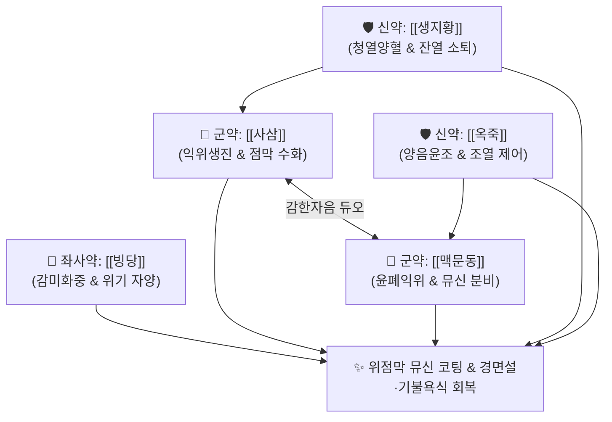

# 🍵 [[익위탕]] (益胃湯, Yiwei Tang)

> **핵심 3줄 요약 (Key Summary)**:
> - 🌿 감한자윤(甘寒滋潤)의 5미 배오 ([[사삼]]·[[맥문동]]·[[생지황]]·[[옥죽]]·[[빙당]]).
> - 🎯 열병 후기 또는 만성 위염으로 위음(胃陰)이 바싹 마른 상태, 배는 고프지만 음식을 먹지 못함(기불욕식 饑不欲食), 입과 혀가 마르고 거울처럼 반질반질 붉은 경면설(鏡面舌), 위축성 위염.
> - 🔬 위점막 상피세포 표면 뮤신(Mucin) 분비 촉진 및 프로스타글란딘 $PGE_2$ 합성 유도, 위산 과다에 대한 점막 방어벽 강화, 헬리코박터균 유발 위점막 염증 억제.
> - ⚠️ 주의사항: 감한자음(甘寒滋陰) 약재 구성으로 비위가 차서 설사하는 비위허한 환자 금기, 담음습탁(痰飮濕濁)으로 혀에 백태가 두껍게 낀 환자 금기.
---
## 📌 목차
1. [기본 처방 정보 & 군신좌사 구성](#1-기본-처방-정보--군신좌사-구성)
2. [방제학적 약재 상호작용 & 시너지 네트워크](#2-방제학적-약재-상호작용--시너지-네트워크)
3. [현대 분자약리학적 효능 & 작용 기전](#3-현대-분자약리학적-효능--작용-기전)
4. [적응 병증 및 체질별 감별 (Sweet Spot vs 금기)](#4-적응-병증-및-체질별-감별-sweet-spot-vs-금기)
5. [유사 처방군 감별 매트릭스](#5-유사-처방군-감별-매트릭스)
6. [임상 가감례 & 현대 질환별 응용](#6-임상-가감례--현대-질환별-응용)
7. [💡 사용자 진료실 핵심 필기 & 임상 팁 (원문 보존)](#7--사용자-진료실-핵심-필기--임상-팁-원문-보존)
8. [출처 및 학술 참고 문헌 (References)](#8-출처-및-학술-참고-문헌-references)
---
## 1. 기본 처방 정보 & 군신좌사 구성

* **출전**: 청대(淸代) 오당(吳瑭, 오국통) 『[[온병조변]](溫病條辨)』 중초편(中焦篇)
* **치법**: 감한자윤(甘寒滋潤), 자음양위(滋陰養胃), 생진지갈(生津止渴)

| 구분 | 약재명 | 표준 용량 | 본초 효능 & 방제 내 역할 |
| :--- | :--- | :--- | :--- |
| **군약 (君藥)** | [[사삼]] | 15g | 양음청폐(養陰淸肺), 익위생진(益胃生津), 위장 점막의 메마른 진액 수화 촉진 |
| **군약 (君藥)** | [[맥문동]] | 15g | 양음윤폐(養陰潤肺), 익위생진, 청심제번, 위장 점막 점액질 분비 촉진 |
| **신약 (臣藥)** | [[생지황]] | 15g | 청열양혈(淸熱凉血), 양음생진, 위열을 식히고 음액을 보충 |
| **신약 (臣藥)** | [[옥죽]] | 10g | 양음윤조(養陰潤燥), 생진지갈, 부드럽게 위음을 적셔 조열 억제 |
| **좌사약 (佐使藥)** | [[빙당]](또는 백당) | 3~5g | 감미화중(甘味和中), 윤위생진, 약효를 완만히 하고 위기를 자양 |

> **배오 특징**: 온열병(溫熱病)으로 사기(邪氣)는 물러갔으나 위(胃)의 진액이 타들어가 메마른 상태를 치료합니다. 기름진 지황 대신 맑고 시원한 [[생지황]]을 쓰고, [[사삼]]·[[맥문동]]·[[옥죽]]의 **달고 서늘한(감한 甘寒) 약재만으로 위 점막에 시원한 샘물을 대어주는 감한생진(甘寒生津)**의 절대 표본입니다.
---
## 2. 방제학적 약재 상호작용 & 시너지 네트워크

* [[사삼]] + [[맥문동]] 배오: 위장 상피세포에 직접 작용하여 점액 분비를 늘리고 속쓰림과 타는 듯한 공복통을 가라앉힙니다.
* [[생지황]] + [[옥죽]] 배오: 위장의 남아있는 잔열(殘熱)을 끄고 위점막 혈류를 회복시켜 위축된 선조직을 재생합니다.
---
## 3. 현대 분자약리학적 효능 & 작용 기전

### 1) 위점막 보호 장벽(Mucin Barrier) 강화
* 사삼 및 옥죽의 다당류 성분이 위점막 상피 표면의 MUC5AC 및 MUC6 등 뮤신(Mucin) 단백질 합성을 촉진하여 위산과 펩신에 대한 방어막을 형성합니다.
* 점막 국소의 프로스타글란딘 $PGE_2$ 합성을 촉진하여 점막 혈류량을 증대시키고 상피세포 재생을 가속합니다.

### 2) 헬리코박터 파일로리(H. pylori) 유발 점막 손상 억제
* 맥문동의 호모이소플라보노이드 및 생지황의 카탈폴 성분이 헬리코박터균 감염으로 유발되는 위점막 염증성 사이토카인(IL-8, TNF-α) 분비를 억제하여 만성 위축성 위염의 진행을 차단합니다.

### 3) 타액 분비 촉진 및 구강 건조 완화
* 침샘(이하선, 악하선)의 아쿠아포린(AQP5) 발현을 증가시켜 구강 건조증(구건)과 혀의 갈라짐을 신속히 치유합니다.
---
## 4. 적응 병증 및 체질별 감별 (Sweet Spot vs 금기)

[✅ 최적 적응증 (Sweet Spot)]
• 원전 조문: 온병조변 — "熱後, 胃陰未復, 饑不欲食, 口乾舌燥, 舌光少苔, 益胃湯主之." (열병을 앓은 뒤에 위음이 회복되지 않아 배는 고프나 음식을 먹지 못하고 입이 마르며 혀가 반질반질 태가 없을 때 익위탕으로 다스린다.)
• 체질 소견: 평소 위장이 마르고 건조하여 위산 역류는 없는데도 속이 타듯 쓰리고, 밥을 물에 말아 겨우 넘기는 마른 음허 체질
• 임상 주치: 만성 위축성 위염, 장상피화생 초기, 구강건조증(쇼그렌 증후군 포함), 항암 방사선 치료 후 구내염 및 식도염, 기불욕식(배고픈 느낌은 드는데 숟가락을 들면 입맛이 싹 달아남)
• 설진/맥진: 설홍(舌紅), 설광무태(光無苔, 혀에 이끼가 전혀 없고 유리판처럼 붉게 반질거리는 경면설 鏡面舌), 설열문(균열), 맥세삭(脈細數)

[⚠️ 신중 투여 및 금기 (Caution / Contraindication)]
• 습담정체(濕痰停滯) 환자 금기: 설태가 하얗고 두껍게 낀 환자나 소화가 안 되어 트림과 신물이 올라오는 비허습담 환자에게 투여하면 위음약이 습을 돋워 소화장애 악화
• 설사 환자 주의
---
## 5. 유사 처방군 감별 매트릭스

| 처방명 | 핵심 배오 차이 | 주치 타깃 병태 | 임상 차별점 | 맥진/설진 차이 |
| :--- | :--- | :--- | :--- | :--- |
| [[익위탕]] | 사삼, 맥문동, 생지황, 옥죽 (감한생진) | **위음고갈 (胃陰枯渴)** | **기불욕식, 위축성 위염, 거울 같은 경면설** | 맥세삭(細數), 설광무태 |
| [[맥문동탕]] | 맥문동 대량, 반하, 인삼, 갱미, 대추 | **폐위음허 + 위기상역** | **기침, 딸꾹질, 구역감 동반 위음허** | 맥허삭(虛數), 설홍소태 |
| [[보중익기탕]] | 황기, 인삼, 백출, 승마, 시호 | **비위기허 (脾胃氣虛)** | **기운 없음, 식후 식곤증, 연변 (음허 아님)** | 맥허무력, 설담태백 |
| [[생맥산]] | 인삼, 맥문동, 오미자 | **기음양허, 서열탈진** | **여름철 땀 과다, 단순 갈증, 마른기침** | 맥허세, 설홍 |
---
## 6. 임상 가감례 & 현대 질환별 응용

* **수반 증상별 가감법**:
  * 명치 타는 듯한 작열통 심할 때 $\rightarrow$ + [[백합]], [[모려]], [[작약]]
  * 구강 건조 및 혀 갈라짐 심할 때 $\rightarrow$ + [[석곡]], [[천화분]]
  * 대변이 양똥처럼 굳어 나올 때 $\rightarrow$ + [[마자인]], [[욱리인]]
* **현대 질환별 임상 매핑**:
  * **소화기계**: 만성 위축성 위염, 장상피화생, 표재성 위염, 신경성 식욕부진
  * **종양내과**: 두경부암 방사선 치료 후 구강건조증 및 연하곤란
  * **자가면역**: 쇼그렌 증후군의 구강 건조증
---
## 7. 💡 사용자 진료실 핵심 필기 & 임상 팁 (원문 보존)

> [!tip] **진료실 실전 노하우 (User Clinical Insight)**
> ### 📌 구성 및 방의
> [[사삼]] [[맥문동]] [[생지황]] [[옥죽]] [[빙당]]
> - 기름지고 끈적한 숙지황 대신 맑고 서늘한 생지황과 식물성 진액 보충 약재(사삼, 맥문동, 옥죽)로만 구성된 순수 감한자윤(甘寒滋潤) 처방
> 
> ### 📌 적응증 및 감별
> - 배는 고픈데 막상 밥을 먹으려 하면 입맛이 없고 안 넘어가는 기불욕식(饑不欲食) 환자에게 사용
> - 혀를 내밀었을 때 백태가 전혀 없고 유리알처럼 빨갛게 반질거리는 경면설(鏡面舌) 환자의 만성 위축성 위염에 특효
> - 혀에 이끼(백태)가 두껍게 낀 습담 환자나 설사 환자에게는 쓰지 않음
---
## 8. 출처 및 학술 참고 문헌 (References)

1. **오당 (1798)**. 『[[온병조변]](溫病條辨)』.
   - **[고전 원전]**: "熱後, 胃陰未復, 饑不欲食, 口乾舌燥, 舌光少苔, 益胃湯主之."
