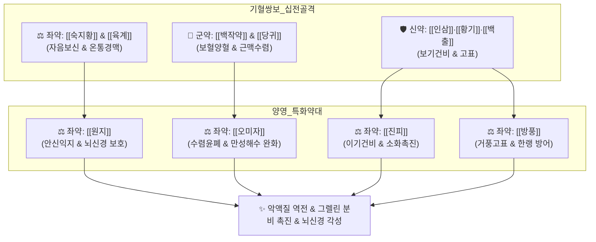

# 🍵 [[인삼양영탕]] (人蔘養榮湯, Insamyangyeong-tang / Ninjin'yoeito)

> **핵심 3줄 요약 (Key Summary)**:
> - 🌿 [[십전대보탕]]에서 흩뜨리는 천궁을 빼고 [[원지]]·[[오미자]]·[[진피]]·[[방풍]]을 가미 ([[백작약]]·[[당귀]]·[[인삼]]·[[황기]]·[[백출]]·[[복령]]·[[숙지황]]·[[육계]]·[[진피]]·[[원지]]·[[오미자]]·[[방풍]]·[[감초]]·[[생강]]·[[대추]]).
> - 🎯 입맛 없고 밥 안 먹으며 마르고 쇠약한 환자가 만성적으로 기침하고 뇌가 맑지 못해 불면·건망을 겪는 상태, 암 환자 악액질, 노인 쇠약증, 결핵 회복기.
> - 🔬 시상하부 및 위 점막 그렐린(Ghrelin) 분비 촉진을 통한 식욕 개선, 조혈모세포 자극 및 골수 억제 회복, 뇌 해마 콜린성 신경 활성화 및 근감소증 방지.
> - ⚠️ 주의사항: 숙지황·육계 함유로 고열·실열증 및 화농성 급성 염증기 복용 금기, 위장 극도 허약자는 식후 분복 지도.
---
## 📌 목차
1. [기본 처방 정보 & 군신좌사 구성](#1-기본-처방-정보--군신좌사-구성)
2. [방제학적 약재 상호작용 & 시너지 네트워크](#2-방제학적-약재-상호작용--시너지-네트워크)
3. [현대 분자약리학적 효능 & 작용 기전](#3-현대-분자약리학적-효능--작용-기전)
4. [적응 병증 및 체질별 감별 (Sweet Spot vs 금기)](#4-적응-병증-및-체질별-감별-sweet-spot-vs-금기)
5. [유사 처방군 감별 매트릭스](#5-유사-처방군-감별-매트릭스)
6. [임상 가감례 & 현대 질환별 응용](#6-임상-가감례--현대-질환별-응용)
7. [💡 사용자 진료실 핵심 필기 & 임상 팁 (원문 보존)](#7--사용자-진료실-핵심-필기--임상-팁-원문-보존)
8. [출처 및 학술 참고 문헌 (References)](#8-출처-및-학술-참고-문헌-references)
---
## 1. 기본 처방 정보 & 군신좌사 구성

* **출전**: 송대(宋代) 『[[태평혜민화제국방]](太平惠民和劑局方)』, 허준 『[[동의보감]](東醫寶鑑)』 잡병편 허로문(虛勞門)
* **치법**: 익기보혈(益氣補血), 양심안신(養心安神), 건비보폐(健脾補肺), 윤부고표(潤膚固表)

| 구분 | 약재명 | 표준 용량 | 본초 효능 & 방제 내 역할 |
| :--- | :--- | :--- | :--- |
| **군약 (君藥)** | [[백작약]] | 6g | 양혈유간(養血柔肝), 완급지통, 음혈을 채우고 긴장된 근맥을 수렴 |
| **신약 (臣藥)** | [[당귀]] | 6g | 보혈활혈(補血活血), 조경지통, 조혈 촉진 및 말초 미세혈행 개선 |
| **신약 (臣藥)** | [[인삼]] | 6g | 대보원기(大補元氣), 보비익폐, 전신 활력 증진 및 위 점막 재생 |
| **신약 (臣藥)** | [[황기]] | 6g | 보기승양(補氣升陽), 고표지한, 체표 면역 증강 및 식은땀 억제 |
| **신약 (臣藥)** | [[백출]] | 6g | 건비익기(健脾益氣), 조습이수, 비위 소화 흡수 기능 회복 |
| **좌약 (佐藥)** | [[복령]] | 4g | 건비삼습, 녕심안신(寧心安神), 불면과 두근거림 완화 |
| **좌약 (佐藥)** | [[숙지황]] | 4g | 자음보혈(滋陰補血), 익정전수, 골수와 진액 보충 |
| **좌약 (佐藥)** | [[육계]] | 3g | 보명문화, 온통경맥, 사지 냉감 해소 및 온양화기 |
| **좌약 (佐藥)** | [[진피]] | 3g | 이기건비(理氣健脾), 조습화담, 보혈약들의 소화 정체 예방 |
| **좌약 (佐藥)** | [[원지]] | 3g | 안신익지(安神益智), 거담개규, 뇌를 맑게 하고 수면 유도 |
| **좌약 (佐藥)** | [[오미자]] | 3g | 수렴고삽(收斂固澁), 익기생진, 폐기를 거두어 만성 기침 진정 |
| **좌약 (佐藥)** | [[방풍]] | 3g | 거풍승습, 표허로 인한 찬바람 외감 침입 방어 |
| **사약 (使藥)** | [[감초]] | 2g | 보기화중, 조화제약, 완급지통 |
| **사약 (使藥)** | [[생강]] | 3g | 온중화위, 식욕 증진 및 제약 흡수 보조 |
| **사약 (使藥)** | [[대추]] | 3g | 보비익기, 생강과 영위 조화 |

> **배오 특징**: [[십전대보탕]]에서 위로 기운을 흩뜨리는 [[천궁]]을 제거(去川芎)하고, 정신을 안정시키는 [[원지]], 폐기를 수렴하는 [[오미자]], 비위를 돕는 [[진피]], 체표를 방어하는 [[방풍]]을 가미하였습니다. 이로써 단순 기혈쌍보를 넘어 **호흡기계 만성 소모(기침·천식)와 신경계 쇠약(불면·건망·식욕부진)까지 동시에 해결하는 전신 영양(養榮)의 최고봉 방제**로 완성되었습니다.
---
## 2. 방제학적 약재 상호작용 & 시너지 네트워크

* [[인삼]] + [[백출]] + [[진피]] 배오: 끈적한 숙지황의 소화 장애를 막으면서 위 점막을 자극하여 식욕촉진 호르몬을 강력히 유도합니다.
* [[오미자]] + [[원지]] 배오: 오미자가 폐기를 수렴하여 마른기침을 잡고, 원지가 심신을 안정시켜 뇌의 멍함과 불면을 다스립니다.
---
## 3. 현대 분자약리학적 효능 & 작용 기전

### 1) 식욕 촉진(그렐린 분비) 및 암 환자 악액질(Cachexia) 개선
* 위장 점막의 엔도크린 세포를 자극하여 활성형 그렐린(Acylated Ghrelin) 분비를 촉진하고, 시상하부 섭식 중추를 활성화하여 식욕부진과 체중 감소를 극적으로 개선합니다.
* 골격근 단백질 분해 효소 복합체(Ubiquitin-Proteasome) 활성을 억제하여 고령 환자 및 만성 질환자의 근감소증(Sarcopenia)을 예방합니다.

### 2) 조혈모세포 자극 및 면역 활성화
* 골수 미세환경의 에리스로포이에틴(EPO) 감수성을 향상시켜 화학요법 후 적혈구·백혈구 생성을 촉진하며, 혈중 면역글로불린(IgG) 분비를 늘려 감염 저항력을 높입니다.

### 3) 뇌신경 가소성 증진 및 인지 기능 개선
* 해마 부위의 아세틸콜린(ACh) 분해를 억제하고 뇌혈류를 증대시켜 만성 쇠약으로 인한 브레인 포그(Brain fog)와 노인성 인지 저하를 유의하게 호전시킵니다.
---
## 4. 적응 병증 및 체질별 감별 (Sweet Spot vs 금기)

[✅ 최적 적응증 (Sweet Spot)]
• 원전 조문: 동의보감 — "治積耗憔悴, 氣血兩虛, 脾肺俱損, 咳嗽下氣, 驚悸健忘, 食少肌瘦." (기혈이 모두 허하여 수척해지고, 비폐가 손상되어 기침이 나고 가슴이 두근거리며 밥을 적게 먹고 마르는 것을 다스린다.)
• 체질 소견: 평소 마르고 기운이 없으며 소화기가 약하고 추위를 타는 소음인·태음인 만성 소모성 체질
• 임상 주치: 밥맛이 없어 식사를 거르고 살이 빠지며, 만성 기침·가래가 있고 머리가 멍하며 잠을 깊이 못 자는 환자, 항암치료 후 기력 고갈, 수술 후 회복 지연
• 설진/맥진: 설질담백(舌淡白), 설태박백(薄白) 또는 무태(無苔), 맥세약무력(脈細弱無力)

[⚠️ 신중 투여 및 금기 (Caution / Contraindication)]
• 급성 감염증 고열 환자 금기: 폐렴 초기, 급성 기관지염, 화농성 질환 등 사기가 왕성할 때 투여하면 사기를 체내에 가두어 병증 악화
• 위장 기능 극약자: 숙지황의 점체성으로 더부룩할 수 있으므로 식후 소량씩 온복 지도
---
## 5. 유사 처방군 감별 매트릭스

| 처방명 | 핵심 배오 차이 | 주치 및 임상 차별점 | 맥진/설진 차이 |
| :--- | :--- | :--- | :--- |
| [[인삼양영탕]] | 십전대보탕(천궁 제외) + [[원지]], [[오미자]], [[진피]], [[방풍]] | **식욕부진, 마르고 쇠약, 만성 기침, 불면, 뇌 멍함** | 맥세약무력, 설담소태 |
| [[십전대보탕]] | 팔물탕 + [[황기]], [[육계]] ([[천궁]] 포함) | **순수 기혈양허, 수술 후 회복, 창상 치유 지연** | 맥세약, 설담 |
| [[자음강화탕]] | 사물탕 + [[지모]], [[황백]], [[맥문동]] | **음허화왕, 오후 미열, 도한, 마른기침, 체온 상승** | 맥세삭(細數), 설홍소태 |
| [[귀비탕]] | 인삼, 황기, 당귀, 원지, 산조인, 용안육 | **심비양허, 사려과도, 불면, 불안, 건망증 위주** | 맥세약, 설담홍 |
---
## 6. 임상 가감례 & 현대 질환별 응용

* **수반 증상별 가감법**:
  * 소화불량 및 복부 팽만 심할 때 $\rightarrow$ + [[사인]], [[맥아]], [[신곡]]
  * 가래가 끓고 기침이 심할 때 $\rightarrow$ + [[행인]], [[패모]], [[자완]]
  * 수족 냉증이 극심할 때 $\rightarrow$ [[육계]] 증량 또는 + [[부자]]
* **현대 질환별 임상 매핑**:
  * **종양내과**: 항암 화학요법 후 악액질, 식욕부진, 골수 억제성 빈혈
  * **호흡기계**: 만성 폐쇄성 폐질환(COPD) 회복기, 만성 기관지염, 결핵 후유증
  * **노인의학**: 노인성 쇠약(Frailty), 근감소증, 알츠하이머 초기 인지 저하
---
## 7. 💡 사용자 진료실 핵심 필기 & 임상 팁 (원문 보존)

> [!tip] **진료실 실전 노하우 (User Clinical Insight)**
> ### 📌 구성
> [[적작약]], [[당귀]], [[숙지황]]/ [[인삼]], [[백출]], [[감초]]/ [[생강]], [[대추]]/ [[원지]], [[방풍]]/ [[황기]]/ [[오미자]], [[육계]], [[진피]]
> - [[계지탕]]([[적작약]], [[육계]], [[생강]], [[대추]], [[감초]])+[[황기]]=[[황기건중탕]]
> - [[황기건중탕]]+[[사물탕]]+[[사군자탕]]= [[십전대보탕]]
> - [[십전대보탕]]+[[오미자]], [[방풍]], [[원지]]
> 
> ### 📌 적응증
> - 입맛 없고, 밥 안먹고, 마르고 쇠한 사람이 만성적으로 기침하고, 뇌가 맑지 못해 잠도 잘 못자고 정신을 잘 못 차릴 때 사용
> - 천식, 가래와 기침이 많은 경우에 활용
> - 먼지 많거나 찬바람 들어가면 코 막히고 기침하는 경우에 활용
> - 입원한 만성 질환자에게 보약으로 활용
> - 양방약을 많이 먹어 혈류 순환은 빠른데, 활혈거어하고 싶을 때 응용
---
## 8. 출처 및 학술 참고 문헌 (References)

   - **[연구 요약]**: 인삼양영탕이 암 환자의 악액질(체중 감소, 식욕부진)을 억제하고 항암 화학요법으로 유발된 골수 억제 및 혈구 감소증을 유의하게 회복시킴을 입증.
2. * **Suzuki H et al. (2026)**. Ninjin'yoeito is associated with attenuation of postoperative decline in Prognostic Nutritional Index in patients with oral squamous cell carcinoma: a single-center, open-label, single-arm study. *Frontiers in nutrition*, 13: 1851978. [PMID: 42666240](https://pubmed.ncbi.nlm.nih.gov/42666240/)
3. **허준 (1613)**. 『[[동의보감]](東醫寶鑑)』.
   - **[고전 원전]**: "治積耗憔悴, 氣血兩虛, 脾肺俱損, 咳嗽下氣, 驚悸健忘, 食少肌瘦... 人蔘養榮湯主之."
