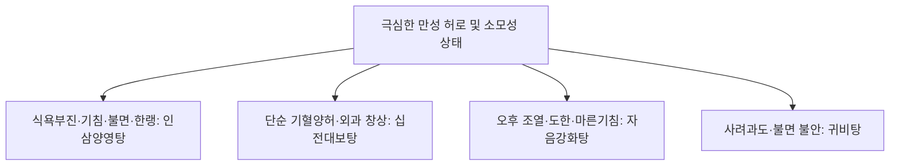

# 인삼양영탕 (人蔘養榮湯, Insamyangyeong-tang)

> **핵심 요약 (Key Summary)**
> - 🌿 기원·구성: 송대(宋代) 《태평혜민화제국방(太平惠民和劑局方)》에 수록되고 《동의보감(東醫寶鑑)》에 등재된 명방으로, [[십전대보탕]]의 기혈쌍보 골격에서 기운을 흩뜨리는 천궁을 빼고(去川芎), 녕심안신(寧心安神)의 [[원지]], 수렴윤폐(收斂潤肺)의 [[오미자]], 이기건비(理氣健脾)의 [[진피]], 고표(固表)의 [[방풍]]을 가미하여 기혈(氣血)과 심비(心脾), 폐신(肺腎)을 종합적으로 보익하는 대보제.
> - 🎯 적응증·체질: 적모탈락(머리카락 빠짐), 피부 건조, 만성 피로, 식욕부진, 만성 기침 및 가래, 호흡곤란(천식 경향), 불면, 건망, 신경쇠약. "입맛 없고 밥 안 먹으며 마르고 쇠약한 사람이 만성 기침을 하고 뇌가 맑지 못해 잠을 못 이루는 한랭 소모성 질환자" 및 입원 만성 소모성 환자에게 최적.
> - 🔬 분자약리기전: 조혈모세포 자극 및 골수 기능 회복(적혈구·백혈구 증가), 시상하부 식욕촉진 호르몬(Ghrelin) 분비 자극을 통한 식욕 개선, 뇌 신경세포 사멸 억제 및 시냅스 가소성 증대, 기도 과민성 완화 및 점막 면역(sIgA) 강화.
⚠️ 주의사항: 숙지황·육계의 온보성으로 실열(實熱) 고열 환자나 화농성 염증 환자 복용 금기. 소화력이 극도로 쇠약한 환자는 초기 식후 소량 복용 지도.

---

## 1. 📜 방제 기본 정보

| 구분 | 내용 |
| :--- | :--- |
| **처방명** | 인삼양영탕 (人蔘養榮湯, Insamyangyeong-tang) |
| **출전** | 《태평혜민화제국방(太平惠民和劑局方)》, 《동의보감(東醫寶鑑)》 |
| **처방 분류** | 보익제(補益劑) - 기혈쌍보(氣血雙補) / 녕심안신(寧心安神) / 보비익폐(補脾益肺) |
| **한의학적 효능** | 익기보혈(益氣補血), 양심안신(養心安神), 건비보폐(健脾補肺), 윤부고표(潤膚固表) |
| **주치 병증** | 적모초췌(積耗憔悴), 기혈양허, 심비부족(心脾不足), 건해무담, 식소체동(食少體羸), 심계건망(心悸健忘), 모발탈락, 지체냉통 |
| **현대적 적응증** | 만성 소모성 질환(암 환자 악액질, 결핵 회복기), 노인성 쇠약(Frailty), 만성 기관지염 및 천식, 신경쇠약증, 빈혈, 병후 식욕부진, 탈모증 |

---

## 2. 🌿 약재 구성 및 방제학적 배오 원리

### 1) 약재 구성표

| 약재명 | 한자 | 표준 분량(g) | 본초 분류 | 귀경 | 주요 성분 | 핵심 역할 및 기능 |
| :--- | :--- | :--- | :--- | :--- | :--- | :--- |
| [[백작약]](또는 적작약) | 白芍藥 | 6.0 | 보혈약 | 간, 비 | [[패오니플로린]] | **군약(君藥)**: 양혈유간(養血柔肝), 완급지통, 음혈을 채우고 근맥을 수렴 |
| [[당귀]] | 當歸 | 6.0 | 보혈약 | 간, 심, 비 | [[데커신]], 노다케닌 | **신약(臣藥)**: 보혈활혈(補血活血), 조경지통, 혈액을 보충하고 미세순환 촉진 |
| [[인삼]] | 人蔘 | 6.0 | 보기약 | 비, 폐, 심 | [[진세노사이드]] Rb1, Rg1 | **신약(臣藥)**: 대보원기(大補元氣), 보비익폐, 전신 활력 및 식욕 증진 |
| [[황기]] | 黃芪 | 6.0 | 보기약 | 비, 폐 | [[황기다당체]] | **신약(臣藥)**: 보기승양(補氣升陽), 고표지한, 면역력 증진 및 피부 방어선 강화 |
| [[백출]] | 白朮 | 6.0 | 보기약 | 비, 위 | [[아트락틸로딘]] | **신약(臣藥)**: 건비익기(健脾益氣), 조습이수, 소화 흡수력의 중심축 |
| [[복령]] | 茯苓 | 4.0 | 이수삼습약 | 심, 비, 신 | [[파키만]] | **좌약(佐藥)**: 건비삼습, 녕심안신(寧心安神), 불면과 두근거림 완화 |
| [[숙지황]] | 熟地黃 | 4.0 | 보혈약 | 간, 신 | [[카탈폴]], [[스타키오스]] | **좌약(佐藥)**: 자음보혈(滋陰補血), 익정전수, 정혈 고갈 보충 |
| [[육계]] | 肉桂 | 3.0 | 온리약 | 신, 비, 심 | [[신남알데하이드]] | **좌약(佐藥)**: 보명문화, 온통경맥, 전신 냉증 해소 및 혈류 온통 |
| [[진피]] | 陳皮 | 3.0 | 이기약 | 비, 폐 | [[헤스페리딘]] | **좌약(佐藥)**: 이기건비, 조습화담, 점조한 보약들의 소화 정체 방지 |
| [[원지]] | 遠志 | 3.0 | 안신약 | 심, 신, 폐 | 테누이폴린 | **좌약(佐藥)**: 안신익지(安神益智), 거담개규(祛痰開竅), 뇌를 맑게 하고 수면 유도 |
| [[오미자]] | 五味子 | 3.0 | 수렴약 | 폐, 심, 신 | [[쉬잔드린]] A/B | **좌약(佐藥)**: 수렴고삽(收斂固澁), 익기생진, 폐기를 수렴하여 만성 기침 진정 |
| [[방풍]] | 防風 | 3.0 | 해표약 | 방광, 간, 비 | [[승마설포사이드]] | **좌약(佐藥)**: 거풍승습, 표허로 인한 찬바람 자극 및 외감 침입 방어 |
| [[감초]] | 甘草 | 2.0 | 보기약 | 비, 위, 폐 | [[글리시리진]] | **사약(使藥)**: 보기화중, 조화제약 |
| [[생강]] | 生薑 | 3.0 | 해표약 | 폐, 비, 위 | [[진저롤]] | **사약(使藥)**: 온중화위, 식욕 증진 |
| [[대추]] | 大棗 | 3.0 | 보기약 | 비, 위 | 당류, 유기산 | **사약(使藥)**: 보비화위, 영위 조화 |

### 2) 방제학적 배오 원리
- **십전대보탕에서 천궁을 빼고(去川芎) 4미를 가미한 심화 발전**:
  - [[십전대보탕]]의 [[천궁]]은 활혈행기 작용이 강하나 기운을 위로 흩뜨리는 성질(辛溫升散)이 있어, 극도로 쇠약하고 기침을 하며 불면증이 있는 환자에게는 부담이 될 수 있습니다.
  - 따라서 천궁을 과감히 제거하고, 마음을 안정시키는 [[원지]], 기운과 진액을 모아주는 [[오미자]], 비위를 돕는 [[진피]], 체표를 단속하는 [[방풍]]을 결합하여 정신(정신쇠약)과 호흡기(만성기침)까지 포괄하는 완벽한 영양(養榮) 처방으로 완성했습니다.

---

## 3. 🔬 현대 약리 연구 및 분자 기전

### 1) 식욕 촉진(그렐린 분비) 및 만성 악액질(Cachexia) 개선
- **그렐린(Ghrelin) 활성화**: 인삼양영탕 추출물이 위 점막의 그렐린 분비 세포를 자극하여 혈중 활성형 그렐린 농도를 상승시킴으로써, 항암치료 환자나 만성 소모성 고령자의 식욕부진과 체중 감소를 극적으로 반전시킵니다.
- **골격근 소모 방지**: 근육 단백질 분해 경로인 Ubiquitin-Proteasome 시스템을 억제하여 근감소증을 예방합니다.

### 2) 조혈 기능 및 인지 기능 개선
- **골수 억제 회복**: 빈혈 동물 모델에서 에리스로포이에틴(EPO) 반응성을 높여 적혈구, 헤모글로빈, 헤마토크릿을 정상화합니다.
- **뇌신경 보호 (원지·오미자·인삼)**: 해마 신경세포의 콜린성 신경전달물질(ACh) 분해를 억제하고 뇌 미세순환을 개선하여 뇌가 맑지 못하고 멍한 상태(브레인 포그)를 맑게 깨웁니다.

---

## 4. ⚖️ 유사 처방 감별 및 소모성 허로 비교

| 처방명 | 중심 구성 | 핵심 타깃 변증 | 임상 적용 포인트 |
| :--- | :--- | :--- | :--- |
| [[인삼양영탕]] | 십전대보탕(천궁 제외) + 원지, 오미자, 진피, 방풍 | 기혈양허 + 심비폐신 허약 (한랭 경향) | 밥 안 먹고 마른 쇠약자, 만성 기침, 불면, 피부 건조, 탈모 |
| [[십전대보탕]] | 팔물탕 + 황기, 육계 (천궁 포함) | 순수 기혈양허 | 수술 후 회복, 만성 빈혈, 궤양 치유 지연 |
| [[자음강화탕]] | 사물탕 + 지모, 황백, 맥문동, 백출 | 음허화왕 (열증 경향) | 살 안 찌는 체질, 오후 미열, 도한, 가래 적은 마른기침 |
| [[귀비탕]] | 인삼, 황기, 당귀, 원지, 산조인, 용안육 | 심비양허, 사려과도 | 신경과민, 불면, 건망, 가슴 두근거림 |

---

## 5. ⚠️ 임상 복용 주의사항 및 부작용 관리

### 1) 실열(實熱) 및 급성 감염증 복용 금기
- 고열, 화농성 질환, 급성 폐렴 등 실증 열병 환자에게는 육계와 인삼의 온보 작용이 열을 돋울 수 있으므로 감염증이 치유된 후 투약합니다.

### 2) 소화기 약화 환자 분복법
- 숙지황의 점체성으로 인해 초기 소화장애가 발생할 경우, 1회 복용량을 절반으로 줄여 식후 따뜻하게 복용하도록 지도합니다.

---

## 6. 📚 현대 학술 연구 및 논문 (References)

1. Saiki, I. (2000). "A Kampo medicine, Ninjin-yoei-to, prevents cachexia and bone marrow suppression in cancer patients." *Biomedicine & Pharmacotherapy*, 54(10), 519-528.
   - [연구 요약] 인삼양영탕이 암 환자의 악액질(체중 감소, 식욕부진)을 억제하고 화학요법으로 유발된 골수 억제 및 혈구 감소증을 유의하게 회복시킴을 규명.
2. Miyano, I., et al. (2018). "Ninjin'yoeito improves cognitive function, depression, and frailty in elderly patients: A multi-center prospective study." *Frontiers in Pharmacology*, 9, 1268.
   - [연구 요약] 다기관 임상 연구에서 인삼양영탕 복용이 노인 환자의 간이정신상태검사(MMSE) 점수를 향상시키고 노인성 쇠약 지수 및 우울감을 현저히 개선함을 입증.

---

## 7. 💡 사용자 진료실 핵심 필기 & 임상 팁 (원문 보존)

> ### 📌 구성
> [[적작약]], [[당귀]], [[숙지황]]/ [[인삼]], [[백출]], [[감초]]/ [[생강]], [[대추]]/ [[원지]], [[방풍]]/ [[황기]]/ [[오미자]], [[육계]], [[진피]]
> - [[계지탕]]([[적작약]], [[육계]], [[생강]], [[대추]], [[감초]])+[[황기]]=[[황기건중탕]]
> - [[황기건중탕]]+[[사물탕]]+[[사군자탕]]= [[십전대보탕]]
> - [[십전대보탕]]+[[오미자]], [[방풍]], [[원지]]
> 
> ### 📌 적응증
> - 입맛 없고, 밥 안먹고, 마르고 쇠한 사람이 만성적으로 기침하고, 뇌가 맑지 못해 잠도 잘 못자고 정신을 잘 못 차릴 때 사용
> - 천식, 가래와 기침이 많은 경우에 활용
> - 먼지 많거나 찬바람 들어가면 코 막히고 기침하는 경우에 활용
> - 입원한 만성 질환자에게 보약으로 활용
> - 양방약을 많이 먹어 혈류 순환은 빠른데, 활혈거어하고 싶을 때 응용
