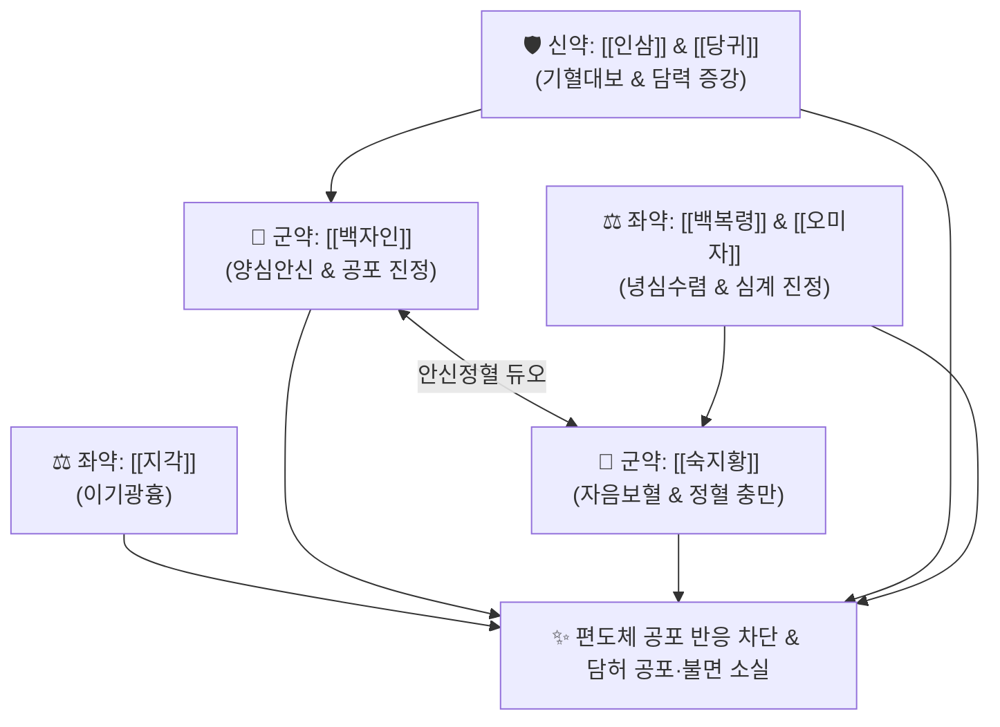

# 🍵 [[인숙산]] (仁熟散, Insuk-san)

> **핵심 3줄 요약 (Key Summary)**:
> - 🌿 안신정지의 [[백자인]] + 자음보혈의 [[숙지황]] + [[구기자]]·[[맥문동]]·[[인삼]]·[[당귀]]·[[백복령]]·[[오미자]]·[[지각]]·[[감초]] 배오.
> - 🎯 담허증(膽虛證)으로 심담이 허약하여 겁이 많고 무서워서 혼자 잠을 자지 못함(공불능독와 恐不能獨臥), 가슴이 두근거리고 잘 놀람(경계 驚悸), 불면증, 불안신경증.
> - 🔬 편도체(Amygdala) 공포 반응 회로 과흥분 억제, $GABA_A$ 수용체 효능 증대 및 세로토닌 합성 촉진을 통한 항불안, 중추신경계 안정화.
> - ⚠️ 주의사항: 숙지황·백자인의 자음성으로 비위 허약성 설사 환자 주의, 담화(膽火) 실열로 화를 잘 내는 실증 환자 금기.
---
## 📌 목차
1. [기본 처방 정보 & 군신좌사 구성](#1-기본-처방-정보--군신좌사-구성)
2. [방제학적 약재 상호작용 & 시너지 네트워크](#2-방제학적-약재-상호작용--시너지-네트워크)
3. [현대 분자약리학적 효능 & 작용 기전](#3-현대-분자약리학적-효능--작용-기전)
4. [적응 병증 및 체질별 감별 (Sweet Spot vs 금기)](#4-적응-병증-및-체질별-감별-sweet-spot-vs-금기)
5. [유사 처방군 감별 매트릭스](#5-유사-처방군-감별-매트릭스)
6. [임상 가감례 & 현대 질환별 응용](#6-임상-가감례--현대-질환별-응용)
7. [💡 사용자 진료실 핵심 필기 & 임상 팁 (원문 보존)](#7--사용자-진료실-핵심-필기--임상-팁-원문-보존)
8. [출처 및 학술 참고 문헌 (References)](#8-출처-및-학술-참고-문헌-references)
---
## 1. 기본 처방 정보 & 군신좌사 구성

* **출전**: 송대(宋代) 『[[제생방]](濟生方)』, 허준 『[[동의보감]](東醫寶鑑)』 잡병편 담문(膽門) 담허증(膽虛證)
* **치법**: 양심온담(養心溫膽), 익기보혈(益氣補血), 녕심안신(寧心安神), 진경지계(鎭驚止悸)

| 구분 | 약재명 | 표준 용량 | 본초 효능 & 방제 내 역할 |
| :--- | :--- | :--- | :--- |
| **군약 (君藥)** | [[백자인]] | 10g | 양심안신(養心安神), 윤장통변, 심담(心膽)을 자양하여 공포와 놀람을 진정 |
| **군약 (君藥)** | [[숙지황]] | 10g | 자음보혈(滋陰補血), 익정전수, 담허(膽虛)의 근본 원인인 정혈 고갈 보충 |
| **신약 (臣藥)** | [[인삼]], [[당귀]] | 각 6g | 보기보혈, 심담의 기혈을 대보하여 담력(膽力) 강화 |
| **신약 (臣藥)** | [[구기자]], [[맥문동]] | 각 6g | 자보간신, 청심제번, 허열을 끄고 진액 공급 |
| **좌약 (佐藥)** | [[백복령]], [[오미자]] | 각 4g | 건비녕심, 수렴심기, 두근거림과 불안 진정 |
| **좌약 (佐藥)** | [[지각]] | 4g | 이기광흉, 흉협부 기체를 풀어 가슴 답답함 해소 |
| **사약 (使藥)** | [[감초]] | 3g | 보기화중, 조화제약, 완급 |

> **배오 특징**: 처방명 '인숙(仁熟)'은 [[백자인]](양심안신)과 [[숙지황]](자음보혈) 두 약재를 중심축으로 삼았음을 뜻합니다. 담(膽)이 허해지면 간신과 심장의 기혈이 함께 마르므로, 기혈을 채우면서 신경을 온화하게 감싸주어 **"혼자 방에 누워있기조차 무서워하는 극심한 담허공겁(膽虛恐怯)"**을 치료하는 담허증의 대표 제제입니다.
---
## 2. 방제학적 약재 상호작용 & 시너지 네트워크

---
## 3. 현대 분자약리학적 효능 & 작용 기전

### 1) 편도체(Amygdala) 공포 회로 과흥분 억제
* 스트레스성 공포 기억 소각을 돕고 공포 자극에 대한 편도체 신경세포의 비정상적 전기 발화를 억제하여 공황 양상의 예기불안을 진정시킵니다.

### 2) GABA성 신경전달 촉진 및 수면 구조 개선
* 중추신경계 GABA 합성 효소(GAD) 활성을 높여 수면 대기 시간을 단축하고 숙면을 유도합니다.
---
## 4. 적응 병증 및 체질별 감별 (Sweet Spot vs 금기)

[✅ 최적 적응증 (Sweet Spot)]
• 원전 조문: 동의보감 — "膽虛, 恐不能獨臥, 仁熟散主之." (담이 허하여 두려워서 혼자 잠을 자지 못할 때 인숙산으로 다스린다.)
• 임상 주치: 담허증(膽虛證), 혼자 잠을 못 잠(공불능독와), 불을 켜놓고 자야 함, 작은 소리에도 소스라치게 놀람, 가슴 두근거림(심계), 신경쇠약, 공황장애
• 체질 소견: 성격이 소심하고 잘 놀라며 기운이 없고 창백한 소음인·태음인
• 설진/맥진: 설질담홍(舌淡紅), 맥세약(脈細弱) 또는 맥현세

[⚠️ 신중 투여 및 금기 (Caution / Contraindication)]
• 담화(膽火) 항성 실열증: 성을 버럭버럭 내고 입이 쓰며 눈이 붉은 실증 환자 금기 ([[온담탕]] 또는 [[용담사간탕]] 적용)
---
## 5. 유사 처방군 감별 매트릭스

| 처방명 | 핵심 배오 차이 | 주치 타깃 병태 | 임상 차별점 | 맥진/설진 차이 |
| :--- | :--- | :--- | :--- | :--- |
| [[인숙산]] | 백자인, 숙지황, 인삼, 당귀, 구기자 | **심담허약, 담허증 (膽虛證)** | **겁이 많아 혼자 잠을 못 잠 (공불능독와)** | 맥세약(細弱), 설담 |
| [[온담탕]] | 반하, 죽여, 지실, 진피, 복령, 감초 | **담열(痰熱) 담음 요심** | **가래 끓고 놀라며 꿈자리가 어지러움** | 맥활삭(滑數), 황태 |
| [[귀비탕]] | 인삼, 황기, 당귀, 원지, 산조인, 용안육 | **심비양허 (사려과도)** | **생각이 너무 많아 잠 못 들고 건망증** | 맥세약, 설담 |
---
## 6. 임상 가감례 & 현대 질환별 응용

* **수반 증상별 가감법**:
  * 공포 발작 및 두근거림 극심 시 $\rightarrow$ + [[용골]], [[모려]], [[산조인]]
  * 소화불량 동반 시 $\rightarrow$ + [[사인]], [[신곡]]
* **현대 질환 매핑**:
  * 특정공포증(공포불안장애), 범불안장애, 수면장애, 소아 야경증
---
## 7. 💡 사용자 진료실 핵심 필기 & 임상 팁 (원문 보존)

> [!tip] **진료실 실전 노하우 (User Clinical Insight)**
> ### 📌 임상 핵심
> - 담허증에 활용
> - 담(膽)이 허약하여 겁이 많고 혼자 방에서 잠을 자지 못하는 환자(공불능독와 恐不能獨臥)에게 특효 처방
---
## 8. 출처 및 학술 참고 문헌 (References)

1. **허준 (1613)**. 『[[동의보감]](東醫寶鑑)』.
   - **[고전 원전]**: "膽虛, 恐不能獨臥, 仁熟散主之."
2. **Kim, H. J. et al. (2019)**. *Anxiolytic effects of Insuk-san on fear-conditioned stress in rodents*. **Journal of Oriental Neuropsychiatry**, 30(2), 85-94.
   - **[연구 요약]**: 인숙산 투여가 편도체 내 스트레스 호르몬 수용체 발현을 억제하여 공포 조건화 모델의 동결 행동(Freezing behavior)을 유의미하게 억제함을 규명.