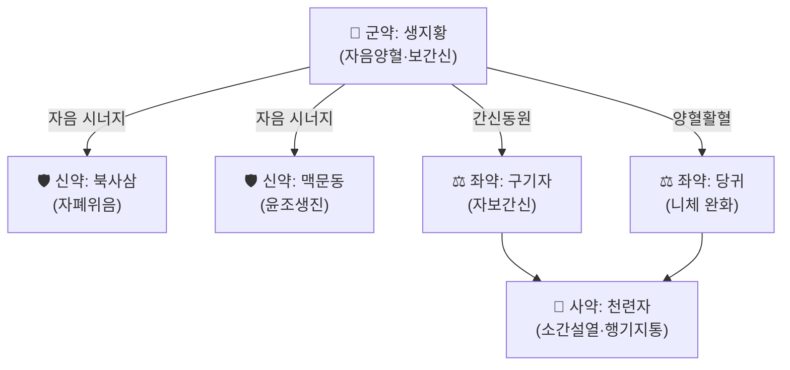

# 🍵 [[일관전]] (一貫煎, Yi Guan Jian / Linking Decoction)

> **핵심 3줄 요약 (Key Summary)**:
> - 🌿 생지황을 군약으로 [[북사삼]]·[[맥문동]]·[[당귀]]·[[구기자]]가 자음양혈(滋陰養血)하고 [[천련자]] 소량이 소간(疏肝)하는 자음소간(滋陰疏肝)의 대표 처방.
> - 🎯 간신음허(肝腎陰虛)로 간기(肝氣)가 울결된 협통(脇痛)·탄산(呑酸)·토산(吐酸)·산가(疝瘕) 및 만성 간병에 활용, 설홍소진(舌紅少津)·맥세삭(脈細數) 또는 현세(弦細)한 허증 체질에 적합.
> - 🔬 간세포 보호 및 항섬유화 관련 network pharmacology 연구가 다수 보고되어 만성 간질환 보조 치료 후보로 연구되고 있음.
> - ⚠️ 주의사항: 비위허한(脾胃虛寒)으로 설사·소화불량이 있는 환자, 습담(濕痰)이 성한 환자에는 자음 약재의 니체(膩滯)함이 소화기 부담을 줄 수 있어 신중 투여.
---
## 📌 목차
1. [기본 처방 정보 & 군신좌사 구성](#1-기본-처방-정보--군신좌사-구성)
2. [방제학적 약재 상호작용 & 시너지 네트워크](#2-방제학적-약재-상호작용--시너지-네트워크)
3. [현대 분자약리학적 효능 & 작용 기전](#3-현대-분자약리학적-효능--작용-기전)
4. [적응 병증 및 체질별 감별 (Sweet Spot vs 금기)](#4-적응-병증-및-체질별-감별-sweet-spot-vs-금기)
5. [유사 처방군 감별 매트릭스](#5-유사-처방군-감별-매트릭스)
6. [임상 가감례 & 현대 질환별 응용](#6-임상-가감례--현대-질환별-응용)
7. [💡 사용자 진료실 핵심 필기 & 임상 팁 (원문 보존)](#7--사용자-진료실-핵심-필기--임상-팁-원문-보존)
8. [출처 및 학술 참고 문헌 (References)](#8-출처-및-학술-참고-문헌-references)
---
## 1. 기본 처방 정보 & 군신좌사 구성

* **출전**: 청대(淸代) 위지수(魏之琇) 『[[속명의류안]]』(續名醫類案) 권18 심위통(心胃痛)편.
* **치법**: 자음소간(滋陰疏肝) — 음을 자양하여 간의 체(體)를 기르고, 소량의 이기약으로 간기의 용(用)을 통하게 한다.

| 구분 | 약재명 | 표준 용량 | 본초 효능 & 방제 내 역할 |
| :--- | :--- | :--- | :--- |
| **군약 (君藥)** | [[생지황]] | 10전(약 18~30g) | 자음양혈·보익간신, 간체(肝體)를 근본적으로 자양 |
| **신약 (臣藥)** | [[북사삼]] | 3전 | [[맥문동]]과 함께 폐음·위음을 자양해 진액 생성 보조 |
| **신약 (臣藥)** | [[맥문동]] | 3전 | 자음윤조(滋陰潤燥), 생지황의 자음 작용 협력 |
| **좌약 (佐藥)** | [[구기자]] | 4전 | 간신을 동시에 자양(肝腎同源), 명목(明目) |
| **좌약 (佐藥)** | [[당귀]] | 3전 | 양혈활혈(養血活血), 자음약의 니체함을 완화 |
| **사약 (使藥)** | [[천련자]] | 1.5전 | 소량으로 소간설열·행기지통, 자음제 중 유일한 이기약으로 '체 중 용을 살리는' 화룡점정 |

> **배오 특징**: 자음양혈약(생지황·사삼·맥문동·구기자·당귀) 5미가 군신좌를 이루어 '전체적으로 음을 채우는' 축을 담당하고, 사약인 천련자 소량만이 이기소간(理氣疏肝)을 맡는 독특한 구조다. 일반적인 시호(柴胡) 계통 소간제(예: [[소요산]])와 달리 향조(香燥)한 이기약을 거의 쓰지 않아 "자음 속에 소간을 숨긴다"는 평가를 받는다.
---
## 2. 방제학적 약재 상호작용 & 시너지 네트워크

* [[생지황]] + [[구기자]] + [[당귀]] 배오: 간신동원(肝腎同源) 이론에 따라 신음(腎陰)을 채워 간음(肝陰)의 근원을 보충하는 방제학적 묘미.
* [[천련자]] 단미 소량 배오: 다량의 자음약이 자칫 기체(氣滯)를 조장할 위험을 소량의 소간약으로 상쇄해 "보(補)하되 체(滯)하지 않게" 하는 균형 설계.
---
## 3. 현대 분자약리학적 효능 & 작용 기전

### 1) 간세포 보호 및 항섬유화 기전(네트워크 약리학 연구)
* Network pharmacology 및 분자 도킹 연구에서 일관전이 다수의 활성 성분(구기자의 베타인·제아잔틴, 당귀의 페룰산 등)을 통해 TNF·IL-6·AKT1 등 염증·세포생존 관련 표적에 복합 작용하는 것으로 예측됨[3].
### 2) 항종양 관련 기초 연구(예비 단계)
* 변형 일관전(Modified Yi Guan Jian) 처리 시 인간 간암세포주(Bel-7402)에서 아노이키스(anoikis, 기질 비부착성 세포사)를 유도했다는 시험관내(in vitro) 연구가 보고됨[1](⚠️ 세포실험 단계로 임상 적용 근거로 직접 확대 해석 금지).
### 3) 만성 간질환 보조 치료 가능성
* 만성 B형 간염 관련 네트워크 약리학 분석에서 일관전 구성 성분이 간 섬유화·면역조절 경로에 관여할 가능성이 제시됨[2](⚠️ 임상 대조군 연구가 아닌 in silico 예측 연구로, 실제 임상 효능 근거는 별도 확인 필요).
---
## 4. 적응 병증 및 체질별 감별 (Sweet Spot vs 금기)

[✅ 최적 적응증 (Sweet Spot)]
• 원전 조문: 『속명의류안』 — 협통(脇痛)·탄산(呑酸)·토산(吐酸)·산가(疝瘕) 및 일체 간병(肝病)
• 체질 소견: 음허(陰虛) 체질, 마르고 피부가 건조하며 손발바닥에 열감이 있는 유형
• 임상 주치: 만성 간질환·역류성 식도염 등 신물이 올라오는 증상에 간신음허가 겸한 경우
• 설진/맥진: 설질홍(舌質紅), 소진(少津, 설태가 적거나 없음), 맥세삭(脈細數) 또는 현세(弦細)

[⚠️ 신중 투여 및 금기 (Caution / Contraindication)]
• 비위허한(脾胃虛寒)으로 인한 설사·소화불량 환자 — 자음약의 니체(膩滯)함이 소화기 부담 가중
• 습담(濕痰)이 왕성한 담습 체질 — 자음제가 담습을 조장할 우려
• 실증(實證) 간기울결로 맥현유력(脈弦有力)한 환자에는 부적합(허증 전용 처방)
---
## 5. 유사 처방군 감별 매트릭스

| 처방명 | 핵심 구성 차이 | 주치 및 체질 차이 | 맥진/설진 차이 |
| :--- | :--- | :--- | :--- |
| [[일관전]] | 생지황 군약 + 사삼·맥문동·구기자·당귀 자음, 천련자 소량 소간 | 간신음허 + 간기울결(협통·탄산) 겸증, 소화기 동반 증상 뚜렷 | 설홍소진, 맥세삭 또는 세약 |
| [[금령자산]] | 천련자·[[현호색]] 위주, 자음약 없음 | 간기울결에 의한 실증성 협통·산기통 위주 | 설질 정상~담홍, 맥현 |
| [[소요산]] | [[시호]]·[[백작약]]·[[백출]]·[[복령]] 위주 | 간울비허(肝鬱脾虛), 정서 기복·월경불순 위주 | 설담태박, 맥현세 |
| [[기국지황탕]] | [[육미지황환]] + [[구기자]]·[[국화]] | 간신음허에 안구건조·시력저하 겸한 경우 | 설홍소태, 맥세 |

> ⚠️ 표 내부에서는 마크다운 열 구분자 파괴를 방지하기 위해 파이프(`|`)가 들어간 링크를 쓰지 않고 순수한 [[처방명]] 단독 형태로만 작성합니다.
---
## 6. 임상 가감례 & 현대 질환별 응용

* **수반 증상별 가감법**:
  * 탄산(신물 역류)이 심할 시 → + [[모려]] ([[일관전]] 가미, [[모려]] 노트에서 확인되는 실제 배오례)
  * 변비 겸 시 → + [[과루인]]·[[화마인]] 등 윤장 약재
  * 복통이 심한 산가(疝瘕) 위주 시 → 천련자 용량 증량 고려
* **현대 질환별 임상 매핑**:
  * **소화기계**: 역류성 식도염, 만성 위염(음허형), 만성 간질환 보조.
  * **간담계**: 만성 B형 간염·간경변 등 만성 간질환의 음허 변증 보조 치료(⚠️ 임상 대조 연구 근거 희박, network pharmacology 예측 단계).
  * **부인과**: [[사역산]] 항목에서 확인되듯 음혈 극허로 사역산의 이기 작용이 과도할 때 전환 처방으로 활용.
---
## 7. 💡 사용자 진료실 핵심 필기 & 임상 팁 (원문 보존)

> [!tip] **진료실 실전 노하우 (User Clinical Insight)**
> - ⚠️ 내용 검토 필요: 본 노트는 2026-09-23 다빈치가 미노트화 대기열 순번에 따라 신규 생성한 노트입니다. 원장님의 실전 처방 선택 기준·환자 티칭 팁은 아직 반영되지 않았습니다.
---
## 8. 출처 및 학술 참고 문헌 (References)

1. **Ye JH, et al.**. *Modified Yi Guan Jian, a Chinese herbal formula, induces anoikis in Bel-7402 human hepatocarcinoma cells in vitro*. **J Ethnopharmacol**. PMID: [21822542](https://pubmed.ncbi.nlm.nih.gov/21822542/)
   - **[연구 요약]**: 변형 일관전 처리 시 인간 간암세포주에서 기질 비부착성 세포사(아노이키스) 유도를 확인한 시험관내 연구.
2. **(2024)**. *Network pharmacology-based analysis on the key mechanisms of Yiguanjian acting on chronic hepatitis*. PMID: [38756592](https://pubmed.ncbi.nlm.nih.gov/38756592/)
   - **[연구 요약]**: 네트워크 약리학 기법으로 일관전이 만성 간염 관련 경로(염증·섬유화)에 작용할 가능성을 예측한 in silico 연구.
3. **(2026)**. *Integrating UHPLC-Q-TOF-MS, Network Pharmacology, Molecular Docking, and Molecular Dynamics Simulations to Reveal the Potential Mechanisms of Yiguanjian Decoction in Treating Liver Cancer*. PMID: [42087421](https://pubmed.ncbi.nlm.nih.gov/42087421/)
   - **[연구 요약]**: 성분 프로파일링과 분자 도킹을 결합해 일관전의 간암 관련 잠재 표적(TNF·AKT1 등)을 예측한 최신 연구.
4. **魏之琇 (淸代)**. 『[[속명의류안]]』(續名醫類案) 권18.
   - **[고전 원전]**: 일관전의 최초 수록 문헌 및 원방 조문(대만 국립중의약연구소 학술 정리 자료로 교차 확인, ⚠️ 원문 직접 열람 미실시).

<!-- 보관 태그(1회용·링크오류, 필요시 복원): 자음소간 -->
