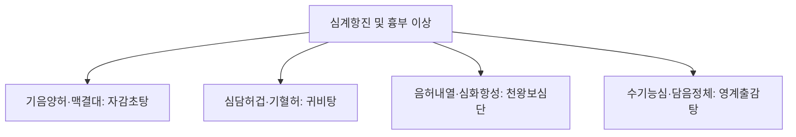

# 자감초탕 (炙甘草湯, Zhigancao-tang)

> **핵심 요약 (Key Summary)**
> - 🌿 기원·구성: 후한(後漢) 장중경(張仲景)의 《상한론(傷寒論)》에 수록된 처방으로, 맥을 회복시킨다는 뜻에서 복맥탕(復脈湯)으로도 불리며, 군약인 [[감초]](자감초)를 대량 사용하고 [[생지황]], [[맥문동]], [[아교]], [[마자인]], [[인삼]], [[계지]], [[생강]], [[대추]]를 청주(淸酒)와 함께 달여 음혈(陰血)을 자양하고 심양(心陽)을 온통(溫通)시키는 대표 방제.
> - 🎯 적응증·체질: 음혈부족(陰血不足) 및 심양허약(心陽虛弱)으로 인한 맥결대(脈結代, 부정맥·결손맥), 심동계(心動悸, 가슴 두근거림), 숨이 차고 어지러움(단기현훈), 불면, 도한, 구건인조, 허로폐위(마른기침, 객혈). 심근염, 심계항진 환자에게 최적.
> - 🔬 분자약리기전: 심근세포 막전위 안정화, $Na^+/K^+$-ATPase 펌프 활성 유지 및 $L\text{-type } Ca^{2+}$ 채널 조절을 통한 이소성 박동(Ectopic beat) 억제, 관상동맥 확장 및 항심근허혈, 활성산소 소거를 통한 심근세포 사멸 방지.
⚠️ 주의사항: 자감초 대량(12g 이상) 함유로 장기 투여 시 위알도스테론증(저칼륨혈증, 부종, 혈압 상승) 위험 주의. 생지황·아교의 점조성으로 비허습성(脾虛濕盛) 설사 환자 복용 주의.

---

## 1. 📜 방제 기본 정보

| 구분 | 내용 |
| :--- | :--- |
| **처방명** | 자감초탕 (炙甘草湯, Zhigancao-tang) / 복맥탕 (復脈湯) |
| **출전** | 《상한론(傷寒論)》 |
| **처방 분류** | 보익제(補益劑) - 기혈쌍보(氣血雙補) / 자음복맥(滋陰復脈) |
| **한의학적 효능** | 익기양혈(益氣養血), 자음복맥(滋陰復脈), 온통심양(溫通心陽), 윤폐지해(潤肺止咳) |
| **주치 병증** | 맥결대(脈結代), 심동계(心動悸), 허로폐위(虛勞肺痿), 구건설소(口乾舌燥), 대변비결, 체동단기(體羸短氣) |
| **현대적 적응증** | 부정맥(심방성·심실성 조기수축, 심방세동), 바이러스성 심근염 후유증, 관상동맥질환, 협심증 심계, 자율신경실조증, 만성 폐쇄성 폐질환 후기 마른기침 |

---

## 2. 🌿 약재 구성 및 방제학적 배오 원리

### 1) 약재 구성표

| 약재명 | 한자 | 표준 분량(g) | 본초 분류 | 귀경 | 주요 성분 | 핵심 역할 및 기능 |
| :--- | :--- | :--- | :--- | :--- | :--- | :--- |
| [[감초]](자감초) | 炙甘草 | 12.0 | 보기약 | 심, 비, 폐 | [[글리시리진]], [[리퀴리틴]] | **군약(君藥)**: 통심맥(通心脈), 익심기(益心氣), 심근 수축력 및 박동 조율의 중추 |
| [[생지황]] | 生地黃 | 24.0 | 청열양혈약 | 심, 간, 신 | [[카탈폴]], 레만닌 | **신약(臣藥)**: 자음양혈(滋陰養血), 생진윤조(生津潤燥), 대량 투여로 심혈(心血)의 물질적 기초 보충 |
| [[맥문동]] | 麥門冬 | 10.0 | 보음약 | 심, 폐, 위 | 오피오포고닌, 다당체 | **신약(臣藥)**: 양음윤폐(養陰潤肺), 청심제번(淸心除煩), 심음(心陰) 보강 및 심장 과열 진정 |
| [[아교]] | 阿膠 | 6.0 | 보혈약 | 폐, 간, 신 | 콜라겐 가수분해물, 아미노산 | **신약(臣藥)**: 보혈지혈(補血止血), 자음윤조(滋陰潤燥), 혈맥을 채우고 심근 손상 수복 (후하) |
| [[마자인]] | 麻子仁 | 8.0 | 사하약(윤하) | 비, 위, 대장 | 리놀레산, 올레산 | **좌약(佐藥)**: 윤장통변(潤腸通便), 자음윤조, 진액 부족으로 인한 변비 해소 |
| [[인삼]] | 人蔘 | 6.0 | 보기약 | 심, 비, 폐 | [[진세노사이드]] Rb1, Rg1 | **좌약(佐藥)**: 대보원기(大補元氣), 익기생혈(益氣生血), 감초와 함께 심기를 대보 |
| [[계지]] | 桂枝 | 8.0 | 해표약 | 심, 폐, 방광 | [[신남알데하이드]] | **좌약(佐藥)**: 온통심양(溫通心陽), 통달혈맥(通達血脈), 대량의 음약이 심양을 울체시키지 않도록 소통 |
| [[생강]] | 生薑 | 6.0 | 해표약 | 폐, 비, 위 | [[진저롤]], [[쇼가올]] | **사약(使藥)**: 온위화중(溫胃和中), 제약의 점조성 완화 및 소화기 보호 |
| [[대추]] | 大棗 | 6.0 | 보기약 | 비, 위 | 당류, 유기산 | **사약(使藥)**: 보비화위(補脾和胃), 영위 조화 |

> *특수 수치/전탕법: 전통적으로 물과 청주(淸酒)를 반씩 섞어 달이며, 이는 약효를 빠르게 심맥으로 퍼뜨리고 약재의 유효성분 추출을 극대화하기 위함입니다. [[아교]]는 탕액을 거른 후 녹여 복용(烊化)합니다.*

### 2) 방제학적 배오 원리
- **음양협조(陰陽協調)와 자음복맥(滋陰復脈)**: 자감초탕은 심장 질환의 병태를 '심음부족(心陰不足) + 심양허쇠(心陽虛衰)'로 파악합니다.
- **다량의 음혈 보충약과 온양통맥약의 절묘한 배오**: [[생지황]], [[맥문동]], [[아교]]의 대량 음약으로 심장의 진액과 혈을 가득 채우고, 소량의 [[계지]]와 생강이 심양을 온화하게 추동하여 "음(陰)이 충만하되 정체되지 않고, 양(陽)이 통하되 조열하지 않게" 박동을 정상 회복시킵니다.

---

## 3. 🔬 현대 약리 연구 및 분자 기전

### 1) 항부정맥(Anti-arrhythmic) 및 막전위 조절
- **이온 통로 조절**: 감초의 리퀴리티게닌과 인삼의 사포닌 복합체가 $K^+$ 외향 전류를 안정화하고, 비정상적인 칼슘 유입($Ca^{2+}$ overload)을 차단하여 심근의 불응기를 연장시키고 조기 박동을 억제합니다.
- **$Na^+/K^+$-ATPase 활성 회복**: 허혈성 심근 손상 시 저하되는 나트륨-칼륨 펌프 활성을 촉진하여 심근세포 내 이온 항상성을 복구합니다.

### 2) 심근세포 보호 및 항산화·항아포토시스
- **심근 허혈-재관류 손상 완화**: [[생지황]]의 카탈폴 및 [[맥문동]] 성분이 미토콘드리아 ROS(활성산소) 생성을 억제하고 Bcl-2/Bax 비율을 정상화하여 심근세포의 자멸사를 유의하게 차단합니다.
- **미세순환 촉진**: 관상동맥의 혈류 저항을 낮추고 심박출량을 정상화하여 심근 산소 요구량과 공급의 불균형을 해소합니다.

---

## 4. ⚖️ 유사 처방 감별 및 네트워크

| 처방명 | 중심 약재 구성 | 변증 및 핵심 타깃 병태 | 맥상 및 특징 |
| :--- | :--- | :--- | :--- |
| [[자감초탕]] | 자감초, 생지황, 맥문동, 아교, 계지 | 기혈음양 구허, 심맥실양(心脈失養) | 맥결대(脈結代, 서맥·부정맥), 심동계, 호흡곤란 |
| [[귀비탕]] | 인삼, 황기, 당귀, 원지, 산조인 | 심비양허(心脾兩虛), 사려과도 | 맥세약, 건망, 불면, 식욕부진 |
| [[천왕보심단]] | 생지황, 현삼, 단삼, 당귀, 백자인 | 심신불교(心腎不交), 음허화왕 | 맥세수, 조열도한, 구설생창, 심번 |
| [[영계출감탕]] | 복령, 계지, 백출, 감초 | 수음능심(水飮凌心), 비양부족 | 맥현, 심하역만, 기상충, 현훈 |

---

## 5. ⚠️ 임상 복용 주의사항 및 부작용 관리

### 1) 위알도스테론증(Pseudoaldosteronism) 모니터링
- [[감초]]가 1일 기준 고용량(12g 이상) 함유되어 있으므로, 고혈압 환자나 고령자에게 장기 연속 투여 시 부종, 저칼륨혈증, 혈압 상승이 유발될 수 있습니다. 정기적인 전해질 검사 및 혈압 측정이 권장됩니다.

### 2) 소화기 습체 및 설사 관리
- [[생지황]], [[아교]], [[맥문동]] 등 기름지고 차가운 자음성(滋陰性) 약재가 대량 포함되어 있어 비위가 차고 무른 변을 보는 환자에게는 소화불량 및 설사를 유발할 수 있습니다.
- 대처법: 생강 용량을 증량하거나 [[사인]], [[백출]]을 배오하고, 청주의 비율을 적절히 조절합니다.

---

## 6. 📚 현대 학술 연구 및 논문 (References)

1. Zhang, Y., et al. (2019). "Zhigancao Tang for the treatment of ventricular premature complexes: A systematic review and meta-analysis of randomized controlled trials." *Journal of Ethnopharmacology*, 239, 111904.
   - [연구 요약] 심실성 조기수축(VPC) 환자를 대상으로 한 메타분석에서 자감초탕 투여가 서양의학적 항부정맥제 대비 동등 이상의 유효율을 보이면서도 이상반응 발생률을 유의하게 낮춤을 확인.
2. Chen, M., et al. (2021). "Cardioprotective effects of Zhigancao Decoction against viral myocarditis through anti-apoptotic and anti-inflammatory pathways." *Phytotherapy Research*, 35(6), 3210-3222.
   - [연구 요약] 콕사키바이러스성 심근염 모델에서 자감초탕이 TNF-alpha, IL-6 생성을 억제하고 심근세포 아포토시스를 감소시켜 심실 재형성을 억제함을 규명.

---

## 7. 💡 사용자 진료실 핵심 필기 & 임상 팁 (원문 보존)

> ### 📌 구성
> [[인삼]] [[맥문동]] [[생지황]] [[아교]] 마인 [[계지]] [[생강]] [[대추]] [[감초]]
> 
> ### 📌 설명
> - 심근염이나 심폐 기능 이상으로 인한 부정맥, 숨이 막히고 어지러울 때 활용