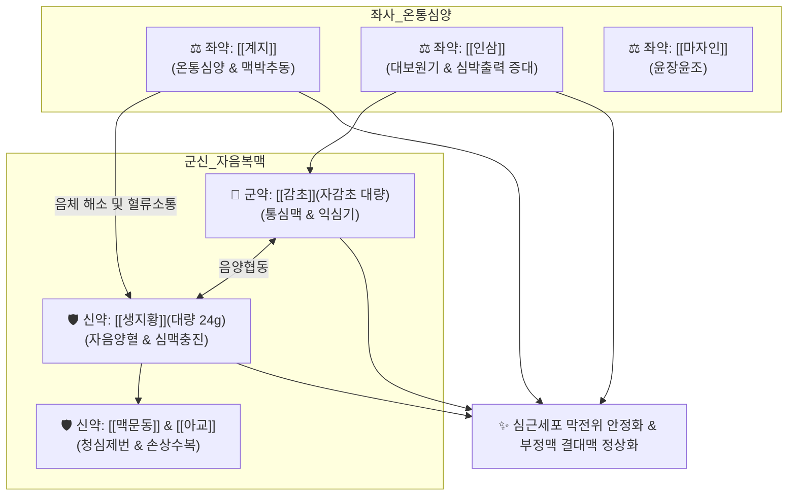

# 🍵 [[자감초탕]] (炙甘草湯, Zhigancao-tang / 복맥탕 復脈湯)

> **핵심 3줄 요약 (Key Summary)**:
> - 🌿 [[감초]](자감초, 군약 대량) + [[생지황]]·[[맥문동]]·[[아교]]·[[마자인]](음혈 자양) + [[인삼]]·[[계지]]·[[생강]]·[[대추]](심양 온통) 배오 (물과 청주를 동량 섞어 전탕).
> - 🎯 기혈음양 구허(俱虛)로 인한 맥결대(부정맥·결손맥), 심동계(심계항진·두근거림), 숨이 차고 어지러운 단기현훈, 바이러스성 심근염 후유증, 허로폐위(마른기침).
> - 🔬 심근세포 막전위 안정화, $Na^+/K^+$-ATPase 활성 회복, $L\text{-type } Ca^{2+}$ 과유입 억제 및 $K^+$ 외향 전류 촉진을 통한 이소성 박동(Ectopic beat) 차단.
> - ⚠️ 주의사항: 자감초 고용량 함유로 장복 시 위알도스테론증(저칼륨혈증, 부종, 혈압 상승) 모니터링 필요, 생지황·아교의 점체성으로 비허습성 설사 환자 주의.
---
## 📌 목차
1. [기본 처방 정보 & 군신좌사 구성](#1-기본-처방-정보--군신좌사-구성)
2. [방제학적 약재 상호작용 & 시너지 네트워크](#2-방제학적-약재-상호작용--시너지-네트워크)
3. [현대 분자약리학적 효능 & 작용 기전](#3-현대-분자약리학적-효능--작용-기전)
4. [적응 병증 및 체질별 감별 (Sweet Spot vs 금기)](#4-적응-병증-및-체질별-감별-sweet-spot-vs-금기)
5. [유사 처방군 감별 매트릭스](#5-유사-처방군-감별-매트릭스)
6. [임상 가감례 & 현대 질환별 응용](#6-임상-가감례--현대-질환별-응용)
7. [💡 사용자 진료실 핵심 필기 & 임상 팁 (원문 보존)](#7--사용자-진료실-핵심-필기--임상-팁-원문-보존)
8. [출처 및 학술 참고 문헌 (References)](#8-출처-및-학술-참고-문헌-references)
---
## 1. 기본 처방 정보 & 군신좌사 구성

* **출전**: 후한(後漢) 장중경(張仲景) 『[[상한론]](傷寒論)』 태양병편(太陽病篇) (별명: 복맥탕 復脈湯)
* **치법**: 익기양혈(益氣養血), 자음복맥(滋陰復脈), 온통심양(溫通心陽), 윤폐지해(潤肺止咳)

| 구분 | 약재명 | 표준 용량 | 본초 효능 & 방제 내 역할 |
| :--- | :--- | :--- | :--- |
| **군약 (君藥)** | [[감초]](자감초) | 12~16g | 통심맥(通心脈), 익심기(益心氣), 완급지통, 심근 수축력 및 박동 조율의 핵심 |
| **신약 (臣藥)** | [[생지황]] | 24~30g | 자음양혈(滋陰養血), 생진윤조, 대량 배오로 심혈과 진액의 물질적 원천 공급 |
| **신약 (臣藥)** | [[맥문동]] | 10~12g | 양음윤폐(養陰潤肺), 청심제번, 심장 과열 진정 및 폐음 보존 |
| **신약 (臣藥)** | [[아교]] | 6~8g | 보혈지혈(補血止血), 자음윤조, 심근 손상 수복 및 심맥 충진 (용화 烊化) |
| **좌약 (佐藥)** | [[인삼]] | 6~8g | 대보원기(大補元氣), 익기생혈, 감초와 합세하여 심기를 대보 |
| **좌약 (佐藥)** | [[계지]] | 6~8g | 온통심양(溫通心陽), 통달혈맥, 대량 음약들의 정체를 뚫어주고 맥동 촉진 |
| **좌약 (佐藥)** | [[마자인]] | 8~10g | 윤장통변(潤腸通便), 자음윤조, 진액 고갈로 인한 변비 해소 |
| **사약 (使藥)** | [[생강]] | 6~8g | 온위화중(溫胃和中), 음약의 소화 장애 방지 및 심양 보조 |
| **사약 (使藥)** | [[대추]] | 4~6개 | 보비화위(補脾和胃), 영위 조화 |

> **배오 특징**: 물과 청주(淸酒)를 반씩 섞어 달여 약효가 심맥으로 신속히 퍼지도록 합니다. [[생지황]]·[[맥문동]]·[[아교]] 등 대량의 자음약으로 심혈의 물질적 토대를 구축하고, 소량의 [[계지]]·[[생강]]으로 온양을 추동하여 **"음(陰)이 차되 체하지 않고, 양(陽)이 돌되 메마르지 않는 완벽한 음양 조화"**로 맥을 되살립니다(復脈).
---
## 2. 방제학적 약재 상호작용 & 시너지 네트워크

* [[생지황]] + [[자감초]] 배오: 심음과 심기를 동시에 채워 심장 근육의 전해질 고갈을 막는 근간이 됩니다.
* [[생지황]] + [[계지]] 배오: 음약이 지나쳐 심양을 가라앉히지 않도록 계지가 따뜻한 기운으로 혈맥을 열어 박동을 유지합니다.
---
## 3. 현대 분자약리학적 효능 & 작용 기전

### 1) 항부정맥 및 심근세포 막전위 정상화
* [[글리시리진]] 및 [[리퀴리틴]](감초)과 [[진세노사이드]](인삼) 복합물이 심근세포의 전위의존성 $Ca^{2+}$ 채널의 과도한 유입을 억제하여 칼슘 과부하로 인한 조기 수축을 차단합니다.
* $Na^+/K^+$-ATPase 활성을 유지하여 심근 세포막의 안정막전위를 회복시키고 활동전위 지속시간(APD)을 조율하여 심실성 및 심방성 조기박동을 억제합니다.

### 2) 심근 허혈-재관류 손상 보호 및 항염증
* [[카탈폴]](생지황) 성분이 미토콘드리아 내 활성산소(ROS) 생성을 억제하고 Bcl-2 단백질 발현을 촉진하여 허혈성 심근세포의 아포토시스를 억제합니다.
* 심근염 유발 사이토카인(TNF-α, IL-6)을 유의하게 감소시켜 심실 재형성을 억제합니다.
---
## 4. 적응 병증 및 체질별 감별 (Sweet Spot vs 금기)

[✅ 최적 적응증 (Sweet Spot)]
• 상한론 원문: "傷寒, 脈結代, 心動悸, 炙甘草湯主之." (상한에 맥이 뛰다 멎었다 하고 가슴이 두근거릴 때 자감초탕으로 다스린다.)
• 체질 소견: 기혈음양이 모두 쇠약해져 얼굴이 창백하고 마르며, 피로 시 가슴이 쿵쾅거리는 허약 체질
• 임상 주치: 심실성·심방성 조기수축, 심방세동, 서맥성 부정맥, 바이러스성 심근염 후 가슴 두근거림, 숨이 차고 어지러운 단기현훈, 만성 폐 질환의 마른기침
• 설진/맥진: 설질홍강(舌紅絳) 또는 담백(淡白), 설태소태(少苔) 혹은 무태, 맥결대(脈結代: 맥이 불규칙하게 건너뜀) 또는 맥세삭(細數), 맥허(虛)

[⚠️ 신중 투여 및 금기 (Caution / Contraindication)]
• 위알도스테론증 주의: 감초가 대량(12g 이상) 배오되어 1개월 이상 연속 복용 시 부종, 혈압 상승, 저칼륨혈증 발생 위험 $\rightarrow$ 고혈압 환자 추적 관찰
• 비허습성 설사 환자: 생지황, 아교, 마자인의 윤장·자음 작용으로 묽은 변이나 설사가 잦은 환자는 감량 또는 [[사인]], [[백출]] 배오
---
## 5. 유사 처방군 감별 매트릭스

| 처방명 | 핵심 배오 차이 | 주치 및 임상 차별점 | 맥진/설진 차이 |
| :--- | :--- | :--- | :--- |
| [[자감초탕]] | 자감초 대량, 생지황, 맥문동, 아교, 계지 | **기음양허, 맥결대(부정맥), 심동계, 호흡곤란** | 맥결대(結代), 설홍소태 |
| [[귀비탕]] | 인삼, 황기, 당귀, 원지, 산조인, 용안육 | **심비양허, 사려과도, 불면, 불안, 건망** | 맥세약(細弱), 설담태백 |
| [[천왕보심단]] | 생지황 대량, 현삼, 천문동, 단삼, 백자인 | **음허화왕, 번열, 도한, 구설생창, 심번** | 맥세삭(細數), 설홍유열 |
| [[영계출감탕]] | 복령, 계지, 백출, 감초 | **수음능심(담음), 심하역만, 현훈, 기립성 어지럼** | 맥현(弦), 설담태백활 |
---
## 6. 임상 가감례 & 현대 질환별 응용

* **수반 증상별 가감법**:
  * 소화불량 및 무른 변 발생 시 $\rightarrow$ [[생지황]] 감량 + [[사인]], [[백출]]
  * 가슴 통증(협심증 양상) 동반 시 $\rightarrow$ + [[단삼]], [[울금]]
  * 기허 무력증 두드러질 때 $\rightarrow$ [[인삼]] 증량 또는 + [[황기]]
* **현대 질환별 임상 매핑**:
  * **순환기계**: 심실성·심방성 조기수축(PVC, PAC), 심방세동(AF), 바이러스성 심근염 후유증, 관상동맥 허혈성 심계
  * **자율신경계**: 공황장애의 심계항진, 자율신경실조증
  * **호흡기계**: 만성 소모성 폐결핵 후기 마른기침, 폐섬유증의 단기(短氣)
---
## 7. 💡 사용자 진료실 핵심 필기 & 임상 팁 (원문 보존)

> [!tip] **진료실 실전 노하우 (User Clinical Insight)**
> ### 📌 구성
> [[인삼]] [[맥문동]] [[생지황]] [[아교]] 마인 [[계지]] [[생강]] [[대추]] [[감초]]
> 
> ### 📌 설명
> - 심근염이나 심폐 기능 이상으로 인한 부정맥, 숨이 막히고 어지러울 때 활용
---
## 8. 출처 및 학술 참고 문헌 (References)

1. **Zhang, Y. et al. (2019)**. *Zhigancao Tang for the treatment of ventricular premature complexes: A systematic review and meta-analysis of randomized controlled trials*. **Journal of Ethnopharmacology**, 239, 111904.
   - **[연구 요약]**: 심실성 조기수축(VPC) 환자 대상 메타분석에서 자감초탕 투여가 서양의학 항부정맥제 대비 동등 이상의 유효율을 보이면서 이상반응 발생률을 유의하게 낮춤을 확인.
2. **Chen, M. et al. (2021)**. *Cardioprotective effects of Zhigancao Decoction against viral myocarditis through anti-apoptotic and anti-inflammatory pathways*. **Phytotherapy Research**, 35(6), 3210-3222.
   - **[연구 요약]**: 콕사키바이러스성 심근염 모델에서 자감초탕이 TNF-α, IL-6 생성을 억제하고 심근세포 아포토시스를 줄여 심실 재형성을 유의미하게 억제함을 규명.
3. **장중경 (200년경)**. 『[[상한론]](傷寒論)』.
   - **[고전 원전]**: "傷寒, 脈結代, 心動悸, 炙甘草湯主之."