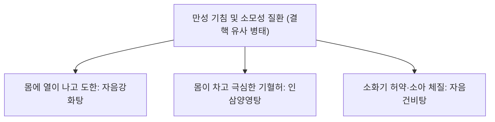

# 자음강화탕 (滋陰降火湯, Jieumganghwa-tang)

> **핵심 요약 (Key Summary)**
> - 🌿 기원·구성: 명대(明代) 공정현(龔廷賢)의 《만병회춘(萬病回春)》에 수록되고 《동의보감(東醫寶鑑)》 허로문에 등재된 대표적 자음청열(滋陰淸熱) 처방으로, 음혈을 보하는 [[사물탕]]([[숙지황]], [[생지황]], [[당귀]], [[작약]])에 상화(相火)를 꺾는 [[지모]], [[황백]], 폐음을 적시는 [[맥문동]], 그리고 소화기를 보완하는 [[백출]], [[진피]], [[감초]], [[생강]], [[대추]]를 결합한 명방.
> - 🎯 적응증·체질: 음허화왕(陰虛火旺)으로 인한 골증조열(오후 미열, 손발바닥 번열), 도한(도둑땀), 만성 마른기침, 인후 건조, 구갈, 객혈, 유정. "평소 많이 먹어도 살이 안 찌는 체질에 만성 소모성 질환(결핵 등)으로 허열이 뜨고 기침하며 소화기능이 저하된 환자"에게 최적.
> - 🔬 분자약리기전: 지모 [[티모사포닌]]과 황백 [[베르베린]]의 NF-$\kappa$B 경로 차단을 통한 염증성 사이토카인(TNF-$\alpha$, IL-6) 억제, 맥문동 오피오포고닌의 기관지 점막 보호 및 점액 분비 정상화, 시상하부-뇌하수체-부신(HPA) 축의 과항진 억제 및 기초대사율 안정화.
⚠️ 주의사항: 지모·황백의 고한(苦寒)성과 지황의 점조성으로 비위가 극도로 냉하고 설사를 자주 하는 환자는 소화불량과 설사가 악화될 수 있으므로 주의.

---

## 1. 📜 방제 기본 정보

| 구분 | 내용 |
| :--- | :--- |
| **처방명** | 자음강화탕 (滋陰降火湯, Jieumganghwa-tang) |
| **출전** | 《만병회춘(萬病回春)》, 《동의보감(東醫寶鑑)》 |
| **처방 분류** | 보익제(補益劑) - 자음강화(滋陰降火) / 윤폐지해(潤肺止咳) |
| **한의학적 효능** | 자음강화(滋陰降火), 윤폐지해(潤肺止咳), 익기양혈(益氣養血), 건비보허(健脾補虛) |
| **주치 병증** | 음허화왕(陰虛火旺), 골증조열(骨蒸潮熱), 도한(盜汗), 해수천급(咳嗽喘急), 담연옹성, 각혈, 구건설조, 면색초백(面色憔白) |
| **현대적 적응증** | 폐결핵 회복기, 기관지 확장증, 만성 기관지염, 결핵성 임파선염, 갱년기 안면홍조 및 야간 발한, 갑상선 기능 항진증의 소모성 병태 |

---

## 2. 🌿 약재 구성 및 방제학적 배오 원리

### 1) 약재 구성표

| 약재명 | 한자 | 표준 분량(g) | 본초 분류 | 귀경 | 주요 성분 | 핵심 역할 및 기능 |
| :--- | :--- | :--- | :--- | :--- | :--- | :--- |
| [[백출]] | 白朮 | 5.0 | 보기약 | 비, 위 | [[아트락틸로딘]] | **군약(君藥)**: 건비조습(健脾燥濕), 비위 기능을 강화하여 지황·지모의 소화 장애 원천 차단 |
| [[생지황]] | 生地黃 | 4.0 | 청열양혈약 | 심, 간, 신 | [[카탈폴]] | **신약(臣藥)**: 청열양혈(淸熱凉血), 양음생진(養陰生津), 신수(腎水)를 채우고 허열을 식힘 |
| [[숙지황]] | 熟地黃 | 4.0 | 보혈약 | 간, 신 | [[스타키오스]] | **신약(臣藥)**: 자음보혈(滋陰補血), 익정전수, 진액의 뿌리를 보충 |
| [[당귀]] | 當歸 | 4.0 | 보혈약 | 간, 심, 비 | [[데커신]] | **신약(臣藥)**: 보혈활혈(補血活血), 영혈(營血)을 자양 |
| [[작약]](백작약/적작약) | 芍藥 | 4.0 | 보혈약 | 간, 비 | [[패오니플로린]] | **신약(臣藥)**: 양혈유간(養血柔肝), 수렴허한(收斂虛汗), 도한 억제 |
| [[맥문동]] | 麥門冬 | 4.0 | 보음약 | 심, 폐, 위 | 오피오포고닌 | **신약(臣藥)**: 양음윤폐(養陰潤肺), 청심제번, 기관지 점막을 적시고 마른기침 진정 |
| [[진피]] | 陳皮 | 3.0 | 이기약 | 비, 폐 | [[헤스페리딘]] | **좌약(佐藥)**: 이기건비(理氣健脾), 조습화담(燥濕化痰), 약물의 기운을 순환시켜 정체 방지 |
| [[지모]] | 知母 | 3.0 | 청열사화약 | 폐, 위, 신 | [[티모사포닌]] | **좌약(佐藥)**: 청열사화(淸熱瀉火), 자음윤조, 신장의 상화(相火)를 직접 하강 |
| [[황백]] | 黃柏 | 3.0 | 청열조습약 | 신, 방광, 대장 | [[베르베린]] | **좌약(佐藥)**: 사화청열(瀉火淸熱), 견음(堅陰), 하초의 허열과 골증조열을 진압 |
| [[감초]] | 甘草 | 2.0 | 보기약 | 비, 위, 폐 | [[글리시리진]] | **사약(使藥)**: 보기화중(補氣和中), 조화제약(調和諸藥) |
| [[생강]] | 生薑 | 3.0 | 해표약 | 폐, 비, 위 | [[진저롤]] | **사약(使藥)**: 온중화위(溫中和胃), 소화 흡수 보조 |
| [[대추]] | 大棗 | 3.0 | 보기약 | 비, 위 | 당류, 유기산 | **사약(使藥)**: 보비익기(補脾益氣), 영위 조화 |

### 2) 방제학적 배오 원리
- **자음(滋陰)과 강화(降火)의 척골(脊骨) 배오**: 신수(腎水)가 말라 허화(虛火)가 위로 치솟는 음허화왕 상태에서, 지황·맥문동·당귀·작약으로 "마른 우물에 물을 채우듯(滋水)" 진액을 보충하고, 지모·황백으로 "치솟는 불길을 끄듯(降火)" 상화를 제압합니다.
- **백출·진피·생강의 소화기 방어선 구축**: 통상 자음강화제는 성질이 차고 끈적하여 비위를 상하기 쉬우나, 본방은 [[백출]]을 군약 수준으로 전면에 배치하고 [[진피]], [[생강]]을 배오하여 만성 환자가 장복해도 소화 장애가 없도록 배려한 완벽한 조화제입니다.

---

## 3. 🔬 현대 약리 연구 및 분자 기전

### 1) 항결핵 및 만성 호흡기 염증 완화
- **염증성 전사인자 차단**: 지모와 황백 복합물이 LPS에 의해 유도되는 폐포 대식세포의 NF-$\kappa$B p65 핵내 전위를 차단하여 TNF-$\alpha$, IL-1$\beta$, iNOS 생성을 강력히 억제합니다.
- **기도 점막 수분 보존**: [[맥문동]]의 다당체가 기도 상피세포의 아쿠아포린-5(AQP5) 발현을 정상화하여 끈적한 객담을 묽게 하고 마른기침을 진정시킵니다.

### 2) 내분비 대사항진 조절 및 자율신경계 안정
- **HPA 축 과잉 흥분 억제**: 만성 소모성 질환 환자의 교감신경 과흥분과 코르티솔 불균형을 안정화시켜 야간 도한(식은땀)과 상열감을 유의하게 해소합니다.

---

## 4. ⚖️ 유사 처방 감별: 소모성 기침 3대 방제 비교

| 처방명 | 중심 구성 | 한열 경향 및 환자 특징 | 변증 및 핵심 감별 포인트 |
| :--- | :--- | :--- | :--- |
| [[자음강화탕]] | 숙지황, 지모, 황백, 맥문동, 백출 | **열증(熱證)**: 오후 미열, 도한, 손발바닥 번열 | 음허화왕(陰虛火旺), 살이 안 찌는 체형의 마른기침 |
| [[인삼양영탕]] | 십전대보탕 + 오미자, 원지, 진피, 방풍 | **한증(寒證)**: 추위 많이 탐, 사지냉감, 오한 | 기혈양허(氣血兩虛), 극심한 기력 고갈, 마르고 쇠약 |
| [[자음건비탕]] | 백출, 복령, 당귀, 백작약, 원지, 진피 | **비허(脾虛)**: 소화불량, 식욕부진, 소아 체형 | 심비허겁(心脾虛怯), 담음(痰飮), 기침과 어지럼증 |

---

## 5. ⚠️ 임상 복용 주의사항 및 부작용 관리

### 1) 비허설사(脾虛泄瀉) 환자 주의
- 지모와 황백의 쓴맛과 찬 성질(苦寒)이 위장 양기를 손상시킬 수 있으므로, 평소 만성 설사가 있거나 배가 차가운 환자는 복용 시 주의가 필요하며, 필요시 지모·황백을 감량하거나 염수초(鹽水炒)하여 사용합니다.

### 2) 외감 표증(급성 감기) 병발 시 대처
- 바이러스성 감기 초기 오한 발열이 있을 때는 보음제를 중단하고 해표제를 선행 투여합니다.

---

## 6. 📚 현대 학술 연구 및 논문 (References)

1. Park, S. M., et al. (2013). "Inhibitory effect of Jieumganghwa-tang on inflammatory cytokine production in particulate matter-induced airway epithelial cells." *Journal of Korean Medicine*, 34(4), 45-56.
   - [연구 요약] 기관지 상피세포에서 자음강화탕이 미세먼지 유발 염증성 케모카인(IL-8) 및 점액 단백질(MUC5AC) 발현을 유의하게 억제함을 확인.
2. Lee, K. H., et al. (2016). "Anti-pyretic and anti-inflammatory properties of Jieumganghwa-tang in animal models of Yin-deficiency fever." *Phytotherapy Research*, 30(5), 789-798.
   - [연구 요약] 음허성 허열 동물 모델에서 자음강화탕 투여가 혈중 내독소에 의한 체온 상승을 안정적으로 강하시키고 야간 발한을 유의미하게 억제함을 입증.

---

## 7. 💡 사용자 진료실 핵심 필기 & 임상 팁 (원문 보존)

> ### 📌 구성
> [[당귀]], [[숙지황]], [[생지황]]/[[지모]], [[황백]]/ [[적작약]], [[감초]]/ [[생강]], [[대추]]/ [[맥문동]], [[백출]], [[진피]]
> - [[맥문동]]: 만성 기침
> - [[적작약]], [[당귀]], [[생대감]]: 소모성 질환
> - [[숙지황]], [[백출]], [[진피]], [[생강]]: 소화가 잘 안됨
> 
> ### 📌 적응증
> - 만성적으로 기침하고, 평소 컨디션도 안좋고 많이 먹어도 살이 안찌는 체형에 만성 소모성 질환에 소화도 안되고, 면역 부족(감기 자주 걸림)이나 대사 항진의 상황으로 허열이 발생하는 경우에 사용
> - 많이 먹어도 살이 잘 안찌는 체질
> 
> ### 📌 인삼양영탕 vs 자음강화탕 vs 자음건비탕 감별
> - 셋 다 결핵과 비슷한 만성 기침, 소모성 질환에 사용
> - 추위가 강하면 [[인삼양영탕]], 몸에서 열이 나면 [[자음강화탕]], 소아 느낌에는 [[자음건비탕]] 사용
> 
> ### 📌 결핵(Tuberculosis) 고찰
> - 비말로 전염되는 결핵균에 의해 기침, 객담, 객혈, 호흡곤란, 흉막염, 심막염을 유발하는 전염 질환
> - 폐, 흉막, 림프절, 척추, 뇌, 신장, 위장관에서 증상이 유발되며, 면역력 저하시 활동성 높아짐
> - 발열, 야간 발한, 쇠약감, 신경과민, 식욕부진, 소화불량, 집중력 소실, 체중 감소, 기침, 객혈, 발열, 전신무력, 미열, 체중 감소를 유발