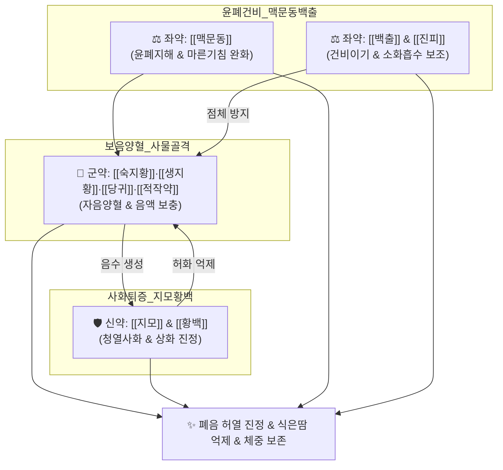

# 🍵 [[자음강화탕]] (滋陰降火湯, Jieumganghwa-tang)

> **핵심 3줄 요약 (Key Summary)**:
> - 🌿 [[사물탕]](보혈) + [[지모]]·[[황백]](사화 청열) + [[맥문동]]·[[백출]]·[[진피]]·[[생강]]·[[대추]]·[[감초]](윤폐건비) 배오 ([[당귀]]·[[숙지황]]·[[생지황]]·[[적작약]]·[[지모]]·[[황백]]·[[맥문동]]·[[백출]]·[[진피]]·[[감초]]·[[생강]]·[[대추]]).
> - 🎯 많이 먹어도 살이 찌지 않는 마른 체형, 오후 미열, 도한(야간 식은땀), 만성 마른기침, 인후 건조, 결핵 유사 만성 소모성 질환의 음허화왕(陰虛火旺) 증후군.
> - 🔬 기관지 점막 점액 분비 촉진(윤조), 염증성 사이토카인 및 활성산소 억제, 시상하부 체온조절 중추 안정화를 통한 허열 진정, 호중구 침윤 억제.
> - ⚠️ 주의사항: 지모·황백의 고한(苦寒)함과 지황의 점체성으로 비위 허한성 만성 설사 환자 주의, 소화불량 시 진피·사인 가미.
---
## 📌 목차
1. [기본 처방 정보 & 군신좌사 구성](#1-기본-처방-정보--군신좌사-구성)
2. [방제학적 약재 상호작용 & 시너지 네트워크](#2-방제학적-약재-상호작용--시너지-네트워크)
3. [현대 분자약리학적 효능 & 작용 기전](#3-현대-분자약리학적-효능--작용-기전)
4. [적응 병증 및 체질별 감별 (Sweet Spot vs 금기)](#4-적응-병증-및-체질별-감별-sweet-spot-vs-금기)
5. [유사 처방군 감별 매트릭스](#5-유사-처방군-감별-매트릭스)
6. [임상 가감례 & 현대 질환별 응용](#6-임상-가감례--현대-질환별-응용)
7. [💡 사용자 진료실 핵심 필기 & 임상 팁 (원문 보존)](#7--사용자-진료실-핵심-필기--임상-팁-원문-보존)
8. [출처 및 학술 참고 문헌 (References)](#8-출처-및-학술-참고-문헌-references)
---
## 1. 기본 처방 정보 & 군신좌사 구성

* **출전**: 명대(明代) 공정현(龔廷賢) 『[[만병회춘]](萬病回春)』, 허준 『[[동의보감]](東醫寶鑑)』 잡병편 화문(火門)
* **치법**: 자음강화(滋陰降火), 윤폐지해(潤肺止咳), 건비생진(健脾生津)

| 구분 | 약재명 | 표준 용량 | 본초 효능 & 방제 내 역할 |
| :--- | :--- | :--- | :--- |
| **군약 (君藥)** | [[백작약]](적작약) | 5g | 양혈유간(養血柔肝), 완급지통, 음혈을 수렴하고 허열을 진정 |
| **군약 (君藥)** | [[당귀]] | 5g | 보혈활혈(補血活血), 음혈 공급 및 미세순환 촉진 |
| **군약 (君藥)** | [[숙지황]] | 4g | 자음보혈(滋陰補血), 신수(腎水)를 채워 화(火)를 제어하는 기본 물질 |
| **신약 (臣藥)** | [[생지황]] | 4g | 청열양혈(淸熱凉血), 양음생진, 혈분의 열을 식히고 진액 보충 |
| **신약 (臣藥)** | [[지모]] | 3g | 청열사화(淸熱瀉火), 자음윤조, 폐·신(肺腎)의 허열을 내림 |
| **신약 (臣藥)** | [[황백]] | 3g | 청열조습(淸熱燥濕), 사화퇴증, 하초 상화(相火) 억제 (염수초 鹽水炒) |
| **좌약 (佐藥)** | [[맥문동]] | 4g | 양음윤폐(養陰潤肺), 청심제번, 만성 마른기침 진정 및 폐음 보존 |
| **좌약 (佐藥)** | [[백출]] | 4g | 건비익기(健脾益氣), 조습이수, 지황·지모의 소화 장애 방지 |
| **좌약 (佐藥)** | [[진피]] | 3g | 이기건비(理氣健脾), 조습화담, 담음 정체 억제 및 가래 배출 |
| **사약 (使藥)** | [[감초]] | 2g | 보기화중, 조화제약, 완급지통 |
| **사약 (使藥)** | [[생강]] | 3g | 온위화중, 식욕 증진 |
| **사약 (使藥)** | [[대추]] | 2개 | 보비익기, 생강과 영위 조화 |

> **배오 특징**: [[사물탕]](당귀·숙지황·생지황·작약)으로 메마른 음혈을 채우고, [[지모]]·[[황백]]으로 위로 치솟는 허화(虛火)를 꺾으며, [[맥문동]]으로 폐를 적시고, [[백출]]·[[진피]]로 비위 소화력을 방어하는 **자음(滋陰)과 강화(降火)의 절묘한 양면 배오**를 갖추었습니다.
---
## 2. 방제학적 약재 상호작용 & 시너지 네트워크

* [[지모]] + [[황백]] 배오: 신수(腎水)가 부족하여 치솟는 음허상화(陰虛相火)를 끌어내려 오후 미열과 도한을 신속히 가라앉힙니다.
* [[맥문동]] + [[백출]] + [[진피]] 배오: 맥문동이 기관지 건조를 적시고 백출과 진피가 소화관 흡수를 촉진하여 음약의 체기를 완전히 없앱니다.
---
## 3. 현대 분자약리학적 효능 & 작용 기전

### 1) 기도 염증 및 마른기침 억제
* [[맥문동]]의 오피오포고닌(Ophiopogonin) 성분이 기도 상피세포의 점액 분비를 조절하고 점막 표면의 점조도를 개선하여 이물감성 만성 자극 기침을 멎게 합니다.
* 폐 조직 내 호중구 침윤 및 염증성 매개물질(TNF-α, IL-6)을 억제하여 결핵 유사 만성 소모성 폐포 염증을 완화합니다.

### 2) 체온 조절 중추 안정화 및 해열
* [[지모]]의 망기페린(Mangiferin)과 [[황백]]의 베르베린(Berberine)이 시상하부 프로스타글란딘 $PGE_2$ 생성을 억제하여 오후만 되면 발생하는 미열(오후 조열)과 야간 발한(도한)을 진정시킵니다.

### 3) 만성 소모성 대사 항진 억제
* 자율신경계 교감신경 과흥분을 가라앉히고 갑상선 호르몬 또는 대사항진으로 인한 체단백 소모를 차단하여 마른 환자의 체중 유지를 돕습니다.
---
## 4. 적응 병증 및 체질별 감별 (Sweet Spot vs 금기)

[✅ 최적 적응증 (Sweet Spot)]
• 원전 조문: 만병회춘 — "治陰虛火動, 盜汗發熱, 咳嗽喘急, 羸瘦無力." (음허로 화가 동하여 도한과 발열이 있고, 기침이 나며 숨이 차고 여위어 힘이 없는 것을 다스린다.)
• 체질 소견: 많이 먹어도 살이 찌지 않고 마른 체형, 평소 피부가 건조하며 성격이 예민하고 붉은 얼굴빛(안면 홍조)을 띠는 음허화왕 체질
• 임상 주치: 만성 소모성 질환, 폐결핵 회복기, 오후 미열, 잠잘 때 흘리는 식은땀(도한), 입안이 바짝 마르는 구건, 가래 없이 목을 긁는 듯한 마른기침
• 설진/맥진: 설질홍(舌紅), 설소태(少苔) 또는 무태, 맥세삭(脈細數: 가늘고 빠른 맥)

[⚠️ 신중 투여 및 금기 (Caution / Contraindication)]
• 비위 허한 환자: 비위가 차고 평소 묽은 변을 보거나 소화력이 약한 환자는 지모·황백의 고한성으로 설사가 심해질 수 있으므로 신중 투여
• 찬바람 맞고 기침하는 외감 표한 환자: 오한과 맑은 콧물이 뚜렷한 표한 환자에게는 금기 ([[소청룡탕]] 적용)
---
## 5. 유사 처방군 감별 매트릭스

| 처방명 | 핵심 배오 차이 | 열감 및 체온 양상 | 주치 및 임상 차별점 | 맥진/설진 차이 |
| :--- | :--- | :--- | :--- | :--- |
| [[자음강화탕]] | 사물탕 + [[지모]], [[황백]], [[맥문동]] | **오후 미열, 도한, 체온 상승** | **마르고 살 안 찜, 결핵 유사 마른기침, 허화** | 맥세삭(細數), 설홍소태 |
| [[인삼양영탕]] | 십전대보탕(천궁 제외) + 원지, 오미자 | **추위 많이 탐(한랭 경향)** | **밥 안 먹고 극도로 쇠약, 기침, 불면, 건망** | 맥세약무력, 설담소태 |
| [[자음건비탕]] | 팔물탕 + 이진탕 + 맥문동, 원지 | **미열 없이 어지럼 위주** | **식소, 기운 없음, 두통, 현훈, 신경과민** | 맥현세(弦細), 백태 |
| [[청서익기탕]] | 보중익기탕 + 생맥산 계열 | **여름철 더위 먹음, 서열** | **비만 체형, 땀 과다, 권태, 설사** | 맥허대(虛大), 설태황니 |
---
## 6. 임상 가감례 & 현대 질환별 응용

* **수반 증상별 가감법**:
  * 소화 장애 및 더부룩함 심할 때 $\rightarrow$ [[생지황]] 감량 + [[사인]], [[백두구]]
  * 가래에 피가 비치거나 인후 작열감 심할 때 $\rightarrow$ + [[천문동]], [[패모]], [[백합]]
  * 식은땀(도한)이 극심할 때 $\rightarrow$ + [[모려]], [[부소맥]]
* **현대 질환별 임상 매핑**:
  * **호흡기계**: 만성 소모성 결핵 회복기, 기관지 확장증 마른기침, 만성 인두염
  * **내분비계**: 갑상선 기능 항진증의 체중 감소 및 도한, 갱년기 안면홍조 및 상열감
  * **전신질환**: 만성 소모성 피로 증후군, 미열 지속 상태
---
## 7. 💡 사용자 진료실 핵심 필기 & 임상 팁 (원문 보존)

> [!tip] **진료실 실전 노하우 (User Clinical Insight)**
> ### 📌 구성
> [[당귀]], [[숙지황]], [[생지황]]/[[지모]], [[황백]]/ [[적작약]], [[감초]]/ [[생강]], [[대추]]/ [[맥문동]], [[백출]], [[진피]]
> - [[맥문동]]: 만성 기침
> - [[적작약]], [[당귀]], [[생대감]]: 소모성 질환
> - [[숙지황]], [[백출]], [[진피]], [[생강]]: 소화가 잘 안됨
> 
> ### 📌 적응증
> - 만성적으로 기침하고, 평소 컨디션도 안좋고 많이 먹어도 살이 안찌는 체형에 만성 소모성 질환에 소화도 안되고, 면역 부족(감기 자주 걸림)이나 대사 항진의 상황으로 허열이 발생하는 경우에 사용
> - 많이 먹어도 살이 잘 안찌는 체질
> 
> ### 📌 인삼양영탕 vs 자음강화탕 vs 자음건비탕 감별
> - 셋 다 결핵과 비슷한 만성 기침, 소모성 질환에 사용
> - 추위가 강하면 [[인삼양영탕]], 몸에서 열이 나면 [[자음강화탕]], 소아 느낌에는 [[자음건비탕]] 사용
> 
> ### 📌 결핵(Tuberculosis) 고찰
> - 비말로 전염되는 결핵균에 의해 기침, 객담, 객혈, 호흡곤란, 흉막염, 심막염을 유발하는 전염 질환
> - 폐, 흉막, 림프절, 척추, 뇌, 신장, 위장관에서 증상이 유발되며, 면역력 저하시 활동성 높아짐
> - 발열, 야간 발한, 쇠약감, 신경과민, 식욕부진, 소화불량, 집중력 소실, 체중 감소, 기침, 객혈, 발열, 전신무력, 미열, 체중 감소를 유발
---
## 8. 출처 및 학술 참고 문헌 (References)

2. **공정현 (1587)**. 『[[만병회춘]](萬病回春)』.
   - **[고전 원전]**: "治陰虛火動, 盜汗發熱, 咳嗽喘急, 羸瘦無力, 滋陰降火湯主之."
3. **허준 (1613)**. 『[[동의보감]](東醫寶鑑)』.
   - **[임상 문헌]**: 허로로 인하여 화가 동하고 도한이 나며 기침하는 음허화왕의 제1 표준 처방으로 수록.
