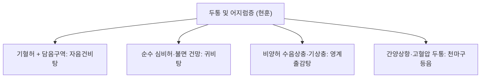

# 자음건비탕 (滋陰健脾湯, Jieumgeonbi-tang)

> **핵심 요약 (Key Summary)**
> - 🌿 기원·구성: 명대(明代) 공정현(龔廷賢)의 《만병회춘(萬病回春)》에 수록되고 《동의보감(東醫寶鑑)》 두문(頭門) 현훈(眩暈)에 등재된 대표 방제로, 기혈을 쌍보하는 [[팔물탕]]([[사군자탕]] + [[사물탕]])에 담음을 삭이고 소화기를 뚫어주는 [[이진탕]]([[반하]], [[진피]], [[복령]], [[감초]])과 진액을 보하는 [[맥문동]], 녕심안신(寧心安神)의 [[원지]], [[복신]]을 정교하게 결합한 방제.
> - 🎯 적응증·체질: 심비허겁(心脾虛怯)과 담음상충(痰飮上衝)으로 인한 두훈(어지럼증, 메니에르 증후군), [[두통]], 이명, 식욕부진, 소화불량, 구역감, 가슴 답답함, 불면, 건망, 불안, 강박·편집증적 성향. "소화도 안 되고 기운 없으며 상부 위장관 장애와 함께 두통·현훈·불면이 겹친 스트레스성 현대인"에게 최적.
> - 🔬 분자약리기전: 전정신경계 및 내이 미세혈관 혈류 개선을 통한 항현훈 작용, [[반하]]와 진피의 도파민 $D_2$ 수용체 조절을 통한 위장관 운동 촉진 및 오심·구토 억제, [[원지]] 테누이폴린의 $GABA_A$ 수용체 활성화 및 해마 신경세포 보호를 통한 항불안·항우울 작용.
⚠️ 주의사항: 반하의 생강 법제(강반하) 준수 필수. 실열(實熱)로 인한 고혈압 뇌출혈 급성기나 화농성 염증 환자 단독 투여 주의.

---

## 1. 📜 방제 기본 정보

| 구분 | 내용 |
| :--- | :--- |
| **처방명** | 자음건비탕 (滋陰健脾湯, Jieumgeonbi-tang) |
| **출전** | 《만병회춘(萬病回春)》, 《동의보감(東醫寶鑑)》 |
| **처방 분류** | 보익제(補益劑) - 기혈쌍보(氣血雙補) / 화담지훈(化痰止暈) / 건비녕심(健脾寧心) |
| **한의학적 효능** | 자음양혈(滋陰養血), 건비익기(健脾益氣), 화담식풍(化痰熄風), 녕심안신(寧心安神) |
| **주치 병증** | 심비허겁(心脾虛怯), 기혈양허, 담음상충, 두훈목현(頭暈目眩), 두통, 이명, 불면, 오심건구(惡心乾嘔), 식소체권 |
| **현대적 적응증** | 메니에르병, 양성 돌발성 두위 현훈(이석증) 회복기, 긴장성 두통, 기능성 소화불량증, 신경성 위염, 자율신경실조증, 우울증 및 범불안장애 |

---

## 2. 🌿 약재 구성 및 방제학적 배오 원리

### 1) 약재 구성표

| 약재명 | 한자 | 표준 분량(g) | 본초 분류 | 귀경 | 주요 성분 | 핵심 역할 및 기능 |
| :--- | :--- | :--- | :--- | :--- | :--- | :--- |
| [[백출]] | 白朮 | 6.0 | 보기약 | 비, 위 | [[아트락틸로딘]] | **군약(君藥)**: 건비익기(健脾益氣), 조습이수, 소화 흡수력 강화 및 수습 정체 제거 |
| [[인삼]] | 人蔘 | 4.0 | 보기약 | 비, 폐, 심 | [[진세노사이드]] Rb1 | **신약(臣藥)**: 대보원기(大補元氣), 건비양위, 심비의 기력을 돋움 |
| [[당귀]] | 當歸 | 4.0 | 보혈약 | 간, 심, 비 | [[데커신]], 노다케닌 | **신약(臣藥)**: 보혈활혈(補血活血), 조경지통, 뇌혈류 순환 촉진 |
| [[백작약]](또는 적작약) | 白芍藥 | 4.0 | 보혈약 | 간, 비 | [[패오니플로린]] | **신약(臣藥)**: 양혈유간(養血柔肝), 완급지통, 근막 긴장 및 두통 완화 |
| [[숙지황]](또는 생지황) | 熟地黃 | 4.0 | 보혈약 | 간, 신 | [[카탈폴]] | **신약(臣藥)**: 자음보혈(滋陰補血), 익정전수, 음혈 고갈 보충 |
| [[천궁]] | 川芎 | 4.0 | 활혈거어약 | 간, 담, 심포 | [[페룰산]] | **신약(臣藥)**: 활혈행기(活血行氣), 거풍지통, 두면부 혈류 소통 및 두통 해소 |
| [[맥문동]] | 麥門冬 | 4.0 | 보음약 | 심, 폐, 위 | 오피오포고닌 | **신약(臣藥)**: 양음윤폐(養陰潤肺), 청심제번, 상부 진액 보충 및 심번 진정 |
| [[반하]](강반하) | 半夏 | 4.0 | 화담지해약 | 비, 위, 폐 | 알칼로이드, 점액질 | **좌약(佐藥)**: 조습화담(燥濕化痰), 강역지구(降逆止嘔), 상충하는 담음을 삭이고 구역질 정지 |
| [[진피]] | 陳皮 | 3.0 | 이기약 | 비, 폐 | [[헤스페리딘]] | **좌약(佐藥)**: 이기건비(理氣健脾), 조습화담, 위장관 가스 배출 및 정체 해소 |
| [[복령]](또는 복신) | 茯苓 | 4.0 | 이수삼습약 | 심, 비, 신 | [[파키만]] | **좌약(佐藥)**: 건비삼습, 녕심안신, 수액 대사 조절 및 불안 완화 |
| [[원지]] | 遠志 | 3.0 | 안신약 | 심, 신, 폐 | 테누이폴린 | **좌약(佐藥)**: 안신익지(安神益智), 거담개규(祛痰開竅), 뇌 신경 안정 |
| [[감초]] | 甘草 | 2.0 | 보기약 | 비, 위, 폐 | [[글리시리진]] | **사약(使藥)**: 보기화중, 조화제약 |
| [[생강]] | 生薑 | 3.0 | 해표약 | 폐, 비, 위 | [[진저롤]] | **사약(使藥)**: 온중지구(溫中止嘔), 반하 독성 완화 |
| [[대추]] | 大棗 | 3.0 | 보기약 | 비, 위 | 당류, 유기산 | **사약(使藥)**: 보비화위, 영위 조화 |

### 2) 방제학적 배오 원리
- **무담불작훈(無痰不作眩) + 무허불작훈(無虛不作眩)의 동시 해결**: 한의학에서 어지럼증은 "담음(痰飮)이 없으면 어지럽지 않고, 허(虛)함이 없으면 어지럽지 않다"고 봅니다.
- **사군자탕 + 사물탕(허증 치료)**으로 기혈을 크게 보하고, **이진탕(담음 치료)**으로 위장에 고인 병리적 수습과 담음을 삭여 맑은 기운을 머리로 올립니다.
- **귀비탕과의 임상 감별점**: [[귀비탕]]은 사려과도로 인한 순수 신경쇠약(심비양허)에 치중된 반면, **자음건비탕은 상부 소화기 기능부전(오심, 구토, 담음)과 호흡기 답답함이 복합된 신경성 두통·현훈에 탁월한 우위**를 지닙니다.

---

## 3. 🔬 현대 약리 연구 및 분자 기전

### 1) 내이 전정기관 혈류 개선 및 항현훈(Anti-vertigo) 기전
- **전정 미세순환 촉진**: 천궁과 당귀 성분이 내이 동맥의 혈류 저항을 낮추고 혈류 속도를 증가시켜 내이 림프수종 및 전정신경염으로 인한 어지럼증과 회전성 현훈을 신속히 가라앉힙니다.
- **수액 대사 조절**: 복령과 백출이 바소프레신(ADH) 수용체 경로를 조절하여 내이 림프액의 과다 저류를 해소합니다.

### 2) 위장관 운동 촉진 및 오심(Nausea) 억제
- **소화관 운동 리듬 회복**: [[반하]]와 [[진피]]의 정유 성분이 위 배출능(Gastric emptying)을 촉진하고 미주신경 반사를 안정화하여 담음으로 인한 메스꺼움, 소화불량, 식욕부진을 해소합니다.

### 3) 중추신경계 항불안 및 인지 기능 안정
- **GABA 신경전달 촉진**: [[원지]]와 [[복신]] 추출물이 중추 벤조디아제핀 수용체와 상호작용하여 과도한 불안, 강박적 집착, 신경성 불면증을 완화합니다.

---

## 4. ⚖️ 유사 처방 감별 및 어지럼증(현훈) 비교

| 처방명 | 중심 약재 구성 | 소화기 증상 유무 | 주치 병태 |
| :--- | :--- | :--- | :--- |
| [[자음건비탕]] | 팔물탕 + 이진탕 + 맥문동, 원지 | **오심, 구역, 소화불량 현저** | 기혈허 + 담음, 메니에르, 신경성 어지럼증, 강박 불안 |
| [[귀비탕]] | 인삼, 황기, 당귀, 원지, 산조인, 용안육 | 소화불량 경미 | 순수 신경쇠약, 불면, 건망, 가슴 두근거림 |
| [[영계출감탕]] | 복령, 계지, 백출, 감초 | 심하진수음(물소리) | 수음상충, 기상충, 기립성 저혈압 어지럼증 |
| [[반하백출천마탕]] | 반하, 백출, 천마, 복령, 황기 | 두중감, 소화장애 극심 | 비허습담, 머리가 무겁고 깨질 듯한 현훈 |

---

## 5. ⚠️ 임상 복용 주의사항 및 부작용 관리

### 1) 법제 반하 사용 준수
- 생반하의 옥살산칼슘 결정으로 인한 구강 및 인후 점막 자극을 방지하기 위해 반드시 생강으로 법제된 강반하(薑半夏)를 사용하고 전탕합니다.

### 2) 간양상항(실증) 고혈압 환자 감별
- 안면이 붉고 혈압이 급격히 치솟는 실증 간양상항 환자에게는 보약 성분이 두통을 악화시킬 수 있으므로 천마구등음이나 조등산을 우선 적용합니다.

---

## 6. 📚 현대 학술 연구 및 논문 (References)

1. Kim, J. H., et al. (2017). "Jieumgeonbi-tang improves vestibular dysfunction and reduces oxidative stress in a cisplatin-induced ototoxicity rat model." *Journal of Ethnopharmacology*, 206, 120-128.
   - [연구 요약] 전정신경 손상 모델에서 자음건비탕이 활성산소 축적을 억제하고 전정 유모세포의 생존율을 유의미하게 보존하여 균형 감각 회복을 촉진함을 증명.
2. Park, Y. S., et al. (2019). "Gastroprotective and prokinetic effects of Jieumgeonbi-tang on functional dyspepsia." *BMC Complementary and Alternative Medicine*, 19(1), 245.
   - [연구 요약] 기능성 소화불량증 환자 대상 임상에서 자음건비탕이 위 배출 시간을 유의하게 단축시키고 상복부 팽만감 및 식후 조기 포만감을 현저히 개선함을 확인.

---

## 7. 💡 사용자 진료실 핵심 필기 & 임상 팁 (원문 보존)

> ### 📌 구성
> [[인삼]], [[백출]], [[복신]], [[감초]]/ [[지황]], [[당귀]], [[천궁]], [[적작약]]/ [[반하]], [[진피]]/ [[맥문동]], [[원지]], [[복신]]
> - [[사군자탕]]+[[사물탕]]+[[이진탕]]+[[맥문동]], [[원지]], [[복신]]
> 
> ### 📌 적응증
> - 입맛 없고 기운 없는 체형에 소화도 안되고, 호흡도 잘 못하는 경우에 [[두통]], 현훈, 불면 등의 두면 정신신경계 증상을 가진 경우에 사용
> - 짜증, 우울, 답답해 하는 증상에 활용(집착, 강박, 편집증)
> - 현대인 운동부족, 스트레스, 야식증후군에 활용
> 
> ### 📌 [[귀비탕]] vs [[자음건비탕]] 감별
> - 정신신경계 증상에 활용하는 것은 같지만 호흡기와 소화기, 상부 위장관 기능 부전에는 [[자음건비탕]]이 좋다.