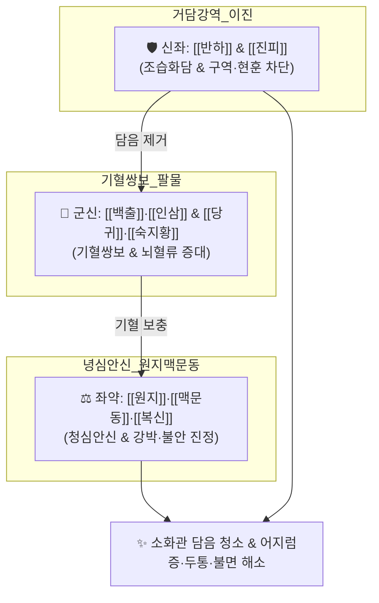

# 🍵 [[자음건비탕]] (滋陰健脾湯, Jieumgeonbi-tang)

> **핵심 3줄 요약 (Key Summary)**:
> - 🌿 [[팔물탕]](기혈쌍보) + [[이진탕]](거담순기) + [[맥문동]]·[[원지]]·[[복신]](자음안신) 배오 ([[인삼]]·[[백출]]·[[복령]]·[[감초]]·[[숙지황]]·[[당귀]]·[[천궁]]·[[적작약]]·[[반하]]·[[진피]]·[[맥문동]]·[[원지]]·[[생강]]·[[대추]]).
> - 🎯 입맛 없고 기운 없는 체형에 소화불량과 호흡 곤란이 겹치고, [[두통]]·현훈(어지럼증)·불면증 등 두면부 정신신경계 증상, 짜증·우울·강박증을 호소하는 환자.
> - 🔬 세로토닌(5-HT) 및 GABAergic 신경계 조절을 통한 항불안·항우울, 뇌혈류 개선 및 전정신경계 안정화(항현훈), 위장관 연동운동 정상화(담음 제거).
> - ⚠️ 주의사항: 숙지황·반하 함유로 급성 위염이나 심한 위점막 출혈 환자 주의, 실열(實熱)로 인한 극심한 두통·고열 환자 금기.
---
## 📌 목차
1. [기본 처방 정보 & 군신좌사 구성](#1-기본-처방-정보--군신좌사-구성)
2. [방제학적 약재 상호작용 & 시너지 네트워크](#2-방제학적-약재-상호작용--시너지-네트워크)
3. [현대 분자약리학적 효능 & 작용 기전](#3-현대-분자약리학적-효능--작용-기전)
4. [적응 병증 및 체질별 감별 (Sweet Spot vs 금기)](#4-적응-병증-및-체질별-감별-sweet-spot-vs-금기)
5. [유사 처방군 감별 매트릭스](#5-유사-처방군-감별-매트릭스)
6. [임상 가감례 & 현대 질환별 응용](#6-임상-가감례--현대-질환별-응용)
7. [💡 사용자 진료실 핵심 필기 & 임상 팁 (원문 보존)](#7--사용자-진료실-핵심-필기--임상-팁-원문-보존)
8. [출처 및 학술 참고 문헌 (References)](#8-출처-및-학술-참고-문헌-references)
---
## 1. 기본 처방 정보 & 군신좌사 구성

* **출전**: 명대(明代) 공정현(龔廷賢) 『[[만병회춘]](萬病回春)』, 허준 『[[동의보감]](東醫寶鑑)』 잡병편 현훈문(眩暈門)
* **치법**: 자음보혈(滋陰補血), 건비거담(健脾祛痰), 화위화중(和胃和中), 안신정지(安神定志)

| 구분 | 약재명 | 표준 용량 | 본초 효능 & 방제 내 역할 |
| :--- | :--- | :--- | :--- |
| **군약 (君藥)** | [[백출]] | 5g | 건비익기(健脾益氣), 조습이수, 비위 기능 강화 및 담음 생성 원천 차단 |
| **군약 (君藥)** | [[당귀]] | 5g | 보혈활혈(補血活血), 조경지통, 뇌혈류 공급 및 간혈 보충 |
| **신약 (臣藥)** | [[인삼]] | 4g | 대보원기(大補元氣), 보비익폐, 전신 활력 및 소화 흡수력 증진 |
| **신약 (臣藥)** | [[숙지황]] | 4g | 자음보혈(滋陰補血), 익정전수, 정혈 보충 및 뇌수 충진 |
| **신약 (臣藥)** | [[적작약]] | 4g | 양혈유간(養血柔肝), 완급지통, 근맥 수렴 및 신경 흥분 완화 |
| **좌약 (佐藥)** | [[천궁]] | 3g | 활혈행기(活血行氣), 거풍지통, 뇌혈관 연축 완화 및 두통 해소 |
| **좌약 (佐藥)** | [[복령]](복신) | 4g | 건비삼습, 녕심안신(寧心安神), 불면과 두근거림 진정 |
| **좌약 (佐藥)** | [[반하]] | 3g | 조습화담(燥濕化痰), 강역지구(降逆止嘔), 상부 위장관 담음 및 구역감 제거 |
| **좌약 (佐藥)** | [[진피]] | 3g | 이기건비(理氣健脾), 조습화담, 기체(氣滯) 해소 및 트림 완화 |
| **좌약 (佐藥)** | [[맥문동]] | 3g | 양음윤폐(養陰潤肺), 청심제번, 허열을 식히고 진액 보존 |
| **좌약 (佐藥)** | [[원지]] | 3g | 안신익지(安神益智), 거담개규, 강박·불안 해소 및 수면 유도 |
| **사약 (使藥)** | [[감초]] | 2g | 보기화중, 조화제약, 완급지통 |
| **사약 (使藥)** | [[생강]] | 3g | 온위화중, 강역지구, 반하 독성 제어 |
| **사약 (使藥)** | [[대추]] | 2개 | 보비익기, 생강과 영위 조화 |

> **배오 특징**: [[팔물탕]](사군자탕 + 사물탕)의 기혈쌍보 체계에 [[이진탕]](반하·진피·복령·감초)의 담음 제거 체계, 그리고 [[맥문동]]·[[원지]]·[[복신]]의 자음안신 체계를 융합하여 **소화관의 정체된 담음(속쓰림·메스꺼움)을 쳐내면서 두면부 뇌신경계의 어지럼증과 불면을 동시에 치료**하는 기혈담음(氣血痰飮) 복합 처방입니다.
---
## 2. 방제학적 약재 상호작용 & 시너지 네트워크

* [[반하]] + [[진피]] 배오: 위장관에 정체된 습담(濕痰)이 위로 치솟아 머리를 흔들고 어지럽게 하는 담훈(痰暈)을 아래로 끌어내립니다.
* [[원지]] + [[복신]] + [[맥문동]] 배오: 심담허겁(心膽虛怯)으로 불안하고 가슴이 답답하며 잠들지 못하는 신경성 증상을 온화하게 진정시킵니다.
---
## 3. 현대 분자약리학적 효능 & 작용 기전

### 1) 전정신경계 안정화 및 뇌 미세순환 개선 (항어지럼증)
* [[천궁]]의 천궁락톤 및 [[당귀]]의 정유 성분이 뇌혈관 연축을 풀고 뇌저동맥(Basilar artery) 및 내이 전정계 혈류량을 증대시켜 기립성 및 이석성 어지럼증을 개선합니다.
* [[반하]] 추출물이 화학수용체 유발대(CTZ) 및 전정핵의 과흥분을 억제하여 메스꺼움과 멀미 양상의 현훈을 차단합니다.

### 2) 신경전달물질(GABA, Serotonin) 조절 및 항불안·항강박
* [[원지]]의 테누이폴린(Tenuifolin)과 [[복신]]의 트리테르펜 성분이 중추신경계 $GABA_A$ 수용체 결합능을 향상시키고 세로토닌 경로를 조절하여 강박적 집착, 짜증, 만성 우울 및 불면증을 완화합니다.

### 3) 상부 위장관 운동성 촉진
* [[진피]](헤스페리딘)와 [[백출]](아트락틸로딘)이 위 배출능을 촉진하고 소화관 평활근의 협조 운동을 정상화하여 조기 만복감과 복부 팽만감을 해소합니다.
---
## 4. 적응 병증 및 체질별 감별 (Sweet Spot vs 금기)

[✅ 최적 적응증 (Sweet Spot)]
• 원전 조문: 동의보감 — "治氣血俱虛, 痰飮上逆, 眩暈, 眉稜骨痛, 惡心嘔吐." (기혈이 모두 허하고 담음이 위로 치밀어 어지럽고 눈썹뼈가 아프며 구역질이 나는 것을 다스린다.)
• 체질 소견: 평소 마르고 기운이 없으며 신경이 예민하고, 밥을 조금만 먹어도 체하며 운동 부족에 시달리는 수험생 및 직장인
• 임상 주치: 어지럼증(현훈), 눈썹 주변 및 관자놀이 두통, 불면증, 가슴 답답함, 식욕부진, 메스꺼움, 강박·불안증
• 설진/맥진: 설질담홍(舌淡紅), 설태백니(白膩: 하얗고 미끈한 이끼), 맥현세(脈弦細) 혹은 맥유활(脈濡滑)

[⚠️ 신중 투여 및 금기 (Caution / Contraindication)]
• 간양상항(肝陽上亢)성 실증 고혈압 두통: 얼굴이 붉고 눈이 충혈되며 혈압이 180 이상 치솟는 실열 두통에는 금기 ([[천마구등음]], [[용담사간탕]] 적용)
• 급성 위궤양 출혈기 주의
---
## 5. 유사 처방군 감별 매트릭스

| 처방명 | 핵심 배오 차이 | 주치 타깃 및 소화기 증상 | 임상 차별점 | 맥진/설진 차이 |
| :--- | :--- | :--- | :--- | :--- |
| [[자음건비탕]] | 팔물탕 + [[이진탕]] + 맥문동, 원지 | **식소, 기운 없음, 메스꺼움, 두통, 어지럼증** | **상부 위장관 담음 + 어지럼증·불면 동반** | 맥현세(弦細), 백니태 |
| [[귀비탕]] | 인삼, 황기, 당귀, 원지, 산조인, 용안육 | **식욕부진은 있으나 메스꺼움 적음** | **사려과도, 순수 심비양허, 불면·불안·건망** | 맥세약(細弱), 설담 |
| [[반하백출천마탕]] | 이진탕 + [[천마]], 백출 | **비허습담 위주 (보혈 작용 약함)** | **극심한 회전성 어지럼증, 메스꺼움, 두중감** | 맥현활(弦滑), 백후니태 |
| [[자음강화탕]] | 사물탕 + [[지모]], [[황백]] | **오후 미열, 도한, 기침 위주** | **소모성 결핵 유사 질환, 음허화왕** | 맥세삭(細數), 설홍소태 |
---
## 6. 임상 가감례 & 현대 질환별 응용

* **수반 증상별 가감법**:
  * 회전성 어지럼증이 심할 때 $\rightarrow$ + [[천마]], [[택사]]
  * 가슴 답답함과 한숨, 매핵기 동반 시 $\rightarrow$ + [[향부자]], [[소엽]]
  * 불면증 및 악몽이 극심할 때 $\rightarrow$ + [[산조인]], [[용골]], [[모려]]
* **현대 질환별 임상 매핑**:
  * **신경정신과**: 범불안장애, 강박증(OCD), 신경성 불면증, 신체형 장애
  * **이비인후과**: 메니에르병, 이석증 후유 현훈, 전정신경염 회복기 어지럼증
  * **소화기계**: 기능성 소화불량증, 담적증후군, 야식증후군 후유 소화장애
---
## 7. 💡 사용자 진료실 핵심 필기 & 임상 팁 (원문 보존)

> [!tip] **진료실 실전 노하우 (User Clinical Insight)**
> ### 📌 구성
> [[인삼]], [[백출]], [[복신]], [[감초]]/ [[지황]], [[당귀]], [[천궁]], [[적작약]]/ [[반하]], [[진피]]/ [[맥문동]], [[원지]], [[복신]]
> - [[사군자탕]]+[[사물탕]]+[[이진탕]]+[[맥문동]], [[원지]], [[복신]]
> 
> ### 📌 적응증
> - 입맛 없고 기운 없는 체형에 소화도 안되고, 호흡도 잘 못하는 경우에 [[두통]], 현훈, 불면 등의 두면 정신신경계 증상을 가진 경우에 사용
> - 짜증, 우울, 답답해 하는 증상에 활용(집착, 강박, 편집증)
> - 현대인 운동부족, 스트레스, 야식증후군에 활용
> 
> ### 📌 [[귀비탕]] vs [[자음건비탕]] 감별
> - 정신신경계 증상에 활용하는 것은 같지만 호흡기와 소화기, 상부 위장관 기능 부전에는 [[자음건비탕]]이 좋다.
---
## 8. 출처 및 학술 참고 문헌 (References)

1. **Park, J. H. et al. (2015)**. *Effects of Jieumgeonbi-tang on chronic stress-induced anxiety and depression in mice*. **Journal of Oriental Neuropsychiatry**, 26(3), 265-274.
   - **[연구 요약]**: 만성 스트레스 부하 동물 모델에서 자음건비탕 투여가 혈중 코르티코스테론 상승을 억제하고 세로토닌 수용체 발현을 정상화하여 우울 및 불안 행동을 유의하게 완화함을 입증.
2. **공정현 (1587)**. 『[[만병회춘]](萬病回春)』.
   - **[고전 원전]**: "治氣血虛損, 痰飮所致, 頭目眩暈, 眉稜骨痛, 惡心嘔吐, 滋陰健脾湯主之."
3. **허준 (1613)**. 『[[동의보감]](東醫寶鑑)』.
   - **[임상 문헌]**: 허로와 담음이 겸하여 어지럽고 머리가 아프며 소화가 안 되는 병증의 표준 방제로 수록.