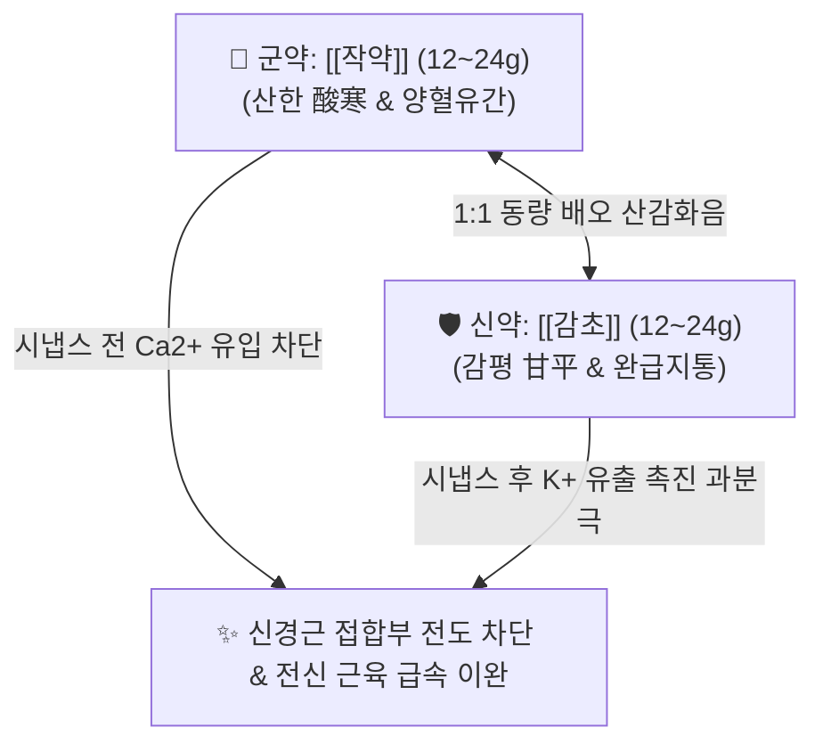

# 🍵 [[작약감초탕]] (芍藥甘草湯, Shakuyakukanzoto)

> **핵심 3줄 요약 (Key Summary)**:
> - 🌿 [[작약]](백작약/적작약) + [[감초]](자감초) 배오 (1:1 동량 배오로 산감화음 酸甘化陰을 이루어 체내 진액을 급속 생성하고 근맥을 이완시키는 지통의 성방 聖方).
> - 🎯 하지 비복근 경련(종아리 쥐남), 급격한 골격근 연축, 소화관 평활근 연축(위경련, 복통), 요로·담도 결석 산통, 월경통, 안면신경 연축, 대장내시경 전후 장관 진경.
> - 🔬 [[패오니플로린]]의 세포 내 $Ca^{2+}$ 유입 차단(액틴-마이오신 결합 억제) + [[글리시리진]]/[[글리시레티닉산]]의 $K^+$ 유출 촉진(세포막 과분극 Hyperpolarization)을 통한 신경근 시냅스 차단.
> - ⚠️ 주의사항: 감초 고용량 배오로 2~4주 이상 장복 시 위알도스테론증(저칼륨혈증, 부종, 혈압 상승) 위험 크므로 급성기 단기 돈복(頓服) 원칙 준수.
---
## 📌 목차
1. [기본 처방 정보 & 군신좌사 구성](#1-기본-처방-정보--군신좌사-구성)
2. [방제학적 약재 상호작용 & 시너지 네트워크](#2-방제학적-약재-상호작용--시너지-네트워크)
3. [현대 분자약리학적 효능 & 작용 기전](#3-현대-분자약리학적-효능--작용-기전)
4. [적응 병증 및 체질별 감별 (Sweet Spot vs 금기)](#4-적응-병증-및-체질별-감별-sweet-spot-vs-금기)
5. [유사 처방군 감별 매트릭스](#5-유사-처방군-감별-매트릭스)
6. [임상 가감례 & 현대 질환별 응용](#6-임상-가감례--현대-질환별-응용)
7. [💡 사용자 진료실 핵심 필기 & 임상 팁 (원문 보존)](#7--사용자-진료실-핵심-필기--임상-팁-원문-보존)
8. [출처 및 학술 참고 문헌 (References)](#8-출처-및-학술-참고-문헌-references)
---
## 1. 기본 처방 정보 & 군신좌사 구성

* **출전**: 장중경(張仲景) 『[[상한론]]』 태양병편(太陽病篇)
* **치법**: 조화간비(調和肝脾), 양혈유간(養血柔肝), 완급지통(緩急止痛), 산감화음(酸甘化陰)

| 구분 | 약재명 | 표준 용량 | 본초 효능 & 방제 내 역할 |
| :--- | :--- | :--- | :--- |
| **군약 (君藥)** | [[작약]] | 12~24g | 양혈유간(養血柔肝), 완급지통, 시고 찬 성미로 음혈을 수렴하고 근막의 급박함을 이완 |
| **신약 (臣藥)** | [[감초]] | 12~24g (자감초) | 건비익기(健脾益氣), 완급지통, 달고 평한 성미로 긴장을 늦추고 작약과 합세하여 진통 극대화 |

> **배오 특징**: 원방은 1:1 동량(각 4냥)으로 구성되며, 복용 즉시 지팡이를 버리고 걸을 수 있게 된다 하여 **거장탕(去杖湯)**이라는 별칭이 붙었습니다.
---
## 2. 방제학적 약재 상호작용 & 시너지 네트워크

* **산감화음(酸甘化陰)의 원리**: [[작약]]의 산미(수렴)와 [[감초]]의 감미(완화)가 결합하여 급속히 체내 음액을 생성하여 마르고 긴장된 근육을 적셔줍니다.
* **골격근과 평활근 동시 진경**: 종아리·어깨 골격근뿐만 아니라 위장, 자궁, 담도 등 내장 평활근의 경련성 수축도 즉각 이완합니다.
---
## 3. 현대 분자약리학적 효능 & 작용 기전

### 1) 신경근 접합부 차단 및 이온 통로 조절 기전
* **작약 ([[패오니플로린]])**:
  * 신경절전 뉴런 및 근세포막의 전위의존성 $Ca^{2+}$ 채널 유입을 차단합니다.
  * 칼슘 유입 차단으로 인해 신경말단에서 아세틸콜린(ACh) 방출이 억제되고, 근육세포 내 액틴-마이오신 교차 결합이 억제되어 근육이 이완됩니다.
* **감초 ([[글리시리진]] 및 [[글리시레티닉산]])**:
  * 신경절후 뉴런 및 근세포막에서 $K^+$ 채널 개방을 촉진하여 칼륨 이온의 세포 외 유출을 증가시킵니다.
  * 칼륨 유출로 막전위가 음(-)으로 깊어지는 **과분극(Hyperpolarization)**이 유도되어 활동전위 발생 빈도가 억제됩니다.

![[작약감초탕-20240516152643807.png|479]]
> [그림 설명: 작약의 패오니플로린에 의한 $Ca^{2+}$ 유입 억제(시냅스 전)와 감초의 글리시레티닉산에 의한 $K^+$ 유출 촉진(시냅스 후 과분극)의 이중 근이완·진통 분자 메커니즘]

### 2) 자궁 평활근 진경 및 월경통 경감
* 프로스타글란딘($PGF_{2\alpha}$)에 의해 유발되는 자궁 평활근의 과도한 연축을 억제하고 자궁 동맥 혈류를 개선하여 허혈성 통증을 신속히 완화합니다.

### 3) 소화관 진경 및 내시경 전처치 응용
* 부교감신경 무스카린 수용체 경로를 억제하여 위경련 및 대장 연축을 가라앉히며, 대장내시경 검사 시 진경 보조제로 탁월한 유효성을 나타냅니다.
---
## 4. 적응 병증 및 체질별 감별 (Sweet Spot vs 금기)

[✅ 최적 적응증 (Sweet Spot)]
• 상한론 조문: "傷寒, 脈浮, 自汗出... 脚攣急, 與芍藥甘草湯, 其脚卽伸." (상한에 다리에 쥐가 나고 경련이 일 때 작약감초탕을 주면 다리가 즉시 펴진다.)
• 임상 주치: 야간 하지 비복근 경련(종아리 쥐남), 운동 후 급격한 근육 연축, 급성 위경련, 격렬한 월경통, 결석 산통
• 투여 방식: 급성기 1~3일간 단기 돈복(頓服: 증상이 있을 때 즉시 복용)
• 설진/맥진: 설담(舌淡) 또는 설홍(舌紅), 박백태, 맥현긴(脈弦緊) 또는 맥현세(脈弦細)

[⚠️ 신중 투여 및 금기 (Caution / Contraindication)]
• 위알도스테론증(Pseudoaldosteronism) 주의: 감초 고용량 처방이므로 2주 이상 장복 시 저칼륨혈증, 부종, 혈압 상승 위험
• 신부전 및 루프 이뇨제 복용 환자 금기: 저칼륨혈증 유발 위험 급증
---
## 5. 유사 처방군 감별 매트릭스

| 처방명 | 핵심 구성 차이 | 작용 속도 및 투여 방식 | 주치 병태 | 맥진/설진 차이 |
| :--- | :--- | :--- | :--- | :--- |
| [[작약감초탕]] | 작약 12~24g, 감초 12~24g | **급성기 돈복 (15~30분 내 발효)** | **비복근 경련, 위경련, 월경통, 결석 산통** | 맥현긴(弦緊), 박백태 |
| [[소건중탕]] | 작약 18g, 계지 9g, 교이 30g 등 | 완복 (연속 복용) | 소아 만성 복통, 허약 체질 개선, 식은땀 | 맥세약(細弱), 담설 |
| [[쌍화탕]] | 작약 10g, 황기, 당귀, 숙지황, 육계 | 연복 | 성생활 및 과로 후 뻐근한 근육통, 감기 전구기 | 맥부완(浮緩), 설담 |
| [[갈근탕]] | 갈근, 마황, 계지, 작약 | 급성기 | 목·어깨(승모근) 강직, 오한 발열 표증 | 맥부긴(浮緊), 박백태 |
---
## 6. 임상 가감례 & 현대 질환별 응용

* **수반 증상별 가감법**:
  * 하지 냉통 및 시림이 극심할 때 $\rightarrow$ + [[부자]] ([[작약감초부자탕]])
  * 어혈성 찌르는 통증 동반 시 $\rightarrow$ + [[단삼]], [[도인]]
  * 허혈성 경련 및 눈 밑 떨림 동반 시 $\rightarrow$ + [[당귀]], [[천궁]]
* **현대 질환별 임상 매핑**:
  * **근골격계**: 야간 하지 경련(Nocturnal Leg Cramps), 이상근 증후군, 테니스 엘보 연축
  * **부인과**: 원발성 월경통(배란 후 월경 직전 및 월경통 지속기)
  * **소화기계**: 위경련, 과민성 대장 증후군(IBS) 경련통, 대장내시경 전처치
---
## 7. 💡 사용자 진료실 핵심 필기 & 임상 팁 (원문 보존)

> [!tip] **진료실 실전 노하우 (User Clinical Insight)**
> ### 📌 구성
> [[적작약]] [[감초]]
> 
> ### 📌 적응증
> - 급격히 발생한 골격근, 평활근 경련과 통증에 활용한다. 
> - 월경통에도 활용할 수 있으며, 예정 월경 약 3일 전부터 1일 1-2포, 월경 시작부터 월경 끝날 때까지 1일 2-3포를 복용한다. 
> - 대장내시경 시 통증 완화 목적으로 투여할 수도 있다. 
> - [[과민성 대장 증후군]], 담도 이상운동증, 내항문 괄약근 경련, [[월경통]], 안면경련, 뇌혈관장애로 인한 통증, [[파상풍]], [[뇌전증]], [[척수염]]에 활용
> 
> ### 📌 약리 작용
> - 작약의 파에오니플로린의 칼슘 세포 내 유입 억제와 감초의 글리시리진의 칼륨 세포 외 유출 촉진으로 인한 신경근 시냅스 차단작용, 소화관 평활근 이완작용, 자궁평활근 수축 억제 작용, 항침해수용작용, 근피로 억제 작용
> 
> ![[작약감초탕-20240516152643807.png|479]]
> 
> - [[피오니플로린]]이 칼슘 이온 유입을 억제, [[글리시레티닉산]]([[감초]])이 칼륨 이온의 유출을 촉진하여 근이완작용이 발생하는 것이다.
> 1) 근육세포내 칼슘 이온 농도가 높아져야 액틴-마이오신 결합이 발생하여 근육이 수축하는 것인데, 이것을 억제하여 이완을 유도
> 2) 신경의 화학적 전달 기전에서 칼슘 이온이 신경절전 뉴런 안으로 들어와야 신경전달물질이 배출되는데, 이를 억제해서 근이완을 유도
> 3) 신경절후 뉴런에서 칼륨 이온을 배출하면서 활동전위를 낮추어 진통, 근이완을 유도
> +칼슘 이온의 유입 억제와 칼륨 이온 유출 촉진의 관계성에 대해 생각해봐야 할듯
---
## 8. 출처 및 학술 참고 문헌 (References)

1. **Hinoshita, F. et al. (2003)**. *Effect of Shakuyaku-kanzo-to (Shao-Yao-Gan-Cao-Tang) on muscle cramps in chronic hemodialysis patients: A randomized, double-blind, placebo-controlled study*. **The American Journal of Chinese Medicine**, 31(2), 221-229.
   - **[연구 요약]**: 만성 혈액투석 환자의 투석 중 하지 근육 경련에 대해 작약감초탕 투여가 경련 빈도와 강도를 유의하게 감소시키며 신속한 근이완 효과를 발휘함을 이중맹검 RCT로 입증.
2. **Nishi, A. et al. (2017)**. *Paeoniflorin and glycyrrhizic acid cooperate to suppress intracellular $Ca^{2+}$ mobilization and elicit relaxation in smooth muscle*. **Journal of Smooth Muscle Research**, 53, 67-78.
   - **[연구 요약]**: 작약의 패오니플로린과 감초의 글리시리진산이 협동하여 평활근의 세포 내 칼슘 농도 상승을 차단하고 세포막 과분극을 유도하여 평활근 연축을 억제함을 규명.
3. **장중경 (200년경)**. 『[[상한론]]』.
   - **[고전 원전]**: "傷寒, 脈浮, 自汗出... 脚攣急, 與芍藥甘草湯, 其脚卽伸." (상한에 다리가 오그라들고 쥐가 날 때 작약감초탕을 주면 그 다리가 즉시 펴진다.)