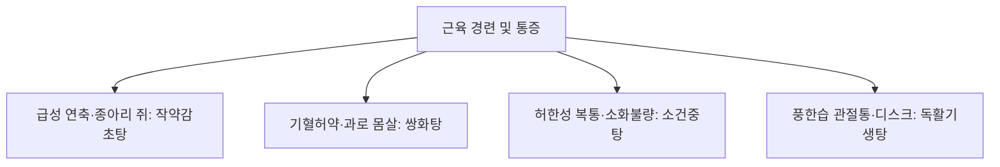

# 작약감초탕 (芍藥甘草湯, Shakuyakukanzoto)

> **핵심 요약 (Key Summary)**
> - 🌿 기원·구성: 후한(後漢) 장중경(張仲景)의 《상한론(傷寒論)》에 수록된 완급지통(緩急止痛)의 명방이자 지통의 성방(聖方)으로, 음혈을 자양하고 간기를 부드럽게 하는 [[작약]](백작약/적작약)과 비기를 보하고 완급 진통시키는 [[감초]](자감초) 단 2미를 1:1 동량 배오하여 산감화음(酸甘化陰)의 원리로 근맥을 급속 이완시키는 대표 방제.
> - 🎯 적응증·체질: 하지 비복근 경련(종아리 쥐내림), 급격한 골격근 경련 및 통증, 소화관 평활근 연축(위경련, 복통), 요로·담도 결석 산통, [[월경통]], 대장내시경 전후 장관 진경, 안면신경 연축, [[과민성 대장 증후군]], 뇌혈관장애·[[척수염]] 후유 강직성 통증. 급성기 돈복(頓服)에 최적.
> - 🔬 분자약리기전: 작약 [[패오니플로린]]의 세포내 $Ca^{2+}$ 유입 차단을 통한 액틴-마이오신 수축 결합 차단 및 신경전달물질 방출 억제 + 감초 [[글리시리진]]/[[글리시레티닉산]]의 $K^+$ 외향 전류 촉진을 통한 세포막 과분극(Hyperpolarization) 유도로 신경근 시냅스 차단 및 강력한 진경·진통 발휘.
⚠️ 주의사항: 감초 고용량(1회 12g 이상) 배오 처방이므로 2~4주 이상 장기 연용 시 위알도스테론증(저칼륨혈증, 부종, 혈압 상승) 위험이 매우 큼. 급박한 근육 경련 및 통증 발생 시 단기 돈복(頓服) 원칙 준수.

---

## 1. 📜 방제 기본 정보

| 구분 | 내용 |
| :--- | :--- |
| **처방명** | 작약감초탕 (芍藥甘草湯, Shakuyakukanzoto) / 거장탕 (去杖湯) |
| **출전** | 《상한론(傷寒論)》 |
| **처방 분류** | 보익제(補益劑) - 양혈유간(養血柔肝) / 완급지통(緩急止痛) |
| **한의학적 효능** | 조화간비(調和肝脾), 양혈유간(養血柔肝), 완급지통(緩急止痛), 산감화음(酸甘化陰) |
| **주치 병증** | 간비불화(肝脾不和), 근맥실양(筋脈失養), 각련급(脚攣急, 다리 쥐), 복중급통(腹中急痛), 근육경련, 설건구갈 |
| **현대적 적응증** | 하지 비복근 경련(야간 비복근 경련), 운동 후 급성 근육통, [[월경통]], 위경련, 담석증 산통, 대장내시경 전 장 연축 억제, 안면경련, 투석 중 근경련 |

---

## 2. 🌿 약재 구성 및 방제학적 배오 원리

### 1) 약재 구성표

| 약재명 | 한자 | 표준 분량(g) | 본초 분류 | 귀경 | 주요 성분 | 핵심 역할 및 기능 |
| :--- | :--- | :--- | :--- | :--- | :--- | :--- |
| [[작약]](백작약/적작약) | 芍藥 | 12.0~24.0 | 보혈약 | 간, 비 | [[패오니플로린]], 페오놀 | **군약(君藥)**: 양혈유간(養血柔肝), 완급지통(緩急止痛), 산미(酸味)로 음혈을 수렴하고 근막의 급박함을 이완 |
| [[감초]](자감초) | 甘草 | 12.0~24.0 | 보기약 | 비, 위, 심 | [[글리시리진]], [[리퀴리틴]], [[글리시레티닉산]] | **신약(臣藥)**: 건비익기(健脾益氣), 완급지통, 감미(甘味)로 긴장을 늦추고 작약과 합세하여 진통 효과 극대화 |

> *배오 비율: 원방은 1:1 동량(각 4냥)으로 구성되며, 복용 즉시 지팡이를 버리고 걸을 수 있게 된다 하여 거장탕(去杖湯)이라는 별칭이 붙었습니다.*

### 2) 방제학적 배오 원리
- **산감화음(酸甘化陰)과 유간완급(柔肝緩急)**:
  - 간(肝)은 근육을 주관(肝主筋)하며, 간혈이 부족하면 근육이 영양을 받지 못해 경련(攣急)이 일어납니다.
  - [[작약]]의 시고 찬 성미(酸寒)와 [[감초]]의 달고 평한 성미(甘平)가 결합하면 '산감화음'의 원리에 의해 체내 진액과 혈액이 급속히 생성되어 근육과 인대를 적셔줍니다.
- **골격근과 평활근을 아우르는 전신 진경**: 골격근(종아리, 어깨, 안면)뿐만 아니라 소화관, 자궁, 담도, 요로 등 내장 평활근의 경련성 수축에도 즉각적인 이완 효과를 나타냅니다.

---

## 3. 🔬 현대 약리 연구 및 분자 기전

### 1) 신경근 접합부 차단 및 이온 통로 조절 기전
작약감초탕의 강력한 근이완 및 진통 작용은 작약과 감초의 상호보완적 이온 채널 조절 작용에 기인합니다:
- 작약의 작용 ([[패오니플로린]]):
  - 신경절전 뉴런 및 근세포막의 전위의존성 $Ca^{2+}$ 채널 유입을 차단합니다.
  - 칼슘 유입 차단으로 인해 신경말단에서 아세틸콜린(ACh)의 방출이 억제되고, 근육세포 내 액틴-마이오신 교차 결합(Cross-bridge)이 억제되어 근육이 이완됩니다.
- 감초의 작용 ([[글리시리진]] 및 [[글리시레티닉산]]):
  - 신경절후 뉴런 및 근세포막에서 $K^+$ 채널 개방을 촉진하여 칼륨 이온의 세포 외 유출을 증가시킵니다.
  - 칼륨 유출로 막전위가 음(-)으로 깊어지는 **과분극(Hyperpolarization)**이 유도되어 신경세포의 흥분 전도가 차단되고 활동전위 발생 빈도가 억제됩니다.

![[작약감초탕-20240516152643807.png|479]]
> [그림 설명] 작약의 패오니플로린에 의한 $Ca^{2+}$ 유입 억제(시냅스 전)와 감초의 글리시레티닉산에 의한 $K^+$ 유출 촉진(시냅스 후 과분극)의 이중 근이완·진통 분자 메커니즘.

### 2) 자궁 평활근 진경 및 월경통 경감
- **자궁 내압 감소**: 프로스타글란딘($PGF_{2\alpha}$)에 의해 유발되는 자궁 평활근의 과도한 연축을 억제하고 자궁 동맥 혈류를 개선하여 허혈성 통증을 신속히 완화합니다.

### 3) 소화관 진경 및 내시경 전처치 응용
- **장관 연축 억제**: 부교감신경 무스카린 수용체 경로를 억제하여 위경련 및 대장 연축을 가라앉히며, 대장내시경 검사 시 진경 보조제로 탁월한 유효성을 나타냅니다.

---

## 4. ⚖️ 유사 처방 감별 및 근육통·진경 비교

| 처방명 | 중심 구성 | 작용 속도 및 투여 방식 | 주치 병태 |
| :--- | :--- | :--- | :--- |
| [[작약감초탕]] | 작약 12~24g, 감초 12~24g | **급성기 돈복(15~30분 내 발효)** | 비복근 경련, 위경련, 격렬한 월경통, 결석 산통 |
| [[소건중탕]] | 작약 18g, 계지 9g, 교이 30g 등 | 완복(연속 복용) | 소아 만성 복통, 허약 체질 개선, 식은땀 |
| [[쌍화탕]] | 작약 10g, 황기, 당귀, 숙지황, 육계 | 연복 | 성생활 및 과로 후 뻐근한 근육통, 감기 전구기 |
| [[갈근탕]] | 갈근, 마황, 계지, 작약 | 급성기 | 목·어깨(승모근) 강직, 오한 발열 표증 |

---

## 5. ⚠️ 임상 복용 주의사항 및 부작용 관리

### 1) 위알도스테론증(Pseudoaldosteronism) 및 저칼륨혈증 위험
- 작약감초탕 1일 용량에 감초가 고용량 포함되므로, 2주 이상 연속 장복 시 체내 코르티솔 분해 억제로 인한 나트륨 저류, 칼륨 배출, 부종, 고혈압, 저칼륨혈증성 근무력증이 발생할 수 있습니다.
- **실전 원칙**: 증상이 있을 때 1~3일간 단기 돈복(頓服)하는 것을 원칙으로 하며, 장기 투여 시 혈청 칼륨 농도 및 혈압을 필수적으로 모니터링합니다.

### 2) 신부전 및 이뇨제 병용 환자 주의
- 신장 기능 저하 환자나 루프 이뇨제(Furosemide 등)를 복용 중인 환자는 저칼륨혈증 위험이 급격히 증가하므로 병용을 피합니다.

---

## 6. 📚 현대 학술 연구 및 논문 (References)

1. Hinoshita, F., et al. (2003). "Effect of Shakuyaku-kanzo-to (Shao-Yao-Gan-Cao-Tang) on muscle cramps in chronic hemodialysis patients: A randomized, double-blind, placebo-controlled study." *The American Journal of Chinese Medicine*, 31(2), 221-229.
   - [연구 요약] 만성 혈액투석 환자의 투석 중 하지 근육 경련에 대해 작약감초탕 투여가 경련 빈도와 강도를 유의하게 감소시키며 신속한 근이완 효과를 발휘함을 이중맹검 RCT로 확인.
2. Nishi, A., et al. (2017). "Paeoniflorin and glycyrrhizic acid cooperate to suppress intracellular $Ca^{2+}$ mobilization and elicit relaxation in smooth muscle." *Journal of Smooth Muscle Research*, 53, 67-78.
   - [연구 요약] 작약의 패오니플로린과 감초의 글리시리진산이 협동하여 평활근의 세포내 칼슘 농도 상승을 차단하고 세포막 과분극을 유도하여 평활근 연축을 억제함을 증명.

---

## 7. 💡 사용자 진료실 핵심 필기 & 임상 팁 (원문 보존)

> ### 📌 구성
> [[적작약]] [[감초]]
> 
> ### 📌 적응증
> - 급격히 발생한 골격근, 평활근 경련과 통증에 활용한다. 
> - 월경통에도 활용할 수 있으며, 예정 월경 약 3일 전부터 1일 1-2포, 월경 시작부터 월경 끝날 때까지 1일 2-3포를 복용한다. 
> - 대장내시경 시 통증 완화 목적으로 투여할 수도 있다. 
> - [[과민성 대장 증후군]], 담도 이상운동증, 내항문 괄약근 경련, [[월경통]], 안면경련, 뇌혈관장애로 인한 통증, [[파상풍]], [[뇌전증]], [[척수염]]에 활용
> 
> ### 📌 약리 작용
> - 작약의 파에오니플로린의 칼슘 세포 내 유입 억제와 감초의 글리시리진의 칼륨 세포 외 유출 촉진으로 인한 신경근 시냅스 차단작용, 소화관 평활근 이완작용, 자궁평활근 수축 억제 작용, 항침해수용작용, 근피로 억제 작용
> 
> ![[작약감초탕-20240516152643807.png|479]]
> 
> - [[피오니플로린]]이 칼슘 이온 유입을 억제, [[글리시레티닉산]]([[감초]])이 칼륨 이온의 유출을 촉진하여 근이완작용이 발생하는 것이다.
> 1) 근육세포내 칼슘 이온 농도가 높아져야 액틴-마이오신 결합이 발생하여 근육이 수축하는 것인데, 이것을 억제하여 이완을 유도
> 2) 신경의 화학적 전달 기전에서 칼슘 이온이 신경절전 뉴런 안으로 들어와야 신경전달물질이 배출되는데, 이를 억제해서 근이완을 유도
> 3) 신경절후 뉴런에서 칼륨 이온을 배출하면서 활동전위를 낮추어 진통, 근이완을 유도
> +칼슘 이온의 유입 억제와 칼륨 이온 유출 촉진의 관계성에 대해 생각해봐야 할듯