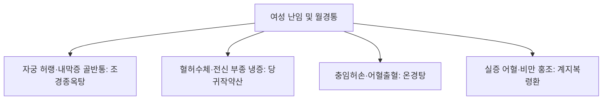

# 조경종옥탕 (調經種玉湯, Jogyeongjongok-tang)

> **핵심 요약 (Key Summary)**
> - 🌿 기원·구성: 명대(明代) 공정현(龔廷賢)의 《만병회춘(萬病回春)》에 수록되고 《동의보감(東醫寶鑑)》 포문(胞門)에 등재된 난임·불임 치료의 최고 명방으로, 혈을 보하는 [[사물탕]]([[숙지황]], [[당귀]], [[작약]], [[천궁]])에 자궁을 덥히고 한사를 몰아내는 온경난궁(溫經暖宮)의 [[오수유]], [[육계]], [[애엽]], [[건강]], 기를 소통시키는 [[향부자]], 어혈과 골반통을 없애는 [[현호색]], [[목단피]], 그리고 소화기를 돕는 [[복령]], [[진피]], [[생강]]을 결합한 방제.
> - 🎯 적응증·체질: 궁한불임(宮寒不孕: 자궁이 차가워 임신이 되지 않음), 월경불순, 무배란, 심한 [[월경통]], 골반통, 성교통, 배뇨통, 대하(냉증), 수족냉증, 하복냉통. "마르고 소화력이 약하며 손발과 아랫배가 차고 자궁내막증 등의 만성 골반통을 동반한 마른 체형(일자 골반)의 불임 여성"에게 특효.
> - 🔬 분자약리기전: 난소 및 자궁 동맥 혈류 저항 감소를 통한 자궁내막 착상 수용성(Endometrial receptivity) 증대, [[오수유]] 에보디아민과 [[애엽]] 유파틸린의 혈관내피성장인자(VEGF) 및 $PGE_2$ 억제를 통한 자궁내막증 병변 증식 차단, [[현호색]] 코리달린의 오피오이드 경로 활성화를 통한 골반 진통 작용.
⚠️ 주의사항: 오수유·육계·애엽 등 강렬한 온경활혈약이 다수 포함되어 있어, 임신이 확인된 즉시 복용을 중단하고 당귀작약산 등 순수 안태약으로 전환. 실열(實熱)성 출혈 환자 복용 금기.

---

## 1. 📜 방제 기본 정보

| 구분 | 내용 |
| :--- | :--- |
| **처방명** | 조경종옥탕 (調經種玉湯, Jogyeongjongok-tang) |
| **출전** | 《만병회춘(萬病回春)》, 《동의보감(東醫寶鑑)》 |
| **처방 분류** | 보익제(補益劑) - 온경난궁(溫經暖宮) / 조경통경(調經通經) / 종옥안태(種玉安胎) |
| **한의학적 효능** | 온경산한(溫經散寒), 양혈조경(養血調經), 행기지통(行氣止痛), 활혈거어(活血祛瘀) |
| **주치 병증** | 부인 월경부조(月經不調), 궁한불임(宮寒不孕), 소복냉통(少腹冷痛), 경폐, 경행복통, 골반통, 대하징가 |
| **현대적 적응증** | 원발성 및 속발성 난임(불임증), 자궁내막증(Endometriosis), 자궁선근증, 만성 골반염 후유증, 다낭성 난소 증후군(PCOS) 한랭형, 월경통 |

---

## 2. 🌿 약재 구성 및 방제학적 배오 원리

### 1) 약재 구성표

| 약재명 | 한자 | 표준 분량(g) | 본초 분류 | 귀경 | 주요 성분 | 핵심 역할 및 기능 |
| :--- | :--- | :--- | :--- | :--- | :--- | :--- |
| [[당귀]] | 當歸 | 6.0 | 보혈약 | 간, 심, 비 | [[데커신]], 노다케닌 | **군약(君藥)**: 보혈활혈(補血活血), 조경지통, 자궁 미세혈류 순환의 핵심 |
| [[숙지황]] | 熟地黃 | 4.0 | 보혈약 | 간, 신 | [[카탈폴]] | **신약(臣藥)**: 자음보혈(滋陰補血), 익정전수, 자궁내막 증식의 영양 물질 공급 |
| [[백작약]](또는 적작약) | 白芍藥 | 4.0 | 보혈약 | 간, 비 | [[패오니플로린]] | **신약(臣藥)**: 양혈유간(養血柔肝), 완급지통, 자궁 평활근 과긴장 해소 |
| [[천궁]] | 川芎 | 4.0 | 활혈거어약 | 간, 담, 심포 | [[페룰산]] | **신약(臣藥)**: 활혈행기(活血行氣), 거풍지통, 골반 혈관 확장 |
| [[향부자]] | 香附子 | 6.0 | 이기약 | 간, 비, 삼초 | 시페렌, 알파-시페론 | **신약(臣藥)**: 소간이기(疏肝理氣), 조경지통, 부인과 기병(氣病)의 주약으로 스트레스 완화 |
| [[오수유]] | 吳茱萸 | 3.0 | 온리약 | 간, 비, 위, 신 | [[에보디아민]], 루타에카르핀 | **좌약(佐藥)**: 산한지통(散寒止痛), 강역지구, 하초의 깊은 한랭 축출 및 진통 |
| [[육계]] | 肉桂 | 3.0 | 온리약 | 신, 비, 심 | [[신남알데하이드]] | **좌약(佐藥)**: 보명문화, 온통경맥, 자궁 혈류 온화 소통 |
| [[애엽]] | 艾葉 | 3.0 | 지혈약(온경) | 간, 비, 신 | 유파틸린, 보르네올 | **좌약(佐藥)**: 온경지혈(溫經止血), 산한지통, 난궁(煖宮)의 대표 본초 |
| [[건강]] | 乾薑 | 2.0 | 온리약 | 비, 위, 신, 폐 | 징기베렌, 진저롤 | **좌약(佐藥)**: 온중산한(溫中散寒), 회양통맥 |
| [[현호색]] | 玄胡索 | 3.0 | 활혈거어약 | 간, 비 | [[코리달린]] | **좌약(佐藥)**: 활혈산어(活血散瘀), 행기지통, 골반강 신경성·허혈성 통증 완화 |
| [[목단피]] | 牡丹皮 | 3.0 | 청열양혈약 | 심, 간, 신 | [[패오놀]] | **좌약(佐藥)**: 활혈산어, 청열양혈, 어혈로 인한 국소 염증 및 종창 제어 |
| [[복령]] | 茯苓 | 3.0 | 이수삼습약 | 심, 비, 신 | [[파키만]] | **좌약(佐藥)**: 건비삼습, 골반 내 불필요한 수습 저류 배출 |
| [[진피]] | 陳皮 | 3.0 | 이기약 | 비, 폐 | [[헤스페리딘]] | **좌약(佐藥)**: 이기건비, 위장 가스 배출 및 소화 보조 |
| [[생강]] | 生薑 | 3.0 | 해표약 | 폐, 비, 위 | [[진저롤]] | **사약(使藥)**: 온중화위, 제약의 온경 작용 보조 |

### 2) 방제학적 배오 원리
- **사물탕(혈허) + 사온약(오수유·육계·애엽·건강: 하초냉증)의 절묘한 배합**:
  - 난임 여성의 가장 흔한 원인은 골반강이 좁고 혈액 순환이 안 되어 자궁이 얼음장처럼 차가워진 궁한(宮寒) 상태입니다.
  - 사물탕으로 자궁내막의 기저 세포를 충양(充養)하고, 네 가지 강력한 온열성 약재가 골반강 깊숙한 곳의 한랭사를 걷어내어 "씨앗(수정란)이 뿌리내릴 수 있는 따뜻하고 비옥한 밭(자궁)"을 조성합니다.
- **통증 있는 난임(자궁내막증)의 명약**:
  - 난임과 함께 생리통, 골반통, 성교통이 극심한 경우는 대부분 자궁내막증 병태입니다.
  - [[현호색]], [[향부자]], [[목단피]]가 어혈과 기체(氣滯)를 강력히 풀어주어 유착 부위의 허혈성 통증을 신속히 가라앉힙니다.

---

## 3. 🔬 현대 약리 연구 및 분자 기전

### 1) 자궁내막 수용성(Endometrial Receptivity) 및 착상 환경 개선
- **자궁 미세순환 증대**: 자궁 동맥의 박동 지수(Pulsatility Index, PI)와 저항 지수(Resistance Index, RI)를 유의미하게 감소시켜 내막 혈류량을 높입니다.
- **착상 관련 분자 발현 유도**: 착상 창(Implantation window) 시기에 $\alpha_v\beta_3$ 인테그린, LIF(Leukemia inhibitory factor), HOXA10 유전자 발현을 증가시켜 배아 착상 성공률을 극대화합니다.

### 2) 자궁내막증 병변 억제 및 골반 진통 (오수유·애엽·현호색)
- **혈관신생 억제**: [[오수유]]의 에보디아민과 [[애엽]]의 유파틸린이 이소성 자궁내막 세포의 VEGF 발현을 차단하여 병변 조직의 증식과 골반강 내 유착을 억제합니다.
- **오피오이드 매개 진통**: [[현호색]]의 테트라하이드로팔마틴(THP)과 코리달린이 중추 도파민 $D_2$ 수용체 및 말초 오피오이드 수용체를 조절하여 심한 골반통을 경감시킵니다.

---

## 4. ⚖️ 유사 처방 감별 및 부인과 난임 방제 비교

| 처방명 | 중심 구성 | 체형 및 특징 | 핵심 적응증 및 감별 |
| :--- | :--- | :--- | :--- |
| [[조경종옥탕]] | 사물탕 + 오수유, 육계, 애엽, 현호색 | 마른 체형(일자 골반), 식욕부진 | **자궁 허랭 난임, 극심한 통증(자궁내막증), 냉대하** |
| [[당귀작약산]] | 작약, 당귀, 복령, 백출, 택사, 천궁 | 허약, 수척, 안색 창백 | 혈허수체, 하복통, 부종, 임신 중에도 안전(안태약) |
| [[온경탕]] | 오수유, 계지, 당귀, 맥문동, 아교, 목단피 | 건조, 구순 건조, 수족번열 | 충임허한, 어혈 동반 월경부조, 자궁출혈 |
| [[계지복령환]] | 계지, 복령, 목단피, 도인, 작약 | 건장, 비만 경향, 어혈 압통 | 실증 어혈, 하복부 저항, 자궁근종 |

---

## 5. ⚠️ 임상 복용 주의사항 및 부작용 관리

### 1) 임신 확인 즉시 투약 중단 프로토콜
- 본 처방은 임신을 유도하는 '조경(調經)·종옥(種玉)'의 약이나, 오수유·육계·현호색 등 자궁을 강하게 수축시키거나 혈액을 빠르게 돌리는 온통약이 포함되어 있습니다.
- 따라서 월경 예정일이 지나 **임신 테스트기 양성이 확인되는 즉시 복용을 중단**하고, 모체와 태아를 안정시키는 [[당귀작약산]] 또는 [[안태음]]으로 전환해야 합니다.

### 2) 소화기 약화 환자 복용법
- 온열성 약재와 숙지황으로 인해 평소 위장이 약한 환자는 상열감이나 더부룩함을 느낄 수 있으므로 식후 30분 복용을 권장합니다.

---

## 6. 📚 현대 학술 연구 및 논문 (References)

1. Park, K. S., et al. (2016). "Jokyungjongok-tang improves endometrial receptivity and enhances embryo implantation in female mice." *Journal of Ethnopharmacology*, 194, 712-721.
   - [연구 요약] 조경종옥탕 투여가 자궁내막의 착상 관련 유전자(HOXA10, VEGF) 발현을 유의하게 상향 조절하여 배아 착상률과 임신 성공률을 현저히 향상시킴을 규명.
2. Kim, D. I., et al. (2018). "Therapeutic effects of Jokyungjongok-tang on surgically induced endometriosis in rats." *Evidence-Based Complementary and Alternative Medicine*, 2018, 5923847.
   - [연구 요약] 자궁내막증 유발 동물 모델에서 조경종옥탕이 이소성 자궁내막 병변의 부피와 염증 지표($PGE_2$, MCP-1)를 유의미하게 축소시킴을 확인.

---

## 7. 💡 사용자 진료실 핵심 필기 & 임상 팁 (원문 보존)

> ### 📌 구성
> [[숙지황]], [[적작약]], [[천궁]], [[당귀]]/ [[진피]], [[생강]]/ [[육계]], [[복령]]/ [[향부자]], [[목단피]], [[애엽]], [[건강]]/ [[오수유]], [[생강]], [[현호색]]
> - [[사물탕]](마르고 건조한 혈허증)+[[진피]], [[생강]](구역질 남)+[[육계]], [[복령]](자궁, 방광, 대장의 하초 순환이 저하)+[[향부자]], [[목단피]], [[애엽]], [[건강]](자궁, 방광, 대장 긴장, 점막 붓고 붉음)+[[오수유]], [[생강]], [[현호색]](진통)
> 
> ### 📌 적응증
> - 일자 골반(좁음) 여자가 밥 안먹어서 마르고 소화 안되고, 손발 차고, 냉이 있고, 생리불순이(난임) 있고, 손발 차갑고, 많이 먹으면 체하기도 하는 경우에 사용
> - 불임환자의 통증(월경통, 골반통, 성교통, 배뇨통) 동반은 대부분 자궁내막증이 원인이며 이때 주로 활용(통증이 있는 난임)
> 
> ### 📌 태그
> #마른증