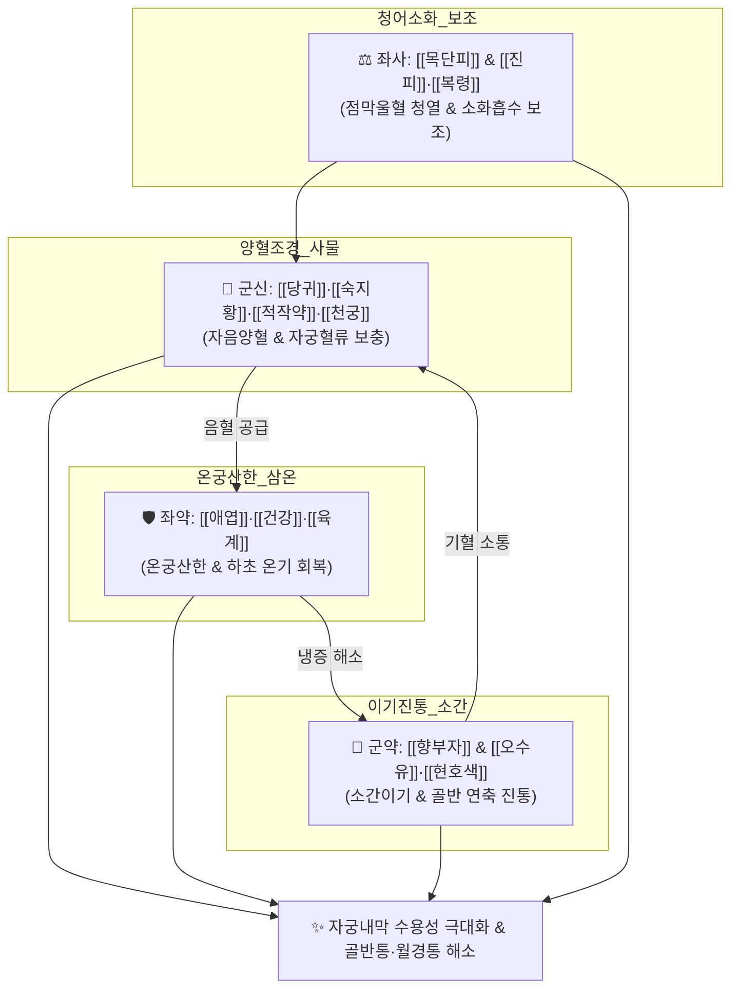

# 🍵 [[조경종옥탕]] (調經種玉湯, Jogyeongjongok-tang)

> **핵심 3줄 요약 (Key Summary)**:
> - 🌿 [[사물탕]](보혈) + [[향부자]]·[[오수유]]·[[현호색]](이기진통) + [[애엽]]·[[건강]]·[[육계]](온궁산한) + [[목단피]](청열활혈) + [[진피]]·[[복령]]·[[생강]](건비화습) 배오.
> - 🎯 좁은 일자 골반의 마른 여성, 식사량 적고 소화불량, 손발이 차고 대하(냉)가 있으며, 월경불순·극심한 월경통·성교통을 동반한 자궁내막증 및 한성(寒性) 난임.
> - 🔬 자궁 동맥 미세혈류 촉진, 프로스타글란딘($PGF_{2\alpha}$) 과합성 억제를 통한 자궁 평활근 진경, 에스트로겐 수용체 조절 및 자궁내막 수용성(Receptivity) 개선.
> - ⚠️ 주의사항: 오수유·건강·육계의 열성으로 실열(實熱) 체질이나 고열 환자 금기, 임신 확인 즉시 복용 중단(활혈행기약 포함).
---
## 📌 목차
1. [기본 처방 정보 & 군신좌사 구성](#1-기본-처방-정보--군신좌사-구성)
2. [방제학적 약재 상호작용 & 시너지 네트워크](#2-방제학적-약재-상호작용--시너지-네트워크)
3. [현대 분자약리학적 효능 & 작용 기전](#3-현대-분자약리학적-효능--작용-기전)
4. [적응 병증 및 체질별 감별 (Sweet Spot vs 금기)](#4-적응-병증-및-체질별-감별-sweet-spot-vs-금기)
5. [유사 처방군 감별 매트릭스](#5-유사-처방군-감별-매트릭스)
6. [임상 가감례 & 현대 질환별 응용](#6-임상-가감례--현대-질환별-응용)
7. [💡 사용자 진료실 핵심 필기 & 임상 팁 (원문 보존)](#7--사용자-진료실-핵심-필기--임상-팁-원문-보존)
8. [출처 및 학술 참고 문헌 (References)](#8-출처-및-학술-참고-문헌-references)
---
## 1. 기본 처방 정보 & 군신좌사 구성

* **출전**: 명대(明代) 공정현(龔廷賢) 『[[만병회춘]](萬病回春)』, 허준 『[[동의보감]](東醫寶鑑)』 잡병편 부인문(婦人門)
* **치법**: 양혈조경(養血調經), 온궁산한(溫宮散寒), 이기지통(理氣止痛), 활혈화어(活血化瘀)

| 구분 | 약재명 | 표준 용량 | 본초 효능 & 방제 내 역할 |
| :--- | :--- | :--- | :--- |
| **군약 (君藥)** | [[당귀]] | 6g | 보혈활혈(補血活血), 조경지통, 자궁 혈류 개선 및 난소 기능 보양 |
| **군약 (君藥)** | [[향부자]] | 6g | 소간이기(疏肝理氣), 조경지통, 부인과 기병(氣病) 총괄 및 골반 울체 해소 |
| **신약 (臣藥)** | [[숙지황]] | 4g | 자음보혈(滋陰補血), 익정전수, 자궁내막 증식의 물질적 근원 |
| **신약 (臣藥)** | [[백작약]](적작약) | 4g | 양혈유간(養血柔肝), 완급지통, 자궁 평활근 연축 억제 |
| **신약 (臣藥)** | [[천궁]] | 4g | 활혈행기(活血行氣), 거풍지통, 골반강 미세혈관 개통 |
| **좌약 (佐藥)** | [[오수유]] | 3g | 산한지통(散寒止痛), 강역지구, 하복부 산한 및 극심한 한성 월경통 완화 |
| **좌약 (佐藥)** | [[현호색]] | 3g | 활혈산어(活血散瘀), 이기지통, 월경통 및 골반통 즉각 진통 |
| **좌약 (佐藥)** | [[애엽]] | 3g | 온경지혈(溫經止血), 산한안태, 자궁을 따뜻하게 덥혀 착상 환경 조성 |
| **좌약 (佐藥)** | [[건강]] | 3g | 온중산한(溫中散寒), 회양통맥, 비위 및 복부 냉증 해소 |
| **좌약 (佐藥)** | [[육계]] | 3g | 보명문화, 온통경맥, 하초 온양 및 사지 말초 혈행 개선 |
| **좌약 (佐藥)** | [[목단피]] | 3g | 청열양혈, 활혈산어, 자궁 점막 울혈 및 미세 염증 청열 |
| **사약 (使藥)** | [[복령]] | 4g | 건비삼습, 하초 습담 정체 배출 |
| **사약 (使藥)** | [[진피]] | 3g | 이기건비, 조습화담, 위장관 소화력 보조 및 구역감 완화 |
| **사약 (使藥)** | [[생강]] | 3g | 온위화중, 강역지구 |

> **배오 특징**: [[사물탕]]으로 마르고 건조한 자궁을 적셔주고, [[향부자]]·[[오수유]]·[[현호색]]으로 골반 신경의 연축을 풀며, [[애엽]]·[[건강]]·[[육계]]로 얼어붙은 자궁을 따뜻한 온상(溫床)으로 변화시킵니다. 여기에 [[목단피]]가 더해져 자궁내막의 국소 울혈 염증을 가라앉히고, [[진피]]·[[복령]]·[[생강]]이 소화관을 편안하게 하여 **"달거리를 고르게 하여 옥 같은 아이를 잉태하게 한다(調經種玉)"**는 종자(種子)의 성방을 이룹니다.
---
## 2. 방제학적 약재 상호작용 & 시너지 네트워크

* [[향부자]] + [[애엽]] + [[오수유]] 배오: 간울(肝鬱)로 뭉치고 한랭(寒冷)으로 얼어붙은 자궁을 부드럽게 이완시키고 따뜻하게 덥혀 월경통을 멈춥니다.
* [[당귀]] + [[현호색]] + [[목단피]] 배오: 자궁내막증 병변의 미세혈전과 어혈을 녹여내고 골반강 내 염증성 유착을 완화합니다.
---
## 3. 현대 분자약리학적 효능 & 작용 기전

### 1) 자궁 동맥 미세혈류 촉진 및 자궁 평활근 진경
* [[현호색]](코리달린)과 [[오수유]](에보디아민) 성분이 $Ca^{2+}$ 통로를 차단하고 프로스타글란딘 $PGF_{2\alpha}$에 의한 자궁근 과수축을 억제하여 원발성 및 속발성 월경통을 신속히 완화합니다.
* 자궁 동맥의 혈류 저항 지수(RI)와 박동 지수(PI)를 낮추어 자궁내막으로 가는 산소와 영양 공급을 획기적으로 개선합니다.

### 2) 자궁내막증 병소 억제 및 항염증
* [[목단피]](패오놀)와 [[당귀]](데커신) 성분이 복강 대식세포의 과도한 염증성 사이토카인(TNF-α, VEGF) 분비를 차단하여 자궁내막증 세포의 비정상적 증식과 혈관 신생을 억제합니다.

### 3) 난소 호르몬 감수성 정상화 및 배란·착상 촉진
* 시상하부-뇌하수체-난소(HPO) 축을 안정화하여 황체형성호르몬(LH)과 에스트로겐의 정상 분비를 유도하고, 착상기 자궁내막의 수용체 단백질(인테그린 $\alpha_v\beta_3$) 발현을 증가시켜 배아 착상률을 높입니다.
---
## 4. 적응 병증 및 체질별 감별 (Sweet Spot vs 금기)

[✅ 최적 적응증 (Sweet Spot)]
• 원전 조문: 만병회춘 — "治婦人經水不調, 久不受孕, 多因經水不調, 經水調則能成孕." (부인의 월경이 불순하여 오래도록 임신하지 못하는 것을 다스린다. 대개 월경이 불순하기 때문이니 월경이 고르면 임신할 수 있다.)
• 체질 소견: 좁은 일자 골반에 마른 체형, 밥을 적게 먹고 소화력이 약하며 손발과 아랫배가 얼음처럼 찬 소음인 여성
• 임상 주치: 한성(寒性) 월경통, 월경 주기 불순(지연), 흑자색 어혈 덩어리, 수족냉증, 맑은 냉대하, 자궁내막증성 골반통·성교통, 난임
• 설진/맥진: 설질담암(舌淡暗), 어반(瘀斑), 박백태(薄白苔), 맥침현(脈沈弦) 또는 맥침지(脈沈遲)

[⚠️ 신중 투여 및 금기 (Caution / Contraindication)]
• 임신 확인 후 즉시 중단: 온열약과 활혈행기약(천궁, 현호색, 오수유 등)이 포함되어 있으므로 착상 및 임신 확인 후에는 안태약([[안태음]])으로 전환
• 실열성 월경과다 환자 금기: 얼굴이 붉고 피가 쏟아지듯 많이 나오는 자궁출혈 환자에게는 출혈 악화 위험
---
## 5. 유사 처방군 감별 매트릭스

| 처방명 | 핵심 배오 차이 | 주치 타깃 및 체질 | 임상 차별점 | 맥진/설진 차이 |
| :--- | :--- | :--- | :--- | :--- |
| [[조경종옥탕]] | 사물탕 + [[향부자]], [[오수유]], [[애엽]], [[현호색]] | **마른 체형, 일자 골반, 수족냉증, 심한 통증** | **통증이 극심한 한성 난임, 자궁내막증** | 맥침현(沈弦), 어반 |
| [[온경탕]] | 오수유, 아교, 맥문동, 모란피, 당귀 | **입술 건조, 하복 냉통, 수장 번열** | **충임허한 + 어혈, 부정출혈 동반** | 맥침세(沈細), 설담소태 |
| [[당귀작약산]] | 당귀, 작약, 천궁, 복령, 백출, 택사 | **체형 보통 또는 통통, 부종 경향** | **혈허수체(부종, 빈혈, 어지럼증 난임)** | 맥유세(濡細), 백니태 |
| [[계지복령환]] | 계지, 복령, 목단피, 도인, 작약 | **체격 건실한 실증 체질 (태음인/소양인)** | **골반강 실증 어혈, 자궁근종, 단단한 복만** | 맥침실(沈實), 설자암 |
---
## 6. 임상 가감례 & 현대 질환별 응용

* **수반 증상별 가감법**:
  * 소화불량 및 구역감이 심할 때 $\rightarrow$ + [[사인]], [[백두구]]
  * 월경통이 극심하여 실신할 지경일 때 $\rightarrow$ [[오수유]] 증량 + [[소회향]], [[몰약]]
  * 허리 시림과 요통 극심 시 $\rightarrow$ + [[두충]], [[속단]]
* **현대 질환별 임상 매핑**:
  * **부인과**: 원발성·속발성 월경통, 자궁내막증, 원인 불명 난임증, 자궁선근증 통증
  * **내분비계**: 시상하부성 월경불순, 황체기 결함
  * **자율신경계**: 레이노 증후군, 수족냉증, 하복부 냉증 증후군
---
## 7. 💡 사용자 진료실 핵심 필기 & 임상 팁 (원문 보존)

> [!tip] **진료실 실전 노하우 (User Clinical Insight)**
> ### 📌 구성
> [[숙지황]], [[적작약]], [[천궁]], [[당귀]]/ [[진피]], [[생강]]/ [[육계]], [[복령]]/ [[향부자]], [[목단피]], [[애엽]], [[건강]]/ [[오수유]], [[생강]], [[현호색]]
> - [[사물탕]](마르고 건조한 혈허증)+[[진피]], [[생강]](구역질 남)+[[육계]], [[복령]](자궁, 방광, 대장의 하초 순환이 저하)+[[향부자]], [[목단피]], [[애엽]], [[건강]](자궁, 방광, 대장 긴장, 점막 붓고 붉음)+[[오수유]], [[생강]], [[현호색]](진통)
> 
> ### 📌 적응증
> - 일자 골반(좁음) 여자가 밥 안먹어서 마르고 소화 안되고, 손발 차고, 냉이 있고, 생리불순이(난임) 있고, 손발 차갑고, 많이 먹으면 체하기도 하는 경우에 사용
> - 불임환자의 통증(월경통, 골반통, 성교통, 배뇨통) 동반은 대부분 자궁내막증이 원인이며 이때 주로 활용(통증이 있는 난임)
> 
> ### 📌 태그
> #마른증
---
## 8. 출처 및 학술 참고 문헌 (References)

2. **공정현 (1587)**. 『[[만병회춘]](萬病回春)』.
   - **[고전 원전]**: "治婦人經水不調, 久不受孕... 經水調則能成孕, 調經種玉湯主之."
3. **허준 (1613)**. 『[[동의보감]](東醫寶鑑)』.
   - **[임상 문헌]**: 부인의 기혈이 허하고 자궁이 차서 월경이 고르지 못하고 잉태하지 못할 때 쓰는 대표 처방으로 수록.
