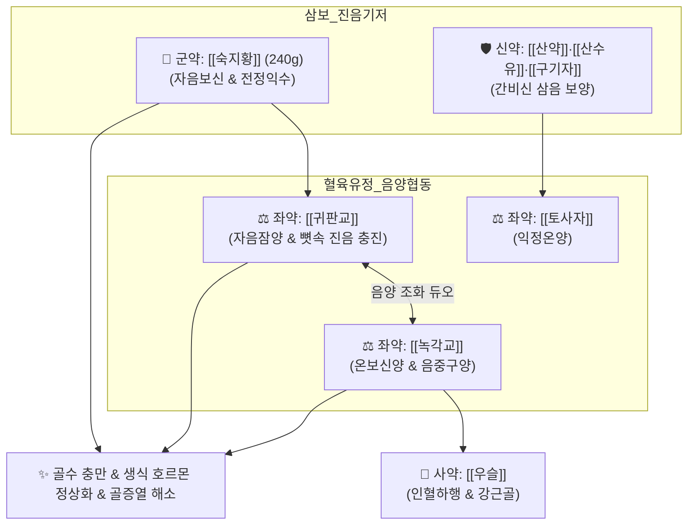

# 🍵 [[좌귀환]] (左歸丸, Zuogui-wan)

> **핵심 3줄 요약 (Key Summary)**:
> - 🌿 [[육미지황탕]]에서 삼사(택사·목단피·복령)를 빼고 순보무사(純補無瀉)로 혈육유정지품을 가미 ([[숙지황]]·[[산약]]·[[산수유]]·[[구기자]]·[[귀판교]]·[[녹각교]]·[[토사자]]·[[우슬]]).
> - 🎯 진음(眞陰)과 신정(腎精)이 극도로 고갈된 상태, 심한 어지럼증(두훈), 이명, 요슬산연(허리와 무릎이 시리고 힘이 빠짐), 골증조열, 도한, 조기 난소 부전, 정자 감소성 불임.
> - 🔬 HPG(시상하부-뇌하수체-성선) 축 정상화, 조골세포(Runx2) 분화 촉진 및 파골세포 억제를 통한 골다공증 예방, 해마 BDNF 촉진을 통한 인지 장애 회복.
> - ⚠️ 주의사항: 순보무사(純補無瀉)하고 기름진 교류(귀판교·녹각교)가 포함되어 있어 비위 허약성 식체·만성 설사 환자 주의, 습열 실열증 금기.
---
## 📌 목차
1. [기본 처방 정보 & 군신좌사 구성](#1-기본-처방-정보--군신좌사-구성)
2. [방제학적 약재 상호작용 & 시너지 네트워크](#2-방제학적-약재-상호작용--시너지-네트워크)
3. [현대 분자약리학적 효능 & 작용 기전](#3-현대-분자약리학적-효능--작용-기전)
4. [적응 병증 및 체질별 감별 (Sweet Spot vs 금기)](#4-적응-병증-및-체질별-감별-sweet-spot-vs-금기)
5. [유사 처방군 감별 매트릭스](#5-유사-처방군-감별-매트릭스)
6. [임상 가감례 & 현대 질환별 응용](#6-임상-가감례--현대-질환별-응용)
7. [💡 사용자 진료실 핵심 필기 & 임상 팁 (원문 보존)](#7--사용자-진료실-핵심-필기--임상-팁-원문-보존)
8. [출처 및 학술 참고 문헌 (References)](#8-출처-및-학술-참고-문헌-references)
---
## 1. 기본 처방 정보 & 군신좌사 구성

* **출전**: 명대(明代) 장경악(張景岳) 『[[경악전서]](景岳全書)』 신집(新集) 고방(古方)
* **치법**: 자음보신(滋陰補腎), 전정익수(塡精益髓), 양간명목(養肝明目), 강근장골(强筋壯骨)

| 구분 | 약재명 | 배합 비율 | 본초 효능 & 방제 내 역할 |
| :--- | :--- | :--- | :--- |
| **군약 (君藥)** | [[숙지황]] | 240g | 자음보신(滋陰補腎), 전정익수, 마르지 않는 신음과 골수의 기본 물질 공급 |
| **신약 (臣藥)** | [[산약]] | 120g | 건비익음(健脾益陰), 고신익정, 후천 비위를 돕고 정혈 생성 촉진 |
| **신약 (臣藥)** | [[산수유]] | 120g | 보간익신(補肝益腎), 삽정지고, 정혈 누설 방지 |
| **신약 (臣藥)** | [[구기자]] | 120g | 자신익정(滋腎益精), 양간명목, 간신의 혈을 돕고 시력 보호 |
| **좌약 (佐藥)** | [[귀판교]] | 120g | 혈육유정지품(血肉有情之品), 자음잠양(滋陰潛陽), 신수 보강 및 골수 충진 |
| **좌약 (佐藥)** | [[녹각교]] | 120g | 혈육유정지품, 온보신양, 음중구양(陰中求陽)의 원리로 생화의 원천 추동 |
| **좌약 (佐藥)** | [[토사자]] | 120g | 보신익정(補腎益精), 온양지고, 음이 뭉치지 않도록 소통 |
| **사약 (使藥)** | [[우슬]] | 90g | 활혈통경, 강근골, 인혈하행하여 약효를 하초 요슬과 골반강으로 인도 |

> **배오 특징**: [[육미지황탕]]이 '삼보삼사(三補三瀉)'로 사화(瀉火)와 이수(利水)를 겸한다면, 좌귀환은 삼사(택사·목단피·복령)를 전면 배제하고 **'순보무사(純補無瀉)'**를 선언한 방제입니다. 특히 식물성 약재 외에 동물성 혈육유정지품인 [[귀판교]]와 [[녹각교]]를 배오하여, "음 가운데에서 양을 구하니 양이 음의 도움을 받아 생화의 원천이 무궁하다(陰中求陽 陽得陰助而生化無窮)"는 장경악 의학의 진수를 보여줍니다.
---
## 2. 방제학적 약재 상호작용 & 시너지 네트워크

* [[귀판교]] + [[녹각교]] 배오: 거북(음)과 사슴(양)의 골수를 농축한 교(膠) 성분이 마른 뼈와 신경을 적셔 진음 고갈을 신속히 회복시킵니다.
* [[숙지황]] + [[우슬]] 배오: 충만해진 진액과 정혈을 허리와 무릎의 관절강으로 정확히 유도하여 보행 무력감을 없앱니다.
---
## 3. 현대 분자약리학적 효능 & 작용 기전

### 1) HPG(시상하부-뇌하수체-성선) 내분비축 정상화 및 생식능 개선
* 에스트로겐 수용체(ER-α, ER-β) 및 테스토스테론 합성을 정상화하여 조기 난소 부전(POI) 모델에서 난포 성숙과 배란을 유도합니다.
* 고환 정세관의 세르톨리 세포(Sertoli Cell) 기능을 강화하고 정자 수와 운동성을 유의하게 개선합니다.

### 2) 조골세포 활성화 및 골다공증 억제
* 골수 간엽줄기세포(BMSC)의 조골세포 분화 촉진 전사인자인 Runx2와 Osterix 발현을 증가시키고, 파골세포 분화 인자인 RANKL/OPG 비율을 낮추어 갱년기 골소실을 억제합니다.

### 3) 뇌 해마 신경재생(Neurogenesis) 및 BDNF 촉진
* 만성 스트레스 및 노화로 위축된 해마 신경세포의 BDNF 및 CREB 인산화를 유도하여 인지 기능 저하와 기억력 감퇴를 회복시킵니다.
---
## 4. 적응 병증 및 체질별 감별 (Sweet Spot vs 금기)

[✅ 최적 적응증 (Sweet Spot)]
• 원전 조문: 경악전서 — "治眞陰腎水不足, 不能滋養營衛, 漸至衰弱, 乃爲眩暈, 遺精, 骨蒸, 盜汗." (진음의 신수가 부족하여 영위를 자양하지 못해 점점 쇠약해져서 어지럽고 유정하며 뼈마디가 쑤시고 식은땀이 나는 것을 다스린다.)
• 체질 소견: 평소 몸이 메마르고 건조하며 하체에 힘이 전혀 없고 눈이 침침한 노인 및 소모성 만성 환자
• 임상 주치: 진음 고갈성 심한 어지럼증(두훈), 이명, 요슬산연(허리와 무릎 시림 및 보행 곤란), 골증조열, 도한, 조루, 남성 불임, 여성 조기 폐경
• 설진/맥진: 설홍(舌紅), 설광무태(光無苔: 거울처럼 매끈한 붉은 혀), 맥세삭(脈細數) 혹은 맥침세(沈細)

[⚠️ 신중 투여 및 금기 (Caution / Contraindication)]
• 비허습담(脾虛濕痰) 환자 금기: 삼사(三瀉) 약재가 없고 대량의 지황과 동물성 교질이 들어있으므로, 소화불량·만성 설사 환자 복용 시 복만 설사 악화
• 급성 외감 발열 환자 금기
---
## 5. 유사 처방군 감별 매트릭스

| 처방명 | 핵심 배오 차이 | 치법 특성 | 주치 및 임상 차별점 | 맥진/설진 차이 |
| :--- | :--- | :--- | :--- | :--- |
| [[좌귀환]] | 육미지황탕 삼사 제외 + [[귀판교]], [[녹각교]], [[토사자]] | **순보무사 (純補無瀉)** | **진음 고갈, 골증열, 허리·무릎 쇠약, 불임** | 맥세삭(細數), 설홍광무태 |
| [[우귀환]] | 팔미지황환 삼사 제외 + 녹각교, 토사자, 당귀, 두충 | **순보신양 (純補腎陽)** | **진양 부족, 사지 극랭, 양위, 오경설사** | 맥침지(沈遲), 설담태백 |
| [[육미지황탕]] | 숙지황, 산약, 산수유 + 택사, 복령, 목단피 | **삼보삼사 (三補三瀉)** | **일반 신음허, 가벼운 도한 및 요슬산통** | 맥세수, 설홍소태 |
| [[지백지황환]] | 육미지황탕 + 지모, 황백 | **청열사화 (淸熱瀉火)** | **음허화왕, 번열이 극심하고 소변 황적** | 맥세삭유력, 설홍 |
---
## 6. 임상 가감례 & 현대 질환별 응용

* **수반 증상별 가감법**:
  * 소화력이 다소 약할 때 $\rightarrow$ + [[사인]], [[맥아]]
  * 허열과 번열이 심할 때 $\rightarrow$ + [[맥문동]], [[지모]]
  * 정자 활동성 저하 및 양위 심할 때 $\rightarrow$ + [[음양곽]], [[파극천]]
* **현대 질환별 임상 매핑**:
  * **내분비계**: 난소 기능 저하(DOR), 조기 폐경, 갱년기 골다공증
  * **비뇨생식기**: 무정자증 및 핍정자증, 남성 불임증, 만성 유정
  * **신경계**: 노인성 인지기능 장애, 만성 신경쇠약, 이명·현훈
---
## 7. 💡 사용자 진료실 핵심 필기 & 임상 팁 (원문 보존)

> [!tip] **진료실 실전 노하우 (User Clinical Insight)**
> ### 📌 육미지황환 vs 좌귀환의 핵심 차이
> - 육미지황환은 [[택사]], [[목단피]], [[복령]]의 삼사(三瀉)가 있어 사열과 이수를 겸하지만, 좌귀환은 삼사를 모두 빼버린 **'순보무사(純補無瀉)'** 처방
> - 진음(眞陰)이 바닥나서 땔감 자체가 없는 환자에게 동물성 교질인 [[귀판교]]와 [[녹각교]]를 투입하여 뼛속 골수와 정(精)을 가득 채우는 전략
> 
> ### 📌 임상 활용 팁
> - 허리와 무릎이 시리고 힘이 빠지며, 눈이 뻑뻑하고 귀에서 소리가 나며(이명), 정액이 줄어든 진음 고갈 환자에게 사용
> - 단, 소화기가 약해 설사를 자주 하는 사람은 지황과 교질이 엉길 수 있으므로 식후 복용을 지도하고 소화제를 겸복시킴
---
## 8. 출처 및 학술 참고 문헌 (References)

1. **장경악 (1624)**. 『[[경악전서]](景岳全書)』.
   - **[고전 원전]**: "治眞陰腎水不足, 不能滋養營衛, 漸至衰弱, 乃爲眩暈, 遺精, 骨蒸, 盜汗, 左歸丸主之."
2. **Zhao, H. et al. (2017)**. *Zuogui Wan promotes osteogenic differentiation of bone marrow mesenchymal stem cells via Wnt/beta-catenin signaling pathway*. **Cellular Physiology and Biochemistry**, 44(4), 1475-1488.
   - **[연구 요약]**: 좌귀환이 Wnt/$\beta$-catenin 경로를 통해 골수 줄기세포의 조골세포 분화를 유의하게 촉진하여 골다공증을 방어함을 규명.
3. **Chen, X. et al. (2020)**. *Zuogui Wan improves ovarian function and endometrial receptivity in rats with diminished ovarian reserve*. **Journal of Ethnopharmacology**, 256, 112760.
   - **[연구 요약]**: 난소 예비력 저하 모델에서 좌귀환 투여가 혈청 AMH 농도를 상승시키고 자궁내막 착상 수용성을 극대화함을 입증.
