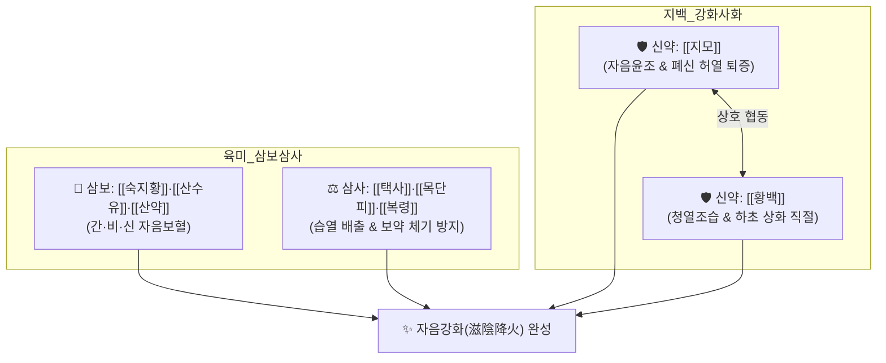

# 🍵 [[지백지황환]] (知柏地黃丸, Zhibai Dihuang Wan)

> **핵심 3줄 요약 (Key Summary)**:
> - 🌿 [[육미지황환]](삼보삼사) + 하초 상화(相火)를 끄는 [[지모]]·[[황백]] 가미 ([[숙지황]]·[[산약]]·[[산수유]]·[[택사]]·[[복령]]·[[목단피]]·[[지모]]·[[황백]]).
> - 🎯 신음 부족으로 허화가 망령되이 치솟는 음허화왕(陰虛火旺), 뼛속에서 열이 뿜어져 나오는 골증조열, 도한(야간 식은땀), 유정·조루, 갱년기 안면홍조, 만성 비뇨기염.
> - 🔬 시상하부 신경펩타이드 조절을 통한 혈관운동성 상열감 진정, [[베르베린]]의 요로상피세포 항균 및 [[NF-κB]] 차단, 조골세포 분화 촉진 및 파골세포 억제를 통한 골밀도 보존.
> - ⚠️ 주의사항: 지모·황백의 침강고한(沈降苦寒)성으로 비위 허한성 소화장애 및 만성 설사 환자 금기, 맥침지·설담 체질 주의.
---
## 📌 목차
1. [기본 처방 정보 & 군신좌사 구성](#1-기본-처방-정보--군신좌사-구성)
2. [방제학적 약재 상호작용 & 시너지 네트워크](#2-방제학적-약재-상호작용--시너지-네트워크)
3. [현대 분자약리학적 효능 & 작용 기전](#3-현대-분자약리학적-효능--작용-기전)
4. [적응 병증 및 체질별 감별 (Sweet Spot vs 금기)](#4-적응-병증-및-체질별-감별-sweet-spot-vs-금기)
5. [유사 처방군 감별 매트릭스](#5-유사-처방군-감별-매트릭스)
6. [임상 가감례 & 현대 질환별 응용](#6-임상-가감례--현대-질환별-응용)
7. [💡 사용자 진료실 핵심 필기 & 임상 팁 (원문 보존)](#7--사용자-진료실-핵심-필기--임상-팁-원문-보존)
8. [출처 및 학술 참고 문헌 (References)](#8-출처-및-학술-참고-문헌-references)
---
## 1. 기본 처방 정보 & 군신좌사 구성

* **출전**: 명대(明代) 오겸(吳謙) 『[[의종금감]](醫宗金鑑)』 (원전 기원: 명대 주진형 『의학발명』)
* **치법**: 자음강화(滋陰降火), 청열사화(淸熱瀉火), 보신익정(補腎益精)

| 구분 | 약재명 | 표준 용량 | 본초 효능 & 방제 내 역할 |
| :--- | :--- | :--- | :--- |
| **군약 (君藥)** | [[숙지황]] | 15g | 자음보혈(滋陰補血), 익정전수, 신음의 근본 물질 공급 |
| **신약 (臣藥)** | [[지모]] | 8g | 청열사화(淸熱瀉火), 자음윤조, 폐신(肺腎) 허열을 내리고 음액 보양 |
| **신약 (臣藥)** | [[황백]] | 8g | 청열조습(淸熱燥濕), 사화퇴증, 하초 상화(相火) 직절 (염수초 鹽水炒) |
| **신약 (臣藥)** | [[산약]] | 10g | 건비보폐(健脾補肺), 고신익정, 후천 비위 보양 |
| **신약 (臣藥)** | [[산수유]] | 10g | 보간익신(補肝益腎), 삽정지한, 신정 누설 방지 |
| **좌약 (佐藥)** | [[택사]] | 8g | 이수청열(利水淸熱), 신음 중 사화 배출 및 이수 |
| **좌약 (佐藥)** | [[목단피]] | 8g | 청열양혈(淸熱凉血), 활혈산어, 간신 허열 진정 및 혈맥 소통 |
| **좌약 (佐藥)** | [[복령]] | 8g | 건비삼습, 녕심안신, 비위 수습 배출 및 숙지황 체기 방지 |

> **배오 특징**: [[육미지황탕]]의 정교한 삼보삼사(三補三瀉) 골격에 고한(苦寒)으로 불을 끄는 [[황백]]과 감한(甘寒)으로 진액을 기르는 [[지모]]를 더하여, **"신수(腎水)가 말라붙어 명문의 허화(虛火)가 위로 치솟는 음허화왕(陰虛火旺)"**의 병태를 신속히 진화하고 진액을 복구하는 자음강화의 대표 제제입니다.
---
## 2. 방제학적 약재 상호작용 & 시너지 네트워크

* [[지모]] + [[황백]] 배오: 지모는 윤조하면서 열을 내리고, 황백은 습열을 말리면서 상화를 꺾어 하초 생식기 및 요로계의 염증과 번열을 완벽히 제어합니다.
* [[숙지황]] + [[지모]] 배오: 지황의 끈적한 음액 보충을 지모가 맑고 시원하게 소통시켜 화열을 가라앉히는 시너지를 냅니다.
---
## 3. 현대 분자약리학적 효능 & 작용 기전

### 1) 혈관운동성 상열감 억제 (갱년기 안면홍조)
* 시상하부 체온조절 중추의 세로토닌 및 노르에피네프린 수용체 균형을 조절하여 혈관운동 신경의 불안정성으로 발생하는 돌발 상열감과 야간 발한(도한)을 진정시킵니다.

### 2) 비뇨생식기 항염증 및 요로상피 보호
* 황백의 [[베르베린]] 성분이 요로상피세포에 대한 대장균(E. coli) 등 세균의 부착을 차단하고 [[NF-κB]] 염증 신호전달 경로를 억제하여 만성 전립선염, 간질성 방광염의 배뇨통과 빈뇨를 완화합니다.

### 3) 골대사 항상성 회복 및 파골세포 억제
* 지모의 망기페린(Mangiferin)과 숙지황 성분이 조골세포의 OPG(Osteoprotegerin) 발현을 유도하고 파골세포 활성을 억제하여 음허 조열성 골다공증을 예방합니다.
---
## 4. 적응 병증 및 체질별 감별 (Sweet Spot vs 금기)

[✅ 최적 적응증 (Sweet Spot)]
• 원전 조문: 의종금감 — "治腎經陰虛火旺, 骨蒸潮熱, 盜汗遺精, 咽乾口燥, 腰痛足軟." (신경의 음허화왕으로 골증조열이 나고 식은땀을 흘리며 유정이 있고 목과 입이 마르며 허리가 아프고 다리에 힘이 없는 것을 다스린다.)
• 체질 소견: 피부가 건조하고 붉은 기가 돌며, 더위를 몹시 타고 찬물을 자주 마시는 마른 음허 체질
• 임상 주치: 오후 및 야간의 골증조열, 수족심열(손발바닥 화끈거림), 도한, 갱년기 안면홍조, 몽정·조루·성욕 이상 항진, 만성 전립선염 및 방광염의 잔뇨감
• 설진/맥진: 설질홍(舌紅), 설소태(少苔) 혹은 무태, 열문(균열설), 맥세삭(脈細數) 혹은 척맥삭유력(尺脈數有力)

[⚠️ 신중 투여 및 금기 (Caution / Contraindication)]
• 비위허약자 금기: 황백과 지모의 고한성으로 위장 장애, 설사 유발 위험 $\rightarrow$ 비위가 차고 무른 변을 보는 환자는 [[육미지황탕]]으로 감량 전환
• 신양허 환자 금기: 손발이 차고 오한을 타는 양허 환자에게는 절대 금기 ([[팔미지황환]] 적용)
---
## 5. 유사 처방군 감별 매트릭스

| 처방명 | 핵심 배오 차이 | 병태 특성 | 주치 및 임상 차별점 | 맥진/설진 차이 |
| :--- | :--- | :--- | :--- | :--- |
| [[지백지황환]] | 육미지황탕 + [[지모]], [[황백]] | **음허화왕 (화열 치솟음)** | **골증조열, 도한, 성욕항진, 하초 번열** | 맥세삭유력, 설홍무태 |
| [[육미지황탕]] | 삼보삼사 6미 (지백 없음) | **순수 신음부족** | **열감이 심하지 않은 일반 신음허, 어지럼증** | 맥세삭(細數), 설홍소태 |
| [[팔미지황환]] | 육미지황탕 + 육계, 포부자 | **신양허 (양기 쇠약)** | **오한, 사지냉감, 요슬냉통, 야간 다뇨** | 맥침지(沈遲), 설담태백 |
| [[기국지황환]] | 육미지황탕 + 구기자, 감국 | **간신음허, 간화상염** | **눈 피로, 시력 감퇴, 안구 건조, 두통** | 맥현세(弦細), 설홍 |
---
## 6. 임상 가감례 & 현대 질환별 응용

* **수반 증상별 가감법**:
  * 혈뇨 및 요로 배뇨통 심할 때 $\rightarrow$ + [[소계]], [[포황]], [[백모근]]
  * 불면증 및 심한 가슴 두근거림 $\rightarrow$ + [[산조인]], [[백자인]]
  * 인후통 및 구강 궤양 동반 시 $\rightarrow$ + [[현삼]], [[맥문동]]
* **현대 질환별 임상 매핑**:
  * **내분비계**: 갱년기 증후군(안면홍조, 야간 발한), 갑상선 기능 항진증 번열
  * **비뇨생식기계**: 만성 비세균성 전립선염, 간질성 방광염, 조루증, 정액류
  * **골대사**: 폐경 후 골다공증, 노인성 골감소증
---
## 7. 💡 사용자 진료실 핵심 필기 & 임상 팁 (원문 보존)

> [!tip] **진료실 실전 노하우 (User Clinical Insight)**
> ### 📌 구성 및 처방의 성격
> [[숙지황]] [[산약]] [[산수유]] [[택사]] [[복령]] [[목단피]] / [[지모]] [[황백]]
> - [[육미지황환]]에 하초의 상화(相火)를 끄는 [[지모]]와 [[황백]]을 추가한 처방
> 
> ### 📌 적응증 및 감별
> - 뼛속에서 열이 뿜어져 나오는 골증열, 잘 때 식은땀을 흘리는 도한, 손발바닥이 화끈거리는 수족심열에 사용
> - 성욕은 이상 항진되는데 정액이 저절로 새는 조루·유정, 만성 전립선염으로 소변이 붉고 찌릿한 환자에게 탁월
> - 비위가 약해 찬 것 먹으면 설사하는 환자에게는 지모·황백이 부담되므로 주의
---
## 8. 출처 및 학술 참고 문헌 (References)

1. **오겸 (1742)**. 『[[의종금감]](醫宗金鑑)』.
   - **[고전 원전]**: "治腎經陰虛火旺, 骨蒸潮熱, 盜汗遺精, 咽乾口燥, 知柏地黃丸主之."
2. **Li, W. et al. (2018)**. *Zhibai Dihuang Wan ameliorates postmenopausal osteoporosis via regulating the RANKL/OPG pathway in ovariectomized rats*. **Journal of Traditional Chinese Medicine**, 38(4), 512-520.
   - **[연구 요약]**: 난소 절제 동물 모델에서 지백지황환 투여가 RANKL/OPG 비율을 정상화하여 파골세포 분화를 억제하고 골밀도를 유의하게 보존함을 입증.
3. **Zhang, Q. et al. (2020)**. *Anti-inflammatory mechanisms of Zhibai Dihuang Wan in chronic nonbacterial prostatitis: Focus on NF-κB and MAPK pathways*. **Phytomedicine**, 68, 153164.
   - **[연구 요약]**: 만성 비세균성 전립선염 모델에서 전립선 염증 침윤 억제 및 배뇨근 안정화 효과 규명.