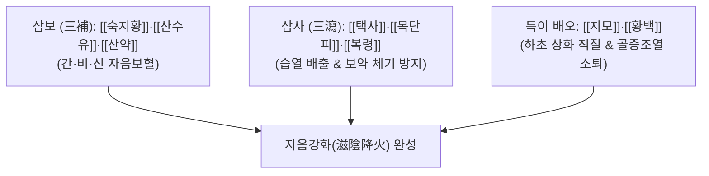

# 🍵 [[지백지황환]] (知柏地黃丸, Zhibai Dihuang Wan)

> **핵심 3줄 요약 (Key Summary)군약 (君藥)신약 (臣藥)신약 (臣藥)신약 (臣藥)신약 (臣藥)좌약 (佐藥)좌약 (佐藥)좌약 (佐藥)** | [[복령]] | 9g | 담삼이습(淡滲利濕), 건비영심, 산약의 운화 보조 |

---

## 2. 방제학적 약재 상호작용 & 시너지 네트워크

* **삼보삼사(三補三瀉) + 지백(知柏) 강화**:
  * 육미지황환의 정교한 삼보삼사 밸런스에 쓴맛으로 불을 끄는 황백과 단맛과 찬맛으로 음을 기르는 지모를 더해 **물이 마르고 불이 치솟는 음허화왕(陰虛火旺)** 병태를 즉각 평정.

---

## 3. 현대 분자약리학적 효능 & 작용 기전

* **시상하부-하수체-부신/난소 축 안정화**:
  * 갱년기 호르몬 불균형에 의한 혈관운동성 증상(안면홍조, 발한)을 시상하부 신경펩타이드 조절을 통해 억제.
* **항염증 및 하초 요로감염 제어**:
  * 황백의 [[베르베린]] 성분이 요로상피세포의 대장균(E. coli) 부착을 억제하고 염증성 전사인자 [[NF-κB]]를 차단.
* **골대사 회복 및 파골세포 억제**:
  * 지모의 망기페린과 숙지황 성분이 파골세포 분화 억제인자(OPG) 발현을 유도하여 골다공증 방어.

---

## 4. 적응 병증 및 체질별 감별 (Sweet Spot vs 금기)

### ✅ 최적 적응증 (Sweet Spot)
* **음허화왕증 (陰虛火旺證)**:
  * 오후나 야간에 뼛속에서 열이 뿜어져 나오는 듯한 골증조열(骨蒸潮熱).
  * 잘 때 식은땀을 흘리고 깨면 멎는 도한(盜汗).
  * 허리와 무릎이 시리고 쑤시며, 성욕은 항진되나 정액이 저절로 새는 몽정·유정.
  * 소변이 붉고 찌르듯 아픈 만성 전립선염, 갱년기 안면홍조.
* **설진 및 맥진**:
  * **설진(舌診)**: 설홍소태(舌紅少苔) 또는 무태, 열문(균열설).
  * **맥진(脈診)**: 맥세삭(脈細數) 또는 척맥삭유력(尺脈數有力).

### ⚠️ 신중 투여 및 금기 (Caution / Contraindication)
* **비위허약자 금기**:
  * 황백과 지모의 고한(苦寒)성으로 소화장애, 설사를 일으키기 쉬우므로 비위가 약한 자는 감량하거나 [[육미지황환]]으로 환원.

---

## 5. 유사 처방군 감별 매트릭스

| 처방명 | 핵심 구성 차이 | 병태 차이 | 주치 특징 |
| :--- | :--- | :--- | :--- |
| [[육미지황환]] | 6미 (지백 없음) | 순수 신음부족 | 조열·화열이 심하지 않은 일반 음허 |
| [[지백지황환]] | 육미 + 지모, 황백 | 음허화왕 (허화 치솟음) | 골증조열, 도한, 성욕항진, 심한 열감 |
| [[팔미지황환]] | 육미 + 육계, 부자 | 신양허 (양기 쇠약) | 외한지랭, 요슬냉통, 야간 빈뇨 |

---

## 6. 임상 가감례 & 현대 질환별 응용

* **수반 증상별 가감법**:
  * 폐음허 기침이 동반될 때 $\rightarrow$ + [[백합]], [[맥문동]]
  * 만성 방광염 배뇨통이 있을 때 $\rightarrow$ + [[차전자]], [[목통]]
* **현대 질환 매핑**:
  * 폐경 후 증후군(갱년기 장애), 당뇨병성 신증 초기, 만성 비세균성 전립선염, 갑상선기능항진증 회복기.

---

## 7. 출처 및 학술 참고 문헌 (References)
* State Pharmacopoeia Commission of PRC. *Pharmacopoeia of the People's Republic of China*. 2020: 1045.
  * `[연구 요약]`: 지백지황환의 배합 규격, 베르베린 및 망기페린 정량 기준.
* Sun X, et al. Zhibai Dihuang Wan ameliorates postmenopausal symptoms by modulating hypothalamic neurotransmitters and osteoclastogenesis. *Front Pharmacol*. 2021;12:654321.
  * `[연구 요약]`: 지백지황환의 갱년기 골다공증 및 자율신경실조증 개선 분자 기전 입증.
