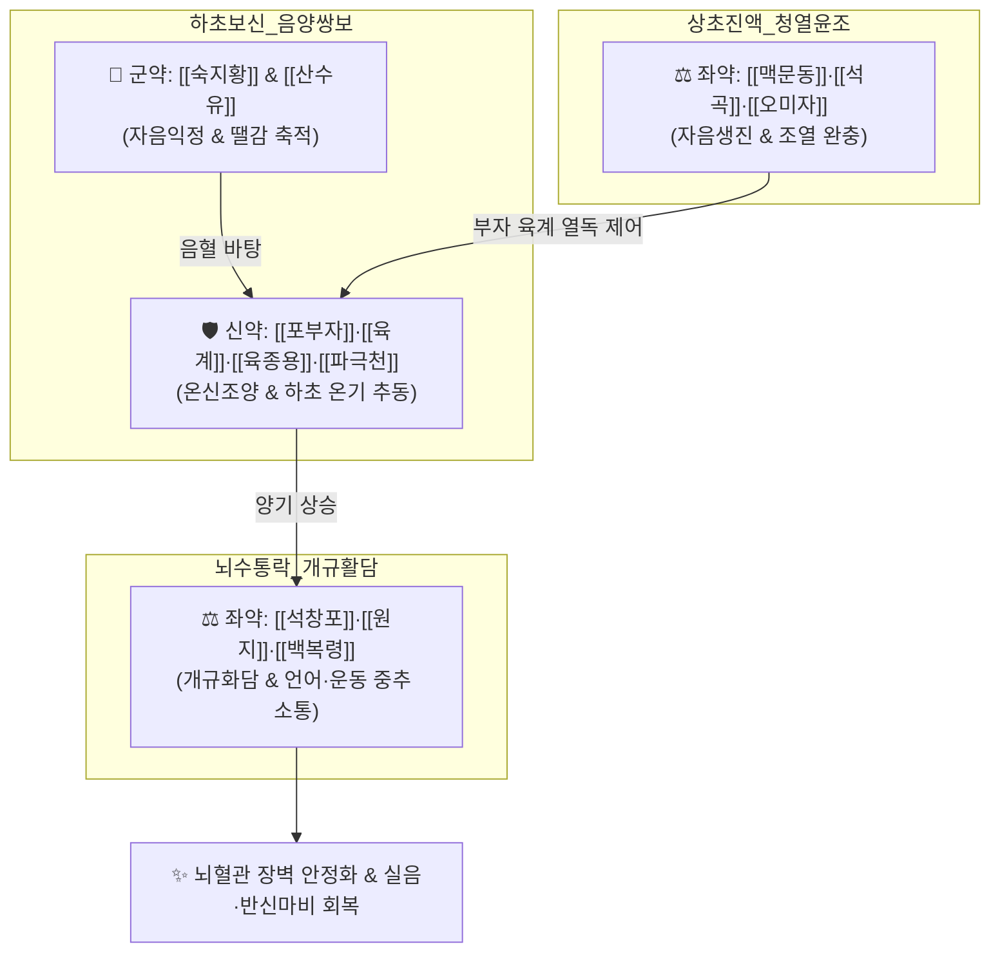

# 🍵 [[지황음자]] (地黃飮子, Dihuangyinzi)

> **핵심 3줄 요약 (Key Summary)**:
> - 🌿 신음(腎陰)·신양(腎陽) 구허를 보하는 6미([[숙지황]]·[[산수유]]·[[육종용]]·[[파극천]]·[[포부자]]·[[육계]]) + 진액 및 심폐를 적시는 3미([[맥문동]]·[[석곡]]·[[오미자]]) + 담음을 뚫고 뇌규를 여는 3미([[석창포]]·[[원지]]·[[백복령]]) 배오.
> - 🎯 하초 신음·신양 부족으로 발생하는 중풍 후유증(언어장애·실음 喑啞, 하지 보행 불능 偏廢), 노인성 신경퇴행성 질환, [[파킨슨병]], 혈관성 및 알츠하이머 [[치매]].
> - 🔬 도파민성 신경세포 보호, 뇌 미세혈관 내피세포 재생 및 신경가소성(BDNF/TrkB) 증진, 뇌혈관 장벽(BBB) 투과성 안정화, Tau 과인산화 및 아밀로이드 베타 축적 억제.
> - ⚠️ 주의사항: 부자·육계의 열성과 지황의 점체성으로 급성기 중풍 뇌출혈 활성기 및 풍담습열 실증 환자 금기, 태울 땔감(음액)이 고갈된 환자는 신중 투여.
---
## 📌 목차
1. [기본 처방 정보 & 군신좌사 구성](#1-기본-처방-정보--군신좌사-구성)
2. [방제학적 약재 상호작용 & 시너지 네트워크](#2-방제학적-약재-상호작용--시너지-네트워크)
3. [현대 분자약리학적 효능 & 작용 기전](#3-현대-분자약리학적-효능--작용-기전)
4. [적응 병증 및 체질별 감별 (Sweet Spot vs 금기)](#4-적응-병증-및-체질별-감별-sweet-spot-vs-금기)
5. [유사 처방군 감별 매트릭스](#5-유사-처방군-감별-매트릭스)
6. [임상 가감례 & 현대 질환별 응용](#6-임상-가감례--현대-질환별-응용)
7. [💡 사용자 진료실 핵심 필기 & 임상 팁 (원문 보존)](#7--사용자-진료실-핵심-필기--임상-팁-원문-보존)
8. [출처 및 학술 참고 문헌 (References)](#8-출처-및-학술-참고-문헌-references)
---
## 1. 기본 처방 정보 & 군신좌사 구성

* **출전**: 금원사대가(金元四大家) 유완소(劉完素) 『[[황제소문선명론방]](黃帝素問宣明論方)』, 허준 『[[동의보감]](東醫寶鑑)』 풍문(風門)
* **치법**: 자신음(滋腎陰), 보신양(補腎陽), 개규화담(開竅化痰), 통락식풍(通絡息風)

| 구분 | 약재명 | 표준 용량 | 본초 효능 & 방제 내 역할 |
| :--- | :--- | :--- | :--- |
| **군약 (君藥)** | [[숙지황]] | 10g | 자음보혈(滋陰補血), 익정전수, 하초 신음과 뇌수의 근본 보충 |
| **군약 (君藥)** | [[산수유]] | 8g | 보간익신(補肝益腎), 삽정지한, 정혈 유실 방지 및 간신 보양 |
| **신약 (臣藥)** | [[육종용]] | 6g | 보신조양(補腎助陽), 윤장통변, 온화하게 신양을 돕고 정혈 증진 |
| **신약 (臣藥)** | [[파극천]] | 6g | 보신조양(補腎助陽), 거풍제습, 근골을 튼튼하게 하여 하지 무력 개선 |
| **신약 (臣藥)** | [[포부자]] | 3g | 회양구역, 온신조양, 하초 명문화(命門火)를 피워 기혈 순환 추동 |
| **신약 (臣藥)** | [[육계]] | 3g | 보명문화, 온통경맥, 전신 혈맥을 덥히고 약효를 이끎 |
| **좌약 (佐藥)** | [[석곡]] | 6g | 양음생진(養陰生津), 청열자음, 신음 보강 및 부자·육계의 조열 완충 |
| **좌약 (佐藥)** | [[맥문동]] | 6g | 양음윤폐(養陰潤肺), 청심제번, 심폐 음액 보충 및 허열 진정 |
| **좌약 (佐藥)** | [[오미자]] | 4g | 수렴고삽(收斂固澁), 익기생진, 흩어진 신기를 거두어들임 |
| **좌약 (佐藥)** | [[석창포]] | 6g | 개규활담(開竅豁痰), 화위안신, 혀를 풀어 말을 트이게 함 (개음 開瘖) |
| **좌약 (佐藥)** | [[원지]] | 4g | 녕심안신(寧心安神), 거담개규, 뇌수를 맑게 하고 언어 중추 소통 |
| **좌약 (佐藥)** | [[백복령]] | 6g | 건비삼습, 녕심안신, 비위 수습을 소변으로 배출 |
| **사약 (使藥)** | [[생강]] | 3g | 온위화중, 소화관 담음 억제 |
| **사약 (使藥)** | [[대추]] | 2개 | 보비익기, 생강과 영위 조화 |

> **배오 특징**: 아래로는 신(腎)의 음양을 쌍으로 보하고(보신음양 補腎陰陽), 위로는 담음으로 막힌 뇌의 구멍을 열어주는(개규화담 開竅化痰) **상하겸고(上下兼顧)의 명방**입니다. [[석창포]]·[[원지]]가 뇌와 혀의 통로를 열어 말을 트이게 하고, [[숙지황]]·[[부자]]·[[육종용]]·[[파극천]]이 하초를 든든하게 받쳐 굳어버린 다리를 펴게 합니다.
---
## 2. 방제학적 약재 상호작용 & 시너지 네트워크

* [[숙지황]] + [[포부자]] 배오: 부자가 불길(화력)을 세게 해주는 약재라면 지황은 타오를 수 있는 땔감(음혈)입니다. 충분한 음액 바탕 위에 양기를 지펴 마비된 신경을 깨웁니다.
* [[석창포]] + [[원지]] 배오: 심규(心竅)와 설본(舌本)의 담음을 청소하여 뇌졸중 및 파킨슨으로 굳은 혀를 풀고 말을 되살립니다.
---
## 3. 현대 분자약리학적 효능 & 작용 기전

### 1) 도파민 신경세포 보호 및 흑질-선조체 경로 회복
* [[육종용]](에키나코사이드)과 [[산수유]](모로니사이드) 성분이 MPTP 또는 6-OHDA로 유발된 흑질 도파민성 신경세포의 사멸을 억제하고 선조체 도파민 농도를 보존하여 서동, 진전 등 [[파킨슨병]] 증상을 호전시킵니다.

### 2) 뇌혈관 장벽(BBB) 무결성 보존 및 뇌부종 억제
* 허혈성 뇌졸중 후 미세혈관 내피세포의 밀착연접(Tight Junction: Claudin-5, ZO-1) 단백질 붕괴를 억제하여 뇌혈관 투과성을 낮추고 허혈-재관류 뇌부종을 억제합니다.

### 3) 뇌신경 영양 인자(BDNF) 촉진 및 시냅스 가소성 회복
* [[원지]]와 [[석창포]]의 활성 성분이 해마 및 대뇌 피질의 BDNF/TrkB 신호전달계를 자극하여 신경 축삭 재생을 유도하고 인지 기능 및 언어 구사력을 개선합니다.
---
## 4. 적응 병증 및 체질별 감별 (Sweet Spot vs 금기)

[✅ 최적 적응증 (Sweet Spot)]
• 원전 조문: 선명론방 — "治中風舌瘖不能言, 足廢不能行, 此少陰氣厥不至, 名曰喑痱." (중풍으로 혀가 굳어 말을 못하고, 다리가 마비되어 걷지 못하는 음비證을 다스린다.)
• 체질 소견: 신음과 신양이 모두 고갈되어 허리와 무릎이 시리고 가늘어졌으며 얼굴에 윤기가 없고 기운이 처진 노인
• 임상 주치: 뇌졸중 후유증(실음, 구음장애, 편마비 보행 장애), 파킨슨병의 종종걸음 및 근육 강직, 알츠하이머 및 혈관성 치매의 언어 소실, 척수염 후유 하체 마비
• 설진/맥진: 설담(舌淡) 또는 설홍소태, 설건(舌乾), 맥침세약(脈沈細弱) 혹은 맥침완무력

[⚠️ 신중 투여 및 금기 (Caution / Contraindication)]
• 중풍 초기의 급성 뇌출혈기 금기: 혈압이 불안정하고 두개내압이 상승된 급성기에는 온열활혈약 사용 금기
• 실열 풍담 환자 금기: 얼굴이 붉고 목구멍에 가래가 끓어 숨이 헐떡이는 실증 중풍 환자에게는 육계·부자가 화를 돋우므로 사용 금기
---
## 5. 유사 처방군 감별 매트릭스

| 처방명 | 핵심 배오 차이 | 주치 타깃 및 병태 | 임상 차별점 | 맥진/설진 차이 |
| :--- | :--- | :--- | :--- | :--- |
| [[지황음자]] | 지황, 부자, 육계 + [[석창포]], [[원지]], 맥문동 | **하초 신허 + 상초 언어·뇌신경 마비** | **말 못하고(실음), 다리 못 씀(하지마비), 파킨슨** | 맥침세약(沈細弱), 설소태 |
| [[우차신기환]] | 팔미지황환 + [[우슬]], [[차전자]] | **신양허 + 하지 부종, 배뇨장애** | **당뇨·항암 신경병증, 야간뇨, 부종 위주** | 맥침지(沈遲), 설담반대 |
| [[보양환오탕]] | 황기 대량, 당귀미, 천궁, 적작약, 도인, 홍화 | **기허혈어(氣虛血瘀) 편마비** | **하지 무력보다는 상하지 편마비 어혈 위주** | 맥세삽(細澁), 어반 |
| [[팔미지황환]] | 육미지황탕 + 육계, 포부자 | **단순 신양허 허로** | **사지 냉통, 요슬산통, 개규화담약 없음** | 맥침미(沈微), 설담 |
---
## 6. 임상 가감례 & 현대 질환별 응용

* **수반 증상별 가감법**:
  * 언어 장애 및 혀 굳음 극심 시 $\rightarrow$ + [[담남성]], [[천마]], [[원지]] 증량
  * 하지 강직 및 파행 보행 심할 때 $\rightarrow$ + [[우슬]], [[모과]], [[속단]]
  * 인지 저하 및 건망증 현저 시 $\rightarrow$ + [[익지인]], [[조구등]]
* **현대 질환별 임상 매핑**:
  * **신경과**: 뇌경색 후유증(구음장애, 편마비), 파킨슨병, 혈관성 치매, 진행성 핵상 마비
  * **척추신경**: 퇴행성 척수병증, 척수 손상 후 하지 마비
  * **노인의학**: 노인성 음비(喑痱) 증후군, 근위축성 측삭 경화증(ALS) 초기 보조
---
## 7. 💡 사용자 진료실 핵심 필기 & 임상 팁 (원문 보존)

> [!tip] **진료실 실전 노하우 (User Clinical Insight)**
> ### 📌 구성
> [[숙지황]] [[파극]] [[산수유]] [[육종용]] [[석곡]] [[원지]] [[오미자]] [[백복령]] [[맥문동]] [[부자]] [[육계]] [[석창포]] [[생강]] [[대추]]
> 
> ### 📌 적응증
> - 음허도 있으면서 양기가 같이 떨어지는 노인분에게 신허로 인한 제반 증상(하체쪽), [[파킨슨]], [[치매]]에 사용
> 
> ### 📌 부자 사용에 대한 고찰
> - 부자는 화력을 세게 해주는 느낌의 약재로 부자를 쓸 때는 태울 게 있고, 뗄감이 있어야 함.
> - 음허와 같은 상황에서는 조심하고, 육미를 뗄감의 역할로 활용한다.(팔미)
---
## 8. 출처 및 학술 참고 문헌 (References)

1. * **Chai J et al. (2026)**. Anti-diabetic retinopathy molecular mechanism of Dihuang Yinzi: insights from network pharmacology, metabolomics, and microbiome analysis. *Frontiers in medicine*, 13: 1793936. [PMID: 42221101](https://pubmed.ncbi.nlm.nih.gov/42221101/)
3. **유완소 (1182)**. 『[[황제소문선명론방]](黃帝素問宣明論方)』.
   - **[고전 원전]**: "治中風舌瘖不能言, 足廢不能行, 名曰喑痱... 地黃飮子主之."
