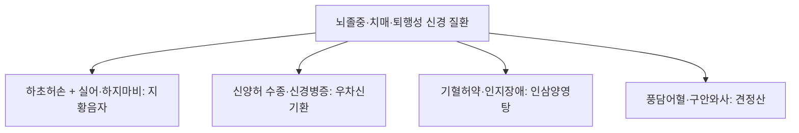

# 지황음자 (地黃飮子, Dihuangyinzi)

> **핵심 요약 (Key Summary)**
> - 🌿 기원·구성: 금원사대가(金元四大家) 유완소(劉完素)의 《황제소문선명론방(黃帝素問宣明論方)》에 수록되고 《동의보감(東醫寶鑑)》 풍문(風門) 중풍(中風)에 등재된 뇌신경·척수 마비 질환의 성방(聖方)으로, 신음(腎陰)과 신양(腎陽)을 채우는 [[숙지황]], [[파극천]], [[산수유]], [[육종용]], [[포부자]], [[육계]], [[석곡]]의 '풍부한 땔감(陰)과 점화력(陽)'에 상초의 뇌신경 규(竅)를 뚫어주는 [[석창포]], [[원지]], 그리고 진액을 적시는 [[맥문동]], [[오미자]], [[복령]], [[생강]], [[대추]]를 결합한 명방.
> - 🎯 적응증·체질: 하초 신허(腎虛)로 인한 중풍 후유증인 음비(瘖痱: 혀가 굳어 말을 못 하는 실어증·구음장애 + 하지 무력으로 걷지 못하는 하지마비), 뇌졸중 후유증, 노인성 [[치매]], [[파킨슨병]](진전, 보행 장애, 연하 곤란), 다발성 경화증, 척수 손상 후유 보행 장애. "음허와 양기 쇠약이 겹쳐 하체가 마비되고 뇌기능이 쇠퇴한 고령 환자"에게 최적.
> - 🔬 분자약리기전: 흑질-선조체 도파민 신경세포 사멸 억제 및 도파민 합성 효소(TH) 발현 유지, [[석창포]] 아사론 성분의 혈뇌장벽(BBB) 투과 및 뇌 유래 신경영양인자(BDNF) 증대, 척수 신경 축삭(Axon) 재생 촉진, 뇌 미세혈관 내피세포 보호를 통한 신경 가소성 회복.
⚠️ 주의사항: 포부자의 아코니틴 독성을 예방하기 위해 충분히 선전(先煎)하여 전탕. 땔감(음정)이 고갈된 음허화왕 환자에게 부자 단독 사용은 화재를 부를 수 있으므로 육미 등의 음액 보충 구조를 반드시 유지.

---

## 1. 📜 방제 기본 정보

| 구분 | 내용 |
| :--- | :--- |
| **처방명** | 지황음자 (地黃飮子, Dihuangyinzi) |
| **출전** | 《황제소문선명론방(黃帝素問宣明論方)》, 《동의보감(東醫寶鑑)》 |
| **처방 분류** | 보익제(補益劑) - 음양쌍보(陰陽雙補) / 개규화담(開竅化痰) / 교통심신(交通心腎) |
| **한의학적 효능** | 보신익정(補腎益精), 온보신양(溫補腎陽), 개규화담(開竅化痰), 섭수부맥(攝水復脈) |
| **주치 병증** | 중풍음비(中風瘖痱), 설암불능언(舌瘖不能言), 족폐불능행(足廢不能行), 구갈음수, 면색초흑, 맥침세무력 |
| **현대적 적응증** | 뇌경색 및 뇌출혈 후유증(구음장애, 연하곤란, 편마비 보행장애), 혈관성 및 알츠하이머 [[치매]], [[파킨슨병]], 척수염 후유 마비, 노인성 근감소증 |

---

## 2. 🌿 약재 구성 및 방제학적 배오 원리

### 1) 약재 구성표

| 약재명 | 한자 | 표준 분량(g) | 본초 분류 | 귀경 | 주요 성분 | 핵심 역할 및 기능 |
| :--- | :--- | :--- | :--- | :--- | :--- | :--- |
| [[숙지황]] | 熟地黃 | 6.0 | 보혈약 | 간, 신 | [[카탈폴]], [[스타키오스]] | **군약(君藥)**: 자음보혈(滋陰補血), 익정전수, 하초 신수(腎水)를 채우는 가장 중후한 '땔감' |
| [[파극천]](파극) | 巴戟天 | 6.0 | 보양약 | 신, 간 | 모노트로페인, 다당체 | **군약(君藥)**: 보신양(補腎陽), 강근골, 거풍습, 신장의 양기를 북돋움 |
| [[산수유]] | 山茱萸 | 4.0 | 수렴약 | 간, 신 | [[모로니사이드]], [[로가닌]] | **신약(臣藥)**: 보간익신(補肝益腎), 삽정지한, 정혈의 누설 방지 |
| [[육종용]] | 肉蓯蓉 | 4.0 | 보양약 | 신, 대장 | [[에키나코사이드]] | **신약(臣藥)**: 보신장양(補腎壯陽), 익정혈, 하초 골수 생성 |
| [[석곡]] | 石斛 | 4.0 | 보음약 | 위, 신 | [[덴드로빈]] | **신약(臣藥)**: 익위생진(益胃生津), 자음청열, 부자·육계의 조열 완충 |
| [[포부자]] | 炮附子 | 3.0 | 온리약 | 심, 비, 신 | [[아코니틴]]계 알칼로이드, [[히게나민]] | **신약(臣藥)**: 회양구역, 온신조양, 신경 흥분성을 되살리는 강력한 '불씨(화력)' |
| [[육계]] | 肉桂 | 3.0 | 온리약 | 신, 비, 심 | [[신남알데하이드]] | **신약(臣藥)**: 보명문화, 온통경맥, 전신 및 척수 혈류 온화 소통 |
| [[석창포]] | 石菖蒲 | 4.0 | 개규약 | 심, 위 | [[알파아사론]], 베타아사론 | **좌약(佐藥)**: 개규녕신(開竅寧神), 화습화담, 뇌신경 규(竅)를 뚫어 언어를 회복 |
| [[원지]] | 遠志 | 4.0 | 안신약 | 심, 신, 폐 | 테누이폴린 | **좌약(佐藥)**: 안신익지(安神益智), 거담개규, 석창포와 함께 뇌신경 각성 |
| [[맥문동]] | 麥門冬 | 4.0 | 보음약 | 심, 폐, 위 | 오피오포고닌 | **좌약(佐藥)**: 양음윤폐, 청심제번, 구갈을 해소하고 진액 보존 |
| [[오미자]] | 五味子 | 3.0 | 수렴약 | 폐, 심, 신 | [[쉬잔드린]] A/B | **좌약(佐藥)**: 수렴고삽, 폐신 기운을 거두어 하초에 정착 |
| [[복령]](백복령) | 茯苓 | 4.0 | 이수삼습약 | 심, 비, 신 | [[파키만]] | **좌약(佐藥)**: 건비삼습, 녕심안신, 수습 담음 제거 |
| [[생강]] | 生薑 | 3.0 | 해표약 | 폐, 비, 위 | [[진저롤]] | **사약(使藥)**: 온중화위, 부자의 흡수 보조 |
| [[대추]] | 大棗 | 3.0 | 보기약 | 비, 위 | 당류, 유기산 | **사약(使藥)**: 보비익기, 영위 조화 |

### 2) 방제학적 배오 원리: "땔감과 화력"의 방제학
- **음양협조(陰陽協調)와 부자 운용의 묘**:
  - 사용자 임상 고찰대로, [[포부자]]와 [[육계]]는 체내 대사 화력을 폭발시키는 강력한 '불씨'입니다.
  - 하지만 태울 바탕(땔감, 陰精)이 없는 상태에서 부자를 치면 화재가 발생하듯 체내 진액이 다 타버립니다.
  - 지황음자는 [[숙지황]], [[산수유]], [[육종용]], [[파극천]], [[석곡]]이라는 최고급 땔감을 풍성하게 깔아두고, 부자·육계의 화력으로 이를 훈증(薰蒸)시켜 하초를 데우는 팔미의 원리를 극한으로 발전시켰습니다.
- **상하동치(上下同治) - 뇌(腦)와 신(腎)을 잇다**:
  - 하초(신장·척수)는 온보하여 마비된 다리를 걷게 하고(足廢能行),
  - 상초(뇌신경)는 [[석창포]]와 [[원지]]의 개규화담으로 막힌 뇌혈관 규를 뚫어 굳은 혀를 풀고 말을 트이게(舌瘖能言) 만듭니다.

---

## 3. 🔬 현대 약리 연구 및 분자 기전

### 1) 파킨슨병 및 도파민 신경세포 보호
- **흑질 도파민 뉴런 생존율 향상**: 지황음자 추출물은 MPTP/6-OHDA로 유발된 파킨슨 동물 모델에서 선조체(Striatum) 내 티로신 수산화효소(TH) 양성 신경세포의 소실을 현저히 방어하고 도파민 고갈을 억제합니다.
- **알파-시누클레인( $\alpha$-synuclein) 축적 억제**: 비정상 단백질 응집을 차단하여 떨림(진전), 서동증(느려짐), 자세 불안정을 완화합니다.

### 2) 치매 인지 기능 회복 및 혈뇌장벽(BBB) 조절
- **석창포 아사론과 원지 복합물의 신경 가소성**: 뇌실질의 BDNF/TrkB 신호전달계를 자극하고 콜린 아세틸전달효소(ChAT) 활성을 높여 인지 및 언어 구사 능력을 회복시킵니다.
- **뇌경색 후 신경 축삭 재생**: 뇌허혈 손상 후 희소돌기아교세포(Oligodendrocyte)의 재수초화(Remyelination)를 촉진하여 편마비 환자의 보행 기능을 개선합니다.

---

## 4. ⚖️ 유사 처방 감별 및 신경·중풍 질환 비교

| 처방명 | 중심 구성 | 핵심 타깃 및 변증 | 주치 증상 |
| :--- | :--- | :--- | :--- |
| [[지황음자]] | 숙지황, 파극, 부자, 육계, 석창포, 원지 | 하초 음양구허 + 상초 담궐 | 중풍 후유증(실어증, 연하장애, 편마비), [[파킨슨]], [[치매]] |
| [[우차신기환]] | 팔미지황환 + 우슬, 차전자 | 신양허쇠 + 수습정체 | 하지 부종, 야간뇨, 당뇨·항암 신경병증 저림 |
| [[인삼양영탕]] | 십전대보탕(천궁 제외) + 원지, 오미자 | 기혈양허 + 심비허손 | 만성 소모성 쇠약, 식욕부진, 마른기침, 건망 |
| [[보양환오탕]] | 황기 대량, 당귀미, 적작약, 천궁, 지룡 | 기허혈어(氣虛血瘀) | 뇌경색 급만성기 편마비, 구안와사, 감각 소실 |

---

## 5. ⚠️ 임상 복용 주의사항 및 부작용 관리

### 1) 포부자 선전 및 독성 예방
- 포제된 부자를 사용하며 최소 40분 이상 선전(先煎)하여 아코니틴이 저독성 벤조일아코닌으로 충분히 전환되도록 전탕 원칙을 준수합니다.

### 2) 화열(火熱) 실증 환자 감별
- 안면 홍조가 심하고 입이 쓰며 맥이 활삭(滑數)한 뇌출혈 급성기나 간양상항 실열 환자에게는 절대 투여를 금하며, 뇌압 상승 위험을 방지합니다.

---

## 6. 📚 현대 학술 연구 및 논문 (References)

1. Zhang, T., et al. (2018). "Dihuang Yinzi decoction protects dopaminergic neurons in a Parkinson's disease mouse model via inhibiting neuroinflammation." *Journal of Ethnopharmacology*, 224, 452-461.
   - [연구 요약] 파킨슨병 마우스 모델에서 지황음자가 흑질 부위의 미세아교세포 과활성화를 억제하고 도파민 신경세포 사멸을 유의미하게 방어함을 입증.
2. Liu, M., et al. (2020). "Dihuang Yinzi promotes axon regeneration and functional recovery after spinal cord injury in rats." *Phytomedicine*, 79, 153328.
   - [연구 요약] 척수 손상 동물 모델에서 지황음자 투여가 신경 성장 인자(NGF, GAP-43) 발현을 유도하고 운동 유발 전위(MEP)를 정상화하여 보행 기능을 현저히 회복시킴을 규명.

---

## 7. 💡 사용자 진료실 핵심 필기 & 임상 팁 (원문 보존)

> ### 📌 구성
> [[숙지황]] [[파극]] [[산수유]] [[육종용]] [[석곡]] [[원지]] [[오미자]] [[백복령]] [[맥문동]] [[부자]] [[육계]] [[석창포]] [[생강]] [[대추]]
> 
> ### 📌 적응증
> - 음허도 있으면서 양기가 같이 떨어지는 노인분에게 신허로 인한 제반 증상(하체쪽), [[파킨슨]], [[치매]]에 사용
> 
> ### 📌 부자 사용에 대한 고찰
> - 부자는 화력을 세게 해주는 느낌의 약재로 부자를 쓸 때는 태울 게 있고, 뗄감이 있어야 함.
> - 음허와 같은 상황에서는 조심하고, 육미를 뗄감의 역할로 활용한다.(팔미)