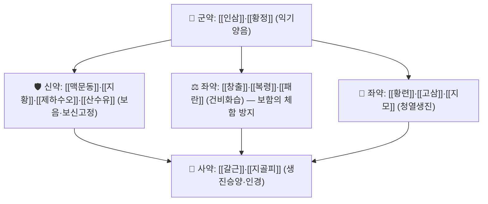

# 🍵 진력달과립 (津力達顆粒, Jinlida Granule)

> 🖼️ **이미지**: 구성 본초의 전탕·계량 실사(개방 소스 예시 사진) 2장 — **실제 제품 포장 사진은 확보하지 못했다(사유 기록: 제조사 자료는 링크로만 인용)**.

> **핵심 3줄 요약 (Key Summary)**:
> - 🌿 현대 중성약 복합 과립: [[인삼]]·[[황정]]·[[맥문동]]·[[지황]](익기양음) + [[창출]]·[[복령]]·[[패란]](건비화습) + [[황련]]·[[고삼]]·[[지모]](청열) + [[음양곽]]·[[산수유]]·[[제하수오]](보신고정) + [[단삼]]·[[갈근]]·[[여지핵]]·[[지골피]] 등 17종 구성
> - 🎯 **최적 적응**: 기음양허(氣陰兩虛) + 담습(痰濕)이 겹친 **전당뇨·내당능장애 + 복부비만 + 이상지질혈증** — 소갈 전단계
> - 🔬 **기전**: 인슐린 감수성 개선(HOMA-IR ↓)·간 지방증·염증 억제·산화스트레스 감소·베타세포 보호의 다표적 작용
> - <font color="#fa7e7e">⚠️ **주의**: 시험 기간 중 다른 혈당강하제 병용이 금지된 설계였다 — [[메트포르민]] 등 표준 약물과 병용 효과는 이 근거로 알 수 없다. 완제품 국내 사용 가능 여부는 별도 확인이 필요하다.</font>

---

## 📌 목차
1. [기본 처방 정보 & 군신좌사 구성](#1-기본-처방-정보--군신좌사-구성)
2. [방제학적 약재 상호작용 & 시너지 네트워크](#2-방제학적-약재-상호작용--시너지-네트워크)
3. [현대 분자약리학적 효능 & 작용 기전](#3-현대-분자약리학적-효능--작용-기전)
4. [적응 병증 및 체질별 감별 (Sweet Spot vs 금기)](#4-적응-병증-및-체질별-감별-sweet-spot-vs-금기)
5. [유사 처방군 감별 매트릭스](#5-유사-처방군-감별-매트릭스)
6. [임상 가감례 & 현대 질환별 응용](#6-임상-가감례--현대-질환별-응용)
7. [💡 사용자 진료실 핵심 필기 & 임상 팁](#7--사용자-진료실-핵심-필기--임상-팁)
8. [출처 및 학술 참고 문헌 (References)](#8-출처-및-학술-참고-문헌-references)

---

## 1. 기본 처방 정보 & 군신좌사 구성

* 출전·성격: 중국에서 2005년 [[제2형 당뇨병]] 치료제로 허가된 현대 복합 과립 제제(제조사 규격 9 g/포, 1일 3회, 8주 1코스, 허가번호 Z20050845). 고전 방제가 아니므로 **원전 조문은 존재하지 않는다.**
* **치법**: 익기양음(益氣養陰) · 건비운진(健脾運津) · 청열생진(淸熱生津)
* ⚠️ **군신좌사 표기에 대한 정직성 고지**: 근대 복합 제제라 고전적 군신좌사가 문헌으로 확정되어 있지 않다. 아래 표는 오늘 리뷰의 처방 구조 분석과 방제학 원칙에 따른 **재구성 해석**이다.

![[진력달과립_01_구성본초_전탕.jpg|400]]
> [그림 1: 한약 전탕액 실사 — 복합 처방의 전탕 형태를 보여 주는 개방 소스 예시 사진(진력달과립 제품 사진 아님) — Wikimedia Commons, CC BY-SA 4.0]

![[진력달과립_02_구성본초_실사.jpg|400]]
> [그림 2: 한약재 계량 실사(약재상에서 건조 본초를 저울에 달아 배합하는 장면) — 구성 본초 배합 과정의 참고 사진 — Wikimedia Commons, CC BY 2.0]

| 구분 | 약재명 | 처방 내 역할(해석) |
| :--- | :--- | :--- |
| **군약 (君藥)** | [[인삼]] · [[황정]] | 익기양음의 중심 — 기허와 음허를 동시에 세운다 |
| **신약 (臣藥)** | [[맥문동]] · [[지황]] · [[제하수오]] · [[산수유]] · [[음양곽]] | 보음·보신고정으로 군약 강화 |
| **좌약 (佐藥)** | [[황련]] · [[고삼]] · [[지모]] · [[지골피]](청열) · [[창출]] · [[복령]] · [[패란]](건비화습) · [[단삼]] · [[갈근]](활혈생진) · [[여지핵]](이기산결) | 청열·화습·활혈로 편향 조정 |
| **사약 (使藥)** | [[갈근]] · [[지골피]] | 생진승양·인경 |

> **배오 특징**: 청열(황련·고삼·지모) + 익기양음(인삼·황정·맥문동·지황) + 건비화습(창출·복령·패란) + 보신고정(음양곽·산수유·제하수오)의 **4축 구조**. 열을 빼면서 기력을 떨어뜨리지 않고, 보하면서 습이 정체하지 않게 설계한 구성이다.

---

## 2. 방제학적 약재 상호작용 & 시너지 네트워크



* [[인삼]] + [[황정]] 배오: 기(氣)와 음(陰)을 함께 세우는 상호 보완 — 한쪽만 쓰면 '보하는데 열이 오르거나(인삼 단독)', '눅이는데 기력이 떨어지는(황정 단독)' 편향이 생긴다
* [[창출]]·[[복령]]·[[패란]] + 보음약: 자음약의 점조(粘稠)함을 화습약이 받쳐 **복부 팽만·식욕저하를 막는** 방제학적 완충
* [[황련]] + [[갈근]]·[[단삼]]: 청열·생진·활혈을 묶어 **소갈의 조열(燥熱)과 혈액 점조도**를 함께 다룬다

---

## 3. 현대 분자약리학적 효능 & 작용 기전

### 1) 인슐린 감수성 개선 (주 기전)
* HOMA-IR −0.47, 공복 인슐린·혈당 동시 개선, 허리둘레 감소 — 즉 **포도당을 '덜 넣는' 것이 아니라 '잘 쓰게' 만드는 방향**이다 → [[인슐린 저항성]] · [[HOMA-IR]]
### 2) 대사·조직 수준 기전(전임상)
* 간 지방증·염증 억제 / 고지방식이 비만 모델에서 **갈색지방 열생성 활성화·미토콘드리아 생합성·지방산 산화 증가** / 산화스트레스 감소 / 췌장 베타세포 보호
### 3) 성분 수준 다표적
* [[베르베린]](황련) · [[푸에라린]](갈근) · [[진세노사이드]] Rb1·Rc·Rb2(인삼) · [[살비아놀산 B]](단삼) · [[이카린]]·에피메딘 B/C(음양곽) — 당·지질 대사에 다표적으로 관여

---

## 4. 적응 병증 및 체질별 감별 (Sweet Spot vs 금기)

```
[✅ 최적 적응증 (Sweet Spot)]
• 🎯 내당능장애(OGTT 2시간 140~199 mg/dL) + 복부비만(허리둘레 남 ≥90·여 ≥85 cm) + 대사이상 ≥1개
   → FOCUS 시험의 실제 포함 기준. 즉 '당뇨 바로 전 단계 + 대사증후군'
• 기음양허(氣陰兩虛) 소견 — 피로·입마름·야간 갈증 + 기력저하
• 설진: 설홍(舌紅)하고 태가 박(薄)하거나 소태(少苔) / 맥상: 세삭(細數)
• 중장년 이후 발병·서서히 진행한 대사 이상

[⚠️ 신중 투여 및 금기 (Caution / Contraindication)]
• 담습 편중 — 설태 후니(厚膩)·복부 팽만·연변에서는 자음약이 맞지 않는다(화습·건비 우선)
• 혈당강하제·인슐린 복용자 — 저혈당 위험. 자가혈당 측정 강화
• 중증 간·신장 기능 장애(시험 배제 기준: ALT 정상상한 3배 초과, 크레아티닌 >1.49 mg/dL)
• 임신·수유부, 1·2형 당뇨병 확진자, 갑상선 기능 이상·조절되지 않는 혈압 — 시험 배제군
• ⚠️ 시험 중 다른 혈당강하제·혈당강하 한약·건기식은 전면 금지 설계였다 → 병용 효과는 근거 없음
```

---

## 5. 유사 처방군 감별 매트릭스

| 처방명 | 핵심 구성 차이 | 주치 및 체질 차이 | 맥진/설진 차이 |
| :--- | :--- | :--- | :--- |
| [[진력달과립]] | 17종 — 익기양음 + 청열 + 화습 + 보신고정 4축 | 전당뇨·다중 대사이상, 기음양허 + 담습 | 설홍·박태, 맥세삭 |
| [[옥천환]] 계열 | [[인삼]]·[[황정]]·[[천화분]]·[[맥문동]] 중심 | 전통 소갈(消渴) — 갈증·다음 중심 | 설건홍, 맥허삭 |
| [[보중익기탕]] | [[황기]]·[[인삼]]·[[백출]]·[[승마]] | 중기하함·비위허약 | 설담, 맥허약 |
| [[태음조위탕]] | [[창출]]·[[향부자]]·[[천궁]] 등 | 담습·비만형 대사이상 | 설태후니, 맥활 |

---

## 6. 임상 가감례 & 현대 질환별 응용

* **수반 증상별 응용(구조 참고용 가감 방향)**:
  * 야간 갈증·다뇨가 심하면 → 보음 축([[맥문동]]·[[지황]]) 가중
  * 복부비만·설태 후니가 두드러지면 → 화습 축([[창출]]·[[복령]]·[[패란]]) 가중, 자음약 감량
  * 변비 경향 → [[여지핵]]·[[결명자]] 계열 검토
  * 수족냉·야간뇨 → [[음양곽]]·[[산수유]] 보신고정 축 강화
* **현대 질환 매핑**:
  * **내분비·대사**: 내당능장애, 공복혈당장애, 대사증후군, 이상지질혈증 동반 전당뇨
  * **순환기**: 경동맥 내중막두께 증가 등 아임상 죽상경화 동반
  * ⚠️ **확진 당뇨병의 단독 치료로 쓰지 않는다** — 근거 시험은 '예방'을 본 시험이고, 확진자에서는 표준 약물이 우선이다
* **양약 상호작용 (Herb–Drug Interaction)**:
  * **혈당 간섭** — 혈당강하 방향 상가 → 저혈당. [[메트포르민]]·설폰요소제·인슐린 병용 시 자가측정·증상 교육 필수 → [[저혈당]]
  * **CYP·수송체 간섭** — [[황련]]([[베르베린]])·[[단삼]] 등이 CYP3A4·P-gp에 관여할 수 있어 병용약 농도 변동 가능 → [[P-당단백(P-gp)]] · [[CYP3A4]]
  * **출혈 위험** — [[단삼]] 포함 → 항응고·항혈소판제 병용 시 주의
  * **복용 시점 분리** — 경구혈당강하제와 **1~2시간 간격** 권고

---

## 7. 💡 사용자 진료실 핵심 필기 & 임상 팁

> 🛡️ **Melt-In 원칙**: 원장님 필기는 상부 섹션에 녹여내고, 여기엔 상부에 담기지 않은 진료실 노하우만 남긴다. (원장님 기존 필기 없음 — 신규 개념)

* **처방 구조를 '그대로' 쓰는 법**: 국내에서 동일 완제 사용 가능 여부와 별개로, **구성 원리는 재현 가능**하다 — 청열(황련·고삼·지모) + 익기양음(인삼·황정·맥문동·지황) + 건비화습(창출·복령·패란) + 보신고정(음양곽·산수유). 변증이 기음양허·담습에 맞으면 이 4축으로 가감한다.
* **상담에서 정확히 말할 것**
  * 하드 아웃컴은 **당뇨 발생 41% 감소(HR 0.59)**, 정상혈당 회복 39% vs 26%다.
  * 반대로 **HbA1c 차이 0.20%포인트, 허리둘레 0.95 cm는 작은 변화**다. "혈당이 뚝 떨어진다"고 설명하면 실망을 만든다.
  * "부작용 94%" 같은 인용은 금물 — 시험의 이상반응 정의가 매우 넓어 양군 모두 90%를 넘었다.
* **진료 루틴 제안**
  1. 전당뇨 상담 시 **허리둘레·중성지방·HDL·혈압·OGTT** 다섯 항목을 함께 기록
  2. 중재 시작 3개월 후 **HbA1c·공복혈당(가능하면 OGTT)** 재평가 → [[경구포도당부하검사]]
  3. 최소 **2년** 관점으로 기대치를 맞춘다(시험 중앙 추적 2.20년)
* **환자 티스크립트**
  > "당뇨 바로 전 단계이면서 배가 나오고 혈압·중성지방까지 있는 분들을 2년 넘게 추적한 연구에서, 17가지 본초로 만든 과립을 드신 군은 당뇨로 넘어가는 비율이 43%에서 28%로 줄었습니다. 다만 이건 매일의 식사·운동 관리 위에 얹는 보조이고, 최소 2년은 꾸준히 가야 의미가 있습니다."

---

## 8. 출처 및 학술 참고 문헌 (References)

1. **Ji L, et al. (2024)**. *Jinlida for Diabetes Prevention in Impaired Glucose Tolerance and Multiple Metabolic Abnormalities: The FOCUS Randomized Clinical Trial*. **JAMA Intern Med**, 184(7):727-735. [PMID 38829648](https://pubmed.ncbi.nlm.nih.gov/38829648/) · [doi:10.1001/jamainternmed.2024.1190](https://doi.org/10.1001/jamainternmed.2024.1190)
   - **[연구 요약]**: 내당능장애 + 복부비만 + 대사이상 889명(진력달 442 vs 위약 443), 중앙 2.20년. **당뇨 발생 27.83% vs 42.66%, HR 0.59(95% CI 0.46~0.74, p<0.001)**, 정상 내당능 회복 39.18% vs 25.64%. HOMA-IR −0.47, 중성지방 −25.7 mg/dL 등 2차 지표도 개선.
2. **Jin D, Hou L, Han S, et al. (2020)**. *Basis and Design of a Randomized Clinical Trial to Evaluate the Effect of Jinlida Granules on Metabolic Abnormalities*. **Front Endocrinol (Lausanne)**, 11:415. [PMID 32670199](https://pubmed.ncbi.nlm.nih.gov/32670199/)
   - **[연구 요약]**: 진력달과립 **9 g 1일 3회**, 생활습관 병행, **3개월마다 OGTT** 평가 일정과 배제·중단 기준을 기술한 공개 프로토콜 — 중재 재현의 1차 자료.
3. **제조사 제품 정보** — Shijiazhuang Yiling Pharmaceutical, Jinlida Granule. [제품 페이지](https://en.yiling.com/pro/jinlida-granule)
   - **[공인 데이터]**: 구성 본초 17종 목록, 9 g/포 규격, 1일 3회 용법, 8주 1코스, 허가번호(Z20050845).
4. **이미지 출처**
   - 전탕 실사: [Chinese herbal decoction (一貫煎) on snow (Wikimedia Commons)](https://commons.wikimedia.org/wiki/File:Chinese_herbal_decoction_(一貫煎)_on_snow.jpg) — CC BY-SA 4.0
   - 본초 계량 실사: [Weighing the dried herbs at a Chinese medicine shop, Kinmen (Wikimedia Commons)](https://commons.wikimedia.org/wiki/File:2012-06-07_weighing_the_dried_herbs_at_an_Chinese_medicine_shop_at_Kinmen.jpg) — CC BY 2.0

---

## 📎 개념 학습 보충 (2026-09-26 논문 연계)

- 이 노트는 **2026-09-26 회차에서 신규 생성**된 처방 개념 파일이다(🧪 [[2026-09-26_대사노인질환_심층리뷰]] 1번).
- **한의원 적용 시 반드시 함께 읽을 것**: [[내당능장애]](적응 병증) · [[제2형 당뇨병]](진행 종점) · [[메트포르민]](병용 근거 없음 주의) · [[경구포도당부하검사]](평가 도구) · [[경동맥 내중막두께]](2차 결과)
