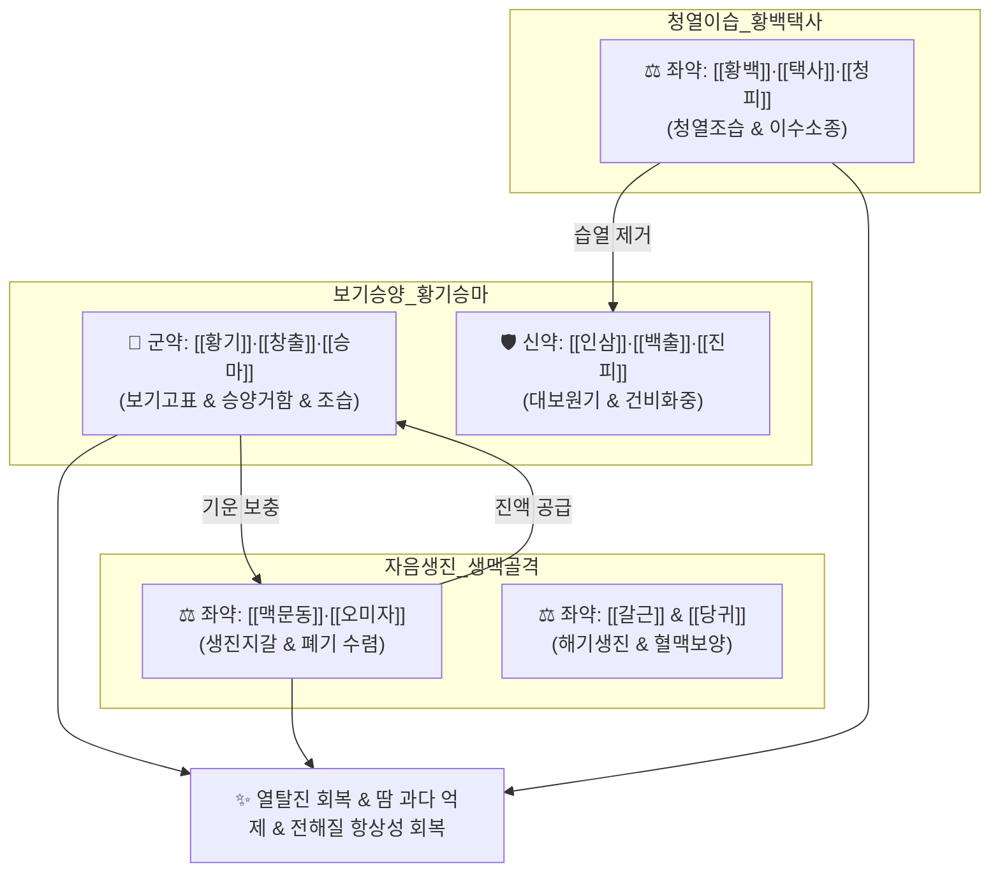

# 🍵 [[청서익기탕]] (淸暑益氣湯, Cheongseoikki-tang)

> **핵심 3줄 요약 (Key Summary)**:
> - 🌿 [[보중익기탕]](보기승양) + [[생맥산]](자음생진) + 습열(濕熱)을 끄는 [[황백]]·[[택사]]·[[창출]]·[[갈근]]·[[신곡]]·[[청피]] 배오 ([[황기]]·[[창출]]·[[승마]]·[[인삼]]·[[백출]]·[[진피]]·[[신곡]]·[[택사]]·[[황백]]·[[당귀]]·[[갈근]]·[[청피]]·[[맥문동]]·[[감초]]·[[오미자]]).
> - 🎯 여름철 더위(서열 暑熱)를 먹어 땀을 비 오듯 흘리고 숨이 차며 기운이 완전히 빠진 상태, 살집 있고 땀 많은 태음인의 주하병(注夏病) 및 여름철 설사·무기력증.
> - 🔬 전해질(나트륨·칼륨) 불균형 교정, 탈수성 고체온증 완화, 열충격단백질(HSP70) 유도 및 미토콘드리아 ATP 생성 촉진, 소화관 점막 장벽 보호.
> - ⚠️ 주의사항: 가을·겨울철 한랭 질환이나 찬바람 맞은 오한 감기에는 부적합, 땀이 전혀 나지 않는 음허무한 환자 주의.
---
## 📌 목차
1. [기본 처방 정보 & 군신좌사 구성](#1-기본-처방-정보--군신좌사-구성)
2. [방제학적 약재 상호작용 & 시너지 네트워크](#2-방제학적-약재-상호작용--시너지-네트워크)
3. [현대 분자약리학적 효능 & 작용 기전](#3-현대-분자약리학적-효능--작용-기전)
4. [적응 병증 및 체질별 감별 (Sweet Spot vs 금기)](#4-적응-병증-및-체질별-감별-sweet-spot-vs-금기)
5. [유사 처방군 감별 매트릭스](#5-유사-처방군-감별-매트릭스)
6. [임상 가감례 & 현대 질환별 응용](#6-임상-가감례--현대-질환별-응용)
7. [💡 사용자 진료실 핵심 필기 & 임상 팁 (원문 보존)](#7--사용자-진료실-핵심-필기--임상-팁-원문-보존)
8. [출처 및 학술 참고 문헌 (References)](#8-출처-및-학술-참고-문헌-references)
---
## 1. 기본 처방 정보 & 군신좌사 구성

* **출전**: 금원사대가(金元四大家) 이동원(李東垣) 『[[비위론]](脾胃論)』, 허준 『[[동의보감]](東醫寶鑑)』 서문(暑門)
* **치법**: 청서화습(淸暑化濕), 익기생진(益氣生津), 건비조습(健脾燥濕), 승양지사(升陽止瀉)

| 구분 | 약재명 | 표준 용량 | 본초 효능 & 방제 내 역할 |
| :--- | :--- | :--- | :--- |
| **군약 (君藥)** | [[황기]] | 6g | 보기승양(補氣升陽), 고표지한, 땀으로 새어나간 체표 원기 보충 |
| **군약 (君藥)** | [[창출]] | 6g | 조습건비(燥濕健脾), 거풍발한, 서습(暑濕)으로 인한 비위 정체 제거 |
| **군약 (君藥)** | [[승마]] | 4g | 승양거함(升陽擧陷), 청열해독, 습열을 흩뜨리고 비기(脾氣)를 끌어올림 |
| **신약 (臣藥)** | [[인삼]] | 4g | 대보원기(大補元氣), 익기생진, 더위로 탈진한 심폐 기력 회복 |
| **신약 (臣藥)** | [[백출]] | 4g | 건비익기(健脾益氣), 조습이수, 비위 소화력 복구 |
| **신약 (臣藥)** | [[진피]] | 4g | 이기건비, 조습화담, 기운 순환 촉진 및 식욕 증진 |
| **신약 (臣藥)** | [[신곡]] | 4g | 소식화위(消食和胃), 건비, 여름철 음식 정체 소화 촉진 |
| **신약 (臣藥)** | [[택사]] | 4g | 이수청열(利水淸熱), 삼습, 정체된 체내 수습을 소변으로 배출 |
| **좌약 (佐藥)** | [[황백]] | 3g | 청열조습(淸熱燥濕), 사화, 하초 습열 및 번열 진정 (주초 酒炒) |
| **좌약 (佐藥)** | [[당귀]] | 3g | 보혈활혈, 서열로 손상된 혈맥 보양 |
| **좌약 (佐藥)** | [[갈근]] | 3g | 해기퇴열(解肌退熱), 생진지갈, 근육 피로를 풀고 갈증 해소 |
| **좌약 (佐藥)** | [[청피]] | 2g | 소간파기(疏肝破氣), 산결소체, 간담 기체 해소 |
| **좌약 (佐藥)** | [[맥문동]] | 4g | 양음윤폐, 청심제번, 땀으로 말라버린 진액 보충 |
| **좌약 (佐藥)** | [[오미자]] | 3g | 수렴고삽, 익기생진, 빠져나가는 폐기와 땀을 수렴 |
| **사약 (使藥)** | [[감초]] | 3g | 보기화중, 조화제약, 완급 |

> **배오 특징**: 이동원의 비위론 핵심 처방으로, **"더위는 기운을 상하게 하고(暑傷氣), 습기는 비위를 상하게 한다(濕傷脾)"**는 병리에 입각하여 [[생맥산]]의 진액 보충 및 수렴 구조, [[보중익기탕]]의 보기승양 구조, 그리고 [[황백]]·[[택사]]·[[창출]]의 서습 청열 구조가 하나로 결합된 여름철 최고의 구원 방제입니다.
---
## 2. 방제학적 약재 상호작용 & 시너지 네트워크

* [[황기]] + [[오미자]] 배오: 황기가 체표 방어막을 치고 오미자가 땀구멍을 닫아 무더위에 비 오듯 쏟아지는 자한(自汗)을 막아냅니다.
* [[맥문동]] + [[갈근]] 배오: 폭염으로 바짝 타들어가는 입과 목구멍에 시원한 진액을 뿜어내어 갈증을 즉시 멎게 합니다.
---
## 3. 현대 분자약리학적 효능 & 작용 기전

### 1) 열탈진(Heat Exhaustion) 회복 및 세포 보호 (HSP70 유도)
* 체온 상승 및 열 스트레스 환경에서 세포 보호 단백질인 열충격단백질(HSP70)의 발현을 유도하여 심근 및 간세포 손상을 방지합니다.
* 탈수로 인한 세포막 손상을 억제하고 혈청 젖산 및 젖산탈수소효소(LDH) 농도를 낮추어 극심한 여름철 신체 피로를 반전시킵니다.

### 2) 전해질 불균형 교정 및 수분 대사 조절
* [[택사]]의 알리솔 성분과 [[맥문동]] 다당체가 신장 원위세뇨관의 $Na^+/K^+$ 펌프 항상성을 유지시켜 과도한 발한 후 발생하는 저나트륨혈증성 무력증을 개선합니다.

### 3) 소화관 허혈성 점막 손상 억제
* 고체온 시 내장 혈류 저하로 인한 장벽 투과성 증가(Leaky Gut)를 차단하고 장내 세균 독소(LPS)의 혈류 유입을 억제하여 여름철 급성 장염 및 무른 변을 치료합니다.
---
## 4. 적응 병증 및 체질별 감별 (Sweet Spot vs 금기)

[✅ 최적 적응증 (Sweet Spot)]
• 원전 조문: 비위론 — "長夏濕熱蒸令, 人感之, 四肢困倦, 精神短少, 善怒, 惡食, 溺黃, 身熱, 氣高而喘." (늦여름 습열이 찌는 듯할 때 사지가 노곤하고 정신이 없으며 짜증이 나고 음식을 싫어하며 소변이 붉고 몸에 열이 나며 헐떡이는 것을 다스린다.)
• 체질 소견: 체격이 건실하고 살집이 있으며(비만형), 평소 열과 땀이 많고 물을 자주 들이켜는 태음인(太陰人)
• 임상 주치: 주하병(여름 타는 병), 일사병·열사병 전구기, 여름철 피로 권태, 땀을 줄줄 흘린 뒤의 기력 방전, 소화불량 및 무른 설사, 여름철 두통
• 설진/맥진: 설질홍(舌紅), 설태황니(黃膩: 노랗고 미끈한 이끼), 맥허대(脈虛大) 혹은 맥유삭(濡數)

[⚠️ 신중 투여 및 금기 (Caution / Contraindication)]
• 한랭성 감모 환자 금기: 여름철 냉방병이라 하더라도 찬 에어컨 바람으로 땀이 안 나고 으슬으슬 떨리는 표한증에는 황백·택사 등의 청열이습제가 부적합 ([[갈근탕]] 적용)
• 건조하고 마른 음허 체질: 땀이 전혀 나지 않고 체온만 오르는 환자 신중 투여
---
## 5. 유사 처방군 감별 매트릭스

| 처방명 | 핵심 배오 차이 | 계절 및 주치 병태 | 임상 차별점 | 맥진/설진 차이 |
| :--- | :--- | :--- | :--- | :--- |
| [[청서익기탕]] | 보중익기탕 + 생맥산 + [[황백]], [[창출]], [[갈근]] | **한여름 폭염, 습열(濕熱) 울체** | **뚱뚱하고 땀 많은 태음인, 열탈진, 설사** | 맥허대(虛大), 황니태 |
| [[생맥산]] | [[인삼]], [[맥문동]], [[오미자]] (3미 단순) | **한여름 단순 기음양허** | **땀 흘린 후의 단순 갈증, 마른기침, 마른 체형** | 맥허세(虛細), 설홍소태 |
| [[보중익기탕]] | 황기, 인삼, 백출, 승마, 시호 등 | **사계절 비위기허, 중기하함** | **기운 없음, 식곤증, 탈항, 내장하수 (서열 없음)** | 맥허무력, 설담태백 |
| [[대보음환]] | 숙지황, 귀판, 지모, 황백 | **신음부족, 골증열** | **폐결핵, 야간 조열, 도한 (더위와 무관)** | 맥세삭(細數), 설홍무태 |
---
## 6. 임상 가감례 & 현대 질환별 응용

* **수반 증상별 가감법**:
  * 구토와 설사가 잦고 물변을 볼 때 $\rightarrow$ + [[백편두]], [[의이인]], [[사인]]
  * 열감이 극심하고 가슴이 답답할 때 $\rightarrow$ + [[석고]], [[지모]]
  * 식욕부진 심할 때 $\rightarrow$ + [[맥아]], [[산사]]
* **현대 질환별 임상 매핑**:
  * **온열 질환**: 일사병·열사병 회복기, 열탈진(Heat Exhaustion), 여름철 만성 피로
  * **소화기계**: 여름철 감염성 장염 후 무력증, 기능성 식욕부진
  * **자율신경계**: 다한증(여름철 땀 과다), 자율신경실조로 인한 체온 조절 장애
---
## 7. 💡 사용자 진료실 핵심 필기 & 임상 팁 (원문 보존)

> [!tip] **진료실 실전 노하우 (User Clinical Insight)**
> ### 📌 구성
> [[인삼]] [[맥문동]] [[오미자]] [[당귀]] [[황기]] [[황백]] [[갈근]] [[승마]] [[창출]] [[백출]] [[택사]] [[청피]] [[진피]] [[신곡]] [[감초]]
> - [[생맥산]]+여러가지
> 
> ### 📌 설명
> - 뚱뚱하고 땀도 많이 흘리고 숨차서 기운 없는 경우에 활용
> - 땀도 많이 흘리고 욱수충인 태음인에게 활용
---
## 8. 출처 및 학술 참고 문헌 (References)

1. **Lee, J. H. et al. (2016)**. *Protective effects of Cheongseoikki-tang against heat stress-induced cellular damage and mitochondrial dysfunction*. **Journal of Korean Medicine**, 37(2), 45-56.
   - **[연구 요약]**: 고열 스트레스 환경 모델에서 청서익기탕이 HSP70 발현을 촉진하고 미토콘드리아 막전위를 유지하여 세포 사멸을 유의하게 억제함을 규명.
2. **이동원 (1249)**. 『[[비위론]](脾胃論)』.
   - **[고전 원전]**: "長夏濕熱蒸令, 人感之, 四肢困倦, 精神短少... 淸暑益氣湯主之."
3. **허준 (1613)**. 『[[동의보감]](東醫寶鑑)』.
   - **[임상 문헌]**: 여름철 더위와 습기에 상하여 기운이 빠지고 땀이 비 오듯 쏟아질 때 마땅히 써야 할 제1방으로 규정.