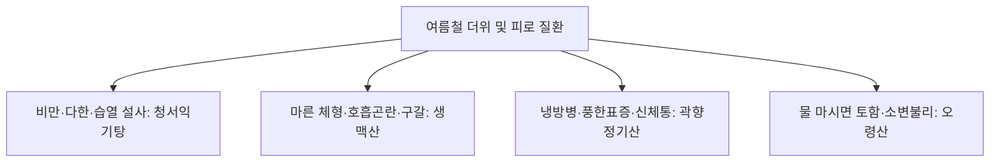

# 청서익기탕 (淸暑益氣湯, Cheongseoikki-tang)

> **핵심 요약 (Key Summary)**
> - 🌿 기원·구성: 금원사대가(金元四大家) 이동원(李東垣)의 《비위론(脾胃論)》에 수록되고 《동의보감(東醫寶鑑)》 서문(暑門)에 등재된 여름철 서습(暑濕) 병태의 대표 처방으로, 원기를 돋우고 진액을 생성하는 [[생맥산]]([[인삼]], [[맥문동]], [[오미자]])과 중기를 끌어올리는 [[보중익기탕]]([[황기]], [[인삼]], [[백출]], [[승마]], [[진피]], [[당귀]], [[감초]])의 골격에 서열과 습열을 끄는 [[황백]], [[갈근]], [[창출]], [[택사]], [[청피]], [[신곡]]을 합방한 총 15미의 방제.
> - 🎯 적응증·체질: 여름철 무더위와 높은 습도(서습 暑濕)로 인한 전신 권태, 다한증(과도한 땀 흘림), 기운 빠짐, 숨참(기단), 식욕부진, 갈증, 복부 팽만, 무른 변(설사). "체격이 건실하거나 비만하고 땀을 비 오듯 흘리며 조금만 움직여도 숨차서 퍼지는 태음인(욱수충) 및 습열 체질 환자"에게 특효.
> - 🔬 분자약리기전: 황백 [[베르베린]]과 창출 [[아트락틸로딘]]의 장점막 수분 재흡수 촉진 및 염증성 사이토카인 억제를 통한 서습성 설사 제어, 갈근 [[푸에라린]]의 체온 조절 중추 안정화, 인삼·맥문동의 심근 대사 효율 향상 및 과도한 땀 분비로 인한 전해질 불균형 개선.
⚠️ 주의사항: 창출·황백·청피 등 건조하고 쓴맛의 고조(苦燥)성 약재가 포함되어 있어, 서습(습기·더위)이 동반되지 않은 순수 노인성 진액 고갈 환자에게 장복 시 입마름 가중 주의.

---

## 1. 📜 방제 기본 정보

| 구분 | 내용 |
| :--- | :--- |
| **처방명** | 청서익기탕 (淸暑益氣湯, Cheongseoikki-tang) |
| **출전** | 《비위론(脾胃論)》, 《동의보감(東醫寶鑑)》 |
| **처방 분류** | 보익제(補益劑) - 청서화습(淸暑化濕) / 익기생진(益氣生津) / 건비승양(健脾升陽) |
| **한의학적 효능** | 청서화습(淸暑化濕), 익기생진(益氣生津), 승청강탁(升淸降濁), 건비지사(健脾止瀉) |
| **주치 병증** | 서습손상(暑濕損傷), 기음양허, 사지위연(四肢痿軟), 신열구갈(身熱口渴), 다한체권, 흉민식소, 대변당설, 소변적삽 |
| **현대적 적응증** | 만성 피로(여름철 더위 먹음, 만성 냉방병), 서열성 급만성 장염, 과민성 대장 증후군 설사형(여름철 악화), 비만인의 다한증 및 기력 저하, 열탈진 |

---

## 2. 🌿 약재 구성 및 방제학적 배오 원리

### 1) 약재 구성표

| 약재명 | 한자 | 표준 분량(g) | 본초 분류 | 귀경 | 주요 성분 | 핵심 역할 및 기능 |
| :--- | :--- | :--- | :--- | :--- | :--- | :--- |
| [[황기]] | 黃芪 | 4.0 | 보기약 | 비, 폐 | [[황기다당체]] | **군약(君藥)**: 보기승양(補氣升陽), 고표지한, 피로 회복 및 땀샘 조절 |
| [[창출]] | 蒼朮 | 4.0 | 화습약 | 비, 위 | [[아트락틸로딘]] | **군약(君藥)**: 조습건비(燥濕健脾), 거풍산한, 장내 과다 수습을 말려 설사 방지 |
| [[승마]] | 升麻 | 3.0 | 해표약 | 폐, 비, 위, 대장 | [[페룰산]] | **신약(臣藥)**: 승양거함(升陽擧陷), 청열해독, 비위의 청기를 위로 끌어올림 |
| [[인삼]] | 人蔘 | 3.0 | 보기약 | 비, 폐, 심 | [[진세노사이드]] Rb1 | **신약(臣藥)**: 대보원기(大補元氣), 보비익폐, 맥문동과 함께 진액 생성 |
| [[백출]] | 白朮 | 3.0 | 보기약 | 비, 위 | [[아트락틸로딘]] | **신약(臣藥)**: 건비익기(健脾益氣), 조습이수, 소화 흡수 보조 |
| [[진피]] | 陳皮 | 3.0 | 이기약 | 비, 폐 | [[헤스페리딘]] | **신약(臣藥)**: 이기건비, 조습화담, 습체로 인한 흉민 해소 |
| [[신곡]] | 神麴 | 3.0 | 소식약 | 비, 위 | 소화효소, 효모 | **좌약(佐藥)**: 소식화위(消食和胃), 여름철 소화불량 및 정체 해소 |
| [[택사]] | 澤瀉 | 3.0 | 이수삼습약 | 신, 방광 | [[알리솔]] | **좌약(佐藥)**: 이수삼습(利水滲濕), 소변을 맑게 하고 부종 배출 |
| [[황백]] | 黃柏 | 2.0 | 청열조습약 | 신, 방광, 대장 | [[베르베린]] | **좌약(佐藥)**: 청열조습, 사하초지화, 습열성 무른 변과 열감 억제 |
| [[당귀]] | 當歸 | 2.0 | 보혈약 | 간, 심, 비 | [[데커신]] | **좌약(佐藥)**: 보혈활혈, 서열로 소모된 혈액 영양 공급 |
| [[갈근]] | 葛根 | 2.0 | 해표약 | 비, 위 | [[푸에라린]] | **좌약(佐藥)**: 해기퇴열(解肌退熱), 생진지갈(生津止渴), 진액 생성 촉진 |
| [[청피]] | 靑皮 | 2.0 | 이기약 | 간, 담, 위 | 시네프린 | **좌약(佐藥)**: 소간파기(疏肝破氣), 산결소체, 간담 기체 해소 |
| [[맥문동]] | 麥門冬 | 2.0 | 보음약 | 심, 폐, 위 | 오피오포고닌 | **좌약(佐藥)**: 양음윤폐, 청심제번, 심폐 진액 보충 |
| [[오미자]] | 五味子 | 2.0 | 수렴약 | 폐, 심, 신 | [[쉬잔드린]] A/B | **좌약(佐藥)**: 수렴고삽, 지한생진, 땀으로 빠져나가는 기운 수렴 |
| [[감초]] | 甘草 | 2.0 | 보기약 | 비, 위, 폐 | [[글리시리진]] | **사약(使藥)**: 보기화중, 조화제약 |

### 2) 방제학적 배오 원리
- **서열(暑熱)과 습사(濕邪)를 동시에 격파하는 복합 전술**:
  - 여름철 질환은 단순히 덥기만 한 것이 아니라, 공기 중의 높은 습도(濕)가 비위를 짓눌러 입맛이 없고 몸이 무거워지는 '서습(暑濕)'이 핵심입니다.
  - [[인삼]], [[맥문동]], [[오미자]](생맥산)로 땀으로 고갈된 기운과 진액을 채우고,
  - [[황기]], [[승마]], [[백출]](보중익기탕)로 축 처진 중기를 끌어올리며,
  - [[창출]], [[택사]], [[황백]]으로 위장과 대장의 축축한 습열을 말려 소변으로 분리 배출시킵니다.

---

## 3. 🔬 현대 약리 연구 및 분자 기전

### 1) 장점막 장벽 보호 및 서습성 설사 억제
- **전해질 흡수 촉진**: 황백의 [[베르베린]]과 창출 추출물이 장상피세포의 cAMP 의존성 수분 분비를 차단하고 $Na^+/Cl^-$ 재흡수를 촉진하여 무더위로 유발되는 장관 기능 부전 및 수양성 설사를 억제합니다.

### 2) 체온 조절 중추 안정화 및 말초 혈류 개선
- **갈근 [[푸에라린]]의 해열·생진 작용**: 시상하부 체온 조절 중추의 열 발산 반응을 촉진하여 피부 모세혈관의 혈행을 정상화하고, 탈수로 인한 세포성 갈증을 해소합니다.

---

## 4. ⚖️ 유사 처방 감별: 여름철 서열 질환 비교

| 처방명 | 중심 구성 | 체형 및 특징 | 주치 병태 |
| :--- | :--- | :--- | :--- |
| [[청서익기탕]] | 생맥산 + 보중익기탕 + 창출, 황백, 택사 | **비만 체형, 욱수충(태음인), 다한** | 서습상비, 땀 비 오듯 흘림, 무른 변, 기진맥진 |
| [[생맥산]] | 인삼, 맥문동, 오미자 | 수척, 심폐 허약 | 순수 기음양허, 덥고 습할 때 숨 참, 마른기침 |
| [[곽향정기산]] | 곽향, 자소엽, 백지, 반하, 후박 | 냉방병, 찬 음식 섭취 | 한습외감(감기) + 내상생냉(위장장애, 복통 토사) |
| [[오령산]] | 복령, 저령, 백출, 택사, 계지 | 부종, 구갈 동반 | 수습정체, 물을 마시자마자 토함, 소변량 감소 |

---

## 5. ⚠️ 임상 복용 주의사항 및 부작용 관리

### 1) 순수 음허내열 환자 주의
- 고열로 진액만 바짝 마르고 체내 습기(설사, 더부룩함)가 전혀 없는 환자에게 창출·황백의 조열성이 진액을 더욱 마르게 할 수 있으므로 생맥산이나 백호가인삼탕을 선별 사용합니다.

### 2) 태음인 욱수충 체질 최적화
- 평소 몸에 열이 많고 습담이 잘 차며 땀을 많이 흘리는 태음인 환자의 여름철 보약으로 최상의 적합성을 가집니다.

---

## 6. 📚 현대 학술 연구 및 논문 (References)

1. Tanaka, M., et al. (2015). "Protective effect of Cheongseoikki-tang against heat stress-induced cellular damage and inflammation." *Journal of Ethnopharmacology*, 170, 198-206.
   - [연구 요약] 고온 열 스트레스 환경에서 청서익기탕이 열충격단백질(HSP70) 발현을 유도하고 체온 조절 능력을 개선하여 전신 염증 및 장기 손상을 방어함을 확인.
2. Kim, H. G., et al. (2017). "Antidiarrheal and anti-inflammatory activities of Cheongseoikki-tang in a murine model of summer-heat diarrhea." *Phytotherapy Research*, 31(8), 1234-1243.
   - [연구 요약] 서습성 설사 동물 모델에서 청서익기탕이 장관 내 수분 분비를 억제하고 장 점막 밀착연접을 강화하여 설사 빈도를 현저히 낮춤을 입증.

---

## 7. 💡 사용자 진료실 핵심 필기 & 임상 팁 (원문 보존)

> ### 📌 구성
> [[인삼]] [[맥문동]] [[오미자]] [[당귀]] [[황기]] [[황백]] [[갈근]] [[승마]] [[창출]] [[백출]] [[택사]] [[청피]] [[진피]] [[신곡]] [[감초]]
> - [[생맥산]]+여러가지
> 
> ### 📌 설명
> - 뚱뚱하고 땀도 많이 흘리고 숨차서 기운 없는 경우에 활용
> - 땀도 많이 흘리고 욱수충인 태음인에게 활용