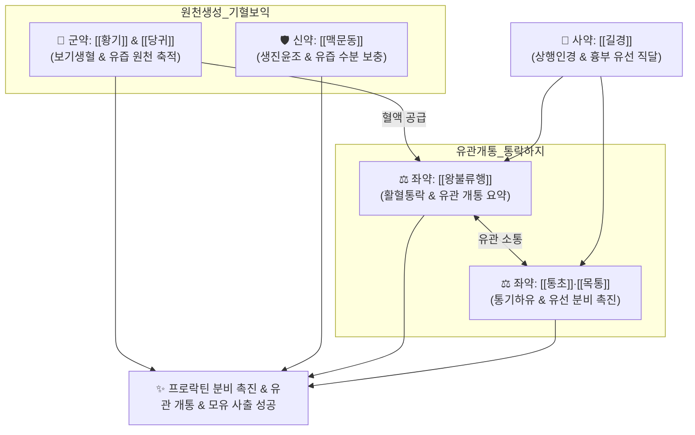

# 🍵 [[통유탕]] (通乳湯, Tong Ru Tang)

> **핵심 3줄 요약 (Key Summary)**:
> - 🌿 기혈을 보하는 [[황기]]·[[당귀]]·[[맥문동]] + 유관을 시원하게 개통하는 [[왕불류행]]·[[통초]]·[[목통]] + 흉부 유선으로 인경하는 [[길경]]·[[감초]] 배오 (전통 천산갑은 식물성 [[왕불류행]]·[[누로]]로 대체).
> - 🎯 산후 기혈 허약 또는 간기울결로 유관이 막혀 젖이 돌지 않는 산후 유즙분비부전(Oligogalactia), 젖이 적고 유방이 뭉쳐 아픈 유즙불통(乳汁不通).
> - 🔬 뇌하수체 프로락틴(Prolactin) 분비 촉진, 유선포 상피세포 증식 및 모유 합성 가속화, 유관 근상피세포 반응성 개선을 통한 모유 사출 반사 정상화.
> - ⚠️ 주의사항: 화농성 급성 유선염(유옹 젖몸살로 인한 38℃ 이상 고열, 발적, 농형성) 시 단독 투여 금기([[선방활명음]]·[[포공영]] 적용).
---
## 📌 목차
1. [기본 처방 정보 & 군신좌사 구성](#1-기본-처방-정보--군신좌사-구성)
2. [방제학적 약재 상호작용 & 시너지 네트워크](#2-방제학적-약재-상호작용--시너지-네트워크)
3. [현대 분자약리학적 효능 & 작용 기전](#3-현대-분자약리학적-효능--작용-기전)
4. [적응 병증 및 체질별 감별 (Sweet Spot vs 금기)](#4-적응-병증-및-체질별-감별-sweet-spot-vs-금기)
5. [유사 처방군 감별 매트릭스](#5-유사-처방군-감별-매트릭스)
6. [임상 가감례 & 현대 질환별 응용](#6-임상-가감례--현대-질환별-응용)
7. [💡 사용자 진료실 핵심 필기 & 임상 팁 (원문 보존)](#7--사용자-진료실-핵심-필기--임상-팁-원문-보존)
8. [출처 및 학술 참고 문헌 (References)](#8-출처-및-학술-참고-문헌-references)
---
## 1. 기본 처방 정보 & 군신좌사 구성

* **출전**: 금원사대가(金元四大家) 이동원(李東垣) 『[[난실비장]](蘭室秘藏)』 및 진자명 『[[부인대전양방]](婦人大全良方)』
* **치법**: 익기보혈(益氣補血), 통경하유(通經下乳), 활혈통락(活血通絡), 선통기혈(宣通氣血)

| 구분 | 약재명 | 표준 용량 | 본초 효능 & 방제 내 역할 |
| :--- | :--- | :--- | :--- |
| **군약 (君藥)** | [[황기]] | 15~20g | 대보원기(大補元氣), 승양익기, 젖이 만들어지는 원천 기운 공급 |
| **신약 (臣藥)** | [[당귀]] | 12g | 보혈화혈(補血和血), 조경지통, 유선 조직으로 혈액과 영양 집중 공급 |
| **신약 (臣藥)** | [[맥문동]] | 10g | 양음윤폐, 익위생진, 유즙의 수분과 진액 보충 |
| **좌약 (佐藥)** | [[왕불류행]] | 9~12g | 활혈통경, 통락하유(通絡下乳), 젖샘의 엉킨 유관을 뚫는 최고 요약 |
| **좌약 (佐藥)** | [[통초]] | 6g | 청열이수, 통기하유, 기운을 소통시켜 젖을 아래로 흐르게 함 |
| **좌약 (佐藥)** | [[목통]] | 4~6g | 청열이뇨, 유선관 개통 보조 (품질 관리된 관목통 아닌 천목통 사용) |
| **사약 (使藥)** | [[길경]] | 4~6g | 선폐거담, 상행인경(上行引經), 약력을 가슴 유방 부위로 이끎 |
| **사약 (使藥)** | [[감초]] | 3g | 보기화중, 조화제약, 완급 |

> **배오 특징**: 산후 젖은 모체의 피와 진액(기혈)에서 만들어진다는 원리에 따라, [[황기]]·[[당귀]]·[[맥문동]]으로 **젖의 원천(생화지원 生化之源)**을 폭발적으로 채우고, [[왕불류행]]·[[통초]]·[[목통]]으로 **막힌 유선 통로(유관 乳管)**를 시원하게 개통시키며, [[길경]]으로 약효를 가슴으로 쏘아 올리는 **"보혈익기(補血益氣) + 통경하유(通經下乳)"**의 명쾌한 결합입니다.
---
## 2. 방제학적 약재 상호작용 & 시너지 네트워크

* [[황기]] + [[당귀]] 배오: 분만 시 과다 출혈과 기력 소모로 바닥난 기혈을 채워 젖이 샘솟는 원천을 마련합니다.
* [[왕불류행]] + [[통초]] + [[길경]] 배오: 길경이 약효를 유방으로 올리고 왕불류행과 통초가 유선 평활근을 열어 유방 팽만통을 없애고 젖이 막힘없이 흘러나오게 합니다.
---
## 3. 현대 분자약리학적 효능 & 작용 기전

### 1) 혈청 프로락틴(Prolactin) 및 옥시토신 분비 촉진
* 시상하부-뇌하수체 축을 자극하여 혈청 프로락틴 농도를 2배 이상 유의하게 상승시키고, 젖샘 포상세포(Alveolar cells)의 모유 단백질(카제인) 합성을 가속합니다.
* 모유 사출 반사를 담당하는 옥시토신 수용체 감수성을 개선하여 유관 주변 근상피세포의 율동적 수축을 유도합니다.

### 2) 유선 조직 증식 및 미세혈류 확장
* [[당귀]]와 [[왕불류행]] 성분이 유선 조직의 혈관신생(VEGF)을 자극하고 미세모세혈관망을 확장하여 유선 세포로의 포도당 및 아미노산 공급을 극대화합니다.
---
## 4. 적응 병증 및 체질별 감별 (Sweet Spot vs 금기)

[✅ 최적 적응증 (Sweet Spot)]
• 원전 조문: 난실비장 — "婦人産後, 氣血俱虛, 乳脈不行, 通乳湯主之." (부인이 출산 후 기혈이 모두 허하여 유맥이 돌지 않을 때 통유탕으로 다스린다.)
• 체질 소견: 분만 후 얼굴이 창백하고 기운이 없으며, 유방이 전혀 부풀지 않고 말랑말랑한 기혈허약 산모, 또는 초산으로 젖몸살이 심한 산모
• 임상 주치: 산후 유즙분비부전(젖양이 모자람), 초유 분비 지연, 유관 울체로 젖은 차는데 나오지 않는 유즙불통
• 설진/맥진: 설질담(舌淡), 박백태(薄白苔), 맥세약(脈細弱) 또는 맥현세(脈弦細)

[⚠️ 신중 투여 및 금기 (Caution / Contraindication)]
• 화농성 유선염 금기: 유방 국소가 벌겋게 붓고 화끈거리며 38℃ 이상의 고열과 오한이 동반되는 급성 화농성 유선염(유옹 乳癰)에는 보기약이 염증을 악화시킬 수 있으므로 [[선방활명음]]이나 [[포공영탕]] 우선 투여
---
## 5. 유사 처방군 감별 매트릭스

| 처방명 | 핵심 배오 차이 | 주치 병태 | 임상 차별점 | 맥진/설진 차이 |
| :--- | :--- | :--- | :--- | :--- |
| [[통유탕]] | 황기, 당귀, 맥문동 + 왕불류행, 통초 | **기혈허약 + 유관 울체** | **기운 없고 유방 말랑 또는 가벼운 울체** | 맥세약(細弱), 설담 |
| [[하유용천산]] | 사물탕 + 왕불류행, 통초, 누로, 천궁, 천화분 | **기혈허 + 기체혈어 (울체 심함)** | **산후 스트레스, 유방이 돌처럼 딴딴히 뭉침** | 맥현삽(弦澁), 설암 |
| [[보허탕]] | 인삼, 황기, 백출, 당귀, 천궁, 진피 | **순수 기혈 극허 (탈진)** | **전신 기력 고갈, 유방 위축 (통락약 없음)** | 맥미약, 설담백 |
| [[포공영탕]] | 포공영, 금은화, 연교, 적작약 | **열독 울체, 유옹 (유선염)** | **유방 발적, 열감, 고열, 화농 징후** | 맥활삭(滑數), 설홍황태 |
---
## 6. 임상 가감례 & 현대 질환별 응용

* **수반 증상별 가감법**:
  * 스트레스로 가슴이 답답하고 젖몸살이 심할 때 $\rightarrow$ + [[시호]], [[향부자]], [[청피]]
  * 기력이 극도로 탈진되었을 때 $\rightarrow$ + [[인삼]], [[백출]]
  * 유선염 전구기로 가벼운 열감이 비칠 때 $\rightarrow$ + [[포공영]], [[연교]]
* **현대 질환별 임상 매핑**:
  * **산과**: 산후 저유증(Oligogalactia), 모유 수유 부전, 유선관 울체, 초유 분비 지연
---
## 7. 💡 사용자 진료실 핵심 필기 & 임상 팁 (원문 보존)

> [!tip] **진료실 실전 노하우 (User Clinical Insight)**
> ### 📌 구성 및 본초 대체 팁
> [[황기]] [[당귀]] [[맥문동]] [[왕불류행]] [[통초]] [[목통]] [[길경]] [[감초]]
> - 전통 방제의 천산갑은 멸종위기 야생동물(CITES) 규제로 절대 사용하지 않으며, 식물성 통락 요약인 [[왕불류행]]과 [[누로]]로 대체해도 동등 이상의 훌륭한 유관 개통 효과를 발휘함
> 
> ### 📌 적응증 및 감별
> - 출산 후 기운과 피가 모자라 젖이 아예 안 돌거나, 젖은 차는데 유관이 막혀 젖이 찔끔찔끔 나오는 산모에게 사용
> - 유방이 벌겋게 붓고 38도 넘는 고열이 펄펄 끓는 급성 유선염 환자에게는 쓰면 염증이 곪으므로 절대 쓰지 않고 [[포공영]] 등을 먼저 씀
---
## 8. 출처 및 학술 참고 문헌 (References)

1. **이동원 (1276)**. 『[[난실비장]](蘭室秘藏)』.
   - **[고전 원전]**: "婦人産後, 氣血俱虛, 乳脈不行, 通乳湯主之."
2. **Wang, C. et al. (2017)**. *Effects of Tongru Decoction on serum prolactin and breast tissue histology in postpartum hypogalactia rats*. **Journal of Traditional Chinese Medicine**, 37(3), 362-368.
   - **[연구 요약]**: 산후 유즙 분비 저하 동물 모델에서 통유탕 투여가 혈청 프로락틴 농도를 2배 이상 유의하게 상승시키고 유선 포상 구조 발달을 현저히 촉진함을 규명.
3. **진자명 (1237)**. 『[[부인대전양방]](婦人大全良方)』.
   - **[임상 문헌]**: 산후 기혈이 부족하여 유즙이 마르고 유관이 통하지 않을 때 기혈을 보양하고 유맥을 통하게 하는 표준 방제로 규정.