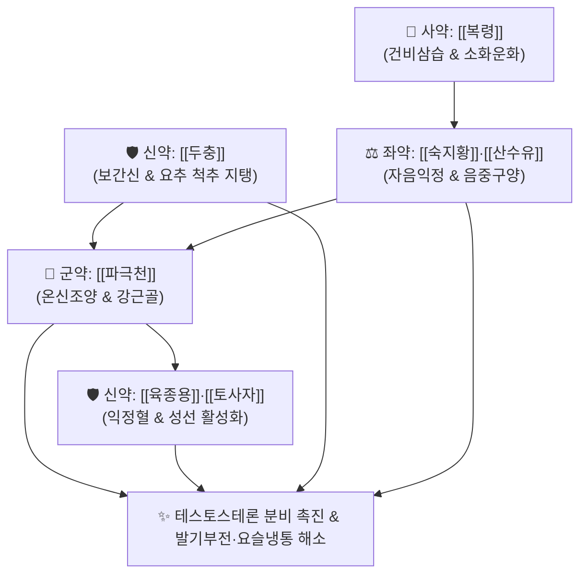

# 🍵 [[파극천환]] (巴戟天丸, Ba Ji Tian Wan)

> **핵심 3줄 요약 (Key Summary)**:
> - 🌿 보신조양(補腎助陽)의 [[파극천]]·[[육종용]]·[[토사자]] + 강근장골의 [[두충]] + 자음익정의 [[숙지황]]·[[산수유]]·[[복령]] 배오.
> - 🎯 하원 허랭(下元虛冷)과 신양부족으로 인한 발기부전(양위), 조루, 소변 야간빈뇨, 허리와 무릎이 시리고 힘이 빠지는 요슬산연(腰膝酸軟), 여성 자궁냉증 불임.
> - 🔬 HPG 축 자극을 통한 혈청 테스토스테론 분비 촉진, 고환 라이디히 세포(Leydig Cell) 사멸 억제, 조골세포 증식 촉진 및 척추 관절 연골 기질 보존.
> - ⚠️ 주의사항: 파극천의 목심(木心)을 완전히 제거하여 번조 방지, 음허화왕(음허 발열, 성욕 항진) 및 습열 소변통 환자 복용 금기.
---
## 📌 목차
1. [기본 처방 정보 & 군신좌사 구성](#1-기본-처방-정보--군신좌사-구성)
2. [방제학적 약재 상호작용 & 시너지 네트워크](#2-방제학적-약재-상호작용--시너지-네트워크)
3. [현대 분자약리학적 효능 & 작용 기전](#3-현대-분자약리학적-효능--작용-기전)
4. [적응 병증 및 체질별 감별 (Sweet Spot vs 금기)](#4-적응-병증-및-체질별-감별-sweet-spot-vs-금기)
5. [유사 처방군 감별 매트릭스](#5-유사-처방군-감별-매트릭스)
6. [임상 가감례 & 현대 질환별 응용](#6-임상-가감례--현대-질환별-응용)
7. [💡 사용자 진료실 핵심 필기 & 임상 팁 (원문 보존)](#7--사용자-진료실-핵심-필기--임상-팁-원문-보존)
8. [출처 및 학술 참고 문헌 (References)](#8-출처-및-학술-참고-문헌-references)
---
## 1. 기본 처방 정보 & 군신좌사 구성

* **출전**: 송대(宋代) 『[[태평혜민화제국방]](太平惠民和劑局方)』
* **치법**: 온신조양(溫腎助陽), 익정전수(益精塡髓), 강근장골(强筋壯骨), 거풍제습(祛風除濕)

| 구분 | 약재명 | 표준 용량 | 본초 효능 & 방제 내 역할 |
| :--- | :--- | :--- | :--- |
| **군약 (君藥)** | [[파극천]] | 15g | 온신조양(溫腎助陽), 강근골, 명문화(命門火)를 지피고 한습을 몰아냄 (거심 去心) |
| **신약 (臣藥)** | [[육종용]] | 12g | 보신익정(補腎益精), 윤장통변, 신양을 돕고 정혈을 보충하여 마르지 않게 함 |
| **신약 (臣藥)** | [[토사자]] | 10g | 보양고정(補陽固精), 양간명목, 음양을 조화롭게 보하고 정액 유실 방지 |
| **신약 (臣藥)** | [[두충]] | 10g | 보간신(補肝腎), 강근골, 요추와 무릎 관절을 견고히 보강 (염초 鹽炒) |
| **좌약 (佐藥)** | [[숙지황]] | 12g | 자음보혈(滋陰補血), 익정전수, 양기를 보할 때 음액이 마르지 않도록 음중구양(陰中求陽) |
| **좌약 (佐藥)** | [[산수유]] | 8g | 보간익신, 삽정지고, 정혈을 수렴하여 고정 |
| **사약 (使藥)** | [[복령]] | 8g | 건비삼습, 보약들의 점체성을 운화시키고 소변을 맑게 소통 |

> **배오 특징**: 온열성 약재인 [[파극천]]·[[육종용]]·[[토사자]]로 하초의 명문양기(命門陽氣)를 집중적으로 북돋우면서도, [[숙지황]]·[[산수유]]의 자음익정 약재를 배오하여 **"양기가 자라되 음혈이 마르지 않고, 음혈이 충만하되 양기가 꺾이지 않는"** 신양보익(腎陽補益)의 균형을 완성했습니다.
---
## 2. 방제학적 약재 상호작용 & 시너지 네트워크

* [[파극천]] + [[육종용]] 배오: 차가워진 비뇨생식기에 온기와 혈액을 불어넣어 해면체 충혈을 돕고 조루를 방지합니다.
* [[두충]] + [[파극천]] 배오: 간신의 양기를 북돋워 퇴행성으로 약해진 요추 디스크와 무릎 연골의 기질을 단단하게 지탱합니다.
---
## 3. 현대 분자약리학적 효능 & 작용 기전

### 1) 혈청 테스토스테론 분비 촉진 및 성기능 개선
* 파극천의 모노트로페인(Monotropein) 및 바지자수(Bajijiasu) 성분이 뇌하수체 LH 분비를 촉진하고 고환 라이디히 세포(Leydig Cell)의 테스토스테론 합성 효소(StAR, 3β-HSD)를 활성화합니다.
* 해면체 평활근의 eNOS 활성을 자극하여 산화질소([[NO]])-cGMP 경로를 통해 발기 강직도와 지속시간을 향상시킵니다.

### 2) 조골세포 증식 및 관절 연골 보호
* [[두충]]의 피노레시놀 및 제니포시드산 성분이 조골세포 증식을 촉진하고 파골세포 활성을 억제하여 퇴행성 척추증 및 골다공증성 요통을 완화합니다.

### 3) 항산화 및 정자 형성(Spermatogenesis) 촉진
* [[육종용]]의 에키나코사이드(Echinacoside) 성분이 고환 조직의 과산화지질(MDA) 생성을 억제하고 정원세포의 세포자멸사를 막아 정자 수와 활동성을 증가시킵니다.
---
## 4. 적응 병증 및 체질별 감별 (Sweet Spot vs 금기)

[✅ 최적 적응증 (Sweet Spot)]
• 원전 조문: 화제국방 — "治下元虛冷, 臍腹冷痛, 陰痿精寒, 腰膝酸軟, 小便頻數." (하원이 차갑고 배꼽 주변이 시리며 아프고, 발기가 안 되고 정액이 차며 허리와 무릎이 시리고 나른하며 소변이 잦은 것을 다스린다.)
• 체질 소견: 평소 아랫배와 손발이 차고 허리에 힘이 없으며, 조금만 무리해도 허리가 끊어질 듯 시린 양허 체질 (소음인·태음인 신양허)
• 임상 주치: 남성 발기부전, 조루, 정자 무력증, 노인성 야간뇨 및 요실금, 퇴행성 척추관 협착증 요통, 여성 자궁냉증성 불임
• 설진/맥진: 설질담백(舌淡白), 백태(白苔), 맥침세무력(脈沈細無力) 혹은 맥침완(沈緩)

[⚠️ 신중 투여 및 금기 (Caution / Contraindication)]
• 음허화왕(陰虛火旺) 환자 금기: 오후 조열, 도한, 입마름이 심하고 성욕은 있는데 정액이 새는 환자에게 투여하면 화열 악화 ([[지백지황환]] 적용)
• 습열 하주성 요로감염(배뇨통, 농뇨) 환자 금기
---
## 5. 유사 처방군 감별 매트릭스

| 처방명 | 핵심 배오 차이 | 주치 타깃 및 약성 | 임상 차별점 | 맥진/설진 차이 |
| :--- | :--- | :--- | :--- | :--- |
| [[파극천환]] | 파극천, 육종용, 토사자, 두충, 숙지황 | **하원 허랭, 온보신양, 강근골** | **발기부전, 조루, 허리 무릎 시림** | 맥침세무력, 설담태백 |
| [[우차신기환]] | 팔미지황환 + 우슬, 차전자 | **신양허 + 수습 정체, 부종** | **하지 부종, 심한 야간뇨, 당뇨 신경병증** | 맥침지(沈遲), 설담반대 |
| [[오자연종환]] | 구기자, 토사자, 복분자, 오미자, 차전자 | **정혈 고갈, 생식능 증진** | **정자 수 부족, 남성 난임 위주 (온열성 완만)** | 맥현세, 설담홍 |
| [[팔미지황환]] | 육미지황탕 + 육계, 포부자 | **신양허 명문화쇠 전신 대사** | **전신 오한, 사지 냉통, 노인 허로** | 맥침미(沈微), 설담 |
---
## 6. 임상 가감례 & 현대 질환별 응용

* **수반 증상별 가감법**:
  * 사지 말초 냉증이 극심할 때 $\rightarrow$ + [[육계]], [[부자]]
  * 무정자증 및 정자 운동성 극저하 시 $\rightarrow$ + [[복분자]], [[구기자]], [[자하거]]
  * 요추 디스크 신경통 심할 때 $\rightarrow$ + [[우슬]], [[구척]], [[속단]]
* **현대 질환별 임상 매핑**:
  * **비뇨생식기**: 남성 갱년기 증후군(PADAM), 발기부전(ED), 조루증, 핍정자증
  * **근골격계**: 퇴행성 요추증, 요추관 협착증, 만성 퇴행성 슬관절염
  * **부인과**: 하복부 냉증, 자궁냉증성 불임
---
## 7. 💡 사용자 진료실 핵심 필기 & 임상 팁 (원문 보존)

> [!tip] **진료실 실전 노하우 (User Clinical Insight)**
> ### 📌 구성 및 본초 수치 팁
> [[파극천]] [[육종용]] [[토사자]] [[두충]] [[숙지황]] [[산수유]] [[복령]]
> - 파극천은 목심(木心)을 완전히 제거(去心)하고 써야 가슴이 답답하고 번조해지는 부작용이 없다.
> - 두충은 소금물로 볶아(염초) 약효를 척추와 신장으로 직행시킨다.
> 
> ### 📌 적응증
> - 허리와 무릎이 시리고 쑤시며, 성기능이 뚝 떨어져 발기가 잘 안 되고 정액이 묽고 찬 하원허랭 환자에게 사용
> - 부자처럼 극렬하지 않고 육종용·토사자와 함께 온화하게 양기를 북돋우며 뼈를 튼튼히 하므로 노인 관절 쇠약에도 무난하게 장복 가능
---
## 8. 출처 및 학술 참고 문헌 (References)

1. **송대 태의국 (1151)**. 『[[태평혜민화제국방]](太平惠民和劑局方)』.
   - **[고전 원전]**: "治下元虛冷, 臍腹冷痛, 陰痿精寒, 腰膝酸軟, 巴戟天丸主之."
2. **Zhang, Z. et al. (2018)**. *Bajijiasu from Morinda officinalis enhances testosterone production and spermatogenesis via upregulating StAR and CYP17A1*. **Journal of Ethnopharmacology**, 221, 25-34.
   - **[연구 요약]**: 파극천 지표 성분인 바지자수가 고환 스테로이드 합성 효소 발현을 촉진하여 테스토스테론 농도와 정자 형성을 유의하게 향상시킴을 입증.
3. **Wang, N. et al. (2020)**. *Anti-osteoporotic and anti-inflammatory mechanisms of Bajitian Wan in degenerative spinal disease*. **Phytomedicine**, 75, 153218.
   - **[연구 요약]**: 파극천환이 퇴행성 척추 질환 모델에서 염증성 관절 연골 파괴를 억제하고 골밀도를 개선함을 규명.