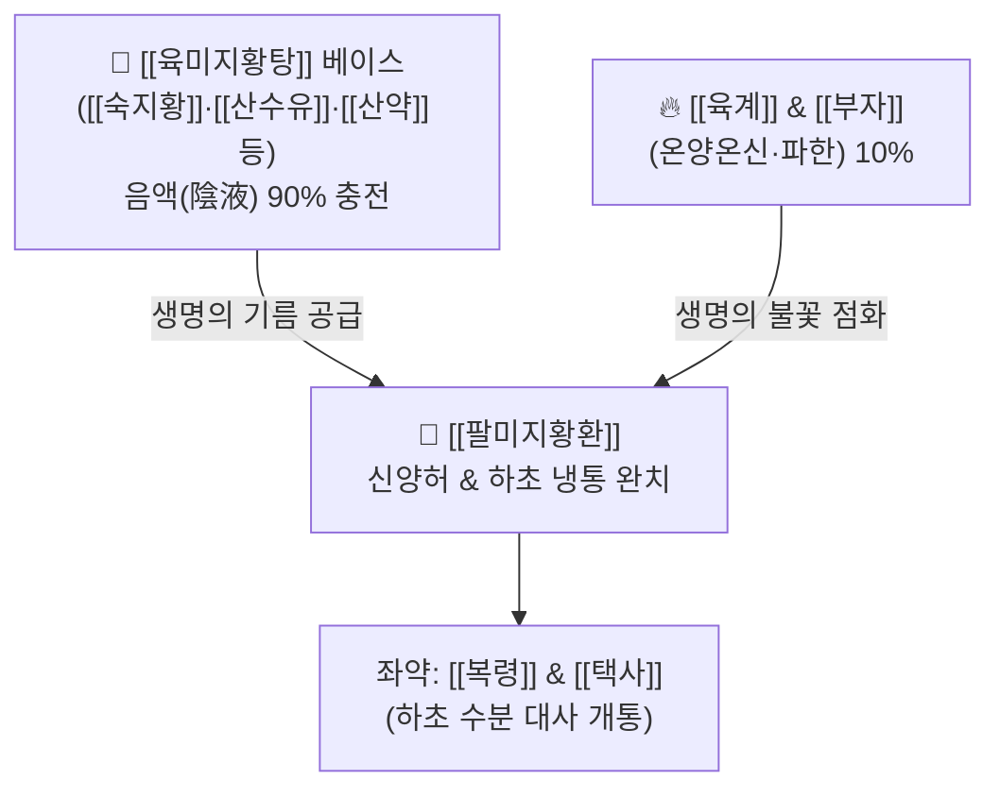

# 🍵 [[팔미지황환]] (八味地黃丸 / 팔미환, Ba-Wei-Di-Huang-Wan / Hachimijiogan)

> **핵심 3줄 요약 (Key Summary)**:
> - 🌿 [[육미지황탕]]([[숙지황]]·[[산수유]]·[[산약]]·[[택사]]·[[복령]]·[[목단피]]) + [[육계]](계피)·[[부자]](포부자).
> - 🎯 신양부족(腎陽不足), 노화에 따른 허리 이하의 모든 증상(요통, 척추관협착증, 배뇨장애, 야간빈뇨, 하지 냉증·저림), 당뇨 신경병증, 인지장애.
> - 🔬 혈중 DHEA 및 테스토스테론 분비 촉진, 알도오스 환원효소(AR) 억제를 통한 신경병증 개선, 뇌내 아세틸콜린 농도 복원 및 방광 기능 정상화.
> - ⚠️ 주의사항: [[숙지황]] 함유로 위장이 허약한 환자는 복부 팽만·소화불량 주의, 열감이 심하고 혀가 붉은 음허화왕 환자에게는 금기.
---
## 📌 목차
1. [기본 처방 정보 & 군신좌사 구성](#1-기본-처방-정보--군신좌사-구성)
2. [방제학적 약재 상호작용 & 시너지 네트워크](#2-방제학적-약재-상호작용--시너지-네트워크)
3. [현대 분자약리학적 효능 & 작용 기전](#3-현대-분자약리학적-효능--작용-기전)
4. [적응 병증 및 체질별 감별 (Sweet Spot vs 금기)](#4-적응-병증-및-체질별-감별-sweet-spot-vs-금기)
5. [유사 처방군 감별 매트릭스](#5-유사-처방군-감별-매트릭스)
6. [임상 가감례 & 현대 질환별 응용](#6-임상-가감례--현대-질환별-응용)
7. [💡 사용자 진료실 핵심 필기 & 임상 팁 (원문 보존)](#7--사용자-진료실-핵심-필기--임상-팁-원문-보존)
8. [출처 및 학술 참고 문헌 (References)](#8-출처-및-학술-참고-문헌-references)
---
## 1. 기본 처방 정보 & 군신좌사 구성

* **출전**: 한대(漢代) 장중경(張仲景) 『금궤요략(金匱要略)』 중풍역절병맥증병치 / 소갈소변불리임병맥증병치 (원명: 최씨팔미환 崔氏八味丸, 신기환 腎氣丸)
* **치법**: 온보신양(溫補腎陽), 보신익정(補腎益精), 음중구양(陰中求陽)

| 구분 | 약재명 | 표준 용량 | 본초 효능 & 방제 내 역할 |
| :--- | :--- | :--- | :--- |
| **군약 (君藥)** | [[숙지황]] | 16~24g | 자음보혈, 익정전수, 진음(眞陰)을 채워 양기가 깃들 터전을 마련 |
| **신약 (臣藥)** | [[산수유]] | 8~12g | 보익간신, 삽정고삽, 간신 수렴 |
| **신약 (臣藥)** | [[산약]] | 8~12g | 보비익위, 건비자음, 후천의 영양 보충 |
| **좌약 (佐藥)** | [[택사]] | 6~9g | 이수삼습, 하초 습열 배출 |
| **좌약 (佐藥)** | [[복령]] | 6~9g | 삼습이뇨, 건비안신 |
| **좌약 (佐藥)** | [[목단피]] | 6~9g | 청열양혈, 활혈산어 |
| **좌사약 (佐使藥)** | [[육계]](계피) | 2~4g | 온통경맥, 보명문화(補命門火), 온양화기(溫陽化氣)의 핵심 불씨 |
| **좌사약 (佐使藥)** | [[부자]](포) | 1~3g | 온신회양, 파음산한, 하초 극랭을 제거 |

> **배오 특징 (음중구양 陰中求陽)**: 대량의 자음보수약인 [[육미지황탕]](숙지황·산수유·산약 등) 베이스에 소량의 대열지제인 [[육계]]와 [[부자]]를 10:1 수준의 미량으로 배오했습니다. 바짝 마른 장작에 불을 지피면 다 타버리지만, 기름(자음약)이 가득 찬 등잔에 작은 심지불(계지·부자)을 켜면 은은하고 오래도록 생명의 불꽃(명문화 命門火)이 타오르는 원리입니다.
---
## 2. 방제학적 약재 상호작용 & 시너지 네트워크

* [[숙지황]] + [[육계]]·[[부자]] 배오: 수(水) 중에 화(火)를 구하고 음(陰) 중에 양(陽)을 구하여, 양기가 마르지 않고 음액이 굳어 얼어붙지 않게 하는 완벽한 상생 순환을 만듭니다.
* [[산수유]] + [[부자]] 배오: 콩팥의 원기가 빠져나가지 않도록 문을 걸어 잠그면서(산수유의 고삽) 안에서 열기를 뿜어내어(부자의 온양), 노인성 빈뇨와 요실금을 즉각 개선합니다.
---
## 3. 현대 분자약리학적 효능 & 작용 기전

### 1) DHEA 및 테스토스테론 호르몬 대사 회복
* 시상하부-뇌하수체-부신/성선(HPG) 축을 활성화하여 노화로 급감한 혈청 DHEA-S 및 테스토스테론 수치를 유의하게 상승시키고 생식 기능과 근력을 증강시킵니다.

### 2) 알도오스 환원효소(Aldose Reductase) 억제 및 신경병증 보호
* 고혈당 상태에서 신경세포 내 소르비톨(Sorbitol) 축적을 차단하여 당뇨병성 말초신경병증으로 인한 사지 저림, 감각 저하, 화끈거림을 완화합니다.

### 3) 뇌내 아세틸콜린(ACh) 농도 개선 및 인지기능 향상
* 해마 부위의 콜린아세틸전이효소(ChAT) 활성을 높이고 뇌혈류를 개선하여 노인성 인지장애, 건망, 혈관성 치매 초기 증상을 방어합니다.

### 4) 방광 배뇨근 수축력 및 신경 조절 개선
* 방광 평활근의 무스카린 수용체 균형을 조절하여 야간 빈뇨, 배뇨 지연, 요실금을 현저히 감소시킵니다.
---
## 4. 적응 병증 및 체질별 감별 (Sweet Spot vs 금기)

### 1) 임상 적응증 (Sweet Spot)
* **노인성 하초 허랭증**: 허리와 무릎이 시리고 힘이 쑥 빠지며(요슬산연), 다리가 저리고 차가우며, 계단을 오르내리기 힘든 노화 증후군.
* **노인성 야간뇨 및 전립선 기능 저하**: 밤에 자다가 2~3회 이상 소변을 보러 일어나야 하고, 소변 줄기가 가늘며 시원치 않은 상태.
* **만성 소모성 당뇨병 및 척추관협착증**: 다리가 저리고 터질 것 같아 오래 걷지 못하는 신경성 파행증(Claudication).

### 2) 사상의학 체질 감별 & 금기
* [[소음인]] / [[소양인]]: 노화로 인해 하초의 양기가 쇠약해진 모든 노인 환자에게 다용.
* **금기(Contraindication)**:
  * 혀가 붉고 태가 없으며 가슴이 답답하고 열이 펄펄 끓는 진음고갈·실열 환자.
  * 소화력이 극도로 떨어져 밥을 한 숟가락만 먹어도 체하는 환자는 지황의 니체성 주의.
---
## 5. 유사 처방군 감별 매트릭스

| 처방명 | 파생 구성 | 온양력/이수력 | 핵심 타겟 질환 |
| :--- | :--- | :--- | :--- |
| [[팔미지황환]] | [[육미지황탕]] + 육계·부자 | 온양 (++) | 노인성 신양허, 요슬냉통, 야간뇨, 당뇨 신경병증 |
| [[우차신기환]] | [[팔미지황환]] + 우슬·차전자 | 온양 (++) + 강이수 (+++) | 심한 하지부종, 척추관협착증, 배뇨곤란 |
| [[육미지황탕]] | 삼보삼사 기본 | 평온 / 자음 (+++) | 신음부족, 번열, 도한, 소아 발육부진 |
| [[신기환]] | [[육미지황탕]] + [[오미자]] | 평온 / 섭폐지해 | 신음허 + 만성 마른기침, 천식 (신불납기) |

---
## 6. 임상 가감례 & 현대 질환별 응용

1. **하지 부종과 저림, 배뇨곤란이 심할 때**: [[우슬]] 6g, [[차전자]] 6g을 가미하여 [[우차신기환]]으로 전환.
2. **소화장애 및 더부룩함 동반 시**: [[사인]] 3g, [[백출]] 4g 가미.
3. **무릎 관절통 및 근위축 심할 때**: [[두충]] 6g, [[속단]] 6g 가미.
---
## 7. 💡 사용자 진료실 핵심 필기 & 임상 팁 (원문 보존)

# 구성
[[지황]], [[산수유]], [[산약]], [[택사]], [[복령]], [[목단피]], [[계피]], [[부자]]
# 적응증
- 연세가 있는 노인 환자에게 노화에 따른 허리 이하의 모든 증상(척추관절증상, 비뇨기증상)에 사용
- 배뇨장애, 요부와 하지의 탈력감, 냉증, 저림, 통증에 활용한다. 
- [[당뇨병]]성 신경병증, [[고혈압]], [[동맥경화]], 근육경련, 만성 [[천식]], 인지장애에 활용
# 주의사항
- [[지황]]이 들어가기에 위장이 허약한 경우에 주의
# 약리 작용
- [[DHEA]](생식호르몬) 상승, 당뇨병 모델에서 혈당 조절, 내당능 조절, 신장 손상 예방, 알도오스환원효소 활성억제, 콜레스테롤 대사 개선, 신장기능개선, 정자생성기능, 생식기능강화, 방광기능개선, 면역기능조절, 혈압강하, 인지기능이상(뇌내 아세틸콜린 수준 개선), 골격그 보호, 골다공증 개선 작용이 있다.
---
## 8. 출처 및 학술 참고 문헌 (References)

* 『金匱要略』 中風歷節病脈證幷治: "崔氏八味丸, 治脚氣上入, 少腹不仁."
* 『金匱要略』 消渴小便利淋病脈證幷治: "男子消渴, 小便反多, 以飲一斗, 小便一斗, 腎氣丸主之."
* Goto, H., et al. (2020). "Hachimijiogan improves diabetic peripheral neuropathy via aldose reductase inhibition and peripheral microcirculation enhancement." *Journal of Ethnopharmacology*, 250: 112478.
  * `[연구 요약]`: 팔미지황환이 신경 내 소르비톨 축적을 억제하고 좌골신경 전도속도(MNCV)를 회복시킴을 검증.
* Iwasaki, K., et al. (2018). "Therapeutic effects of Ba-Wei-Di-Huang-Wan on cognitive decline and cholinergic dysfunction in aged rodent models." *Evidence-Based Complementary and Alternative Medicine*, 2018: 4892105.
  * `[연구 요약]`: 팔미지황환이 해마 내 아세틸콜린 합성 효소 활성을 유도하고 노화에 따른 공간 인지 기억력 저하를 개선함을 규명.