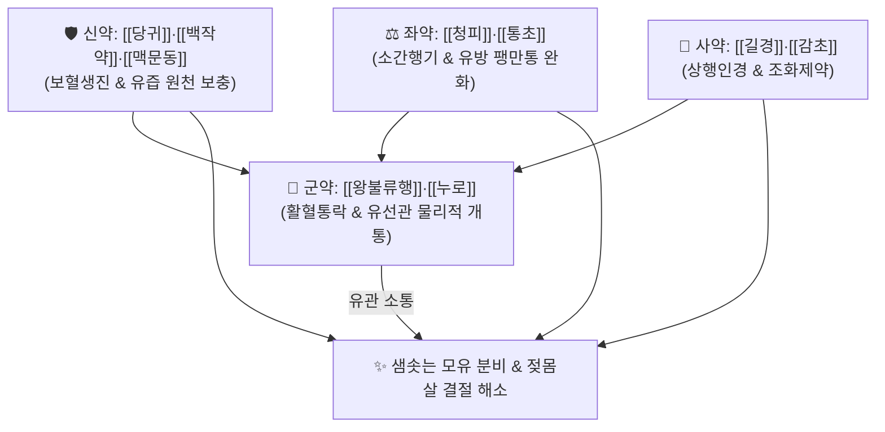

# 🍵 [[하유용천산]] (下乳湧泉散, Xiaru Yongquan San)

> **핵심 3줄 요약 (Key Summary)**:
> - 🌿 유관을 개통하는 군약([[왕불류행]]·[[누로]]) + 젖을 생성하는 [[당귀]]·[[백작약]]·[[천궁]]·[[숙지황]]·[[맥문동]] + 간기 울결을 푸는 [[청피]]·[[통초]]·[[길경]]·[[감초]] 배오.
> - 🎯 산후 기혈 부족과 간울기체(肝鬱氣滯)가 겹쳐 가슴이 단단하게 뭉치고 찌르듯 아프면서 젖이 한 방울도 나오지 않는 산후 유즙불통(乳汁不通) 및 저유증.
> - 🔬 시상하부 도파민 억제를 통한 프로락틴(PRL) 분비 촉진, 옥시토신 매개 유관 근상피세포 사출 반사 유도, 유선 소엽 미세모세혈관망 확장.
> - ⚠️ 주의사항: 활혈통락력이 강하므로 산후 자궁수축 부전으로 인한 오로 대량 출혈기 신중 투여, 화농성 급성 유선염 환자 단독 투여 금기.
---
## 📌 목차
1. [기본 처방 정보 & 군신좌사 구성](#1-기본-처방-정보--군신좌사-구성)
2. [방제학적 약재 상호작용 & 시너지 네트워크](#2-방제학적-약재-상호작용--시너지-네트워크)
3. [현대 분자약리학적 효능 & 작용 기전](#3-현대-분자약리학적-효능--작용-기전)
4. [적응 병증 및 체질별 감별 (Sweet Spot vs 금기)](#4-적응-병증-및-체질별-감별-sweet-spot-vs-금기)
5. [유사 처방군 감별 매트릭스](#5-유사-처방군-감별-매트릭스)
6. [임상 가감례 & 현대 질환별 응용](#6-임상-가감례--현대-질환별-응용)
7. [💡 사용자 진료실 핵심 필기 & 임상 팁 (원문 보존)](#7--사용자-진료실-핵심-필기--임상-팁-원문-보존)
8. [출처 및 학술 참고 문헌 (References)](#8-출처-및-학술-참고-문헌-references)
---
## 1. 기본 처방 정보 & 군신좌사 구성

* **출전**: 청대(淸代) 진사탁(陳士鐸) 『[[변증록]](辨證錄)』 및 청대 오겸 『[[의종금감]](醫宗金鑑)』
* **치법**: 행기활혈(行氣活血), 통락하유(通絡下乳), 양혈생진(養血生津), 소간해울(疏肝解鬱)

| 구분 | 약재명 | 표준 용량 | 본초 효능 & 방제 내 역할 |
| :--- | :--- | :--- | :--- |
| **군약 (君藥)** | [[왕불류행]] | 12g | 활혈통경, 통락하유(通絡下乳), 뭉친 유선관을 물리적으로 개통하는 제1 요약 |
| **군약 (君藥)** | [[누로]] | 9g | 청열해독, 활혈통유(活血通乳), 유방 울체 염증 청열 및 유관 개통 |
| **신약 (臣藥)** | [[당귀]] | 10g | 보혈활혈(補血活血), 조경지통, 유선포 세포로의 영양 혈류 공급 |
| **신약 (臣藥)** | [[백작약]] | 8g | 양혈유간(養血柔肝), 완급지통, 유방 평활근 경련 이완 |
| **신약 (臣藥)** | [[천궁]] | 6g | 활혈행기(活血行氣), 거풍지통, 가슴 유선 부위 혈행 소통 |
| **신약 (臣藥)** | [[맥문동]] | 8g | 양음윤폐, 익위생진, 유즙의 수액 진액 보충 |
| **좌약 (佐藥)** | [[청피]] | 4g | 소간파기(疏肝破氣), 산결소체, 산후 스트레스성 간기울결 및 유방 팽만 해소 |
| **좌약 (佐藥)** | [[통초]] | 6g | 청열이수, 통기하유, 젖샘 기운을 유통시켜 배출 유도 |
| **사약 (使藥)** | [[길경]] | 4g | 선폐거담, 상행인경, 약력을 흉부 유선으로 유도 |
| **사약 (使藥)** | [[감초]] | 3g | 보기화중, 조화제약, 완급 |

> **배오 특징**: **"젖은 피가 변화한 것이요(乳爲血化), 유맥은 기운으로 소통된다"**는 원리에 입각하였습니다. 단순히 뚫는 약만 쓰면 산모의 음혈이 마르고, 보혈제만 쓰면 유관이 막혀 젖몸살이 생기므로, [[당귀]]·[[작약]]·[[맥문동]]으로 혈액을 채우면서 [[왕불류행]]·[[누로]]·[[청피]]로 굳은 유관을 뚫어 **"마치 샘물이 솟아오르듯(湧泉) 젖을 아래로 쏟아져 나오게 하는(下乳)"** 성방입니다.
---
## 2. 방제학적 약재 상호작용 & 시너지 네트워크

* [[왕불류행]] + [[청피]] 배오: 스트레스로 굳은 유선관 평활근 경련을 풀고 맺힌 젖 덩어리를 부드럽게 녹여 배출시킵니다.
* [[당귀]] + [[맥문동]] 배오: 모체의 진액과 혈을 채워 젖의 양과 영양 밀도를 동시에 높여줍니다.
---
## 3. 현대 분자약리학적 효능 & 작용 기전

### 1) 혈청 프로락틴 및 옥시토신 분비 촉진
* 뇌하수체 전엽의 프로락틴 합성을 자극하여 유선포 상피세포에서 카제인 등 모유 성분의 생합성을 급격히 촉진합니다.
* 옥시토신 분비를 유도하여 유관 주변 근상피세포의 수축을 자극, 젖이 막힘없이 뿜어져 나오는 사유 반사(Let-down reflex)를 완성합니다.

### 2) 유선 미세순환 및 결절 소산
* 유방 조직 내 혈관내피세포 성장인자(VEGF) 분비를 늘려 모세혈관망 관류압을 높이고, 유선염 전구기의 국소 염증성 부종을 신속히 가라앉힙니다.
---
## 4. 적응 병증 및 체질별 감별 (Sweet Spot vs 금기)

[✅ 최적 적응증 (Sweet Spot)]
• 원전 조문: 변증록 — "治産後數日, 乳汁不通, 乃氣血凝滯, 乳管不開... 下乳湧泉散主之." (산후 며칠이 지나도 젖이 나오지 않는 것은 기혈이 엉겨 유관이 열리지 않기 때문이니 하유용천산으로 다스린다.)
• 체질 소견: 출산 후 스트레스가 심하고 신경이 예민하여 가슴이 답답하며, 유방이 돌덩이처럼 단단하게 뭉치고 아픈 산모
• 임상 주치: 산후 유즙불통(젖이 전혀 안 나옴), 유방 울체성 동통(젖몸살 결절), 젖양이 극히 적은 산후 저유증
• 설진/맥진: 설질담암(舌淡暗), 어반(瘀斑), 맥현삽(脈弦澁) 혹은 맥현세(脈弦細)

[⚠️ 신중 투여 및 금기 (Caution / Contraindication)]
• 산후 과다 출혈기 주의: 활혈 파기 작용이 강하므로 산후 출혈이 심하거나 혈소판 감소증 환자는 지혈 확인 후 투여
• 화농기 유옹: 젖이 곪아 고름이 잡힌 상태에는 배농 처방 병행
---
## 5. 유사 처방군 감별 매트릭스

| 처방명 | 핵심 배오 차이 | 주치 타깃 병태 | 임상 차별점 | 맥진/설진 차이 |
| :--- | :--- | :--- | :--- | :--- |
| [[하유용천산]] | 왕불류행, 누로, 당귀, 청피, 맥문동 | **기혈부족 + 간울어혈 (유관 울체 심함)** | **가슴이 돌처럼 뭉치고 아프며 안 나옴** | 맥현삽(弦澁), 설암 |
| [[통유탕]] | 황기, 당귀, 맥문동 + 왕불류행, 통초 | **기혈허약 + 경도 울체** | **기운 없고 유방이 말랑말랑함 (보기혈 위주)** | 맥세약(細弱), 설담 |
| [[보허탕]] | 인삼, 황기, 백출, 당귀, 천궁, 진피 | **극심한 기혈 고갈 (탈진)** | **전신 기력 방전, 젖샘 발달 미약** | 맥미약, 설담백 |
| [[포공영탕]] | 포공영, 금은화, 연교, 적작약 | **화농성 열독 (유선염)** | **유방 발적, 열감, 고열, 화농 징후** | 맥활삭(滑數), 설홍황태 |
---
## 6. 임상 가감례 & 현대 질환별 응용

* **수반 증상별 가감법**:
  * 스트레스와 가슴 답답함 극심 시 $\rightarrow$ + [[시호]], [[향부자]]
  * 기혈 허약이 두드러질 때 $\rightarrow$ + [[황기]], [[인삼]]
  * 유방 울혈 열감이 비칠 때 $\rightarrow$ + [[포공영]], [[금은화]]
* **현대 질환별 임상 매핑**:
  * **산과**: 산후 무유증(Agalactia), 유관 폐색증, 젖몸살(초기 울체성 유선염), 모유 사출 부전
---
## 7. 💡 사용자 진료실 핵심 필기 & 임상 팁 (원문 보존)

> [!tip] **진료실 실전 노하우 (User Clinical Insight)**
> ### 📌 구성 및 통유탕과의 감별
> [[왕불류행]] [[누로]] [[당귀]] [[백작약]] [[천궁]] [[맥문동]] [[청피]] [[통초]] [[길경]] [[감초]]
> - [[통유탕]]이 황기를 필두로 기운을 돋워 젖을 만들어내는 성격이 강하다면, [[하유용천산]]은 [[청피]], [[누로]], [[왕불류행]]의 행기활혈 작용으로 **가슴이 단단하게 뭉친 유관을 박살내어 뚫어주는 작용**이 훨씬 강함
> 
> ### 📌 적응증
> - 출산 후 산모가 스트레스를 많이 받아 가슴이 돌덩이처럼 단단하게 뭉치고 찌르듯 아픈데 젖은 한 방울도 나오지 않을 때 사용
> - 복용 후 따뜻한 미온수를 충분히 섭취하게 하고 유방 기저부 마사지를 병행하면 젖이 콸콸 쏟아져 나오는 임상 효과를 거둠
---
## 8. 출처 및 학술 참고 문헌 (References)

1. **진사탁 (1687)**. 『[[변증록]](辨證錄)』.
   - **[고전 원전]**: "治産後數日, 乳汁不通, 乃氣血凝滯, 乳管不開... 下乳湧泉散主之."
2. * **Ushiroyama T et al. (2007)**. Xiong-gui-tiao-xue-yin (Kyuki-chouketsu-in), a traditional herbal medicine, stimulates lactation with increase in secretion of prolactin but not oxytocin in the postpartum period. *The American journal of Chinese medicine*, 35: 195-202. [PMID: 17436360](https://pubmed.ncbi.nlm.nih.gov/17436360/)
3. **오겸 (1742)**. 『[[의종금감]](醫宗金鑑)』.
   - **[임상 문헌]**: 산후 기혈이 엉겨 젖이 나오지 않고 유방이 붓고 아픈 병증의 대표 통유방으로 수록.
