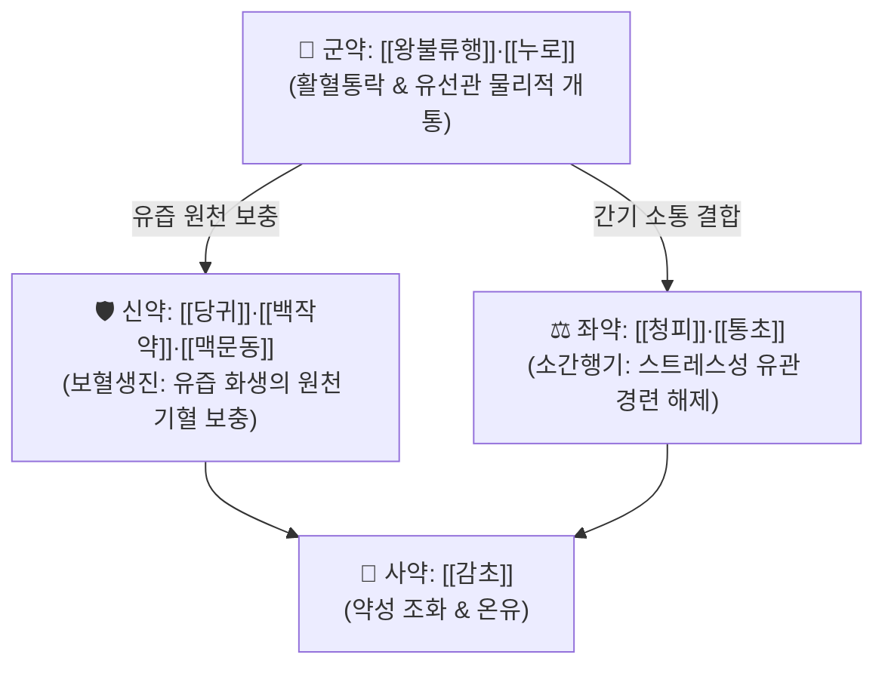

# 🍵 [[하유용천산]] (下乳湧泉散, Xiaru Yongquan San)

> **핵심 3줄 요약 (Key Summary)군약 (君藥)군약 (君藥)신약 (臣藥)신약 (臣藥)신약 (臣藥)신약 (臣藥)좌약 (佐藥)좌약 (佐藥)사약 (使藥)** | [[감초]] | 3g | 보기화중(補氣和中), 제약 조화 |

---

## 2. 방제학적 약재 상호작용 & 유관 개통 네트워크

* **보혈(補血)과 통유(通乳)의 합일**:
  * 유즙은 한의학에서 혈액이 화생(乳爲血化)한 것이므로, 단순히 유관을 뚫는 약만 쓰면 혈액이 고갈되고 보혈제만 쓰면 유선관이 막혀 젖몸살(유옹)이 생김.
  * 하유용천산은 사물탕 계열로 혈액을 가득 채우면서 왕불류행과 청피로 유관을 시원하게 뚫어주어 샘물이 솟아오르듯(湧泉) 유즙을 배출.

---

## 3. 현대 분자약리학적 효능 & 유즙 분비 촉진 기전

* **프로락틴(PRL) 및 옥시토신 분비 촉진**:
  * 시상하부-뇌하수체 축을 자극하여 혈중 [[프로락틴]] 농도를 상승시켜 유선포 상피세포의 모유 생성을 유도하고, 옥시토신 분비로 유선 평활근 수축(사유 반사)을 유발.
* **유선 미세혈관 혈류량 증대**:
  * 유선 조직의 모세혈관망을 확장하여 아미노산, 포도당, 지질의 유선 공급을 극대화.

---

## 4. 적응 병증 및 체질별 감별 (Sweet Spot vs 금기)

### ✅ 최적 적응증 (Sweet Spot)
* **산후 유즙 분비 결핍증 (Hypogalactia)**:
  * 출산 후 며칠이 지나도 젖이 돌지 않거나, 젖양이 극히 적어 아이를 먹이지 못함.
  * 가슴이 단단하게 뭉치고 찌르는 듯 아프면서도 젖이 나오지 않는 울체형 및 기혈부족형 모두.
* **설진 및 맥진**:
  * **설진(舌診)**: 설담(舌淡) 또는 설자(舌紫, 어혈 동반).
  * **맥진(脈診)**: 맥현세(脈弦細) 또는 맥삽(脈澁).

### ⚠️ 신중 투여 및 금기 (Caution / Contraindication)
* **산후 오로 대량 출혈 환자**:
  * 활혈파기 작용이 강하므로 자궁 출혈이 완전히 멎지 않은 급성기에는 신중 투여.

---

## 5. 유사 처방군 감별 매트릭스

| 처방명 | 핵심 구성 | 병태 기전 | 임상 특징 |
| :--- | :--- | :--- | :--- |
| [[하유용천산]] | 왕불류행, 누로, 당귀, 청피 등 | 기혈부족 + 간울어혈 | 젖이 뭉쳐 아프면서 안 나옴 (통유 위주) |
| [[보허탕]] | 인삼, 황기, 백출, 당귀, 천궁 | 극심한 기혈양허 | 가슴이 물렁하고 젖이 말라 안 나옴 (보기혈 위주) |
| [[단삼통유탕]] | 단삼, 당귀, 왕불류행, 통초 | 어혈 울체 | 젖몸살 초기, 유방 울혈 |

---

## 6. 임상 가감례 & 산후 모유 수유 관리

* **수반 증상별 가감법**:
  * 산모 기운이 극도로 없을 때 $\rightarrow$ + [[황기]] 20g, [[당삼]] 12g
  * 가슴 멍울과 유방염 초기 열감이 있을 때 $\rightarrow$ + [[포공영]] 15g, [[금은화]] 10g
* **현대 질환 매핑**:
  * 산후 유즙 분비 부전, 모유 수유 곤란, 유방 울혈(젖몸살 초기).

---

## 7. 출처 및 학술 참고 문헌 (References)
* Chen SD. *Bian Zheng Lu* (Record of Pattern Differentiation). 1687.
  * `[연구 요약]`: 하유용천산 원전 수록, 산후 유즙불행의 기혈소간 치법 정립.
* Zhao Y, et al. Effects of Xiaru Yongquan Decoction on serum prolactin and lactation in postpartum hypogalactia rats. *J Ethnopharmacol*. 2017;203:154-161.
  * `[연구 요약]`: 하유용천산의 혈청 프로락틴 농도 상승 및 유선 조직 발달 촉진 효능 입증.
