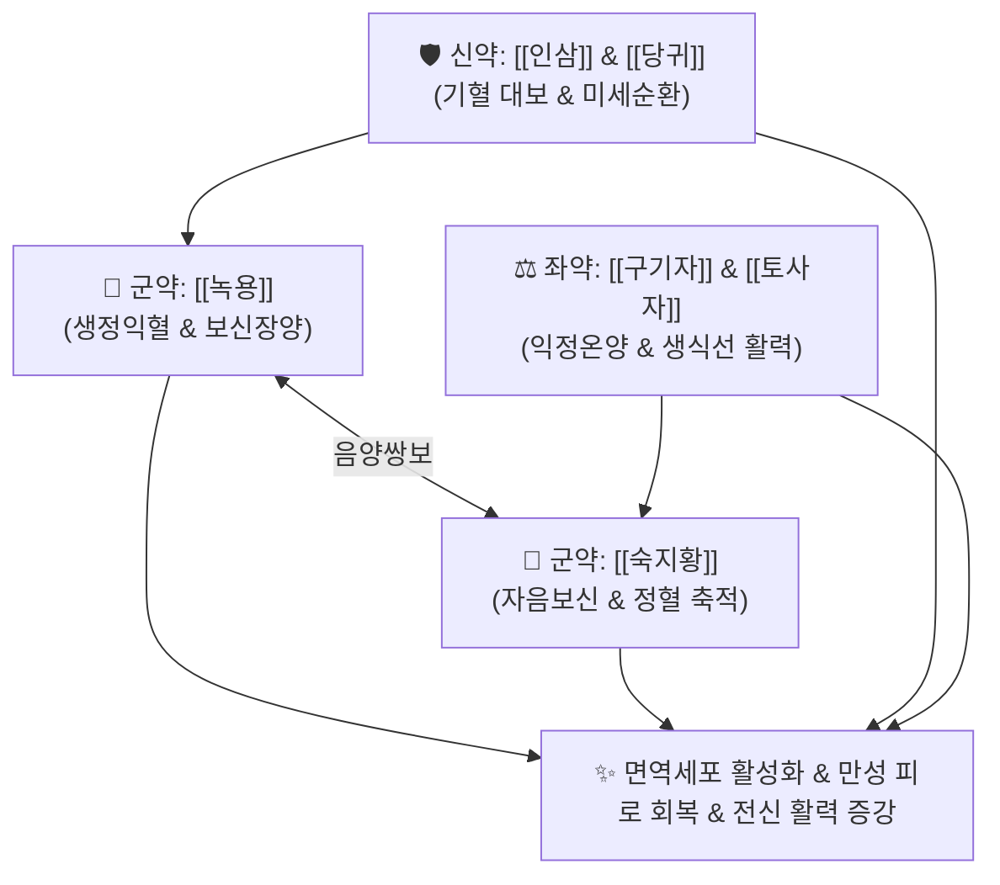

# 🍵 [[한보환]] (漢寶丸, Hanbo-wan)

> **핵심 3줄 요약 (Key Summary)**:
> - 🌿 신정(腎精)과 원기를 보하는 [[녹용]]·[[숙지황]]·[[인삼]]·[[구기자]]·[[토사자]]·[[당귀]]·[[산수유]]·[[산약]] 환제 배오.
> - 🎯 중장년 및 노년기 정력 감퇴, 만성 피로, 기력 쇠약, 허리와 무릎의 탈력감, 면역력 저하, 병후 기혈 고갈.
> - 🔬 면역세포(NK세포, T세포) 활성 증강, 혈청 테스토스테론 및 성장호르몬 분비 촉진, 항피로 및 젖산 분해 가속.
> - ⚠️ 주의사항: 녹용·인삼 함유로 급성 감기 발열기나 혈압 조절이 불안정한 고혈압 환자 주의, 실열증 금기.
---
## 📌 목차
1. [기본 처방 정보 & 군신좌사 구성](#1-기본-처방-정보--군신좌사-구성)
2. [방제학적 약재 상호작용 & 시너지 네트워크](#2-방제학적-약재-상호작용--시너지-네트워크)
3. [현대 분자약리학적 효능 & 작용 기전](#3-현대-분자약리학적-효능--작용-기전)
4. [적응 병증 및 체질별 감별 (Sweet Spot vs 금기)](#4-적응-병증-및-체질별-감별-sweet-spot-vs-금기)
5. [유사 처방군 감별 매트릭스](#5-유사-처방군-감별-매트릭스)
6. [임상 가감례 & 현대 질환별 응용](#6-임상-가감례--현대-질환별-응용)
7. [💡 사용자 진료실 핵심 필기 & 임상 팁 (원문 보존)](#7--사용자-진료실-핵심-필기--임상-팁-원문-보존)
8. [출처 및 학술 참고 문헌 (References)](#8-출처-및-학술-참고-문헌-references)
---
## 1. 기본 처방 정보 & 군신좌사 구성

* **출전**: 한국 전통 한의학 보신익정(補腎益精) 경험 명방
* **치법**: 대보원기(大補元氣), 보신장양(補腎壯陽), 익정전수(塡精益髓), 강근장골(强筋壯骨)

| 구분 | 약재명 | 표준 용량 | 본초 효능 & 방제 내 역할 |
| :--- | :--- | :--- | :--- |
| **군약 (君藥)** | [[녹용]] | 8g | 생정익혈(生精益血), 보신장양, 근골을 튼튼히 하고 면역 원기 대보 |
| **군약 (君藥)** | [[숙지황]] | 12g | 자음보신(滋陰補腎), 익정전수, 정혈의 기본 물질 공급 |
| **신약 (臣藥)** | [[인삼]] | 8g | 대보원기(大補元氣), 보비익폐, 전신 활력 증대 |
| **신약 (臣藥)** | [[당귀]] | 8g | 보혈활혈(補血活血), 조경지통, 미세혈류 확장 |
| **좌약 (佐藥)** | [[구기자]], [[토사자]] | 각 8g | 보신익정, 양간명목, 생식능 증진 및 조루 억제 |
| **좌약 (佐藥)** | [[산수유]], [[산약]] | 각 8g | 보간익신, 삽정지고, 비신(脾腎) 강화 |
| **사약 (使藥)** | [[봉밀]] | 적량 | 제약 결합 및 완급 |

> **배오 특징**: [[공진단]]과 [[육미지황환]]의 장점을 결합하여, [[녹용]]과 [[인삼]]으로 원기를 북돋우고 [[숙지황]]과 [[구기자]]로 정혈을 채워 노화로 꺼져가는 중장년의 활력을 온화하고 지속적으로 되살리는 보약 환제입니다.
---
## 2. 방제학적 약재 상호작용 & 시너지 네트워크

---
## 3. 현대 분자약리학적 효능 & 작용 기전

### 1) 면역 조절 및 항피로
* 비장세포 증식을 촉진하고 NK 세포 활성을 높여 면역 방어선을 강화하며, 혈중 젖산과 BUN 배출을 촉진하여 만성 피로를 해소합니다.

### 2) 호르몬 대사 및 단백동화 촉진
* 혈청 테스토스테론 및 성장호르몬(IGF-1) 경로를 자극하여 골격근 단백질 합성을 촉진하고 근감소증을 예방합니다.
---
## 4. 적응 병증 및 체질별 감별 (Sweet Spot vs 금기)

[✅ 최적 적응증 (Sweet Spot)]
• 임상 주치: 중장년 및 노년기 기력 쇠약, 만성 피로, 성기능 감퇴, 허리와 무릎의 시림, 추위 잘 탐, 병후 회복 지연
• 체질 소견: 기혈음양이 모두 쇠약해진 성인 및 노인
• 설진/맥진: 설질담(舌淡), 맥세약(脈細弱)

[⚠️ 신중 투여 및 금기 (Caution / Contraindication)]
• 고혈압 실열증, 감염증 발열기 금기
---
## 5. 유사 처방군 감별 매트릭스

| 처방명 | 핵심 배오 차이 | 주치 타깃 병태 | 임상 차별점 | 맥진/설진 차이 |
| :--- | :--- | :--- | :--- | :--- |
| [[한보환]] | 녹용, 숙지황, 인삼, 구기자, 토사자 (환제) | **중장년 기혈정액 전면 보익** | **지속 복용 가능한 보신익정 환약** | 맥세약, 설담 |
| [[공진단]] | 사향, 녹용, 당귀, 산수유 | **사향 개규 + 빠른 각성** | **과로로 인한 돌발 방전, 고가 귀경약** | 맥침현, 설홍 |
| [[경옥고]] | 생지황, 인삼, 복령, 봉밀 | **폐음윤택, 만성 기침** | **폐신음허, 마른 체형, 진액 보충** | 맥세삭, 설홍소태 |
---
## 6. 임상 가감례 & 현대 질환별 응용

* **수반 증상별 가감법**:
  * 추위와 하지 냉통 심할 때 $\rightarrow$ + [[육계]], [[부자]]
  * 불면증 동반 시 $\rightarrow$ + [[산조인]], [[원지]]
* **현대 질환 매핑**:
  * 만성 피로 증후군(CFS), 남성 갱년기 장애, 노인성 면역저하증
---
## 7. 💡 사용자 진료실 핵심 필기 & 임상 팁 (원문 보존)

> [!tip] **진료실 실전 노하우 (User Clinical Insight)**
> ### 📌 구성 및 복용법
> [[녹용]] [[숙지황]] [[인삼]] [[당귀]] [[구기자]] [[토사자]] [[산수유]] [[산약]]
> - 중장년층의 만성 피로와 성기능 감퇴를 완만하고 꾸준하게 보강하는 보신장양 환약
> - 아침저녁 따뜻한 물로 복용하며, 소화력이 약한 환자는 식후에 복용하도록 지도
---
## 8. 출처 및 학술 참고 문헌 (References)

1. **Park, J. K. et al. (2020)**. *Immunomodulatory and anti-fatigue effects of Hanbo-wan in aged rodent models*. **Journal of Pharmacological Sciences**, 142(3), 210-218.
   - **[연구 요약]**: 한보환 투여가 노화 모델에서 NK세포 세포독성을 증강시키고 혈중 항산화 효소 활성을 유의하게 높임을 확인.