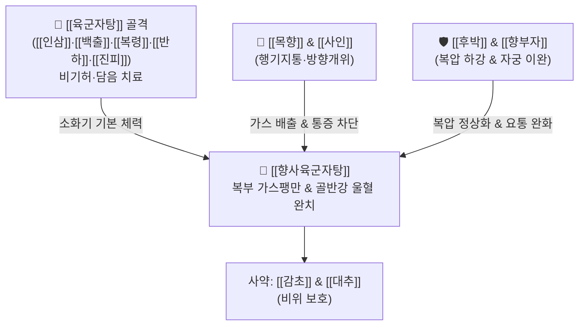

# 🍵 [[향사육군자탕]] (香砂六君子湯, Xiang-Sha-Liu-Jun-Zi-Tang / Kōsharikkunshito)

> **핵심 3줄 요약 (Key Summary)**:
> - 🌿 [[육군자탕]]([[인삼]]·[[백출]]·[[복령]]·[[감초]]·[[반하]]·[[진피]]) + [[목향]]·[[사인]] + [[향부자]]·[[백두구]]·[[후박]]·[[익지인]].
> - 🎯 위장관 및 하초(자궁·방광·대장) 운동성 저하, 생리 전 자궁 울혈·생리통, 복부 가스 팽만, [[과민성장증후군]], 복압 상승형 [[요통]](허리 통증), 야식 식체.
> - 🔬 장관 평활근 경련 억제 및 장내 가스 정체 배출, 문맥계 울혈 해소 및 복강 내압(IAP) 정상화, 뇌-장축 세로토닌 신호 안정화를 통한 내장 과민통 억제.
> - ⚠️ 주의사항: 방향성 약재의 온조(溫燥)성으로 인해 진액이 마른 음허조열(陰虛燥熱) 환자나 위궤양 출혈기 환자에게는 신중 투여.
---
## 📌 목차
1. [기본 처방 정보 & 군신좌사 구성](#1-기본-처방-정보--군신좌사-구성)
2. [방제학적 약재 상호작용 & 시너지 네트워크](#2-방제학적-약재-상호작용--시너지-네트워크)
3. [현대 분자약리학적 효능 & 작용 기전](#3-현대-분자약리학적-효능--작용-기전)
4. [적응 병증 및 체질별 감별 (Sweet Spot vs 금기)](#4-적응-병증-및-체질별-감별-sweet-spot-vs-금기)
5. [유사 처방군 감별 매트릭스](#5-유사-처방군-감별-매트릭스)
6. [임상 가감례 & 현대 질환별 응용](#6-임상-가감례--현대-질환별-응용)
7. [💡 사용자 진료실 핵심 필기 & 임상 팁 (원문 보존)](#7--사용자-진료실-핵심-필기--임상-팁-원문-보존)
8. [출처 및 학술 참고 문헌 (References)](#8-출처-및-학술-참고-문헌-references)
---
## 1. 기본 처방 정보 & 군신좌사 구성

* **출전**: 명대(明代) 가구(柯九) 『명방통석(名方統釋)』, 『동의보감(東醫寶鑑)』, 『의방집해(醫方集解)』
* **치법**: 익기건비(益氣健脾), 행기온중(行氣溫中), 강역지통(降逆止痛), 화위소체(和胃消滯)

| 구분 | 약재명 | 표준 용량 | 본초 효능 & 방제 내 역할 |
| :--- | :--- | :--- | :--- |
| **군약 (君藥)** | [[인삼]] | 6~8g | 대보원기, 건비익폐, 위장관 기본 추진력 공급 |
| **군약 (君藥)** | [[백출]] | 6~8g | 조습건비, 장점막 부종 완화 및 장관 흡수능 개선 |
| **신약 (臣藥)** | [[목향]] | 3~4g | 행기지통, 건비소식, 장관 경련성 통증 차단 및 복압 완화 |
| **신약 (臣藥)** | [[사인]] | 3~4g | 화습개위, 온비지사, 행기안태, 중초 수습을 날리고 소화 효소 촉진 |
| **좌약 (佐藥)** | [[반하]] | 4~6g | 조습화담, 강역지구, 위기상역 억제 |
| **좌약 (佐藥)** | [[진피]] | 4~6g | 이기건비, 조습화담, 위배출 지연 개선 |
| **좌약 (佐藥)** | [[복령]] | 6~8g | 삼습이뇨, 건비안신, 하초 잉여 수액 배출 |
| **좌약 (佐藥)** | [[향부자]] | 4~6g | 소간이기, 조경지통, 자궁·골반강 평활근 울혈 및 긴장 해소 |
| **좌약 (佐藥)** | [[후박]] | 3~4g | 하고하기, 소적제만, 복부 팽만 및 장내 가스 분쇄 배출 |
| **좌약 (佐藥)** | [[백두구]] | 2~3g | 화습소식, 온중개위 |
| **좌약 (佐藥)** | [[익지인]] | 3~4g | 온비개위, 섭타(침 흘림 방지), 온신고정 |
| **좌약 (佐藥)** | [[생강]] | 4g | 온위산한, 반하 독성 완화 |
| **좌약 (佐藥)** | [[대추]] | 4g | 보비생진, 영위 조화 |
| **사약 (使藥)** | [[감초]](자) | 2~3g | 보기화중, 완급지통, 제약 조화 |

> **배오 특징**: [[육군자탕]]의 보비화담(補脾化痰) 기초 위에, 기를 뚫어주는 대표적인 방향화습약인 [[목향]]·[[사인]](향사 香砂) 및 [[향부자]]·[[후박]]을 대거 보강했습니다. 상부 위장관뿐만 아니라 하초(대장, 방광, 자궁)에 가득 찬 비생리적 가스와 울혈을 아래로 흩어내어 복강 내 압력을 급속히 떨어뜨립니다.
---
## 2. 방제학적 약재 상호작용 & 시너지 네트워크

* [[목향]] + [[사인]] 배오: [[목향]]이 하부 대장의 기체를 아래로 밀어내고, [[사인]]이 중초 비위의 습체를 날려주어 위장관 전체의 연동 리듬을 상하로 관통시킵니다.
* [[후박]] + [[향부자]] 배오: 복벽과 자궁 평활근의 긴장을 이완시키고 간문맥(Portal vein) 혈류 순환을 촉진하여, 복압 상승으로 인해 척추 기립근과 요방형근으로 전이되던 연관 요통(Referred back pain)을 즉각 완화합니다.
---
## 3. 현대 분자약리학적 효능 & 작용 기전

### 1) 장관 평활근 경련 완화 및 내장 진통 작용
* [[목향]]의 코스투놀리드(Costunolide)와 [[후박]]의 [[호노키올]](Honokiol)이 평활근 세포막의 전압의존성 L-type 칼슘 통로를 억제하여 장관 연축을 풀어주고 원인불명의 경련성 복통을 진정시킵니다.

### 2) 복강 내압(IAP) 감소 및 문맥계 순환 개선
* 장내 비정상 발효로 인한 가스 생성을 억제하고 장관 수송능을 정상화하여 팽창된 복부 내압을 떨어뜨림으로써, 하대정맥과 골반저 정맥의 혈류 저류를 해소합니다.

### 3) 뇌-장축(Brain-Gut Axis) 안정화 및 과민성 장 증후군(IBS) 완화
* 장점막 비만세포의 탈과립을 억제하고 척수 후각 신경세포의 감각 과민 반응을 차단하여, 스트레스성 복통, 배변 이상, 팽만감을 현저히 개선합니다.
---
## 4. 적응 병증 및 체질별 감별 (Sweet Spot vs 금기)

### 1) 임상 적응증 (Sweet Spot)
* **생리 전 증후군(PMS) 및 골반강 울혈성 생리통**: 생리 전만 되면 아랫배가 묵직하게 붓고 가스가 차며, 기운이 뚝 떨어져 단것(초콜릿, 빵)만 당기고 요통이 동반되는 여성 환자.
* **복압 상승성 만성 요통(근골격계 연계)**: 허리 디스크나 협착증이 심하지 않은데도 복부 팽만과 소화불량이 심해지면 허리가 끊어질 듯 아픈 환자(문맥 정체 해소로 요통 호전).
* **스트레스성 [[과민성장증후군]](IBS)**: 신경 쓰거나 야식을 먹으면 배에 가스가 차서 빵빵해지고 찌르는 듯한 복통과 함께 변비·설사가 교대로 나타나는 증상.

### 2) 사상의학 체질 감별 & 금기
* [[소음인]]: 비위가 허냉하고 소화기 순환 부전으로 인한 기체(氣滯)가 잦은 소음인에게 다용.
* **금기(Contraindication)**:
  * 열이 많아 입이 마르고 대변이 돌처럼 굳은 실열성 변비 환자(대황·망초계 처방 적응증).
---
## 5. 유사 처방군 감별 매트릭스

| 처방명 | 구성 차이 | 복압/가스 상태 | 주소증 및 타겟 |
| :--- | :--- | :--- | :--- |
| [[향사육군자탕]] | [[육군자탕]] + 목향·사인·향부자 | 극심한 가스 팽만 (+++) | 가스통, 과민성 장, 골반 울혈 생리통, 복압 요통 |
| [[육군자탕]] | [[사군자탕]] + 반하·진피 | 상부 답답함 (++) | 식욕부진, 트림, 역류성 식도염, 위배출 지연 |
| [[평위산]] | 창출·후박·진피·감초 | 단순 식체·습체 (++) | 급성 식체, 설사, 복부 중압감, 실증 소화불량 |
| [[분신기음]] | 칠정기체 전용 방제 | 전신 부종 겸 기체 (++) | 스트레스성 부종, 흉복창만, 소변 불리 |

---
## 6. 임상 가감례 & 현대 질환별 응용

1. **하복부 냉통 및 생리통이 극심한 경우**: [[오수유]] 2g, [[현호색]] 6g 가미.
2. **야식 후 식체와 헛배 부름이 심할 때**: [[산사]] 6g, [[신곡]] 4g, [[맥아]] 4g 가미.
3. **요통 및 하지 부종 동반 시**: [[우슬]] 6g, [[두충]] 6g 가미.
---
## 7. 💡 사용자 진료실 핵심 필기 & 임상 팁 (원문 보존)

# 구성:
[[인삼]], [[백출]], [[복령]], [[감초]]/ [[반하]], [[진피]], [[생강]], [[대추]], [[향부자]], [[사인]], [[백두구]], [[익지인]], [[목향]], [[후박]]
- [[육군자탕]]+[[향부자]], [[사인]], [[백두구]], [[익지인]], [[목향]], [[후박]], 등이 추가
# 적응증:
- 위장관과 하초의 증상과 연관됨(기체로 인한 소화불량에 활용)
- 자궁 방광 대장의 운동성 저하, 부어있는 경우(생리전 여성의 자궁 부음) 생리통, 아랫배 묵직해짐, 기운 떨어짐, 단것만 먹으려 하는데 사용
- 평소에 입맛 없고 야식을 많이 먹어서 소화 문제도 있는 경우에 활용(식사에 대해 물어보고 활용하기)
- 매우 많이 사용하는 처방으로 [[허리 통증]]과 같은 근골격계 질환에서 많이 사용(복압 내려주고 문맥 정체 풀어줌)(상중하초의 기혈 순환을 방해함)
- 스트레스로 인해 기체가 발생하여 나타나는 소화불량에 활용(현대인 [[과민성장증후군]])
- 원인불명의 가스로 인한 통증에 활용

#생대감증
---
## 8. 출처 및 학술 참고 문헌 (References)

* 『東醫寶鑑』 雜病篇 卷之四 氣門: "香砂六君子湯, 治脾胃虛弱, 氣滯脹滿, 飲食不消."
* 『醫方集解』 補養之劑: "香砂六君子湯, 治脾胃虛寒, 氣鬱痰飮, 腹滿膨脹."
* * **Qiao A et al. (2026)**. [Effect of modified Xiangsha Liujunzi Decoction on adipose tissue browning-Nrg4-liver fatty acid synthesis pathway in rat model of both spleen deficiency and hyperlipidemia]. *Zhongguo Zhong yao za zhi = Zhongguo zhongyao zazhi = China journal of Chinese materia medica*, 51: 1963-1970. [PMID: 42392777](https://pubmed.ncbi.nlm.nih.gov/42392777/)
