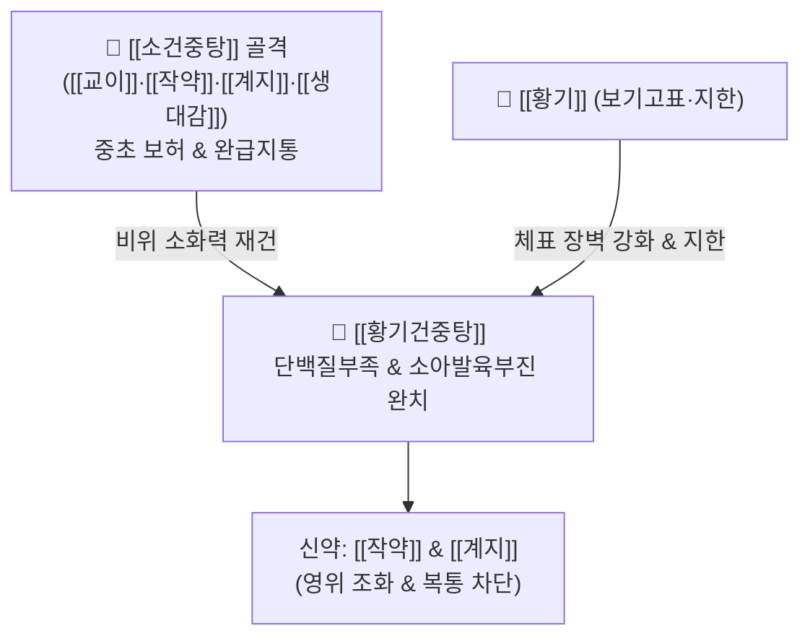

# 🍵 [[황기건중탕]] (黃芪建中湯, Huang-Qi-Jian-Zhong-Tang / Ogikenchuto)

> **핵심 3줄 요약 (Key Summary)**:
> - 🌿 [[소건중탕]]([[계지]]·[[적작약]]·[[생강]]·[[대추]]·[[감초]]·[[교이]]) + [[황기]](보기고표).
> - 🎯 허로리급(虛勞裏急), 소아 단백질 부족형 발육부진(밥 안 먹고, 식은땀, 잦은 감기, 키 안 큼, 상처 치유 지연, 잦은 복통), 저알부민혈증.
> - 🔬 간세포 알부민 합성 촉진 및 단백질 동화작용, 비장 림프구 면역 활성화, 섬유아세포 콜라겐 합성 촉진 및 성장판 대사 환경 최적화.
> - ⚠️ 주의사항: 현대 소아는 영양 과잉 경향이 있으므로 [[교이]]를 10g 내외로 감량 조절, 감기 급성기 고열 환자에게는 복용 유예.
---
## 📌 목차
1. [기본 처방 정보 & 군신좌사 구성](#1-기본-처방-정보--군신좌사-구성)
2. [방제학적 약재 상호작용 & 시너지 네트워크](#2-방제학적-약재-상호작용--시너지-네트워크)
3. [현대 분자약리학적 효능 & 작용 기전](#3-현대-분자약리학적-효능--작용-기전)
4. [적응 병증 및 체질별 감별 (Sweet Spot vs 금기)](#4-적응-병증-및-체질별-감별-sweet-spot-vs-금기)
5. [유사 처방군 감별 매트릭스](#5-유사-처방군-감별-매트릭스)
6. [임상 가감례 & 현대 질환별 응용](#6-임상-가감례--현대-질환별-응용)
7. [💡 사용자 진료실 핵심 필기 & 임상 팁 (원문 보존)](#7--사용자-진료실-핵심-필기--임상-팁-원문-보존)
8. [출처 및 학술 참고 문헌 (References)](#8-출처-및-학술-참고-문헌-references)
---
## 1. 기본 처방 정보 & 군신좌사 구성

* **출전**: 한대(漢代) 장중경(張仲景) 『금궤요략(金匱要略)』 혈비허로병맥증병치(血痺虛勞病脈證幷治)
  * "虛勞裏急, 諸不足, 黃芪建中湯主之."
* **치법**: 온중보허(溫中補虛), 익기생혈(益氣生血), 고표지한(固表止汗)

| 구분 | 약재명 | 표준 용량 | 본초 효능 & 방제 내 역할 |
| :--- | :--- | :--- | :--- |
| **군약 (君藥)** | [[황기]] | 8~12g | 보기승양, 고표지한, 피하 모공 수축 및 체표 단백질 장벽 강화 |
| **군약 (君藥)** | [[교이]](조청) | 10~20g | 감온보허, 온양비위, 즉각적인 포도당 및 대사 에너지 공급 (소아 현대 감량) |
| **신약 (臣藥)** | [[적작약]](또는 [[백작약]]) | 8~12g | 양혈유간, 완급지통, 복직근 긴장 및 경련 완화 |
| **신약 (臣藥)** | [[계지]] | 4~6g | 온통경맥, 발표산한, 영위 조화 |
| **좌약 (佐藥)** | [[생강]] | 4~6g | 온위지구, 비위 운화 촉진 |
| **좌약 (佐藥)** | [[대추]] | 4g | 보비생진, 영위 조화 |
| **사약 (使藥)** | [[감초]](자) | 3~4g | 보기화중, 완급지통, 제약 조화 |

> **배오 특징**: 온중보허의 성약인 [[소건중탕]]에 기를 보하고 표를 단단히 굳히는(고표 固表) [[황기]]를 결합했습니다. 비위가 약해 음식을 잘 소화 흡수하지 못하고, 그 결과 단백질(알부민, 피브리노겐)이 결핍되어 땀이 비 오듯 새어나가고 잦은 감기에 걸리며 상처가 잘 아물지 않는 허약 아동과 성인 소모성 질환자에게 완벽한 재건 솔루션을 제공합니다.
---
## 2. 방제학적 약재 상호작용 & 시너지 네트워크

* [[황기]] + [[교이]] 배오: [[교이]]가 속에서 에너지를 즉각 채워주고, [[황기]]가 겉의 모공을 조여주어(고표지한) 땀으로 빠져나가는 진액과 체열의 손실을 원천 봉쇄합니다.
* [[황기]] + [[작약]]·[[감초]] 배오: 체표의 모세혈관 순환과 영양 공급을 촉진하여, 살결이 거칠고 상처가 나면 곪고 진물이 오래가는 영양실조성 피부 질환을 신속히 유합시킵니다.
---
## 3. 현대 분자약리학적 효능 & 작용 기전

### 1) 간세포 알부민 합성 촉진 및 저단백혈증 개선
* [[황기다당체]]와 [[아스트라갈로사이드]](Astragaloside IV) 성분이 간세포의 단백질 합성 경로(mTOR 신호)를 자극하여 혈청 총단백 및 알부민 수치를 유의미하게 상승시키고, 부종과 근육 위축을 호전시킵니다.

### 2) 섬유아세포(Fibroblast) 증식 및 콜라겐 합성 가속
* 상처 부위 피브리노겐과 제1형/제3형 콜라겐 합성을 유도하여 수술 후 상처, 만성 피부 궤양, 욕창의 육아조직 형성을 촉진하고 상처 치유 기간을 획기적으로 단축합니다.

### 3) 골단판(성장판) 연골세포 대사 활성화
* 성장인자(IGF-1) 분비 환경을 개선하고 연골세포의 증식을 도와, 단백질 섭취 부족 및 만성 복통으로 성장이 지연된 소아의 골밀도와 신장 성장을 견인합니다.
---
## 4. 적응 병증 및 체질별 감별 (Sweet Spot vs 금기)

### 1) 임상 적응증 (Sweet Spot)
* **소아 단백질 부족형 허약증(성장클리닉 표적)**: 밥을 잘 안 먹고, 밤에 잘 때 머리와 목 뒤로 식은땀을 줄줄 흘리며, 환절기마다 감기에 걸리고, 피부에 상처가 나면 잘 아물지 않고, 늘 배가 살살 아프다고 호소하는 성장부진 아동.
* **저알부민혈증 환자의 만성 피로 및 연변**: 단백질 흡수 장애로 손발이 붓고, 피로가 극심하며, 대변이 무르고 퍼지는 소화기 허약자.
* **만성 궤양성 피부염 및 결합조직 취약증**: 상처 재생력이 떨어지고 인대와 연골이 약해져 관절통이 잦은 허증 환자.

### 2) 사상의학 체질 감별 & 금기
* [[소음인]]: 땀을 흘리면 기운이 급격히 꺾이고 소화기가 냉한 소음인 소아에게 최고의 명방.
* **금기(Contraindication)**:
  * 실열로 인해 얼굴이 붉고 변비가 심한 환자, 화농성 감염 질환의 급성 발열기에는 투여 금기.
---
## 5. 유사 처방군 감별 매트릭스

| 처방명 | 구성 비교 | 주소증 및 핵심 타겟 | 특징적 응용 |
| :--- | :--- | :--- | :--- |
| [[황기건중탕]] | [[소건중탕]] + [[황기]] | 소아 다한, 잦은 감기, 상처 유합 부진, 성장부진 | 소아 성장클리닉, 저알부민증 |
| [[소건중탕]] | 계지가작약탕 + [[교이]] | 복중급통, 소아 신경성 복통, 허약, 야뇨 | 복통 위주 소아 기본방 |
| [[보중익기탕]] | 황기·인삼·승마·시호 등 | 기허하함, 성인 노동자 탈진, 장기하수 | 블루칼라 피로, 위하수 |
| [[쌍화탕]] | [[황기건중탕]] + [[사물탕]] 거숙지황 | 성인 근육 피로, 성생활 후 탈진, 몸살 | 기혈쌍보 및 근육 피로 해소 |

---
## 6. 임상 가감례 & 현대 질환별 응용

1. **소아 성장 발육 및 골격 성장이 지연된 경우**: [[녹용]] 2~4g을 가미하여 성장판 자극 및 조혈 촉진.
2. **현대 소아의 영양 섭취 환경 고려 시**: 사용자 임상 팁에 따라 [[교이]](조청)를 **10g 내외(밥 ⅓공기 분량)로 감량**하고 균형 잡힌 식사 지도 병행.
3. **만성 복부 냉통과 설사 동반 시**: [[건강]] 4g, [[백출]] 4g 가미.
---
## 7. 💡 사용자 진료실 핵심 필기 & 임상 팁 (원문 보존)

# 구성:
[[계지]], [[적작약]]2/ [[생강]], [[대추]], [[감초]]/ [[교이]]/ [[황기]]
- [[소건중탕]]+[[황기]]
# 적응증:
- 생대감증에 밥 잘 안먹고, 땀 흘리고, 감기 잘 걸리고, 키 안크고, 상처가 잘 안낫고, 배아픈 등의 단백질 부족 증상에 사용(소아)
- 저알부민증(부종, 다한), 내분비이상(운송 단백질 부족), 상처치유 안됨(피브리노겐), 면역저하, 근육도 안 생기고 성호르몬도 약하고, 연골도 약해진 경우
- 체력 저하된 환자의 피부 질환, 식욕부진, 피로감, 연변, 설사 경향에 활용
# 가감:
- 현대에는 밥을 잘 먹기 때문에 [[교이]]를 밥 한공기의 ⅓ 정도인 10g 정도만 사용해도 괜찮다.(+식사 잘 하도록 지도)
- [[녹용]]과 [[황기]]를 가감하여 성장클리닉, 뼈, 연골 치료에 사용
---
## 8. 출처 및 학술 참고 문헌 (References)

* 『金匱要略』 血痺虛勞病脈證幷治: "虛勞裏急, 諸不足, 黃芪建中湯主之."
* * **Liu X et al. (2026)**. Corrigendum to "Huangqi Jianzhong decoction inhibits CRC invasion through the modulation of BCLAF1-mediated glycolysis" [J. Ethnopharmacol. (2026) 121940]. *Journal of ethnopharmacology*. [PMID: 42401508](https://pubmed.ncbi.nlm.nih.gov/42401508/)
