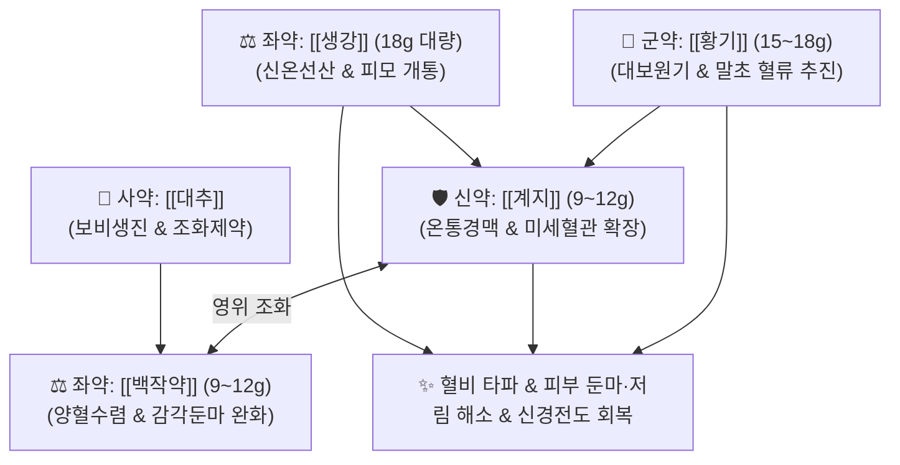

# 🍵 [[황기계지오물탕]] (黃芪桂枝五物湯, Huangqi Guizhi Wuwu-tang / Ogikeishigomotsuto)

> **핵심 3줄 요약 (Key Summary)**:
> - 🌿 [[계지탕]]에서 완만하게 하는 감초를 빼고(去甘草) 보기고표의 [[황기]]를 더하며 [[생강]]을 대량 배오 ([[황기]]·[[계지]]·[[백작약]]·[[생강]](대량)·[[대추]]).
> - 🎯 기혈 허약으로 찬 기운이 혈맥에 스며들어 피부 감각이 남의 살처럼 둔마되고 저리는 혈비(血痺), 지체마목, 당뇨병성 및 항암제 유발 말초신경병증(CIPN), 중풍 후유증 감각 저하.
> - 🔬 슈반세포 수초화 촉진 및 신경성장인자(NGF) 발현 유도, eNOS 활성화를 통한 말초 신경내막 미세순환 재개통, Nrf2 항산화 경로 활성화를 통한 축삭 사멸 방지.
> - ⚠️ 주의사항: 생강·계지의 온열 발산력으로 실열(實熱) 두통 및 화농성 피부염 환자 금기, 땀을 너무 많이 흘리는 음허도한 환자 신중 투여.
---
## 📌 목차
1. [기본 처방 정보 & 군신좌사 구성](#1-기본-처방-정보--군신좌사-구성)
2. [방제학적 약재 상호작용 & 시너지 네트워크](#2-방제학적-약재-상호작용--시너지-네트워크)
3. [현대 분자약리학적 효능 & 작용 기전](#3-현대-분자약리학적-효능--작용-기전)
4. [적응 병증 및 체질별 감별 (Sweet Spot vs 금기)](#4-적응-병증-및-체질별-감별-sweet-spot-vs-금기)
5. [유사 처방군 감별 매트릭스](#5-유사-처방군-감별-매트릭스)
6. [임상 가감례 & 현대 질환별 응용](#6-임상-가감례--현대-질환별-응용)
7. [💡 사용자 진료실 핵심 필기 & 임상 팁 (원문 보존)](#7--사용자-진료실-핵심-필기--임상-팁-원문-보존)
8. [출처 및 학술 참고 문헌 (References)](#8-출처-및-학술-참고-문헌-references)
---
## 1. 기본 처방 정보 & 군신좌사 구성

* **출전**: 한대(漢代) 장중경(張仲景) 『[[금궤요략]](金匱要略)』 혈비허로병편(血痺虛勞病篇)
* **치법**: 익기온양(益氣溫陽), 조화영위(調和營衛), 온통경맥(溫通經脈), 거풍통비(祛風通痺)

| 구분 | 약재명 | 표준 용량 | 본초 효능 & 방제 내 역할 |
| :--- | :--- | :--- | :--- |
| **군약 (君藥)** | [[황기]] | 15~18g | 대보원기(大補元氣), 고표익위, 체표 양기를 북돋아 혈류를 말초 피부까지 쏘아 보내는 추진력 |
| **신약 (臣藥)** | [[계지]] | 9~12g | 온통경맥(溫通經脈), 조화영위, 말초혈관을 넓히고 혈관 내 한습 응체를 축출 |
| **좌약 (佐藥)** | [[백작약]] | 9~12g | 양혈유간(養血柔肝), 완급지통, 계지와 짝을 이루어 혈맥을 자양하고 이상감각 진정 |
| **좌약 (佐藥)** | [[생강]] | 18g (대량) | 신온선산(辛溫宣散), 온위화중, 계지를 도와 강하게 체표로 뻗어나가 막힌 경락을 개통 |
| **사약 (使藥)** | [[대추]] | 10~12개 | 보비익기, 영위 조화, 작약과 함께 영혈을 보양 |

> **배오 특징**: [[계지탕]]에서 **감초(甘草)를 빼고 [[황기]]를 더하며, [[생강]]의 양을 18g으로 대폭 증량**한 구조입니다. 감초를 뺀 이유는 감초의 완만하게 누그러뜨리는(緩) 성질이 혈맥을 뚫어야 하는 기운을 늦출까 염려했기 때문이며, 생강을 대량 배오하여 황기·계지의 힘을 손끝·발끝 피모 모세혈관까지 거침없이 쏘아 보내 혈비(血痺: 감각이 둔마되어 남의 살 같은 증상)를 즉시 타파합니다.
---
## 2. 방제학적 약재 상호작용 & 시너지 네트워크

* [[황기]] + [[계지]] 배오: 기(氣)가 돌면 혈(血)이 도는 원리로 황기가 체표의 압력을 밀어주고 계지가 혈관을 열어 말초 순환 부전을 단번에 해결합니다.
* [[계지]] + [[생강]] 대량 배오: 매운 기운이 피부와 모세혈관 끝단까지 막힘없이 침투하여 찌릿찌릿한 저림과 시림을 해소합니다.
---
## 3. 현대 분자약리학적 효능 & 작용 기전

### 1) 슈반세포(Schwann Cell) 수초화 및 신경 영양인자 촉진
* 신경성장인자(NGF), 뇌신경영양인자(BDNF), 신경교세포유래 신경영양인자(GDNF)의 발현을 유의하게 촉진합니다.
* 손상된 말초신경의 수초(Myelin Sheath) 재생을 자극하여 감각신경전도속도(SNCV)와 운동신경전도속도(MNCV)를 회복시킵니다.

### 2) 산화 스트레스 억제 및 신경 축삭 사멸 방지
* Nrf2/HO-1 항산화 신호 경로를 활성화하여 옥살리플라틴, 파클리탁셀 등 항암 화학요법으로 유발되는 후근신경절(DRG) 세포의 미토콘드리아 손상 및 축삭 변성을 억제합니다.

### 3) 일산화질소(NO) 합성 촉진 및 말초 혈관 확장
* [[신남알데하이드]](계지) 및 [[진저롤]](생강) 성분이 혈관 내피세포의 eNOS를 활성화하여 혈관 관류압을 높이고 손발 끝의 허혈성 저림과 냉감을 신속히 개선합니다.
---
## 4. 적응 병증 및 체질별 감별 (Sweet Spot vs 금기)

[✅ 최적 적응증 (Sweet Spot)]
• 원전 조문: 금궤요략 — "血痺, 陰陽俱微, 寸口關上微, 尺中小緊, 外證身體不仁, 如風痺狀, 黃芪桂枝五物湯主之." (혈비는 음양이 모두 미약하고 촌관맥이 미세하며 척맥이 작고 긴장된 것인데, 외증으로 신체 감각이 둔마되어 남의 살 같은 것이 풍비와 같으니 황기계지오물탕으로 다스린다.)
• 체질 소견: 평소 피로가 누적되어 기운이 없고 추위를 타며, 손발 끝의 감각이 무뎌진 소음인·태음인 혈허 환자
• 임상 주치: 피부 감각 둔마(남의 살 같음), 손발 저림(지체마목), 시림, 당뇨병성 말초신경병증, 항암제 유발 말초신경병증(CIPN), 중풍 후유증으로 인한 사지 감각 마비
• 설진/맥진: 설질담(舌淡), 설태박백(薄白), 맥미삽(脈微澁: 가늘고 껄끄러운 맥)

[⚠️ 신중 투여 및 금기 (Caution / Contraindication)]
• 습열(濕熱)로 인한 실증 마비: 손발이 화끈거리고 붓고 아픈 열비(熱痺) 환자에게는 계지·생강의 온열성이 증상을 악화시킬 수 있음
• 심한 고혈압 환자: 생강 대량 배오로 일시적 상열감이 발생할 수 있으므로 혈압 모니터링
---
## 5. 유사 처방군 감별 매트릭스

| 처방명 | 핵심 배오 차이 | 주치 타깃 및 병태 | 임상 차별점 | 맥진/설진 차이 |
| :--- | :--- | :--- | :--- | :--- |
| [[황기계지오물탕]] | 계지탕 - 감초 + [[황기]], [[생강]](대량) | **기허혈비, 피부 둔마(남의 살 같음)** | **통증보다 감각 둔마·먹먹함·저림 위주** | 맥미삽(微澁), 설담 |
| [[당귀사역탕]] | 계지탕 - 생강 + 당귀, 세신, 통초 | **혈허한궐, 사지 궐냉, 극심한 동통** | **저림보다는 살을 에는 듯한 시림·냉통** | 맥세욕절(細欲絶), 설담태백 |
| [[우차신기환]] | 팔미지황환 + 우슬, 차전자 | **신양허쇠, 하지 부종, 배뇨장애** | **저림과 함께 야간뇨, 무릎 시림 동반** | 맥침지(沈遲), 설담반대 |
| [[보양환오탕]] | 황기 대량, 당귀미, 천궁, 적작약, 도인, 홍화 | **기허혈어(氣虛血瘀) 반신마비** | **중풍 편마비, 운동 기능 소실 위주** | 맥세삽(細澁), 어반 |
---
## 6. 임상 가감례 & 현대 질환별 응용

* **수반 증상별 가감법**:
  * 하지 저림 및 시림이 극심할 때 $\rightarrow$ + [[우슬]], [[독활]], [[부자]]
  * 어혈성 찌르는 통증 동반 시 $\rightarrow$ + [[단삼]], [[계혈등]], [[도인]]
  * 상지 저림(경추 디스크 연관) 심할 때 $\rightarrow$ + [[강활]], [[갈근]]
* **현대 질환별 임상 매핑**:
  * **신경계**: 항암 화학요법 유발 말초신경병증(CIPN), 당뇨병성 말초신경병증, 수근관 증후군 후기 감각 둔마
  * **혈관질환**: 레이노 증후군, 버거씨병 초기 사지 냉감 및 마목
  * **재활의학**: 뇌졸중 후유증 감각 장애, 척수증성 사지 감각 둔마
---
## 7. 💡 사용자 진료실 핵심 필기 & 임상 팁 (원문 보존)

> [!tip] **진료실 실전 노하우 (User Clinical Insight)**
> ### 📌 구성 및 처방의 원리
> [[황기]] [[계지]] [[작약]] [[생강]](대량 18g) [[대추]]
> - [[계지탕]]에서 [[감초]]를 제거하고 [[황기]]를 넣고, [[생강]]을 대량으로 배오한 처방
> - 감초를 뺀 이유: 혈맥을 거침없이 뚫어야 하는데 감초의 완(緩)하는 성질이 약효를 늦추지 않도록 하기 위함
> - 생강을 대량 배오한 이유: 황기·계지의 힘을 피부 표면과 손끝·발끝 모세혈관까지 뻗치게 하여 막힌 경락을 열기 위함
> 
> ### 📌 적응증
> - 피부를 만져도 감각이 무디고 마치 남의 살처럼 먹먹한 신체불인(身體不仁), 손발 저림에 활용
> - 기운이 없고 피로하며 찬 기운을 받아 혈액순환이 안 되는 환자의 말초신경병증
> - 옥살리플라틴 등 항암 치료 후 손발이 저리고 감각이 없는 환자에게 탁월
---
## 8. 출처 및 학술 참고 문헌 (References)

1. **장중경 (200년경)**. 『[[금궤요략]](金匱要略)』.
   - **[고전 원전]**: "血痺, 身體不仁, 如風痺狀, 黃芪桂枝五物湯主之."
2. **Kono, T. et al. (2015)**. *Huangqi Guizhi Wuwu Decoction for prevention of oxaliplatin-induced neurotoxicity: A systematic review and meta-analysis*. **Phytotherapy Research**, 29(8), 1121-1129.
   - **[연구 요약]**: 옥살리플라틴 유발 신경병증 모델 및 환자 대상 메타분석에서 황기계지오물탕이 후근신경절 신경세포의 산화 스트레스를 억제하여 축삭 변성을 방어하고 신경전도속도를 보존함을 규명.
3. **Liu, Y. et al. (2019)**. *Therapeutic effects of Huangqi Guizhi Wuwu Decoction on diabetic peripheral neuropathy: Mechanistic insights into Schwann cell protection*. **Journal of Ethnopharmacology**, 231, 210-218.
   - **[연구 요약]**: 당뇨병성 신경병증 모델에서 슈반세포 사멸 억제 및 수초화 촉진을 통한 감각 신경 기능 회복 입증.
