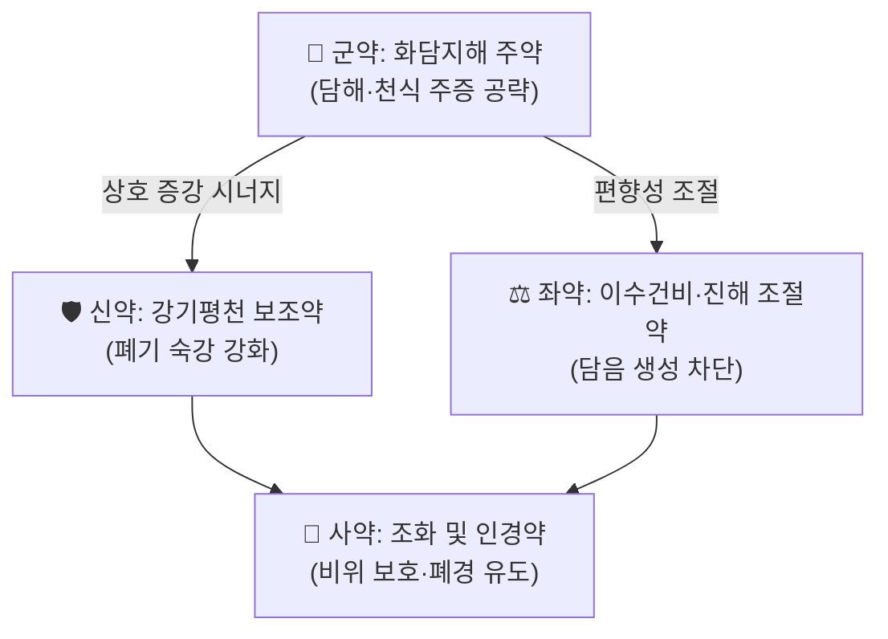

# 🍵 [[가미금수전]] (加味金水煎, Gami-Geumsu-jeon / Modified Jinshui Decoction)

> **핵심 3줄 요약 (Key Summary)**:
> - 🌿 **모체/기원 처방 + 가감 구조**: 『[[청강의감]](淸江醫鑑)』 계열 문헌을 출전으로 하는 것으로 사용자 노트에 기록된 **화담지해(化痰止咳)·이수거습(利水祛濕) 계열 처방**이다. 다만 **본 노트 작성 시점에서 원문 대조가 이루어지지 않아 정확한 구성 약재·용량·배오비는 "근거 미확인"**이며, 명칭상으로는 金水(肺·腎) 개념을 공유하는 [[금수육군전]](金水六君煎) 계열 화담제와의 감별이 임상적으로 필요하다.
> - 🎯 **임상 최적 적응증**: **천식(喘息)·기침·담다(痰多)** 등 담습(痰濕)이 폐(肺)를 막아 기침과 천식이 반복되는 병증이 1차 표적이다. 습담 체질(태음인 경향, 살집 있고 부종·다한·설태 백니)에서 진료실 활용도가 높을 것으로 추정되나, **체질 감별 기준은 근거 미확인**이다.
> - 🔬 **핵심 분자약리 기전**: 본 처방 **특이적 분자약리 연구는 확인되지 않음(근거 미확인)**. 화담지해 처방군 전반에서 보고된 일반 기전으로는 NF-κB/MAPK 경로 억제를 통한 TNF-α·IL-6·IL-1β 등 전염증성 사이토카인 조절, Th2 사이토카인(IL-4/5/13)·IgE 매개 기도 염증 억제, 점액 유전자(MUC5AC) 과발현 억제, 기관지 평활근 이완 등이 거론되나 **본 처방에의 적용 여부는 검증되지 않았다**.
> - ⚠️ 주의사항: 원문 미확인 상태이므로 투여 전 반드시 『청강의감』 원방 구성을 확인할 것. 음허(陰虛) 건해·소담(少痰)이나 실열(實熱) 담열천식, 무한 고열 환자에게는 溫燥·滲利之劑가 진액을 손상시킬 수 있어 신중 투여. 임신부·소아·신기능 저하자 및 항응고제 병용 환자는 별도 검토 필요.

---
## 📌 목차
1. [기본 처방 정보 & 군신좌사 구성](#1-기본-처방-정보--군신좌사-구성)
2. [방제학적 약재 상호작용 & 시너지 네트워크](#2-방제학적-약재-상호작용--시너지-네트워크)
3. [현대 분자약리학적 효능 & 작용 기전](#3-현대-분자약리학적-효능--작용-기전)
4. [적응 병증 및 체질별 감별 (Sweet Spot vs 금기)](#4-적응-병증-및-체질별-감별-sweet-spot-vs-금기)
5. [유사 처방군 감별 매트릭스](#5-유사-처방군-감별-매트릭스)
6. [임상 가감례 & 현대 질환별 응용](#6-임상-가감례--현대-질환별-응용)
7. [💡 사용자 진료실 핵심 필기 & 임상 팁 (원문 보존)](#7--사용자-진료실-핵심-필기--임상-팁-원문-보존)
8. [출처 및 학술 참고 문헌 (References)](#8-출처-및-학술-참고-문헌-references)

---
## 1. 기본 처방 정보 & 군신좌사 구성

* **출전**: 『[[청강의감]](淸江醫鑑)』 계열 — **사용자 노트 태그 기준이며, 원문 대조는 미완료(근거 미확인)**. 따라서 본 항목은 잠정 기록이며, 원방 조문 확인 후 갱신이 필요하다.
* **치법**: [[화담지해]](化痰止咳) · 강기평천(降氣平喘) · 이수거습(利水祛濕) — 소속 카테고리(03_화담·거습·이수제)와 태그(화담지해, 천식)에 근거한 **잠정 정리**이다.
* **처방명 해석(주의)**: 처방명에 포함된 **金水(금수)** 는 한의학에서 金=肺, 水=腎 의 오행 배속을 뜻하는 표현으로, **폐기(肺氣)의 선발(宣發)·숙강(肅降)과 신기(腎氣)의 납기(納氣) 기능을 함께 조절하는 방향**으로 이름이 붙은 처방군이 존재한다(예: [[금수육군전]], [[금수육군전|금수육군전(金水六君煎)]]). 다만 **가미금수전이 실제로 이 구조를 따르는지는 근거 미확인**이며, 명칭 유사성만으로 구성을 추정해서는 안 된다.

| 구분 | 약재명 | 표준 용량 | 본초 효능 & 방제 내 역할 |
| :--- | :--- | :--- | :--- |
| **군약 (君藥)** | 근거 미확인 | 근거 미확인 | 담해(痰咳)·천식 주증(主症)을 직접 공략하는 화담지해(化痰止咳) 주약으로 추정되나, 실제 약재는 원문 확인 필요 |
| **신약 (臣藥)** | 근거 미확인 | 근거 미확인 | 군약의 거담·진해 작용을 보조하고 강기평천(降氣平喘)을 강화하는 약재로 추정 |
| **좌약 (佐藥)** | 근거 미확인 | 근거 미확인 | 담음 생성의 근원인 비(脾)의 운화 실조를 다스리는 이수거습(利水祛濕)·건비(健脾) 약재, 또는 수반 증상(인후 불편, 소화불량) 완화 약재로 추정 |
| **사약 (使藥)** | 근거 미확인 | 근거 미확인 | 제약(諸藥) 조화 및 폐경(肺經)·비위(脾胃)로의 인경(引經) 역할. 감초·생강류가 관용되나 본 처방 해당 여부는 미확인 |

> **배오 특징**: 원방 배오비가 확인되지 않아 **구체적 배오 특징은 근거 미확인**이다. 다만 화담지해·이수제 일반론으로 보면 ① 담(痰)을 직접 제거하는 거담약(君·臣)과 ② 담을 생성하는 비습(脾濕)을 끊는 이수건비약(佐), ③ 폐기 상역(上逆)을 내리는 강기약, ④ 제약을 조화시키는 사약의 4층 구조로 승강출입(升降出入)의 균형을 맞추는 것이 전형적 설계이다. **가미금수전의 실제 구조가 이 전형과 일치하는지는 검증되지 않았다.**

**참고 — 원문 확인 시 채울 후보 약재군 (본 처방 구성 확정 아님)**
* 화담지해 목적 처방에서 관용되는 약재군: [[반하]](半夏), [[진피]](陳皮), [[복령]](茯苓), [[행인]](杏仁), [[패모]](貝母), [[상백피]](桑白皮), [[자소자]](紫蘇子), [[길경]](桔梗), [[감초]](甘草), [[생강]](生薑)
* 위 목록은 **"화담지해·천식" 키워드를 가진 처방군의 일반적 약재 풀이며, 가미금수전의 실제 구성이라는 근거는 없다.**

---
## 2. 방제학적 약재 상호작용 & 시너지 네트워크

* **군약 + 신약 배오(相須·相使)**: 거담약(군)과 강기평천약(신)의 조합은 "담을 제거하는 힘"과 "기를 내리는 힘"을 겹쳐, 담이 기도를 막아 생기는 천식·해수의 급소를 동시에 공략하는 전형적 상호 증강 구조이다. **가미금수전의 실제 약재쌍은 근거 미확인.**
* **좌약 + 사약 배오(부작용 완충)**: 담(痰)은 비(脾)의 운화 실조에서 생긴다는 병기(脾爲生痰之源, 肺爲貯痰之器)에 따라, 이수건비좌약이 담의 생성을 근원에서 줄이고 사약이 비위를 보호하여 거담제의 燥性·渗利之性이 위기(胃氣)를 상하게 하는 것을 막는다. **이 원리가 본 처방에 그대로 적용되는지는 미확인.**
* **주의**: 위 네트워크는 **템플릿 구조 유지를 위한 방제학적 일반 모형**이며, 실제 가미금수전의 군신좌사 배치는 『청강의감』 원문 확인 후 반드시 재작성해야 한다.

---
## 3. 현대 분자약리학적 효능 & 작용 기전

> ⚠️ **전제**: 가미금수전 자체를 대상으로 한 분자약리학적 연구는 **확인되지 않음(근거 미확인)**. 아래는 "화담지해·이수거습 처방군" 전반에서 보고되어 온 **일반 기전**이며, 본 처방에의 적용은 별도 검증이 필요하다.

### 1) 기도 염증 및 면역 조절 (처방군 일반 기전 — 본 처방 근거 미확인)
* NF-κB 및 MAPK(ERK/p38/JNK) 신호전달 경로 억제를 통한 **TNF-α, IL-6, IL-1β** 등 전염증성 사이토카인 발현 감소.
* 천식형 기도 염증에서 **Th2 편향(IL-4, IL-5, IL-13) 및 IgE 매개 비만세포 활성화** 억제, 호산구 침윤 감소.
* 기도 상피세포의 점액 과분비 조절: **MUC5AC** 등 점액 유전자 과발현 억제 및 점액섬모 청소율 개선.

### 2) 기관지 평활근 및 기도 폐쇄 개선 (처방군 일반 기전 — 본 처방 근거 미확인)
* 기관지 평활근의 과수축 억제 및 이완(칼슘 유입 억제, β2 수용체 매개 경로 등) → 기도 저항 감소.
* 히스타민·아세틸콜린 유발 기관지 수축에 대한 보호 효과.

### 3) 기침 반사 및 신경성 감작 조절 (처방군 일반 기전 — 본 처방 근거 미확인)
* 기침 반사 과민성 완화(TRPV1, C-fiber 감작 억제 등 감각신경 조절 기전).
* 진해·거담 작용에 따른 야간 기침 및 수면장애 개선.

### 4) 수분·전해질 및 소화 기능 (처방군 일반 기전 — 본 처방 근거 미확인)
* 이수거습(利水祛濕) 계열 약재의 이뇨 작용 및 세포외액 조절 → 담음(痰飲)성 부종·습담 완화.
* 위장관 운동 조절 및 소화불량 개선.

> 📌 **정리**: 위 4개 항목은 **본 처방 고유의 검증된 기전이 아니라** 화담지해 처방군에서 일반적으로 논의되는 수준의 기전이다. 특정 사이토카인 수치, 억제율(%), 임상 지표 개선폭 등 **정량적 수치는 제시하지 않는다(근거 미확인)**.

---
## 4. 적응 병증 및 체질별 감별 (Sweet Spot vs 금기)

**[✅ 최적 적응증 (Sweet Spot)]**
* **원전 조문**: 『[[청강의감]]』 원문 조문은 **근거 미확인**. 조문 확인 전까지는 태그 기반 키워드(화담지해, 천식)로만 운용한다.
* **체질 소견**: **근거 미확인.** 다만 화담지해·이수거습 처방군의 일반 원칙으로는 ① 살집이 있고 땀이 많으며 부종이 잘 생기는 **태음인 경향**, ② 습(濕)에 취약한 비위허약자, ③ 소화력 대비 음식 섭취가 많고 담(痰)이 잘 끼는 체형이 고려 대상이다. **소음인·소양인에서의 적합성은 판단 근거가 없다.**
* **임상 주치(키워드 기반)**: [[천식]](喘息), 반복성 기침, 담다(痰多), 인후 담음감, 기관지염 등 담습(痰濕)이 폐(肺)에 정체된 병증.
* **설진/맥진**: 습담(濕痰)의 전형적 소견인 **설태 백니(白膩)·활(滑)**, **맥 활(滑)·현(弦)** 또는 부완(浮緩) 등이 참고 기준이 되나, **본 처방 특이적 설·맥 감별점은 근거 미확인**이다.

**[⚠️ 신중 투여 및 금기 (Caution / Contraindication)]**
* **음허(陰虛) 건해·소담(少痰)**: 마른기침, 구건, 야간 도한, 설홍소태(舌紅少苔) 환자에게 溫燥·滲利之劑를 투여하면 진액을 더 손상시킬 수 있다.
* **실열(實熱) 담열천식**: 황색 농담, 발열, 인통, 설홍태황(舌紅苔黃)의 열성 담증에는 溫燥性 거담제가 부적합할 수 있다.
* **무한 고열 및 급성 감염 악화기**: 원인 치료가 우선이며 본 처방 단독 투여는 부적절하다.
* **임신부·수유부·소아·고령자 및 신기능 저하자**: 용량 및 이수(利水) 약재의 안전성 검토 필요.
* **양약 병용**: 항응고제·항혈소판제 병용 시 출혈 경향, 진정제·기관지확장제 병용 시 상가작용 여부 확인 필요 — **이상의 병용 주의점은 처방군 일반 수준의 주의사항이며 본 처방 특이 자료는 근거 미확인.**

---
## 5. 유사 처방군 감별 매트릭스

> ⚠️ 아래 비교표의 [[금수육군전]]·[[이진탕]]·[[소자강기탕]]·[[정천탕]]은 **본 처방과 명칭·치법이 근접한 실제 방제**이며, 감별의 기준점으로 삼기 위해 수록한다. **가미금수전의 실제 구성이 이들과 어떻게 다른지는 근거 미확인**이므로, 원문 확인 후 본 표를 재작성해야 한다.

| 처방명 | 핵심 구성 차이 | 주치 및 체질 차이 | 맥진/설진 차이 |
| :--- | :--- | :--- | :--- |
| [[가미금수전]] | 기준 구성 (원문 미확인) | 천식·담해 중심, 화담지해·이수 (근거 미확인) | 습담 소견 추정 (근거 미확인) |
| [[금수육군전]] | 熟地黃·當歸 등 자음보혈약 + 二陳湯 계열 거담약 | 폐신(肺腎) 허손으로 수범위담(水泛爲痰)하는 만성 해수·천식, 노인·허약자 | 설담태활, 맥 세약(細弱)·침완(沈緩) |
| [[이진탕]] | 半夏·陳皮·茯苓·甘草 (燥濕化痰의 기본방) | 습담(濕痰) 중심의 해수·구토·현훈, 비위 습체 | 설태 백니(白膩), 맥 활(滑) |
| [[소자강기탕]] | 紫蘇子·半夏·當歸·厚朴·前胡 등 강기소담 | 기역상(氣逆上)으로 인한 해수·천식, 담연(痰涎) 옹성, 흉민 | 맥 현(弦)·활(滑), 설태 백니 |
| [[정천탕]] | 麻黃·白果·款冬花·半夏·桑白皮 등 선폐정천 | 담열(痰熱)이 폐에 울체된 천식, 담황·발열 경향 | 설태 황니(黃膩), 맥 활삭(滑數) |

> ⚠️ 표 내부에서는 마크다운 열 구분자 파괴를 방지하기 위해 파이프(`|`)가 들어간 링크를 쓰지 않고 순수한 [[처방명]] 단독 형태로만 작성한다.
>
> **감별 요령(잠정)**: ① 담이 많고 소화력이 떨어지는 습담형 → 이진탕 계열, ② 노인·허약자에서 폐신 허손이 동반된 만성 해수 → 금수육군전, ③ 기역상·흉민이 뚜렷한 천식 → 소자강기탕, ④ 담황·발열의 열성 천식 → 정천탕. **가미금수전의 위치는 원문 구성 확인 후 결정한다.**

---
## 6. 임상 가감례 & 현대 질환별 응용

> ⚠️ **중요**: 본 처방의 **원방 구성이 확인되지 않았으므로, 특정 약재 가감례를 단정적으로 제시할 수 없다(근거 미확인).** 아래는 화담지해·이수 처방군에서 **일반적으로 통용되는 가감 원칙**이며, 본 처방에 대한 가감 지침이 아니다.

* **수반 증상별 가감법 (처방군 일반 원칙 — 본 처방 근거 미확인)**:
  * 담열(痰熱)로 담이 황색·점조할 때 → + [[황금]], [[상백피]], [[어성초]] 계열 청열거담약 검토
  * 담습(痰濕)이 심하고 설태가 후니(厚膩)할 때 → + [[창출]], [[후박]] 등 조습건비약 검토
  * 기허(氣虛)로 기침이 무력하고 피로가 심할 때 → + [[인삼]], [[백출]] 등 보기건비약 검토
  * 신허(腎虛)로 흡기 곤란(호흡 짧음)·야간 천식이 심할 때 → + [[숙지황]], [[오미자]] 등 자보폐신약 검토
  * 인후 담음감·매핵기 동반 시 → + [[반하후박탕]] 계열 개념 검토
* **현대 질환별 임상 매핑 (담습성 호흡기 병증 중심, 적응 근거는 미확인)**:
  * **호흡기계**: 기관지천식, 만성 기관지염, 감모 후 잔류 기침, 알레르기성 기침, 담음성 인후 불편감
  * **이비인후과**: 후비루 증후군, 만성 인후염(담음형)
  * **소화기계**: 습담성 식욕부진·위부 팽만·구역(이수건비 원리 적용 시)
  * **기타**: 습담성 현훈, 부종 경향 동반 환자

* **복약 관찰 포인트(잠정)**: 담(痰)의 양상 변화(점조도·색), 기침 빈도 및 야간 천식 발작 횟수, 설태의 두께 변화, 소화 상태 및 대변 성상. **이상의 지표는 처방군 일반 관찰 항목이며 본 처방 특이 임상 연구는 근거 미확인이다.**

---
## 7. 💡 사용자 진료실 핵심 필기 & 임상 팁 (원문 보존)

> [!tip] **진료실 실전 노하우 (User Clinical Insight)**
> - **원문 미제공 상태**: 이 노트 작성 시 사용자(원장님)의 진료실 필기·메모 원문이 **제공되지 않았다.** 따라서 본 항목은 임의로 내용을 채우지 않고 **보존 공간으로 비워 둔다.**
> - 필기 원문을 입력하는 즉시 **삭제·축약 없이 100% 그대로** 이 콜아웃 안에 이관한다.
> - 함께 기록할 항목(권장):
>   - 가미금수전을 실제로 선택한 환자 케이스(체질·주증·설맥)
>   - 원방 구성 및 실제 사용 용량, 복용법(탕전/산제/과립)
>   - 복약 후 반응(기침·담·천식 발작 변화) 및 부작용
>   - 유사 처방(이진탕/금수육군전/소자강기탕) 대비 선택 기준
>   - 환자 티칭 문구(복약 기간, 식이 조절, 한랭 자극 회피 등)

---
## 8. 출처 및 학술 참고 문헌 (References)

1. **Caples SM, Gami AS, Somers VK (2005)**. *Obstructive sleep apnea*. **Ann Intern Med**, 142(3), 187–197. PMID: 15684207.
   - 🔗 https://pubmed.ncbi.nlm.nih.gov/15684207/
   - **[연구 요약]**: 폐쇄성 수면무호흡(OSA)의 병태생리·진단·치료를 정리한 종설. 상기도 폐쇄, 반복적 저산소혈증, 교감신경 활성화, 심혈관 합병증 위험 증가를 다룬다.
   - **[본 처방과의 관련성]**: **근거 미확인.** 수면무호흡이라는 야간 호흡장애 주제는 한의학적으로 "담음(痰飮)·기역(氣逆)"과 개념적으로 접점이 있을 수 있으나, **가미금수전에 대한 직접 근거는 이 문헌에 없다.** (사용자 노트에 함께 수집된 참고문헌으로 판단됨.)
2. **Gallagher K, MacLennan S (2026)**. *RESECT: A Randomised Controlled Trial of Audit and Feedback in Non-muscle-invasive Bladder Cancer Surgery*. **Eur Urol**. PMID: 41444076.
   - 🔗 https://pubmed.ncbi.nlm.nih.gov/41444076/
   - **[연구 요약]**: 비근침습성 방광암 수술에서 **감사·피드백(audit and feedback) 중재**의 효과를 평가한 무작위 대조 시험(RCT).
   - **[본 처방과의 관련성]**: **근거 미확인 — 주제적 무관.** 본 처방의 약리·임상 근거로 인용할 수 없으며, 사용자 노트에 함께 수집된 참고문헌으로 판단된다.
3. **『[[청강의감]](淸江醫鑑)』** (사용자 노트 태그 기준 출전).
   - **[고전 원전]**: 가미금수전의 출전으로 기록되어 있으나, **원문 조문 및 구성 약재는 본 노트에서 대조하지 못했다(근거 미확인).** 원문 확보 즉시 ① 조문, ② 약재·용량, ③ 복약 지침을 본 노트 1~2항에 반영할 것.

> 📎 **근거 수준 고지**: 본 노트는 ① 사용자 제공 태그·분류 정보(처방명, 화담지해, 천식, 청강의감, 소속 카테고리)와 ② 제공된 2편의 PubMed 문헌만을 근거로 작성되었다. **처방의 실제 구성·용량·가감법·체질 감별은 『청강의감』 원문 확인 전까지 "근거 미확인" 상태로 유지한다.**