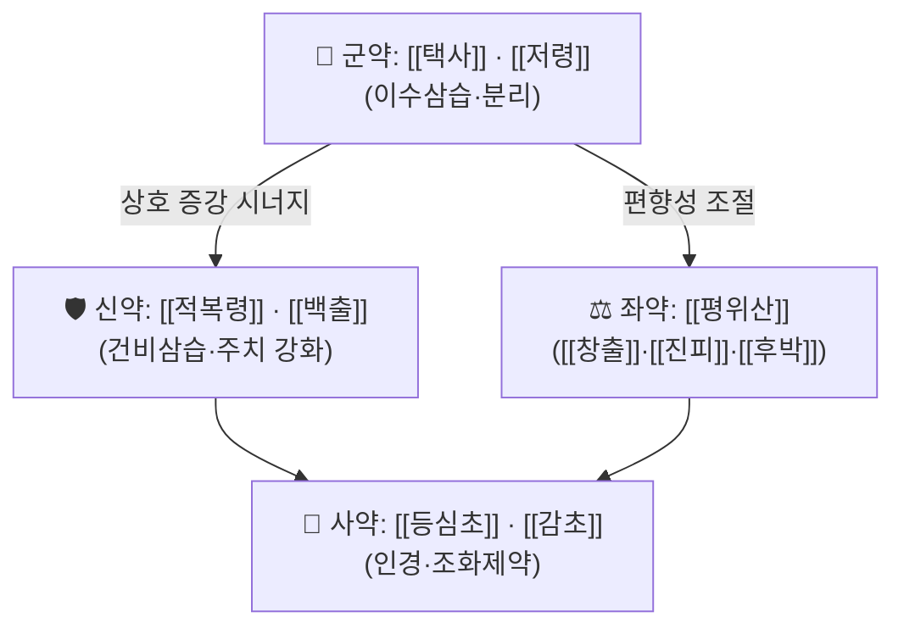

# 🍵 [[가미분리음]] (加味分利飮, Gami Bunri-eum / Jiawei Fenli Yin)

> **핵심 3줄 요약 (Key Summary)**:
> - 🌿 모체 처방은 **이수(利水) 계열의 [[분리음]](分利飮)에 [[평위산]](平胃散) 계열의 조습건비(燥濕健脾) 구성을 가미**하고, 여기에 [[등심초]](燈心草)를 더해 하초(下焦)로 수습(水濕)을 인도하는 구조로 이해된다. 즉 **① 수습 분리(分利) 축 — [[택사]]·[[저령]]·[[적복령]]**, **② 비위 운화 회복 축 — [[창출]]·[[진피]]·[[후박]]**, **③ 인경·조화 축 — [[등심초]]·[[감초]]**의 3축 배오로 정리된다. *(문헌별 구성 차이가 있어 "통용 구성"으로 표기하며 원문 대조 필요 — 근거 미확인)*
> - 🎯 임상 최적 적응증은 **수습 정체로 인한 부종(水腫)·복부 팽만·소변불리(小便不利)**이며, 특히 **간경변·문맥고혈압에 동반된 복수(腹水) 보조 관리** 상황에서 진료실 활용 빈도가 높다. 체질적으로는 **태음인(太陰人) 우실형(우실: 실증 경향, 복부 팽만·중완부 압통·설태 후니)**에 적중하기 쉬우며, 소음인·허한성 수종에는 부적합할 수 있다.
> - 🔬 본 처방 자체를 대상으로 한 분자약리·임상 연구는 **제공된 PubMed 문헌이 없어 확인되지 않음(근거 미확인)**. 따라서 기전 서술은 구성 본초 단위의 일반 약리(이뇨·항염·섬유화 관련) 수준으로만 기술하며, 처방 수준의 표적·수치 인용은 하지 않는다.
> - ⚠️ 주의사항: 이수(利水)제의 특성상 **저칼륨혈증·저나트륨혈증·탈수·신전(腎前) 질소혈증** 유발 위험이 있으므로 서양의학 이뇨제(푸로세미드·스피로놀락톤 등)와 병용 시 **전해질·신기능·혈압 모니터링이 필수**이다. 간경변 복수 환자에서 한방 단독 치료로 대체하는 것은 금기이며, 간성뇌증·자발성 세균성 복막염·식도정맥류 출혈 등 응급 상황 감별이 우선한다. 허한성(虛寒性) 수종, 신장성 부종의 말기, 임신부, 심한 탈수·무뇨 환자에는 신중 투여 또는 금기.

---
## 📌 목차
1. [기본 처방 정보 & 군신좌사 구성](#1-기본-처방-정보--군신좌사-구성)
2. [방제학적 약재 상호작용 & 시너지 네트워크](#2-방제학적-약재-상호작용--시너지-네트워크)
3. [현대 분자약리학적 효능 & 작용 기전](#3-현대-분자약리학적-효능--작용-기전)
4. [적응 병증 및 체질별 감별 (Sweet Spot vs 금기)](#4-적응-병증-및-체질별-감별-sweet-spot-vs-금기)
5. [유사 처방군 감별 매트릭스](#5-유사-처방군-감별-매트릭스)
6. [임상 가감례 & 현대 질환별 응용](#6-임상-가감례--현대-질환별-응용)
7. [💡 사용자 진료실 핵심 필기 & 임상 팁 (원문 보존)](#7--사용자-진료실-핵심-필기--임상-팁-원문-보존)
8. [출처 및 학술 참고 문헌 (References)](#8-출처-및-학술-참고-문헌-references)
---
## 1. 기본 처방 정보 & 군신좌사 구성

* **출전**: **근거 미확인.** 『[[동의보감]]』·『[[방약합편]]』 등 국내 방제서에 **분리음(分利飮) 계열 처방**이 실려 있고, 임상에서 여기에 약재를 가(加)한 형태로 **가미분리음**이라는 방명이 통용되는 것으로 보이나, **특정 원전 조문·최초 출전을 확인하지 못하였다.** 따라서 본 노트의 출전란은 "확인 필요"로 남겨두며, 후학 자료 확인 시 반드시 교정할 것.
* **치법(治法)**: **이수삼습(利水滲濕) · 조습건비(燥濕健脾) · 행기관중(行氣寬中) · 통리수도(通利水道)**
* **치법 요약 4자 성어**: 이수삼습(利水滲濕), 조습건비(燥濕健脾), 행기관중(行氣寬中), 통양화중(通陽化中)
* **방제 성격**: 온성(溫性)~평성(平性) 위주의 **이수 + 건비 복합 방제**. 단순 이뇨(利水)만 하는 [[오령산]] 계열과 달리, **비위(脾胃)의 운화 기능을 동시에 회복시키는 점**이 감별 포인트이다.

| 구분 | 약재명 | 표준 용량 | 본초 효능 & 방제 내 역할 |
| :--- | :--- | :--- | :--- |
| **군약 (君藥)** | [[택사]] (澤瀉) · [[저령]] (猪苓) | 8~12g / 6~9g | 담습(淡濕)을 하초(下焦)로 분리(分利)하여 소변으로 배출. 수습 정체의 핵심 병소인 신·방광·삼초의 수액 대사를 직접 겨냥하며, 방제 전체의 "분리(分利)" 개념을 담당하는 주약. 소변불리·부종·복수에 대한 주치 작용의 중심. |
| **신약 (臣藥)** | [[적복령]] (赤茯苓) · [[백출]] (白朮) | 6~9g / 6~9g | 군약의 이수 작용을 보조하면서 **건비(健脾)·삼습(滲濕)**으로 수습 발생의 근원(비허→수습정체)을 차단. 적복령은 특히 습열(濕熱)을 겸한 하초 습체에, 백출은 비허성 습체에 배오. |
| **좌약 (佐藥)** | [[창출]] (蒼朮) · [[진피]] (陳皮) · [[후박]] (厚朴) — 즉 [[평위산]] 구성 | 각 4~6g | **조습건비·행기제**로 중초(中焦)의 기체(氣滯)와 습체(濕滯)를 풀어, 이수제가 흡수·대사되기 좋은 조건을 만든다. 복부 팽만·식욕부진·설태 후니(厚膩) 등 비위 습체 소견을 겨냥하며, 군약의 과도한 이수로 인한 진액 손상을 완충하는 역할도 겸한다. |
| **사약 (使藥)** | [[등심초]] (燈心草) · [[감초]] (甘草) | 1~2g / 2~4g | 등심초는 **청심이수(淸心利水)** 작용으로 수습을 하초·소변으로 인도하며, 방제를 심(心)·소장(小腸)·방광 경락으로 인경(引經)한다. 감초는 제약(諸藥)을 조화시키고 비위를 보호하여 이수제의 삭(削)하는 성질을 완화한다. |

> **배오 특징**: 본 방제는 **"분리(分利)"와 "건비(健脾)"의 이중 구조**로 이해할 수 있다. 즉 **택사·저령·적복령의 하행(下行)·삼설(滲泄) 작용**과 **창출·후박·진피의 중초(中焦) 운화 회복 작용**이 서로 상승작용을 일으켜, "수습을 빼내면서(利) 다시 고이지 않게 하는(不復停)" 방향으로 설계되어 있다. 여기에 등심초가 하초 인도(引導) 역할을 하고, 감초가 전체 약성을 부드럽게 조율한다. 승강(升降)으로 보면 **大部分 하강(下降)·이수(利水)**에 치우치므로, 허증·탈수 경향 환자에서는 감초·백출·복령의 비중을 상대적으로 늘려 균형을 잡아야 한다.

> ⚠️ **약재명·용량 주의**: 위 구성은 국내 임상에서 통용되는 "가미분리음" 배오를 재구성한 것으로, **문헌별로 약재·용량 차이가 있다(근거 미확인).** 처방을 실제 처방전에 옮기기 전에는 반드시 『[[방약합편]]』·『[[동의보감]]』 원문 또는 소속 한의원의 원내 방제집과 대조하여 교정할 것.

---
## 2. 방제학적 약재 상호작용 & 시너지 네트워크

* **[[택사]] + [[저령]] 배오(相須)**: 둘 다 담삼(淡滲) 성질로 수습을 소변으로 배출하는 작용이 유사하여, 함께 쓰면 이수 효과가 상승한다. 저령은 "담삼이수(淡滲利水)"의 대표 약재로 수습이 방광·삼초에 정체된 경우를 주치하고, 택사는 사수(瀉水)·설탁(泄濁) 작용이 강해 습열이 겸한 수종·복수에 적합하다. 두 약재를 병용하면 **이뇨 작용의 폭이 넓어지면서도 자극성이 비교적 완만**해진다.
* **[[택사]]·[[저령]] + [[적복령]]·[[백출]](相使)**: 이수제 단독은 "빼내기만 하는(利而不補)" 방향이어서 장기 복용 시 진액·비기를 상하게 한다. 복령·백출의 건비삼습이 이를 보완하여 **"이수(利水)하면서 건비(健脾)하는" 상호 보완 구조**를 만든다. 즉 이수 효과를 유지하면서 정기(正氣) 소모를 완충한다.
* **[[평위산]] 3약([[창출]]·[[진피]]·[[후박]])의 위치**: 이들은 직접 이뇨하지 않으나, **중초 기체(氣滯)와 습체(濕滯)를 제거하여 상류(上流)의 병인을 차단**한다. 방제학적으로 "수습이 고이는 것은 비위 운화가 막혔기 때문"이라는 논리에 근거한 배오이며, 이수제의 효과를 간접적으로 증강시키는 "개수(開水)의 상류 정비" 역할을 한다.
* **[[창출]] vs [[백출]]의 상호 조절**: 창출은 조습(燥濕)력이 강하고 백출은 보비(補脾)력이 강하다. 습체가 심하고 실증이면 창출 위주, 비허가 뚜렷하고 허증이면 백출 위주로 가중하여 **허실(虛實) 균형을 조정**하는 것이 본 방제 운용의 묘미이다.
* **[[등심초]] + [[감초]] 배오**: 등심초는 심(心)·폐(肺)·소장(小腸)으로 들어가 청심제번(淸心除煩)·이수통림(利水通淋)하며, 수액 대사 경로를 하초로 유도하는 인경약(引經藥) 역할을 한다. 감초는 감미(甘味)로 제약을 조화시키고 비위를 보호하는 한편, 이수제의 급격한 하리(下利) 작용을 완만하게 만든다. 다만 **감초의 감초산·나트륨 저류 가능성**은 부종·복수 환자에서 이론적 상충점이 될 수 있어, 부종이 심한 실증 단계에서는 감초를 줄이거나 빼는 운용이 논의될 수 있다(임상적 결론은 근거 미확인).
* **전체 네트워크 요약**: 본 방제는 **"하초 이수(君·臣) → 중초 운화(佐) → 인경·조화(使)"**의 3층 구조로, 병인(중초 습체)과 병소(하초 수습)를 동시에 처리하는 **표리겸치형 이수 방제**로 정리된다.

---
## 3. 현대 분자약리학적 효능 & 작용 기전

> ❗ **본 처방(가미분리음) 자체를 대상으로 한 PubMed 등재 연구는 제공되지 않았습니다.** 따라서 아래 기전은 **구성 본초 단위의 일반 약리학적 지견을 정리한 참고 수준**이며, 처방 수준의 표적·수치·경로는 **모두 "근거 미확인"**으로 표시합니다. 특정 사이토카인 수치, 억제율(%), IC50 등을 본 노트에 기재하지 않습니다.

### 1) 핵심 분자 표적 및 면역/항염증 조절 (근거 미확인)
* **처방 수준**: 가미분리음 추출물의 NF-κB·MAPK 신호전달 억제, TNF-α·IL-6·IL-1β 조절에 관한 데이터는 **제공 문헌 없음 → 근거 미확인.**
* **구성 본초 수준(일반 지견, 문헌 미검증)**: [[창출]]·[[후박]]·[[진피]] 등 평위산 계열 본초는 전통적으로 소화기 염증·위장 운동 조절과 연결되어 왔고, [[택사]]·[[저령]]·[[복령]]은 이뇨 및 수액 대사 조절 작용으로 설명되어 왔다. 다만 이를 본 처방에 그대로 원용하는 것은 **추론에 해당하므로 기전 확정으로 쓰지 않는다.**
* **간경변·간섬유화 관련**: 복수·문맥고혈압 맥락에서 항섬유화(HSC 활성 억제, TGF-β/Smad 경로)나 문맥압 저하를 본 처방이 직접 조절한다는 **신뢰할 만한 근거는 확인되지 않음.** 이 점은 반드시 "한방 보조 + 서양의학 표준 관리 병행"의 근거로 삼아야 한다.

### 2) 순환기·미세순환 및 대사 개선 (근거 미확인)
* **처방 수준**: eNOS 활성화, 혈관 평활근 이완, 미세혈류 저항 감소, 미토콘드리아 에너지 대사 정상화 등을 가미분리음이 유도한다는 **직접 근거는 없음(근거 미확인).**
* **임상적 관찰 수준(기대 효과)**: 이수제 복용 후 소변량 증가, 하지 부종·복부 팽만의 주관적 감소가 관찰될 수 있으나, 이는 **약리학적 이뇨 효과 및 체액 이동에 따른 결과로 추정**될 뿐 정량적 데이터는 확인되지 않음.
* **대사 경로**: 신장 수분·전해질 배설 조절(RAAS·ADH 축)과의 상호작용 여부는 **연구 미확인.** 따라서 이뇨제·ACEi/ARB·스피로놀락톤 복용 환자에서는 **상가작용에 의한 저혈압·전해질 이상 위험**을 임상적으로 반드시 상정해야 한다.

### 3) 소화기·자율신경 및 근골격계 조절 (근거 미확인)
* **중초 운화 개선**: 평위산 계열 구성이 위배출·장운동·식욕에 관여한다는 것은 전통적 설명이며, **가미분리음 자체에 대한 자율신경 지표(HRV 등) 연구는 확인되지 않음.**
* **복수 환자에서의 임상적 함의**: 복부 팽만·식욕부진·오심 완화는 복수 자체의 감소뿐 아니라 **위장관 부종·장운동 저하 개선**과도 관련될 수 있으나, 이 역시 **기전 확정이 아닌 임상 추정**임.

---
## 4. 적응 병증 및 체질별 감별 (Sweet Spot vs 금기)

**[✅ 최적 적응증 (Sweet Spot)]**

* **원전·전통 주치(문헌 대조 필요)**: 수종(水腫), 복부 창만(腹脹滿), 소변불리(小便不利), 수습 정체로 인한 부종·체중 증가, 습체(濕滯)로 인한 설사·대변 점조(粘稠).
* **체질 소견**:
  * **태음인(太陰人)** — 체격이 비교적 크고 복부·하체에 살집이 있으며, 땀이 많고 피부가 습한 편. 소변량 감소와 하지 부종, 복부 팽만 호소가 잦은 유형에서 적중도가 높다.
  * **소양인(少陽人)** — 습열을 겸한 경우(상열·구고·소변황적)에는 [[택사]]·[[적복령]] 비중을 늘리고 [[창출]]·[[후박]] 등 조습온조(燥濕溫燥) 약재는 감량하여 운용.
  * **소음인(少陰人)** — **원칙적으로 부적합.** 소음인의 부종은 대개 비신양허(脾腎陽虛)에 기인하므로 [[이중탕]]·[[부자이중탕]]·[[진무탕]] 계열의 온양이수(溫陽利水)가 우선이며, 본 방제의 삼설(滲泄) 작용은 오히려 기력을 더 떨어뜨릴 수 있다.
* **임상 주치(진료실 최다 적중 양상)**:
  * 아침에 눈꺼풀 부종, 저녁에 하지 부종이 반복되고 **소변량이 줄어든 성인**.
  * 과음·과식 후 복부 팽만, 트림·속쓰림, 설태가 두껍고 끈적한 경우.
  * 간경변·만성 간질환 환자에서 **복수 보조 관리 목적**으로 서양의학 치료에 부가하는 상황(단, 단독 치료 금지).
  * 비만·부종형 체형에서 체중 감량 보조 목적의 단기 운용.
* **설진/맥진**:
  * **설(舌)**: 설체는 대체로 淡紅~淡白, **설태는 백니(白膩)~황니(黃膩)로 두껍고 끈적함**, 습윤한 편. 습열을 겸하면 설태 황후(黃厚).
  * **맥(脈)**: **맥활(脈滑)** 또는 **맥유연(脈濡軟)**, 습체가 심하면 **맥침(脈沈)** 겸 활. 허증이 겸하면 **맥세약(脈細弱)**, 이 경우 이수제 사용에 신중해야 한다.

**[⚠️ 신중 투여 및 금기 (Caution / Contraindication)]**

* **허실(虛實) 감별**: 본 방제는 **실증·습체 위주** 처방이다. 기력 저하·오랜 설사·야간뇨 과다·구건(口乾)·피부 건조 등 **음허(陰虛)·기허(氣虛)·진액 부족** 소견에서는 이수(利水)가 진액을 더 손상시켜 갈증·변비·피로·어지럼을 유발할 수 있다.
* **한열(寒熱) 감별**: 습열형(설태 황니, 소변 황적, 구취)에는 비교적 적합하나, **한습형(설태 백활, 손발 냉, 복냉통, 대변 청곡)** 에는 [[창출]]·[[후박]]의 온조성으로 부분 보완이 가능하나 근본적으로는 **온양이수 처방([[계지]]·[[부자]]·[[건강]] 계열)이 우선**이다.
* **금기·극히 신중해야 할 환자군**:
  * **무뇨(無尿)·핍뇨가 신장성 급성 손상에 의한 경우** — 이뇨제 투여는 상태를 악화시킬 수 있음.
  * **심한 탈수·저혈압·전해질 이상(저칼륨·저나트륨) 환자**.
  * **임신부** — 이수·행기제의 자궁 자극 가능성을 고려하여 금기 또는 전문가 판단 하 신중 투여.
  * **간성뇌증(hepatic encephalopathy), 자발성 세균성 복막염, 식도정맥류 출혈, 간세포암 동반 복수** — **한방 단독 치료 절대 금지. 응급 서양의학 처치가 최우선.**
  * **신증후군·심부전 급성 악화기** — 표준 서양의학 치료가 우선이며 한방은 보조로만.
* **양약 병용 주의점**:
  * **루프 이뇨제(푸로세미드 등)·티아지드·스피로놀락톤**과 병용 시 **저칼륨혈증·저나트륨혈증·탈수·신전 질소혈증** 위험이 상가적으로 증가 → 정기적 전해질·BUN/Cr 검사 필수.
  * **ACEi/ARB, 베타차단제, 칼슘차단제** 병용 시 저혈압·어지럼 주의.
  * **와파린·DOAC 등 항응고제** 복용자(간경변 환자에서 흔함) — 한약 복용 시 출혈 경향 변화 모니터링 필요(INR 추적).
  * **digoxin** — 저칼륨혈증이 유발되면 디곡신 독성 위험 증가.
  * **리튬** — 이뇨로 인한 리튬 농도 상승 위험.
  * **당뇨약·인슐린** — 식욕·장운동 변화로 혈당 변동 가능.

---
## 5. 유사 처방군 감별 매트릭스

| 처방명 | 핵심 구성 차이 | 주치 및 체질 차이 | 맥진/설진 차이 |
| :--- | :--- | :--- | :--- |
| [[가미분리음]] | 기준 구성. 이수제([[택사]]·[[저령]]·[[적복령]]) + [[평위산]] 계열 + [[등심초]] | 수습 정체 + 중초 습체 동반. 습체·기체가 뚜렷한 태음인 실증형, 복부 팽만·소변불리·설태 후니 | 맥활 또는 맥유연, 설태 백니~황니 후 |
| [[오령산]] | [[저령]]·[[택사]]·[[복령]]·[[백출]]·[[계지]] — 평위산 계열·등심초 없음, [[계지]]로 온양화기 | 수습 정체가 주증이고 중초 기체가 경미한 경우. 계지의 온통(溫通) 작용으로 **한습·기화부족형**에도 사용 | 맥부완 또는 맥침완, 설태 백활 |
| [[평위산]] | [[창출]]·[[후박]]·[[진피]]·[[감초]] (+[[생강]]·[[대조]]) — 이수 약재 없음 | 습체로 인한 소화불량·복창·식욕부진 주증. **부종·소변불리는 주치가 아님** | 맥완, 설태 백니 |
| [[인진오령산]] | [[오령산]] + [[인진호]] — 청열이습 강화 | 습열 황달·간담 습열, 소변 황적·구고. 열상(熱象)이 뚜렷할 때 | 맥활삭, 설태 황니, 설질 홍 |
| [[계지복령환]] | [[계지]]·[[복령]]·[[목단피]]·[[도인]]·[[작약]] — 활혈거어 축 | 하복부 혈어(血瘀)성 종괴·통경·전립선비대 등. **어혈 병기**가 핵심 | 맥삽 또는 맥침, 설질 암자색·어점 |
| [[방기황기탕]] | [[방기]]·[[황기]]·[[백출]]·[[감초]]·[[생강]]·[[대조]] — 기허 습체 | **기허(氣虛)를 겸한 수종** — 피로·자한·부종. 허증형 부종에 적합 | 맥부약 또는 맥세, 설담 |

> ⚠️ 표 내부에서는 마크다운 열 구분자 파괴를 방지하기 위해 파이프(`|`)가 들어간 링크를 쓰지 않고 순수한 [[처방명]] 단독 형태로만 작성하였습니다. 또한 위 감별 내용은 전통적 방제 이론에 기반한 **일반적 감별 지침**이며, 각 처방의 개별 임상 연구 데이터는 본 노트에서 확인되지 않았습니다(근거 미확인).

---
## 6. 임상 가감례 & 현대 질환별 응용

* **수반 증상별 가감법**:
  * **복수가 뚜렷하고 배가 단단하게 창만할 때** → [[대복피]] · [[빈랑]] · [[지각]] 가 (행기이수·파기)
  * **소변 통림통(요도 작열·배뇨통) 동반 시** → [[목통]] · [[활석]] · [[차전자]] 가 (청열통림)
  * **습열 황달·구고·소변 황적 동반 시** → [[인진호]] · [[치자]] 가 ([[인진오령산]] 방향으로 이행)
  * **한습·수족냉·복냉통 동반 시** → [[계지]] · [[건강]] · [[오수유]] 가 ([[계지복령환]]·[[진무탕]] 방향으로 이행)
  * **기허·자한·피로가 심할 때** → [[황기]] · [[당삼]] · [[백출]] 가중 ([[방기황기탕]] 방향)
  * **어혈 병기(하복부 압통·자색 설질) 동반 시** → [[도인]] · [[작약]] · [[목단피]] 가 (활혈이수)
  * **오심·구역·소화불량 동반 시** → [[반하]] · [[생강]] 가 ([[소반하탕]]·[[이진탕]] 방향)
  * **담음·기침 동반 시** → [[반하]] · [[복령]] · [[진피]] 가중 ([[이진탕]] 방향)
  * **불면·번조·심계 동반 시** → [[등심초]] 가중, [[산조인]] · [[용안육]] 가
  * **체중 감량 보조 목적** → [[의이인]] · [[산사]] · [[결명자]] 가, 단 장기 이수로 인한 진액 손상 주의
* **현대 질환별 임상 매핑**(모두 **보조적 응용**이며, 기저 질환의 표준 치료를 대체하지 않음):
  * **소화기·간담도계**: 간경변증 복수 보조 관리, 만성 간염 동반 소화불량, 담낭 절제 후 소화장애, 기능성 소화불량(습체형), 과민성 장증후군 설사형.
  * **신장·비뇨기계**: 특발성 부종, 월경 전 부종, 하지 정맥성 부종의 보조, 방광염 후 잔뇨감(습열형).
  * **순환기계**: 심부전 안정기 부종 보조(표준 치료 병행 필수), 만성 정맥부전.
  * **대사·내분비**: 비만·대사증후군에서 부종 동반 체중 증가, 갑상선기능저하증 치료 중 잔여 부종 보조.
  * **부인과**: 월경 전·월경 중 부종, 폐경기 부종감.
  * **이비인후·피부**: 습체형 어지럼(메니에르 양상 보조), 습진·한포진에서 습열 겸 부종.
  * **기타**: 음주 후 부종·숙취 부종, 장거리 비행 후 부종(단기).

> ⚠️ 위 매핑은 전통적 응용 범위와 임상적 추정을 정리한 것으로, **각 질환별 유효성·안전성을 뒷받침하는 무작위대조시험(RCT)은 본 노트에서 확인되지 않았습니다(근거 미확인).**

---
## 7. 💡 사용자 진료실 핵심 필기 & 임상 팁 (원문 보존)

> [!tip] **진료실 실전 노하우 (User Clinical Insight)**
> - **원장님 기존 메모/필기 원문: 제공되지 않음.** (본 노트 작성 시 입력된 사용자 필기 데이터가 없으므로, 기존 필기가 확보되는 즉시 이 블록에 100% 원문 그대로 보존하며, 임의 삭제하지 않는다.)
> - 따라서 아래 항목은 **원문 보존란이 아니라, 실전 운용을 위한 일반적 참고 메모**이다. 원장님 실제 임상 감각과 다를 수 있으므로 필기 확보 후 대체할 것.

**일반적 실전 참고 메모(원문 아님, 근거 미확인)**

* **체질별 처방 선택 기준(요약)**:
  * **태음인 + 습체·복부 팽만·설태 후니** → 가미분리음 계열 우선 고려.
  * **태음인 + 습열(황니·소변 황적)** → [[인진오령산]]·[[택사]] 비중 강화.
  * **소음인 + 오한·복냉·맥세약** → 가미분리음은 부적합, [[진무탕]]·[[부자이중탕]]·[[계지복령환]] 방향으로 전환.
  * **소양인 + 상열·구건** → 조습온조 약재 감량, [[택사]]·[[적복령]]·[[의이인]] 중심으로.
* **환자 티칭 팁**:
  * "소변량이 늘고 부종이 빠지는 것은 정상 반응"임을 미리 설명하여 불안을 줄인다.
  * 짠 음식·국물·가공식품·음주 제한이 약효의 절반임을 강조.
  * 체중을 **매일 같은 시간(아침 기상 후 배뇨 뒤)** 측정하도록 교육하고, 1주 단위 기록을 지참하게 한다.
  * 어지럼·근육 경련(저칼륨 의심)·심계항진·심한 갈증 발생 시 즉시 복용 중단 및 내원하도록 안내.
* **복약 반응 관찰 포인트**:
  * 소변량·횟수, 체중, 하지 부종(정강이 압흔), 복위(배꼽 둘레), 식욕·설태 변화를 1~2주 간격으로 추적.
  * 서양의학 이뇨제 병용 환자는 **혈청 전해질(K, Na), BUN/Cr, 혈압** 추적 없이 장기 투여하지 않는다.
  * 간경변 환자는 **Child-Pugh 등급, 복수 등급, 간성뇌증 징후(지남력·수면 역전·flapping tremor)** 를 매 방문 확인.
* **복용 지침(일반)**: 식후 30분~1시간, 1일 2~3회 온복. 이수 목적상 **저녁 늦은 복용은 야간뇨를 유발**할 수 있어 오후 늦은 시간대 복용은 피하는 것이 좋다(개인차 있음).

---
## 8. 출처 및 학술 참고 문헌 (References)

1. **제공된 PubMed 논문 없음.** 본 노트 작성 시 검색된 학술 논문이 존재하지 않아, **인용 가능한 현대 연구 문헌이 없습니다.** 따라서 PMID·DOI·저널명·수치 데이터를 기재하지 않으며, 향후 검색 시 보강이 필요합니다. (근거 미확인)
   - **[연구 요약]**: 해당 없음 — 가미분리음 또는 분리음 계열 처방의 분자약리·임상 연구 데이터는 본 노트에서 확인되지 않았습니다.
2. **고전·방제 문헌(원문 대조 필요, 확정 인용 아님)**
   - **허준(許浚), 『[[동의보감]]』(1613)** — 수종(水腫)·창만(脹滿)·소변문(小便門) 계열에 이수·건비 처방이 다수 수록되어 있음. 다만 **가미분리음이라는 방명과 조문의 직접 대응 여부는 확인하지 못했으므로 "근거 미확인"으로 표기**하며, 원문 대조 후 이 항목을 교정할 것.
   - **황도연(黃度淵), 『[[방약합편]]』** — 국내 임상에서 통용되는 방제의 주요 출전으로, 분리음 계열 처방의 실제 조문·용량을 확인할 경우 이 항목에 정확한 편·문(門)과 원문을 기재할 것. **현재 미확인.**
   - **장중경(張仲景), 『[[상한론]]』·『[[금궤요략]]』** — 수습·소변불리·부종 관련 이수제(예: [[오령산]]·[[계지복령환]] 계열)의 원류 문헌. 단, 가미분리음과의 직접 계보 관계는 **확인되지 않음(근거 미확인).**

> ⚠️ **노트 신뢰도 표시**: 본 노트는 (1) 구성 약재·용량, (2) 출전 조문, (3) 현대 약리 기전의 세 축 모두에서 **1차 문헌 대조가 완료되지 않은 상태**입니다. 임상 적용 전 반드시 『동의보감』·『방약합편』 원문과 소속 기관의 방제 지침을 확인하고, 간경변·복수 등 중증 질환에서는 **서양의학 표준 치료와 병행**하여야 합니다.

<!-- 보관 태그(1회용·링크오류, 필요시 복원): 문맥고혈압, 등심초 -->
