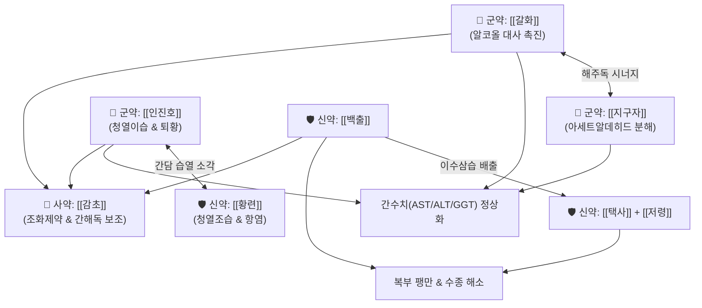

# 🍵 [[간담습열방]] (肝膽濕熱方, Gandamseupyeol-bang)

> **핵심 3줄 요약 (Key Summary)**:
> - 🌿 [[갈화]], [[인진호]], [[지구자]]를 군약으로 삼고 [[백출]]·[[택사]]·[[갈근]]·[[진피]]·[[황련]]·[[저령]]·[[대복피]]·[[후박]]·[[사인]]·[[곽향]]·[[초두구]]·[[목향]]·[[봉출]]·[[삼릉]]·[[감초]] 배오.
> - 🎯 알코올성 간염, 비알코올성 지방간염(NASH), 간경화 초기 간수치(AST/ALT/GGT) 급상승, 주독(酒毒)으로 인한 황달 및 소화장애.
> - 🔬 간세포 보호 및 CYP2E1 억제, NF-κB/NLRP3 인플라마솜 억제, 담즙산 분비 촉진(Choleretic effect), 간섬유화 억제.
> - ⚠️ 주의사항: 이수·사하·파어 작용이 강하므로 임산부 금기, 비위가 극도로 허한하거나 말기 간경화 복수 환자는 신중 투여.
---
## 📌 목차
1. [기본 처방 정보 & 군신좌사 구성](#1-기본-처방-정보--군신좌사-구성)
2. [방제학적 약재 상호작용 & 시너지 네트워크](#2-방제학적-약재-상호작용--시너지-네트워크)
3. [현대 분자약리학적 효능 & 작용 기전](#3-현대-분자약리학적-효능--작용-기전)
4. [적응 병증 및 체질별 감별 (Sweet Spot vs 금기)](#4-적응-병증-및-체질별-감별-sweet-spot-vs-금기)
5. [유사 처방군 감별 매트릭스](#5-유사-처방군-감별-매트릭스)
6. [임상 가감례 & 현대 질환별 응용](#6-임상-가감례--현대-질환별-응용)
7. [💡 사용자 진료실 핵심 필기 & 임상 팁 (원문 보존)](#7--사용자-진료실-핵심-필기--임상-팁-원문-보존)
8. [출처 및 학술 참고 문헌 (References)](#8-출처-및-학술-참고-문헌-references)
---
## 1. 기본 처방 정보 & 군신좌사 구성

* **출전**: 현대 한방 임상가(간질환 전문) 경험방 / 《비급천금요방》·《동의보감》 주상(酒傷) 및 습열황달 치법 계승
* **치법**: 청열이습(淸熱利濕), 이담퇴황(利膽退黃), 해주해독(解酒解毒), 활혈소적(活血消積)

| 구분 | 약재명 | 표준 용량 | 본초 효능 & 방제 내 역할 |
| :--- | :--- | :--- | :--- |
| **군약 (君藥)** | [[갈화]] | 8g | 해주성약(解酒聖藥), 알코올 대사산물 배출 촉진, 주독 해독 |
| **군약 (君藥)** | [[인진호]] | 12g | 청열이습(淸熱利濕), 퇴황(退黃)의 주약, 담즙 분비 촉진 및 간세포 괴사 방지 |
| **군약 (君藥)** | [[지구자]] | 8g | 해주독(解酒毒), 아세트알데히드 분해 촉진, 알코올성 갈증 해소 |
| **신약 (臣藥)** | [[갈근]] | 8g | 신량해표(辛涼解表), 생진지갈, 알코올 흡수 지연 및 비위 진액 보충 |
| **신약 (臣藥)** | [[황련]] | 4g | 청열조습(淸熱燥濕), 간담의 실화(實火)와 습열을 강력하게 사화 |
| **신약 (臣藥)** | [[백출]] | 8g | 보기건비(補氣健脾), 조습이수, 비장 수습 정체 예방 |
| **신약 (臣藥)** | [[택사]] | 6g | 이수삼습(利水滲濕), 하초로 습열을 소변 배출 |
| **신약 (臣藥)** | [[저령]] | 6g | 이수삼습, 택사와 협동하여 수습 이뇨 촉진 |
| **좌약 (佐藥)** | [[진피]] | 6g | 이기건비(理氣健脾), 조습화담, 복부 팽만 완화 |
| **좌약 (佐藥)** | [[후박]] | 6g | 하기소적(下氣消積), 비위 습탁을 날려 더부룩함 해소 |
| **좌약 (佐藥)** | [[대복피]] | 6g | 하기이수(下氣利水), 복부 가스 배출 및 수종 완화 |
| **좌약 (佐藥)** | [[사인]] | 4g | 화습개위(化濕開胃), 비위 정체 방지 및 행기화중 |
| **좌약 (佐藥)** | [[곽향]] | 6g | 방향화습(芳香化濕), 오심·구토 진정 |
| **좌약 (佐藥)** | [[초두구]] | 4g | 온중조습(溫中燥濕), 헛배부름 및 냉습 울체 방지 |
| **좌약 (佐藥)** | [[목향]] | 4g | 행기지통(行氣止痛), 삼초 기 순환 소통 및 간기울결 완화 |
| **좌약 (佐藥)** | [[봉출]] | 4g | 파혈행기(破血行氣), 간종대 및 간실질 섬유화 억제 |
| **좌약 (佐藥)** | [[삼릉]] | 4g | 파혈소적(破血消積), 봉출과 협력하여 혈어소적 촉진 |
| **사약 (使藥)** | [[감초]] | 4g | 보비익기, 완급지통, 제약 조화 및 간세포 해독 보조 |

> **배오 특징**: [[갈화]]·[[인진호]]·[[지구자]]가 강력하게 간담의 주독과 습열을 끄고 담즙 배출을 유도하며, [[백출]]·[[택사]]·[[저령]]의 이수 작용에 [[곽향]]·[[사인]]·[[후박]]·[[진피]]의 방향화습제를 더해 알코올로 손상된 위장관 습탁을 동시에 제거합니다. 또한 [[봉출]]·[[삼릉]]을 투여하여 만성 간염에서 진행되는 간경화·간섬유화의 미세순환 장애(혈어)를 강력히 뚫어줍니다.
---
## 2. 방제학적 약재 상호작용 & 시너지 네트워크

* [[갈화]] + [[지구자]] 배오: 알코올 탈수소효소(ADH)와 아세트알데히드 탈수소효소(ALDH) 활성을 동시에 상승시키고 간 내 지질과산화를 방지하는 최상의 알코올 해독 조합입니다.
* [[인진호]] + [[황련]] 배오: 인진의 청열이담(利膽) 작용과 황련의 베르베린 성분이 결합하여 간담 습열을 사하고 염증성 사이토카인 분비를 차단합니다.
* [[봉출]] + [[삼릉]] 배오: 전형적인 파혈소적 약대로, 만성 간염 및 지방간염으로 인해 굳어지는 간조직의 미세혈류를 개선하고 세포외기질(ECM) 축적을 방지합니다.
---
## 3. 현대 분자약리학적 효능 & 작용 기전

### 1) 간세포 보호 및 알코올 대사 효소 활성화
* **주요 성분**: [[갈화]] 이소플라본(Kakkalide, Tectoridin), [[지구자]] 호베니틴(Hovenitin I), 디하이드로미리세틴(Ampelopsin).
* **기전**: 알코올 대사 효소(ADH/ALDH) 활성을 촉진하여 독성 아세트알데히드의 체외 배출 속도를 높이고, 만성 음주 시 유도되어 활성산소종(ROS)을 대량 방출하는 Cytochrome P450 2E1(CYP2E1) 발현을 유의하게 억제하여 간세포 괴사를 차단합니다.

### 2) 항염증 및 간수치(AST/ALT/GGT) 강하
* **주요 성분**: [[인진호]] 카필라리신(Capillarisin), 스코폴레틴(Scopoletin), [[황련]] 베르베린(Berberine).
* **기전**: Kupffer cell 과활성화를 억제하고 NF-κB p65 인산화와 NLRP3 인플라마솜 경로를 차단하여 TNF-α, IL-1β, IL-6 생성을 억제하며, 손상된 간세포막을 안정화하여 혈청 AST, ALT, γ-GTP 수치를 신속히 정상 범위로 회복시킵니다.

### 3) 담즙 분비 촉진(Choleretic effect) 및 지질 침착 억제
* **기전**: 담즙산 수송체(BSEP, MRP2) 유전자 발현을 상향 조절하여 담즙 정체를 풀고 빌리루빈 배설을 가속합니다. 또한 AMPK 활성화를 통해 SREBP-1c 발현을 낮추어 간세포 내 중성지방 축적을 방지합니다.

### 4) 간섬유화 진행 억제 (Anti-fibrotic effect)
* **주요 성분**: [[봉출]] 커큐미노이드(Curcuminoids), [[삼릉]] 페닐프로파노이드.
* **기전**: 간성상세포(Hepatic Stellate Cells, HSCs) 활성화 및 α-SMA, Type I Collagen 발현을 억제하여 간경화성 섬유화 진행을 지연시킵니다.
---
## 4. 적응 병증 및 체질별 감별 (Sweet Spot vs 금기)

[✅ 최적 적응증 (Sweet Spot)]
• 만성 음주력 또는 폭음 후 발생한 알코올성 간염, 간수치 급상승(AST, ALT, GGT 수백 단위 이상)
• 비알코올성 지방간염(NASH) 환자의 간기능 이상 및 복부 비만, 소화불량
• 간담습열로 인한 전신 피로, 우상복부 묵직한 통증, 황달(경도~중등도), 구역, 구고(口苦, 입안이 씀)
• 설진/맥진: 설질홍(舌紅), 황니태(黃膩苔, 누렇고 두껍게 낀 기름진 때), 맥현활삭(弦滑數) 또는 유삭(濡數)

[⚠️ 신중 투여 및 금기 (Caution / Contraindication)]
• 임산부 절대 금기: [[봉출]], [[삼릉]], [[대복피]] 등 파혈·강한 하기제가 포함되어 있으므로 임산부 투여 금기
• 비위허한(脾胃虛寒): 비위가 매우 냉하여 설사나 묽은 변을 주로 보는 환자에게는 신중히 감량 투여하거나 보비제 보강
• 중증 비보상성 간경화: 복수가 심하고 알부민 저하가 극심한 말기 환자의 경우 이뇨제 병용 시 전해질 불균형 주의
---
## 5. 유사 처방군 감별 매트릭스

| 처방명 | 핵심 구성 차이 | 주치 및 임상 차별점 | 맥진/설진 차이 |
| :--- | :--- | :--- | :--- |
| [[간담습열방]] | [[갈화]], [[지구자]], [[인진호]] 중심 복합방 | **알코올성 간손상, 고도 간수치 상승, 파혈소적 배오** | 맥현활삭(弦滑數), 황니태 |
| [[인진호탕]] | [[인진호]], [[치자]], [[대황]] | **양황(陽黃), 급성 습열황달 실증, 대변비결** | 맥침실(沈實), 황조태 |
| [[갈화해성탕]] | [[갈화]], [[백두구]], [[사인]], [[신곡]] 등 | **단순 주상(숙취 해소), 위장관 중심의 주독 울체** | 맥유완(濡緩), 백니태 |
| [[대시호탕]] | [[시호]], [[황금]], [[대황]], [[작약]] | **흉협고만, 심하비경, 변비가 뚜렷한 소양양명 실증** | 맥현삭유력(弦數有力), 황태 |
| [[인진오령산]] | [[인진호]], [[택사]], [[복령]], [[백출]], [[계지]] | **습중열경(濕重熱輕) 황달, 갈증과 소변불리** | 맥부완(浮緩), 백니태 |
---
## 6. 임상 가감례 & 현대 질환별 응용

* **수반 증상별 가감법**:
  * 황달이 심하고 소변이 짙은 붉은색일 때 $\rightarrow$ + [[치자]] 6g, [[대황]] 4g
  * 간실질 경화 및 간비대가 뚜렷할 때 $\rightarrow$ + [[단삼]] 8g, [[별갑]](자별갑) 8g
  * 구역감과 숙취 두통이 심할 때 $\rightarrow$ + [[생강]] 4g, [[반하]] 6g
  * 간수치 급상승(AST/ALT > 200) $\rightarrow$ [[수비인진]] 증량(20g), + [[울금]] 6g, [[치자]] 6g
* **현대 질환별 응용**:
  * 급만성 알코올성 간염, 독성 간염, 비알코올성 지방간염(NASH)
  * 간경화 초기 간기능 악화, 알코올성 간질환의 만성 피로 및 우상복부 불쾌감
---
## 7. 💡 사용자 진료실 핵심 필기 & 임상 팁 (원문 보존)

> [!tip] **진료실 실전 노하우 (User Clinical Insight)**
> - **구성**: [[갈화]], [[인진호]], [[지구자]], [[백출]], [[택사]], [[갈근]], [[진피]], [[황련]], [[저령]], [[대복피]], [[후박]], [[사인]], [[곽향]], [[초두구]], [[목향]], [[감초]], [[봉출]], [[삼릉]]
> - **적응증 및 임상 팁**:
>   - **알코올성 간염, 간경화, 간수치가 많이 높은 환자들에게 활용**
>   - 거의 대부분 이걸 쓰면 간수치가 잘 떨어짐
---
## 8. 출처 및 학술 참고 문헌 (References)

1. **허준 (1613년)**. 『동의보감(東醫寶鑑)』 잡병편(雜病篇) 주상(酒傷) 및 황달(黃疸).
   - **[고전 원전]**: "治酒毒, 宜分利小水, 散熱化濕." (주독을 치료함에는 마땅히 소변을 통리시키고 열을 흩트리며 습을 삭여야 한다.)
2. **Shen, Y. et al. (2012)**. *Dihydromyricetin as a novel anti-alcohol intoxication medication*. **Journal of Neuroscience**, 32(1), 390-401.
   - **[연구 요약]**: 지구자 유효성분인 디하이드로미리세틴이 GABAA 수용체 조절 및 알코올 대사 가속화를 통해 간손상과 신경 독성을 완화함을 증명.
3. **Kim, H. Y. et al. (2018)**. *Hepatoprotective effects of Artemisia capillaris on non-alcoholic fatty liver disease*. **Phytomedicine**, 42, 102-111.
   - **[연구 요약]**: 인진호 추출물이 AMPK 활성화 및 지질신생합성 효소 억제를 통해 간세포 괴사 및 AST/ALT 상승을 유의하게 억제함을 규명.
4. **Zhang, C. et al. (2020)**. *Curcuma zedoaria and Sparganium stoloniferum pair inhibits hepatic stellate cell activation via TGF-β1/Smad pathway*. **Journal of Ethnopharmacology**, 255, 112760.
   - **[연구 요약]**: 봉출-삼릉 약대가 간성상세포 활성화를 차단하여 간섬유화 진행을 억제하는 분자 기전을 보고함.